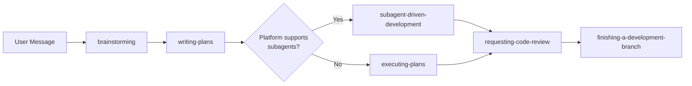
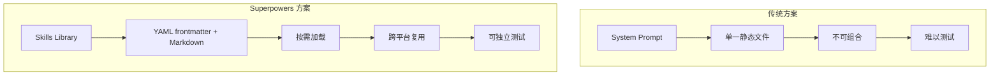

# 第一章 · Superpowers 是什么

> 源文件：`README.md`、`RELEASE-NOTES.md`、`package.json`

## 概述

Superpowers 是一个面向 AI coding agent(AI 编程代理）的 **skills library（技能库）**，为 Claude Code、Cursor、Codex、OpenCode 和 Gemini CLI 五大平台提供统一的软件开发工作流。它通过可组合的 skill（技能）将 "先设计再编码、测试驱动、子代理协作" 等最佳实践**强制注入**代理的行为链路，使代理在无人值守时仍能产出一致、可审计的结果。

## 前置阅读

- 无（本章为全书入口）

---

## 1 · 项目定位

Superpowers 的一句话定义：

> **A complete software development workflow for your coding agents, built on top of a set of composable "skills".**

它**不是**又一个 prompt template（提示词模板）集合，而是一套带有强制执行语义的工作流引擎——skill 会在 session start（会话启动）时通过 hook（钩子）自动注入，代理在响应任何用户消息之前必须先检查是否有匹配的 skill，再按 skill 规定的流程执行。

### 为什么需要它

| 问题 | 没有 Superpowers | 有 Superpowers |
|------|-----------------|----------------|
| 代理直接写代码 | 跳过设计，质量不可控 | 先 brainstorming → spec → plan，用户审批后才动手 |
| 测试后补 | 覆盖率低，回归频繁 | 强制 RED-GREEN-REFACTOR 循环 |
| 长任务偏移 | 代理偏离目标后需人工纠正 | subagent-driven-development 每个任务独立分发 + 双阶段 review |
| 跨平台不一致 | 每个平台写一套规则 | 一份 skill 通过 platform adaptation layer 适配五大平台 |

---

## 2 · 解决的核心问题

Coding agent 本质上是"一个热情但缺乏项目上下文、没有品味、回避测试的初级工程师"（README 原文）。Superpowers 解决的是**过程缺失**：

```
无过程 → 不可预测的产出
有过程 → 可重复、可审计的产出
```

**为什么** 用 skill 而不是直接写 system prompt？因为 system prompt 是静态的，而 skill 可以按需加载、分层组合、跨平台复用，且支持版本演进。

---

## 3 · 设计哲学

> 源文件：`README.md` → Philosophy

四条核心原则，每条都直接映射为具体的 skill 实现：

### 3.1 Test-Driven Development（测试驱动开发）

> "Write tests first, always."

**机制**：`test-driven-development` skill 强制执行 RED → GREEN → REFACTOR 三步循环。代理必须先写失败测试，看到测试失败，才写最少代码使其通过，然后才提交。

**不遵守的后果**：代理写出的代码未经验证，后续修改引入回归时无法发现。

### 3.2 Systematic over Ad-hoc（系统化优于临时方案）

> "Process over guessing."

**机制**：`systematic-debugging` skill 定义四阶段根因分析流程；`brainstorming` skill 使用 hard gate 阻止跳过设计阶段。

**不遵守的后果**：代理猜测式修改 → 引入更多 bug → 修复时间指数增长。

### 3.3 Complexity Reduction（复杂度削减）

> "Simplicity as primary goal."

**机制**：`writing-plans` skill 将工作拆成 2-5 分钟的小任务，每个任务有确切文件路径、完整代码和验证步骤。YAGNI（You Aren't Gonna Need It）原则贯穿始终。

**不遵守的后果**：产出过度设计的系统，后续维护成本远超初始开发。

### 3.4 Evidence over Claims（证据优于声明）

> "Verify before declaring success."

**机制**：`verification-before-completion` skill 要求代理在宣布完成前实际运行验证。

**不遵守的后果**：代理说"已修复"但实际未修复，用户浪费时间验证。

---

## 4 · 目标平台

Superpowers 通过 platform adaptation layer（平台适配层）支持五大 AI 编程平台：

| 平台 | 安装方式 | Skill 加载机制 | Subagent 支持 |
|------|---------|---------------|--------------|
| Claude Code | Plugin marketplace | `Skill` tool | ✅ 原生 Task |
| Cursor | Plugin marketplace | `Skill` tool (Cursor hooks) | ✅ |
| Codex | Clone + symlink | Native skill discovery | ✅ `spawn_agent` |
| OpenCode | `opencode.json` plugin | Native `skill` tool | ⚠️ `@mention` 语法 |
| Gemini CLI | `gemini extensions install` | `activate_skill` tool | ❌ 降级为 `executing-plans` |

**为什么** 支持多平台？因为 skill 的价值在于工作流本身，不应被绑定到单一平台。平台锁定意味着当用户迁移时所有积累的最佳实践丢失。

详细安装步骤见 [03-installation.md](./03-installation.md)。

---

## 5 · 基本工作流一览

Superpowers 的核心工作流是一条自动触发的 pipeline（流水线）：



> 图示说明：用户消息触发 brainstorming skill，产出 spec 后自动进入 writing-plans，再根据平台能力选择 subagent-driven-development 或 executing-plans，最后经 code review 后结束开发分支。

每个节点都是一个独立的 skill，可单独触发或组合使用。**代理在执行任何任务前会自动检查是否有匹配的 skill**——这是强制行为，不是建议。

---

## 6 · 版本演进亮点

> 源文件：`RELEASE-NOTES.md`

Superpowers 当前版本为 **v5.0.6**。以下是关键版本的演进脉络：

| 版本 | 日期 | 里程碑 |
|------|------|--------|
| v4.1.x | 2026-01 | 早期 skill 体系和基础工作流 |
| v4.2.0 | 2026-02-05 | Codex 原生 skill discovery 取代 bootstrap CLI；worktree 隔离强制化 |
| v4.3.0 | 2026-02-12 | brainstorming hard gate 阻止跳过设计；EnterPlanMode 拦截 |
| v4.3.1 | 2026-02-21 | Cursor 平台支持 |
| v5.0.0 | 2026-03-09 | 重大重构：可视化 brainstorm companion；文档 review 系统；subagent 状态协议；架构指导贯穿 pipeline |
| v5.0.1 | 2026-03-10 | Gemini CLI 原生扩展；brainstorm server 移入 skill 目录（agentskills 合规）；Windows 修复 |
| v5.0.2 | 2026-03-11 | 零依赖 brainstorm server（移除 node_modules）；subagent context isolation |
| v5.0.3 | 2026-03-15 | Cursor hooks 正式支持；Bash 5.3+ 挂起修复 |
| v5.0.4 | 2026-03-16 | Review loop 优化（单次全 plan review）；OpenCode 一行安装 |
| v5.0.5 | 2026-03-17 | Brainstorm server ESM 修复；执行方式选择恢复 |
| v5.0.6 | 2026-03-24 | 内联自审替代 subagent review（节省约 25 分钟/次） |

**演进趋势**：从"描述性建议"到"强制性工作流"，从"单平台"到"五平台适配"，从"外部依赖"到"零依赖自包含"。

---

## 7 · 为什么选择 "Skills" 方案



> 图示说明：传统 system prompt 方案是单一静态文件，不可组合、难以测试。Superpowers 的 skill 方案使用 YAML frontmatter + Markdown 格式，支持按需加载、跨平台复用和独立测试。

Skill 方案的五个关键优势：

1. **Reusable（可复用）**：一个 skill 写一次，五个平台用
2. **Composable（可组合）**：多个 skill 可以按优先级叠加（process skill 先于 implementation skill）
3. **Testable（可测试）**：skill 有独立的测试套件（见 `tests/` 目录）
4. **Platform-agnostic（平台无关）**：skill 用 Claude Code tool name 编写，其他平台通过 tool mapping reference 适配
5. **Evolvable（可演进）**：skill 有版本，自动更新，用户始终使用最新最佳实践

**为什么** 不用 RAG 或向量检索？因为 skill 的数量有限（十几个），每个 skill 的触发条件明确，不需要语义搜索——精确匹配比模糊匹配更可靠。

---

## 本章核心结论

1. **Superpowers = 强制工作流**：不是 prompt 模板，而是代理在每次响应前必须检查和执行的 skill pipeline
2. **四原则驱动设计**：TDD / 系统化 / 减复杂度 / 证据优先——每条原则都有对应 skill 强制执行
3. **五平台一套 skill**：通过 platform adaptation layer 适配，skill 本身保持平台无关
4. **Skill > System Prompt**：可组合、可测试、可演进、按需加载，是 system prompt 的严格上位替代
5. **自动触发，非手动调用**：skill 通过 session start hook 注入，代理行为链路中自动匹配和执行
