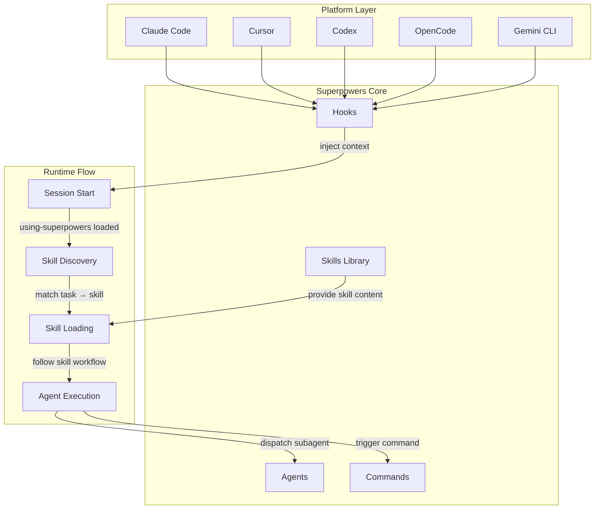
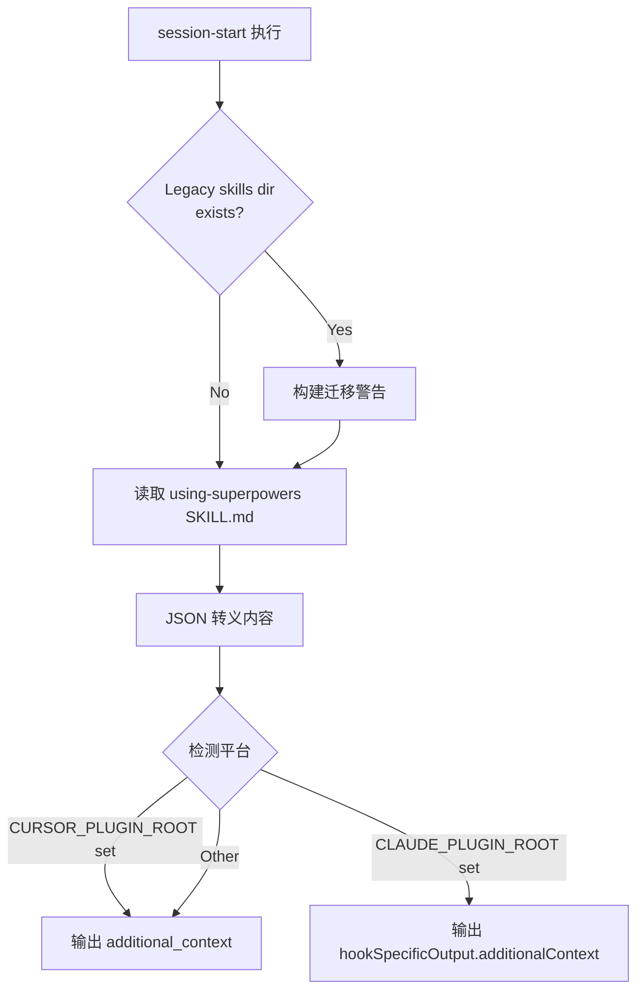
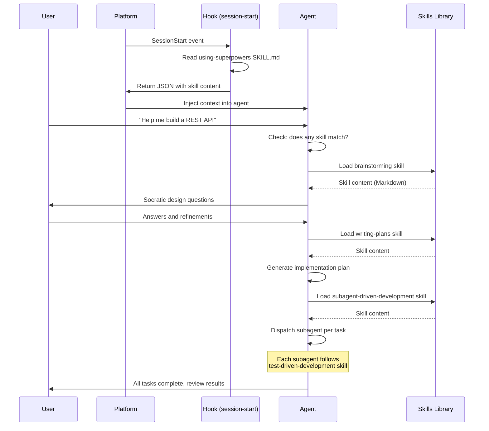

# 第二章 · 系统架构

> 源文件：`README.md`、`hooks/hooks.json`、`hooks/hooks-cursor.json`、`hooks/session-start`、`.claude-plugin/plugin.json`、`.cursor-plugin/plugin.json`、`gemini-extension.json`、`skills/using-superpowers/SKILL.md`

## 概述

Superpowers 由四个核心组件构成：Skills（技能）、Agents（代理配置）、Hooks（钩子）、Commands（命令）。它们通过 "hook 注入 → skill 发现 → skill 加载 → 代理执行" 的链路协作，在五大平台上提供统一的开发工作流。本章解析每个组件的职责、数据流向和设计决策。

## 前置阅读

- [01-what-is-superpowers.md](./01-what-is-superpowers.md)

---

## 1 · 架构总览



> 图示说明：五大平台通过各自的 hook 机制触发 session start，注入 `using-superpowers` skill 作为元技能。此后代理根据用户消息匹配并加载具体 skill，执行过程中可能分发 subagent（通过 agents 配置）或触发 command。

---

## 2 · 四大核心组件

### 2.1 Skills（技能）

> 源文件：`skills/` 目录

Skill 是 Superpowers 的基本单元。每个 skill 是一个 Markdown 文件，带有 YAML frontmatter（前置元数据）：

```yaml
---
name: test-driven-development
description: Use when implementing code - enforces RED-GREEN-REFACTOR cycle
---

# Skill content in Markdown...
```

**结构规则**：
- **YAML frontmatter**：`name` 和 `description` 是必填字段（`description` 用于 skill discovery 时的匹配判断）
- **Markdown body**：skill 的完整指令，代理加载后直接遵循
- **Flat namespace（扁平命名空间）**：所有 skill 在 `skills/` 目录下一级，不嵌套子目录分类
- **References 子目录**：skill 可包含 `references/` 子目录存放补充材料（如 `codex-tools.md`、`gemini-tools.md`）
- **Scripts 子目录**：skill 可包含 `scripts/` 子目录存放可执行脚本（如 brainstorming 的 server）

**为什么** 用 Markdown 而不是 JSON/YAML？因为 skill 的主体是**自然语言指令**，Markdown 是最适合混合结构化元数据和自由文本的格式。LLM 对 Markdown 的理解也最好。

**当前 skill 清单**：

| 类别 | Skill | 用途 |
|------|-------|------|
| Testing | `test-driven-development` | RED-GREEN-REFACTOR 循环 |
| Debugging | `systematic-debugging` | 四阶段根因分析 |
| Debugging | `verification-before-completion` | 完成前验证 |
| Collaboration | `brainstorming` | Socratic 设计精炼 |
| Collaboration | `writing-plans` | 生成实施计划 |
| Collaboration | `executing-plans` | 批量执行（无 subagent 平台） |
| Collaboration | `subagent-driven-development` | subagent 逐任务分发 + 双阶段 review |
| Collaboration | `dispatching-parallel-agents` | 并发 subagent 工作流 |
| Collaboration | `requesting-code-review` | Pre-review checklist |
| Collaboration | `receiving-code-review` | 响应 review 反馈 |
| Collaboration | `using-git-worktrees` | 并行开发分支隔离 |
| Collaboration | `finishing-a-development-branch` | 合并/PR 决策工作流 |
| Meta | `using-superpowers` | 元技能：skill 系统的使用规则 |
| Meta | `writing-skills` | 创建新 skill 的最佳实践 |

### 2.2 Hooks（钩子）

> 源文件：`hooks/hooks.json`、`hooks/hooks-cursor.json`、`hooks/session-start`

Hook 是平台与 Superpowers 之间的桥梁。**核心职责**：在 session start 时将 `using-superpowers` skill 的完整内容注入代理上下文。

**Claude Code hook 配置**（`hooks/hooks.json`）：

```json
{
  "hooks": {
    "SessionStart": [
      {
        "matcher": "startup|clear|compact",
        "hooks": [
          {
            "type": "command",
            "command": "\"${CLAUDE_PLUGIN_ROOT}/hooks/run-hook.cmd\" session-start",
            "async": false
          }
        ]
      }
    ]
  }
}
```

关键设计决策：

- **`async: false`**：hook 同步执行。**为什么**？如果异步执行，hook 可能在代理第一轮响应后才完成，导致第一条消息完全没有 skill 上下文（v4.3.0 修复的问题）。
- **`matcher: "startup|clear|compact"`**：仅在新会话、清除和压缩时触发。**为什么**？`--resume` 恢复的会话已经有上下文，重复注入会导致 context window 浪费（v5.0.3 修复的问题）。
- **`run-hook.cmd` 跨平台包装器**：Windows 上通过 polyglot（多语言）脚本自动发现 bash 路径。**为什么**？Windows 不支持 shebang，直接调用 extensionless 脚本会打开"打开方式"对话框。

**Cursor hook 配置**（`hooks/hooks-cursor.json`）：

```json
{
  "version": 1,
  "hooks": {
    "sessionStart": [
      {
        "command": "./hooks/session-start"
      }
    ]
  }
}
```

**为什么** 需要两套配置？Cursor 使用 camelCase 格式（`sessionStart`）和 `version` 字段，与 Claude Code 的 PascalCase（`SessionStart`）不兼容。

**`session-start` 脚本核心逻辑**：



> 图示说明：session-start 脚本根据环境变量检测当前平台，然后以该平台要求的 JSON 格式输出 skill 内容。Claude Code 和 Cursor 使用不同的 JSON 字段名，脚本只输出当前平台消费的字段以避免 context 重复注入。

**为什么** 不直接在 hook config 中内联 skill 内容？因为 skill 内容很大（数 KB），且包含需要转义的特殊字符。脚本方式支持动态读取最新 skill 内容、平台检测和 legacy 迁移警告。

### 2.3 Agents（代理配置）

> 源文件：`agents/` 目录

Agents 目录包含代理角色定义文件（如 `code-reviewer.md`）。这些文件定义了**subagent 角色**——当主代理通过 skill 分发子任务时，子代理使用这些角色配置。

**为什么** 将角色定义独立为文件？因为 subagent 需要最小化的、任务专属的上下文（context isolation 原则）。独立文件允许精确控制每个 subagent 接收的指令范围。

### 2.4 Commands（命令）

> 源文件：`commands/` 目录

Commands 提供快捷入口（如 `/brainstorm`、`/write-plan`、`/execute-plan`），让用户可以直接触发特定工作流而不依赖自动 skill 匹配。

**注意**：v5.0.0 起 slash command 已标记为 deprecated（弃用），因为 skill 自动触发是首选方式。命令将在下一个 major version 移除。

**为什么** 弃用命令？因为命令需要用户记住名称，而 skill 自动匹配是零成本的——用户只需自然描述任务，代理自动调用匹配的 skill。

---

## 3 · 目录结构

```
superpowers/
├── skills/                          # 核心：所有 skill 定义
│   ├── brainstorming/
│   │   ├── SKILL.md                 # Skill 主文件
│   │   ├── references/              # 补充材料
│   │   └── scripts/                 # 可执行脚本（brainstorm server）
│   ├── test-driven-development/
│   │   ├── SKILL.md
│   │   └── references/
│   ├── using-superpowers/
│   │   ├── SKILL.md                 # 元技能：skill 系统使用规则
│   │   └── references/
│   │       ├── codex-tools.md       # Codex 工具名映射
│   │       └── gemini-tools.md      # Gemini CLI 工具名映射
│   └── .../                         # 其他 skill（扁平结构）
├── agents/                          # Subagent 角色定义
│   └── code-reviewer.md
├── commands/                        # Slash 命令（已弃用）
│   ├── brainstorm.md
│   ├── write-plan.md
│   └── execute-plan.md
├── hooks/                           # Session start 钩子
│   ├── hooks.json                   # Claude Code hook 配置
│   ├── hooks-cursor.json            # Cursor hook 配置
│   ├── session-start                # 主 hook 脚本（extensionless）
│   └── run-hook.cmd                 # 跨平台 polyglot 包装器
├── .claude-plugin/
│   └── plugin.json                  # Claude Code 插件清单
├── .cursor-plugin/
│   └── plugin.json                  # Cursor 插件清单
├── .codex/
│   └── INSTALL.md                   # Codex 安装说明
├── .opencode/
│   ├── INSTALL.md                   # OpenCode 安装说明
│   └── plugins/superpowers.js       # OpenCode 插件入口
├── gemini-extension.json            # Gemini CLI 扩展清单
├── GEMINI.md                        # Gemini CLI 上下文入口
├── package.json                     # npm 包元数据
├── tests/                           # 测试套件
├── docs/                            # 附加文档
└── all-in-one-book/                 # 本书
```

**为什么** 每个平台都有独立的配置目录？因为每个平台有不同的 plugin discovery（插件发现）机制——Claude Code 读 `.claude-plugin/plugin.json`，Cursor 读 `.cursor-plugin/plugin.json`，Gemini CLI 读 `gemini-extension.json`。统一入口不可行。

---

## 4 · 平台适配层

同一套 skill 在五个平台上运行，适配的关键在于三个层面：

### 4.1 Skill 加载机制适配

| 平台 | 发现方式 | 加载 API |
|------|---------|---------|
| Claude Code | Plugin 注册 → `skills/` 目录扫描 | `Skill` tool |
| Cursor | Plugin 注册 → `hooks-cursor.json` | `Skill` tool (Cursor variant) |
| Codex | `~/.agents/skills/superpowers` symlink | Native skill discovery |
| OpenCode | `opencode.json` plugin 数组 | Native `skill` tool |
| Gemini CLI | `gemini-extension.json` + `GEMINI.md` | `activate_skill` tool |

### 4.2 Tool name 映射

Skill 内容统一使用 Claude Code 的 tool name（如 `Read`、`Write`、`Edit`、`Bash`、`TodoWrite`、`Task`）。其他平台通过 reference 文件进行映射：

| Claude Code Tool | Codex 等效 | OpenCode 等效 | Gemini CLI 等效 |
|-----------------|-----------|--------------|----------------|
| `Read` | `read_file` | native | `read_file` |
| `Write` | `write_file` | native | `write_file` |
| `Edit` | `edit_file` | native | `replace` |
| `Bash` | `shell` | native | `run_shell_command` |
| `TodoWrite` | `todowrite` | `todowrite` | `save_memory` |
| `Task` (subagent) | `spawn_agent` | `@mention` | ❌ 不支持 |

**为什么** 以 Claude Code 为基准而不创建平台无关的 tool name？因为 Claude Code 是最早支持的平台，大部分 skill 已用其 tool name 编写。引入抽象层会增加所有 skill 的复杂度，而 reference 文件的映射方式更简单。

### 4.3 Hook 输出格式适配

`session-start` 脚本根据环境变量检测平台并输出不同格式的 JSON：

```
Claude Code → hookSpecificOutput.additionalContext
Cursor      → additional_context
Other       → additional_context (fallback)
```

**为什么** 不统一为一种格式？因为 Claude Code 同时读取两个字段但不去重，如果两个字段都有值会导致 context 双重注入。脚本必须只输出当前平台消费的字段。

---

## 5 · 数据流：从 session start 到任务完成



> 图示说明：完整的数据流从 session start hook 注入元技能开始，用户发送消息后代理自动匹配和加载具体 skill，沿 brainstorming → writing-plans → subagent-driven-development pipeline 执行，每个子任务内部遵循 TDD skill。

---

## 6 · 架构设计决策总结

| 决策 | 选择 | 为什么 |
|------|------|--------|
| Skill 格式 | YAML frontmatter + Markdown | LLM 理解最佳，混合元数据和自然语言指令 |
| Skill 命名空间 | 扁平目录 | 简单直观，避免分类争议，skill 数量可控 |
| Hook 执行 | 同步 | 确保第一条消息有 skill 上下文 |
| Hook 触发条件 | startup/clear/compact | 避免 resume 时重复注入 |
| Tool name 基准 | Claude Code | 历史原因 + 最大用户群，其他平台通过 reference 映射 |
| Platform 检测 | 环境变量 | 零配置，平台设置 `CLAUDE_PLUGIN_ROOT` / `CURSOR_PLUGIN_ROOT` |
| Context 注入 | 仅 `using-superpowers` | 最小化 session start 注入量，其他 skill 按需加载 |
| Slash commands | 弃用 | 自动匹配优于手动记忆命令名 |

---

## 本章核心结论

1. **四组件协作链路**：Hook 注入元技能 → Skill 匹配任务 → Agent 执行 → Command 提供快捷入口（已弃用）
2. **Session start 只注入 `using-superpowers`**：其余 skill 按需加载——这是最小化 context window 占用的关键
3. **Hook 必须同步**：异步会导致第一条消息丢失 skill 上下文
4. **每个平台都需要独立配置文件**：plugin discovery 机制不同，统一入口不可行
5. **Tool name 映射通过 reference 文件**：skill 本身保持 Claude Code 语法，映射开销分摊到平台适配层
6. **扁平 skill 命名空间**：简单性优先，skill 数量有限时无需分类层级
