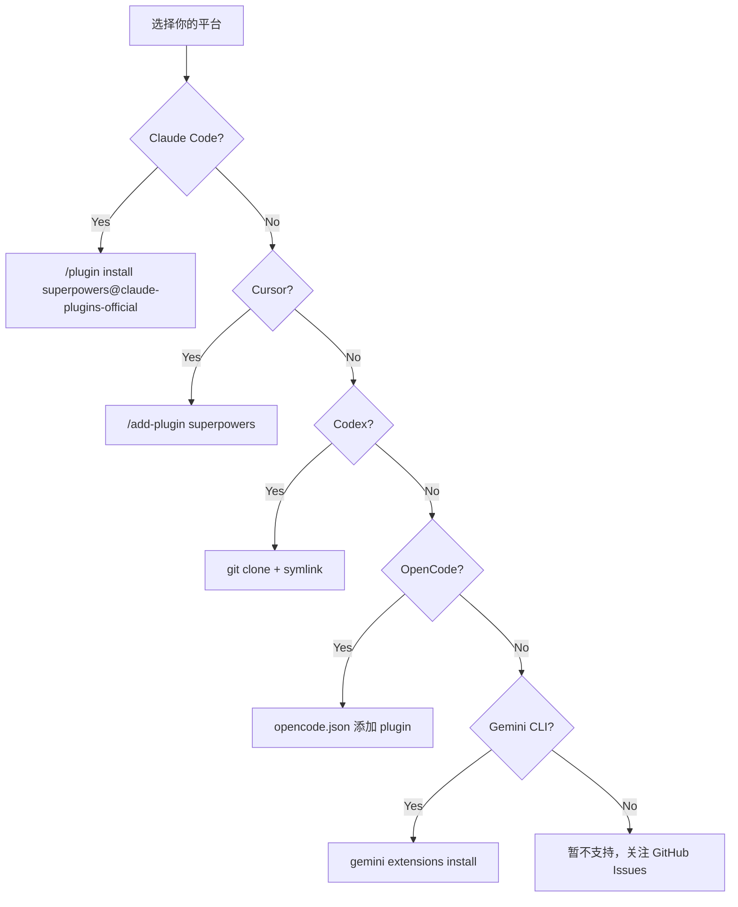

# 第三章 · 全平台安装配置

> 源文件：`README.md`、`.claude-plugin/plugin.json`、`.cursor-plugin/plugin.json`、`.codex/INSTALL.md`、`.opencode/INSTALL.md`、`gemini-extension.json`、`GEMINI.md`

## 概述

Superpowers 支持 Claude Code、Cursor、Codex、OpenCode 和 Gemini CLI 五大平台。各平台的 plugin discovery（插件发现）机制不同，因此安装方式各异。本章提供每个平台的完整安装、验证、更新和卸载步骤。

## 前置阅读

- [01-what-is-superpowers.md](./01-what-is-superpowers.md)
- [02-architecture.md](./02-architecture.md)

---

## 1 · 安装方式对比

| 特性 | Claude Code | Cursor | Codex | OpenCode | Gemini CLI |
|------|------------|--------|-------|----------|------------|
| 安装方式 | Plugin marketplace | Plugin marketplace | Clone + symlink | `opencode.json` 配置 | `gemini extensions install` |
| 前置依赖 | 无 | 无 | Git | OpenCode 已安装 | Gemini CLI 已安装 |
| 自动更新 | `/plugin update` | 平台管理 | `git pull` | 重启时自动 | `gemini extensions update` |
| Windows 支持 | ✅ | ✅ | ✅（需 junction） | ✅ | ✅ |
| 安装复杂度 | ⭐ 最简 | ⭐ 最简 | ⭐⭐⭐ 手动 | ⭐⭐ 一行配置 | ⭐ 一行命令 |

---

## 2 · Claude Code

### 2.1 通过官方 Marketplace 安装（推荐）

Superpowers 已上架 [Claude 官方插件市场](https://claude.com/plugins/superpowers)。

```bash
/plugin install superpowers@claude-plugins-official
```

### 2.2 通过社区 Marketplace 安装

如果需要使用社区 marketplace 版本：

```bash
# 步骤 1：注册 marketplace
/plugin marketplace add obra/superpowers-marketplace

# 步骤 2：安装插件
/plugin install superpowers@superpowers-marketplace
```

### 2.3 插件清单

> 源文件：`.claude-plugin/plugin.json`

```json
{
  "name": "superpowers",
  "description": "Core skills library for Claude Code: TDD, debugging, collaboration patterns, and proven techniques",
  "version": "5.0.6",
  "author": {
    "name": "Jesse Vincent",
    "email": "jesse@fsck.com"
  },
  "homepage": "https://github.com/obra/superpowers",
  "repository": "https://github.com/obra/superpowers",
  "license": "MIT",
  "keywords": ["skills", "tdd", "debugging", "collaboration", "best-practices", "workflows"]
}
```

**为什么** 使用 plugin marketplace 而不是手动克隆？因为 marketplace 提供版本管理、一键安装、自动更新，降低了用户的维护成本。手动克隆需要自行 `git pull` 更新。

### 2.4 验证安装

启动一个新 session，要求代理执行一个会触发 skill 的任务：

```
帮我设计一个新功能
```

代理应自动调用 `brainstorming` skill，而不是直接写代码。如果代理直接开始编码，说明 skill 未正确加载。

### 2.5 更新

```bash
/plugin update superpowers
```

### 2.6 卸载

```bash
/plugin uninstall superpowers
```

---

## 3 · Cursor

### 3.1 安装

在 Cursor Agent chat 中执行：

```text
/add-plugin superpowers
```

或在 plugin marketplace 中搜索 "superpowers"。

> ⚠️ **注意**：早期文档使用 `/plugin-add`，这是错误的。正确命令是 `/add-plugin`（v5.0.1 修正）。

### 3.2 插件清单

> 源文件：`.cursor-plugin/plugin.json`

```json
{
  "name": "superpowers",
  "displayName": "Superpowers",
  "description": "Core skills library: TDD, debugging, collaboration patterns, and proven techniques",
  "version": "5.0.6",
  "skills": "./skills/",
  "agents": "./agents/",
  "commands": "./commands/",
  "hooks": "./hooks/hooks-cursor.json"
}
```

Cursor 的 plugin.json 与 Claude Code 版本的关键区别：
- 额外的 `displayName` 字段
- 显式声明 `skills`、`agents`、`commands`、`hooks` 路径
- Hook 配置指向 `hooks-cursor.json`（camelCase 格式）

**为什么** Cursor 需要独立的 hook 配置？因为 Cursor 使用 `sessionStart`（camelCase）而非 Claude Code 的 `SessionStart`（PascalCase），并且要求 `version: 1` 字段。

### 3.3 验证安装

同 Claude Code：启动新 session，请求代理设计功能，观察是否自动触发 brainstorming skill。

### 3.4 更新与卸载

通过 Cursor 的 plugin 管理界面操作。

---

## 4 · Codex

> 源文件：`.codex/INSTALL.md`

Codex 不支持 plugin marketplace，需要手动 clone + symlink 安装。

### 4.1 前置依赖

- Git

### 4.2 安装步骤

**步骤 1：克隆仓库**

```bash
git clone https://github.com/obra/superpowers.git ~/.codex/superpowers
```

**步骤 2：创建 skills symlink**

macOS / Linux：

```bash
mkdir -p ~/.agents/skills
ln -s ~/.codex/superpowers/skills ~/.agents/skills/superpowers
```

Windows（PowerShell）：

```powershell
New-Item -ItemType Directory -Force -Path "$env:USERPROFILE\.agents\skills"
cmd /c mklink /J "$env:USERPROFILE\.agents\skills\superpowers" "$env:USERPROFILE\.codex\superpowers\skills"
```

> ⚠️ Windows 使用 `mklink /J`（junction）而非 `mklink /D`（symbolic link）。**为什么**？Junction 不需要管理员权限，且在所有 Windows 版本上行为一致。Symbolic link 在某些 Windows 配置上需要开发者模式或提升权限。

**步骤 3：重启 Codex**

退出并重新启动 Codex CLI，使其发现新的 skill 目录。

### 4.3 从旧版 Bootstrap 迁移

如果之前通过 `superpowers-codex bootstrap` CLI 安装：

```bash
# 1. 更新仓库
cd ~/.codex/superpowers && git pull

# 2. 创建 symlink（上面步骤 2）

# 3. 移除旧 bootstrap 块
#    编辑 ~/.codex/AGENTS.md，删除所有引用 superpowers-codex bootstrap 的内容

# 4. 重启 Codex
```

**为什么** 放弃 bootstrap CLI？因为 Codex 现在支持 native skill discovery（原生技能发现），直接读取 `~/.agents/skills/` 目录。Bootstrap CLI 增加了 Node.js 依赖且需要额外维护。

### 4.4 验证安装

```bash
ls -la ~/.agents/skills/superpowers
```

应看到一个 symlink（或 Windows junction）指向 superpowers 的 skills 目录。

### 4.5 更新

```bash
cd ~/.codex/superpowers && git pull
```

Skills 通过 symlink 即时生效，无需额外操作。

### 4.6 卸载

```bash
rm ~/.agents/skills/superpowers
```

可选：删除克隆的仓库：

```bash
rm -rf ~/.codex/superpowers
```

---

## 5 · OpenCode

> 源文件：`.opencode/INSTALL.md`

### 5.1 前置依赖

- [OpenCode.ai](https://opencode.ai) 已安装

### 5.2 安装

在 `opencode.json`（全局或项目级）中添加 plugin：

```json
{
  "plugin": ["superpowers@git+https://github.com/obra/superpowers.git"]
}
```

重启 OpenCode 即可。插件自动安装并注册所有 skill。

**为什么** 一行配置就够了？因为 OpenCode 的 plugin 系统通过 `config` hook 自动注册 skills 目录（v5.0.4 新增），无需手动创建 symlink 或配置 `skills.paths`。

### 5.3 从旧版 Symlink 安装迁移

```bash
# 移除旧 symlink
rm -f ~/.config/opencode/plugins/superpowers.js
rm -rf ~/.config/opencode/skills/superpowers

# 可选：移除克隆的仓库
rm -rf ~/.config/opencode/superpowers

# 如果在 opencode.json 中添加了 skills.paths，也一并移除
```

然后按上述步骤安装。

### 5.4 验证安装

在 OpenCode 中询问：

```
Tell me about your superpowers
```

或使用 skill tool 列出可用技能：

```
use skill tool to list skills
```

### 5.5 固定特定版本

```json
{
  "plugin": ["superpowers@git+https://github.com/obra/superpowers.git#v5.0.3"]
}
```

### 5.6 更新

重启 OpenCode 时自动从 git 拉取最新版本。

### 5.7 Tool 名称映射

OpenCode 环境中 skill 引用的 Claude Code tool name 需要心理映射：

| Skill 中引用的 Tool | OpenCode 等效 |
|---------------------|--------------|
| `TodoWrite` | `todowrite` |
| `Task` (subagent) | `@mention` 语法 |
| `Skill` tool | OpenCode native `skill` tool |
| File 操作 | 平台原生 tool |

### 5.8 卸载

从 `opencode.json` 中移除 plugin 行，重启 OpenCode。

---

## 6 · Gemini CLI

> 源文件：`gemini-extension.json`、`GEMINI.md`

### 6.1 安装

```bash
gemini extensions install https://github.com/obra/superpowers
```

### 6.2 扩展清单

> 源文件：`gemini-extension.json`

```json
{
  "name": "superpowers",
  "description": "Core skills library: TDD, debugging, collaboration patterns, and proven techniques",
  "version": "5.0.6",
  "contextFileName": "GEMINI.md"
}
```

`contextFileName` 指向 `GEMINI.md`，该文件在 session start 时被 Gemini CLI 自动加载：

```markdown
@./skills/using-superpowers/SKILL.md
@./skills/using-superpowers/references/gemini-tools.md
```

**为什么** 使用 `@import` 语法？Gemini CLI 的扩展系统通过 context file 注入上下文，`@` 前缀指令让 CLI 自动加载引用文件的内容。这等效于 Claude Code 的 session-start hook。

### 6.3 已知限制

| 限制 | 影响 | 应对方案 |
|------|------|---------|
| 无 subagent 支持 | 不能使用 `subagent-driven-development` | 自动降级为 `executing-plans` |
| Tool name 不同 | Skill 中的 Claude Code tool name 不直接可用 | `gemini-tools.md` 提供完整映射表 |

### 6.4 验证安装

启动 Gemini CLI 新 session，观察 agent 是否识别 superpowers skill。

### 6.5 更新

```bash
gemini extensions update superpowers
```

### 6.6 卸载

```bash
gemini extensions uninstall superpowers
```

---

## 7 · 常见问题排查

### 7.1 Skill 未触发

**症状**：代理直接写代码，不经过 brainstorming。

**排查步骤**：

1. **确认安装**：按各平台的验证步骤检查
2. **新 session**：确保在新 session 中测试（resume 的 session 可能遗漏 hook 输出）
3. **检查 hook 输出**：Claude Code 可查看 hook 日志，OpenCode 用 `--print-logs` 参数

### 7.2 Windows 上 Hook 执行失败

**症状**：SessionStart hook 报错或超时。

**常见原因与解决方案**：

| 原因 | 解决方案 |
|------|---------|
| Bash 未安装 | 安装 Git for Windows（自带 bash） |
| 路径包含空格 | `run-hook.cmd` 已处理（v4.3.1 修复） |
| Bash 5.3+ heredoc 挂起 | 已通过 `printf` 替代修复（v5.0.3） |
| CRLF 行尾 | `.gitattributes` 强制 LF（v4.2.0 修复） |

### 7.3 OpenCode Plugin 未加载

1. 检查日志：`opencode run --print-logs "hello" 2>&1 | grep -i superpowers`
2. 验证 `opencode.json` 中 plugin 行的格式
3. 确认使用最新版 OpenCode

### 7.4 Codex Symlink 无效

```bash
# 检查 symlink 是否正确
ls -la ~/.agents/skills/superpowers

# 如果损坏，重建
rm ~/.agents/skills/superpowers
ln -s ~/.codex/superpowers/skills ~/.agents/skills/superpowers
```

### 7.5 Gemini CLI 扩展未识别

确认 `gemini-extension.json` 在仓库根目录，且 `contextFileName` 指向有效的 `GEMINI.md`。

---

## 8 · 安装决策流程



> 图示说明：根据你使用的 AI 编程平台选择对应的安装方式。Claude Code 和 Cursor 最简单（marketplace 一键安装），Codex 最复杂（手动 clone + symlink），OpenCode 和 Gemini CLI 介于中间。

---

## 本章核心结论

1. **优先使用 marketplace 安装**：Claude Code 和 Cursor 一键安装，自动更新，零维护
2. **Codex 必须手动 symlink**：Windows 用 `mklink /J`（junction），不要用 symbolic link
3. **OpenCode 一行配置**：`opencode.json` 添加 plugin 行即可，重启后自动注册
4. **Gemini CLI 一行命令**：`gemini extensions install`，但注意无 subagent 支持
5. **验证方法统一**：启动新 session → 请求设计功能 → 观察是否触发 brainstorming skill
6. **Windows 兼容性已经过多版本打磨**：v4.2.0-v5.0.3 修复了路径空格、CRLF、bash 版本等问题
