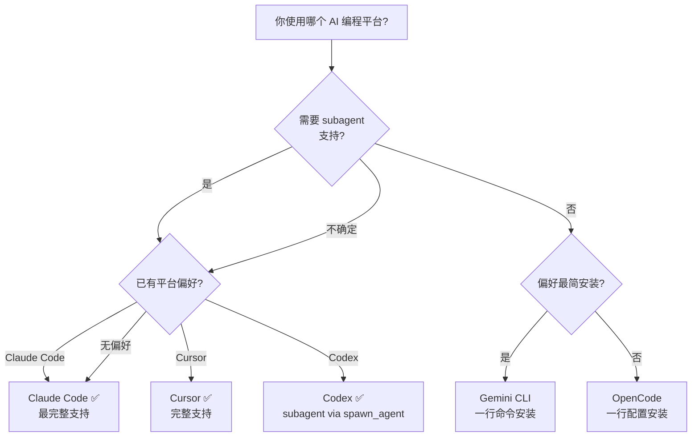
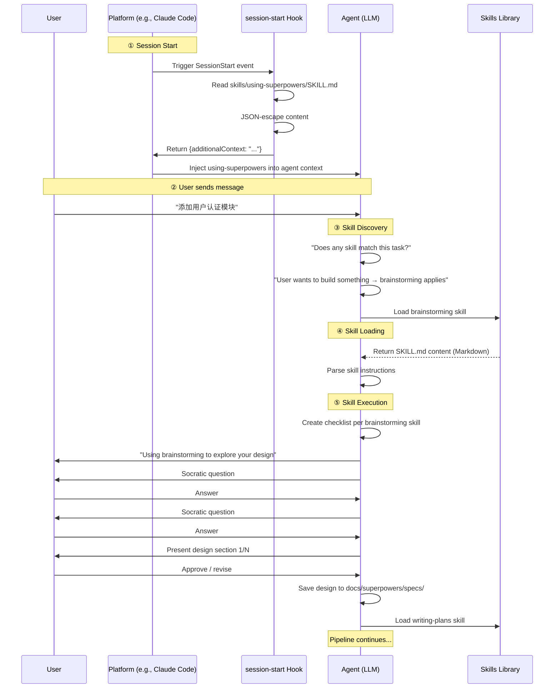
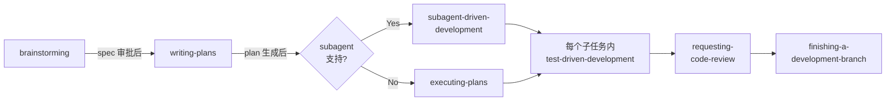

# 第四章 · 快速开始

> 源文件：`README.md`、`skills/using-superpowers/SKILL.md`、`hooks/session-start`

## 概述

本章带你从零开始，用最短路径完成 Superpowers 的安装并触发第一个 skill。阅读完本章后，你将理解 skill 自动触发的完整链路——从 session start hook 到 skill discovery、loading 和 execution。

## 前置阅读

- [01-what-is-superpowers.md](./01-what-is-superpowers.md)
- [03-installation.md](./03-installation.md)

---

## 1 · 前置条件

| 依赖 | 说明 | 必需？ |
|------|------|--------|
| Node.js | brainstorming 的可视化 companion 需要（核心 skill 不需要） | 可选 |
| Git | Codex 安装需要；`using-git-worktrees` skill 需要 | 推荐 |
| 支持的平台 | Claude Code / Cursor / Codex / OpenCode / Gemini CLI 之一 | **必需** |

---

## 2 · 选择你的平台



> 图示说明：Claude Code 提供最完整的 Superpowers 支持（原生 `Skill` tool + `Task` subagent）。如果不需要 subagent 功能或想快速体验，Gemini CLI 是最简选择。

**推荐**：如果你刚接触 Superpowers，**选 Claude Code**。所有 skill 以 Claude Code 为基准编写，文档示例也以它为主。

---

## 3 · 最短路径安装

### Claude Code（30 秒）

```bash
/plugin install superpowers@claude-plugins-official
```

完成。

### Cursor（30 秒）

在 Agent chat 中输入：

```text
/add-plugin superpowers
```

完成。

### Codex（2 分钟）

```bash
git clone https://github.com/obra/superpowers.git ~/.codex/superpowers
mkdir -p ~/.agents/skills
ln -s ~/.codex/superpowers/skills ~/.agents/skills/superpowers
```

重启 Codex。

### OpenCode（1 分钟）

编辑 `opencode.json`：

```json
{
  "plugin": ["superpowers@git+https://github.com/obra/superpowers.git"]
}
```

重启 OpenCode。

### Gemini CLI（30 秒）

```bash
gemini extensions install https://github.com/obra/superpowers
```

完成。

详细安装步骤和平台差异见 [03-installation.md](./03-installation.md)。

---

## 4 · 触发你的第一个 Skill

安装完成后，启动一个**全新的 session**（不要 resume 旧 session），然后输入：

```
我想为项目添加一个用户认证模块，支持 JWT 和 OAuth2
```

或者用英文：

```
I want to add a user authentication module with JWT and OAuth2 support
```

### 你应该看到什么

代理**不会**直接开始写代码。相反，它会：

1. **宣布使用 skill**：`"Using brainstorming skill to explore your authentication design"`
2. **提出 Socratic 问题**：
   - 你的用户规模是什么？
   - 需要支持哪些 OAuth2 provider？
   - 是否有已存在的 session 管理机制？
3. **分段展示设计方案**：每个部分足够短，可以认真阅读和消化
4. **等待你的审批**：只有你确认设计后，才会进入下一阶段

### 你不应该看到什么

- ❌ 代理直接输出代码文件
- ❌ 代理说"让我先看看代码库"然后就开始实现
- ❌ 代理将整个设计压缩成一段话

如果出现以上情况，说明 skill 未正确加载。参考 [03-installation.md](./03-installation.md) 的常见问题排查部分。

---

## 5 · 幕后发生了什么

从你输入消息到代理响应，经历了以下完整链路：



> 图示说明：完整链路分为五个阶段——① Session Start 注入元技能，② 用户发送消息，③ 代理执行 skill discovery 匹配任务到 brainstorming，④ 加载 brainstorming skill 内容，⑤ 按 skill 指令执行 Socratic 设计流程。

### 阶段详解

#### ① Session Start（会话启动）

当你启动新 session 时，平台触发 `SessionStart` event。`session-start` hook 脚本执行以下操作：

1. 定位 plugin 根目录
2. 读取 `skills/using-superpowers/SKILL.md` 的完整内容
3. 将内容 JSON 转义
4. 根据平台类型输出适配的 JSON 格式

**结果**：代理在第一轮响应之前就已拥有 `using-superpowers` 元技能的完整指令。

#### ② Skill Discovery（技能发现）

`using-superpowers` 元技能定义了一条核心规则：

> **"Invoke relevant or requested skills BEFORE any response or action."**

代理在响应任何消息（包括澄清问题）之前，必须检查是否有匹配的 skill。即使只有 1% 的可能性，也必须加载 skill 查看。

**为什么** 如此严格？因为 LLM 倾向于"合理化跳过"——"这只是个简单问题"、"让我先探索代码库"、"这个 skill 太重了"。元技能通过 Red Flags 表格列出这些合理化借口并逐一驳斥。

#### ③ Skill Loading（技能加载）

代理通过平台的 skill 加载 API 获取匹配 skill 的完整内容：

| 平台 | 加载方式 |
|------|---------|
| Claude Code | `Skill` tool 调用 |
| Cursor | `Skill` tool 调用 |
| Codex | Native skill discovery |
| OpenCode | `skill` tool 调用 |
| Gemini CLI | `activate_skill` tool 调用 |

#### ④ Skill Execution（技能执行）

加载 skill 后，代理：
1. 宣布正在使用哪个 skill 以及为什么
2. 如果 skill 包含 checklist，为每个检查项创建 TODO
3. 严格按照 skill 的流程执行

对于 brainstorming skill，这意味着：Socratic 问题 → 逐段展示设计 → 用户审批 → 保存 spec 文档。

---

## 6 · 完整工作流预览

触发 brainstorming 只是 pipeline 的第一步。以下是一个典型的完整工作流：



> 图示说明：brainstorming 产出设计 spec → writing-plans 生成任务列表 → subagent 或 inline 执行（每个任务强制 TDD）→ code review → 结束开发分支。整个流程自动推进，只在用户审批点暂停。

| 阶段 | 自动/手动 | 产出 |
|------|----------|------|
| brainstorming | 自动触发，手动审批 | `docs/superpowers/specs/YYYY-MM-DD-<topic>-design.md` |
| writing-plans | 自动接续 | `docs/superpowers/plans/YYYY-MM-DD-<feature>.md` |
| subagent-driven-development | 自动执行 | 代码变更 + 测试 |
| test-driven-development | 每个任务内强制 | 失败测试 → 通过测试 → 提交 |
| requesting-code-review | 任务间自动 | Review 报告 |
| finishing-a-development-branch | 所有任务完成后 | Merge / PR / 保留 / 丢弃 |

---

## 7 · 第一次体验的常见陷阱

| 陷阱 | 说明 | 解决方案 |
|------|------|---------|
| 使用 resume session | Resume 的 session 不触发 SessionStart hook | 启动全新 session |
| 消息太简短 | 如 "fix bug" 可能不触发 brainstorming | 描述你想构建或解决的问题 |
| 期望代理直接写代码 | Superpowers 强制先设计后编码 | 信任流程，设计阶段的投入会在实施阶段回报 |
| 手动调用 slash command | `/brainstorm` 等命令已弃用 | 自然描述任务，让 skill 自动匹配 |

---

## 8 · 下一步

恭喜！你已成功触发了第一个 Superpowers skill。接下来建议：

1. **完成一次完整工作流**：从 brainstorming 开始，一路走到 finishing-a-development-branch，体验完整 pipeline
2. **了解核心 skill**：阅读 [核心工作流章节](../01-core-workflow/) 深入理解每个 skill 的设计和用法
3. **探索 TDD skill**：如果你对测试驱动开发感兴趣，[TDD 章节](../06-testing/) 详细解析了 RED-GREEN-REFACTOR 循环
4. **了解平台差异**：[平台集成章节](../05-platform-integration/) 详细对比五大平台的功能差异和适配策略

---

## 本章核心结论

1. **新 session 是前提**：resume session 不触发 hook，skill 不会注入——所有体验必须从新 session 开始
2. **自然描述任务即可**：不需要记命令名或 skill 名，代理会自动匹配（1% 可能性就触发）
3. **先设计后编码是强制的**：brainstorming → writing-plans → implementation 是不可跳过的 pipeline
4. **链路是 hook → discovery → loading → execution**：理解这四步就理解了 Superpowers 的运行机制
5. **验证标志是代理提问而非写码**：如果代理直接输出代码，说明 skill 未加载
