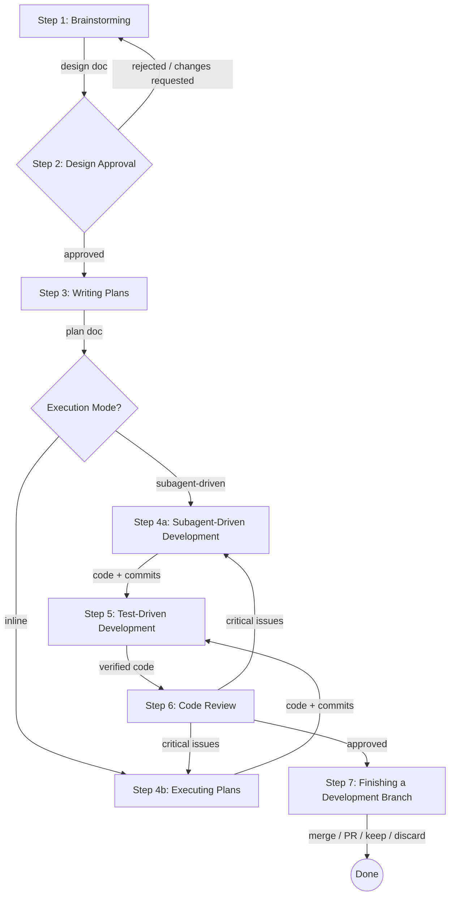
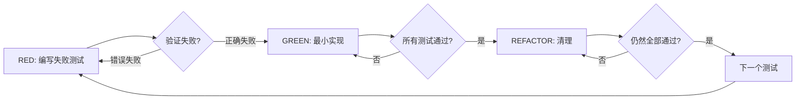

# 第一章 核心工作流全景：七步开发法

> **对应源文件**：`README.md`、`skills/brainstorming/SKILL.md`、`skills/writing-plans/SKILL.md`、`skills/subagent-driven-development/SKILL.md`、`skills/executing-plans/SKILL.md`、`skills/test-driven-development/SKILL.md`、`skills/requesting-code-review/SKILL.md`、`skills/finishing-a-development-branch/SKILL.md`

## 概述

Superpowers 的核心是一条 **七步串行工作流**——从 Brainstorming(头脑风暴) 到 Finishing(收尾)。每一步的输出都是下一步的前置输入；跳过任何一步，后续步骤将缺少必要信息，导致返工甚至交付缺陷代码。本章将逐步拆解这条流水线，解释每步"为什么在这个位置"，以及违反时的具体后果。

**前置阅读**：无（本章为全书起点）。后续章节 [02-skill-lifecycle](./02-skill-lifecycle.md) 和 [03-instruction-priority](./03-instruction-priority.md) 分别深入 Skill 加载机制与指令优先级。

---

## 1 全景流程图



> 上图中每条箭头上的标注即为前一步的产出物。箭头方向不可逆转（除了明确的回退路径），因为每一步都依赖前一步产出的制品(Artifact)。

---

## 2 七步详解

### Step 1 — Brainstorming（探索与设计）

> 源文件：`skills/brainstorming/SKILL.md`

**做什么**：通过 Socratic(苏格拉底式) 对话，把模糊需求精炼为可审批的设计文档。

**对应 Skill**：`brainstorming`

**为什么排在第一步**：如果跳过设计直接编码，Agent 会按自己的理解"猜"需求，导致大量返工。设计文档的核心价值不是"文档"本身，而是**强迫所有假设显式化**——写下来才能被审查。

**跳过的后果**：
- Agent 按猜测实现 → 80%+ 概率偏离用户意图
- 缺少 Spec(规格说明) → Plan 无法编写 → 后续步骤全部悬空

**铁律（Iron Law）**：

```
在用户审批设计之前，禁止调用任何实现类 Skill、编写任何代码、搭建任何脚手架。
```

**关键流程**：
1. 探索项目上下文（文件、文档、最近提交）
2. 逐个提出澄清问题（每次一个，优先选择题）
3. 提出 2–3 种方案，附带权衡分析和推荐
4. 分节展示设计，逐节获取用户确认
5. 将设计文档写入 `docs/superpowers/specs/YYYY-MM-DD-<topic>-design.md` 并提交
6. Spec Self-Review（自审：占位符、矛盾、歧义、范围）
7. 用户审批 Spec 文件

---

### Step 2 — Design Approval（设计审批）

**做什么**：用户审阅 Spec 文件，确认或要求修改。

**对应 Skill**：仍由 `brainstorming` 驱动（Spec Self-Review + User Review Gate）

**为什么单独列为一步**：Design Approval 是**人类控制阀**——它把"Agent 认为对的设计"变成"用户确认了的设计"。如果自动跳过审批，Agent 可能带着自洽但错误的设计一路执行到底。

**跳过的后果**：
- 设计中隐含的歧义直到代码审查阶段才暴露 → 返工成本 5–10×

**铁律**：

```
Brainstorming 的唯一合法终止状态是调用 writing-plans Skill。
不得调用 frontend-design、mcp-builder 或任何其他实现类 Skill。
```

---

### Step 3 — Writing Plans（计划编写）

> 源文件：`skills/writing-plans/SKILL.md`

**做什么**：将审批通过的设计拆分为 Bite-Sized Task(极小任务)（每个 2–5 分钟），包含精确文件路径、完整代码、验证命令。

**对应 Skill**：`writing-plans`

**为什么在设计之后**：Plan 的输入就是 Spec。没有 Spec，Plan 里的文件路径、接口签名、测试用例全无依据。Plan 相当于把建筑蓝图(Spec)翻译成施工工序表(Task List)。

**跳过的后果**：
- 没有 Plan → 执行步骤缺少精确指令 → Subagent 猜测行为 → 质量不可控
- 计划中的 TDD 步骤被省略 → 测试覆盖率断崖式下跌

**铁律**：

```
NO PLACEHOLDERS — 每一步必须包含工程师所需的实际内容。
禁止写 "TBD"、"TODO"、"implement later"、"similar to Task N"。
```

**任务粒度示范**：

```markdown
- [ ] Step 1: 编写失败测试
- [ ] Step 2: 运行测试，确认失败
- [ ] Step 3: 编写最小实现代码
- [ ] Step 4: 运行测试，确认通过
- [ ] Step 5: 提交
```

每一步都是**单一动作**，拒绝合并或省略。

---

### Step 4 — Execution（执行）

执行有两种模式，由用户选择：

#### Step 4a — Subagent-Driven Development（推荐）

> 源文件：`skills/subagent-driven-development/SKILL.md`

**做什么**：为每个 Task 派发一个全新 Subagent(子代理)，执行后进行两阶段审查——先 Spec Compliance(规格合规)，再 Code Quality(代码质量)。

**为什么推荐**：
- 每个 Subagent 拥有干净上下文 → 不会被前序任务的残留信息污染
- 两阶段审查 → 先保证"做对了"再保证"做好了"
- Controller(控制器) 保留全局上下文用于协调

**铁律**：

```
先完成 Spec Compliance Review，再启动 Code Quality Review——顺序不可互换。
```

#### Step 4b — Executing Plans（内联执行）

> 源文件：`skills/executing-plans/SKILL.md`

**做什么**：在当前会话中按 Plan 逐步执行，遇到阻塞立即停止并求助。

**适用场景**：平台不支持 Subagent，或任务间高度耦合。

**铁律**：

```
遇到阻塞时停止执行并求助——永远不要猜测。
```

---

### Step 5 — Test-Driven Development（测试驱动开发）

> 源文件：`skills/test-driven-development/SKILL.md`

**做什么**：强制执行 RED-GREEN-REFACTOR 循环——先写失败测试，再写最小实现，再重构。

**对应 Skill**：`test-driven-development`

**为什么嵌入执行阶段**：TDD 不是独立步骤，它贯穿整个 Step 4。Plan 中的每个 Task 都已包含 TDD 步骤。这里单独列出是因为它有自己的 Iron Law 和反模式检测。

**跳过的后果**：
- 先写代码再补测试 → 测试立即通过 → 无法证明测试真正检测到了缺陷
- "简单到不需要测试" → 简单代码照样出 Bug，而且没有回归保护

**铁律**：

```
NO PRODUCTION CODE WITHOUT A FAILING TEST FIRST
先写代码后补测试？删除代码，从头开始。不保留为"参考"、不"改编"、不偷看。
```

**RED-GREEN-REFACTOR 循环**：



---

### Step 6 — Code Review（代码审查）

> 源文件：`skills/requesting-code-review/SKILL.md`

**做什么**：派发 Reviewer Subagent，获取精确的 `BASE_SHA..HEAD_SHA` diff，按严重级别报告问题。

**对应 Skill**：`requesting-code-review`

**为什么在执行之后、收尾之前**：执行产出的代码需要独立视角的检查，才能进入合并阶段。Review 发现的 Critical/Important 问题必须修复后才能前进，这构成了质量门禁(Quality Gate)。

**跳过的后果**：
- 代码缺陷进入主干分支 → 线上事故
- Spec Compliance 遗漏 → 功能缺失上线

**铁律**：

```
Critical 问题立即修复；Important 问题在继续之前修复。
绝不因为"代码很简单"而跳过审查。
```

**回退路径**：当 Review 发现 Critical 问题 → 回到 Step 4 修复 → 重新 Review。

---

### Step 7 — Finishing a Development Branch（收尾）

> 源文件：`skills/finishing-a-development-branch/SKILL.md`

**做什么**：验证测试通过 → 提供 4 个结构化选项(Merge / PR / Keep / Discard) → 执行用户选择 → 清理 Worktree(工作树)。

**对应 Skill**：`finishing-a-development-branch`

**为什么排在最后**：收尾是所有质量门禁通过后的最终出口。它确保不会把失败的测试合并到主干，也不会遗忘清理临时分支和 Worktree。

**跳过的后果**：
- 测试失败的代码被合并 → 主干构建红灯
- 遗留 Worktree 占用磁盘 → 开发环境混乱

**铁律**：

```
测试失败时禁止提供合并/PR 选项。
丢弃代码必须获得用户输入 'discard' 的明确确认。
```

---

## 3 速查总表

| 步骤 | Skill | 输入 | 输出 | 铁律 |
|------|-------|------|------|------|
| 1. Brainstorming | `brainstorming` | 用户需求（模糊） | 设计文档 (Spec) | 设计审批前禁止写代码 |
| 2. Design Approval | `brainstorming` (gate) | Spec 文件 | 审批通过的 Spec | Brainstorming 只能过渡到 writing-plans |
| 3. Writing Plans | `writing-plans` | 审批通过的 Spec | 实现计划 (Plan) | No Placeholders；每步 2–5 分钟 |
| 4a. Subagent-Driven | `subagent-driven-development` | Plan | 代码 + 提交 | Spec Review → Code Quality Review（顺序不可逆） |
| 4b. Executing Plans | `executing-plans` | Plan | 代码 + 提交 | 遇阻即停，不猜测 |
| 5. TDD | `test-driven-development` | 当前 Task | 经过 RED-GREEN 验证的代码 | 无失败测试则无生产代码 |
| 6. Code Review | `requesting-code-review` | git diff (BASE..HEAD) | Review 报告 | Critical/Important 必须修复 |
| 7. Finishing | `finishing-a-development-branch` | 全部通过的代码 | Merge / PR / Keep / Discard | 测试失败时禁止合并 |

---

## 4 为什么顺序不可随意调换

七步之间存在严格的**产出-输入因果链**：


- **Spec 缺失** → Plan 无法写出精确文件路径和接口签名
- **Plan 缺失** → Subagent 没有 Task 指令，只能自由发挥
- **TDD 缺失** → Code Review 无法确认行为正确性
- **Review 缺失** → Finishing 无法保证代码质量

每跳过一步，就消灭了一层质量屏障，错误将在更后期、更昂贵的阶段才被发现。

---

## 5 回退机制

并非所有流程都一帆风顺。以下是合法的回退路径：

| 触发条件 | 回退到 | 原因 |
|----------|--------|------|
| 用户在 Step 2 要求修改设计 | Step 1 | Spec 需要重新协商 |
| Code Review 发现 Critical 问题 | Step 4 | 实现需要修复 |
| Plan Self-Review 发现 Spec 遗漏 | Step 1 | 设计本身有缺陷 |
| Subagent 报告 BLOCKED | Step 3（调整计划）或人类介入 | 任务不可完成 |
| 测试在 Finishing 阶段失败 | Step 4 | 代码有回归缺陷 |

**不合法的回退**：从 Step 7 直接回到 Step 1 重新设计——如果问题如此根本，应当明确告知用户并重新启动整个流程。

---

## 6 实战推演：添加一个 REST API Endpoint

假设用户说："给项目加一个 `GET /api/users/:id` 接口"。

### Step 1 — Brainstorming

Agent 不会立刻写代码。它先探索项目上下文：
- 项目使用什么框架？（Express / Fastify / Koa）
- 现有的路由(Route) 模式是什么？
- 数据库用什么？ORM(对象关系映射) 是哪个？

逐个提出澄清问题：
1. "返回哪些字段？全部还是子集？"
2. "认证方式？JWT / Session / 无认证？"
3. "用户不存在时返回 404 还是空对象？"

提出 2–3 种方案（如：直接查数据库 vs 加 Cache 层 vs GraphQL 代替），给出推荐。分节展示设计并逐节确认。

**产出**：`docs/superpowers/specs/2025-01-15-get-user-endpoint-design.md`

### Step 2 — Design Approval

用户审阅 Spec：
> "认证部分改成 Bearer Token，其他 OK。"

Agent 修改 Spec，重跑 Self-Review，用户确认。

### Step 3 — Writing Plans

生成 Plan，包含 5 个 Task：

| Task | 内容 | 预计耗时 |
|------|------|----------|
| 1 | 编写路由 Handler 的失败测试 | 3 min |
| 2 | 实现路由 Handler，使测试通过 | 4 min |
| 3 | 编写认证 Middleware 的失败测试 | 3 min |
| 4 | 实现认证 Middleware，使测试通过 | 5 min |
| 5 | 集成测试：完整请求链路 | 4 min |

每个 Task 包含精确的文件路径、完整代码、运行命令和预期输出。

**产出**：`docs/superpowers/plans/2025-01-15-get-user-endpoint.md`

### Step 4 — Subagent-Driven Development

Controller 读取 Plan，为 Task 1 派发 Implementer Subagent：

```
Task 1: 在 tests/routes/user.test.ts 中编写 GET /api/users/:id 的失败测试。
预期：测试因 "route not defined" 而失败。
```

Implementer 完成后，派发 Spec Reviewer：
> ✅ 测试覆盖了 Spec 中定义的字段和错误码。

再派发 Code Quality Reviewer：
> ✅ 测试命名清晰，无 Mock 滥用。

标记 Task 1 完成，进入 Task 2……

### Step 5 — TDD（贯穿 Step 4）

每个 Task 内部严格遵循 RED-GREEN-REFACTOR：
- **RED**：`npm test -- tests/routes/user.test.ts` → FAIL
- **GREEN**：实现 Handler → `npm test` → PASS
- **REFACTOR**：提取公共验证逻辑 → 测试仍然 PASS

### Step 6 — Code Review

全部 5 个 Task 完成后，派发最终 Reviewer：

```
BASE_SHA: a1b2c3d (分支起点)
HEAD_SHA: e4f5g6h (最新提交)
```

Review 报告：
- **Important**：缺少速率限制(Rate Limiting)中间件（Spec 未要求，但建议添加）
- **Minor**：变量命名 `usr` → `user`

Agent 修复 Minor 问题，将 Important 建议记录为后续任务。

### Step 7 — Finishing

```
✅ 全部 12 个测试通过。

Implementation complete. What would you like to do?

1. Merge back to main locally
2. Push and create a Pull Request
3. Keep the branch as-is
4. Discard this work

Which option?
```

用户选择 2 → Agent 推送分支、创建 PR、清理 Worktree。

---

## 本章核心结论

1. **七步链式依赖**：每步产出是下一步输入，跳过任何一步等同于移除一层质量屏障。
2. **设计先于代码**：无论项目多"简单"，都必须经过 Brainstorming → Approval → Plan 三步。
3. **TDD 不是独立步骤**：它嵌入在 Execution 阶段的每个 Task 内部，贯穿始终。
4. **两阶段审查顺序不可逆**：先 Spec Compliance，再 Code Quality——先确认"做对了"再确认"做好了"。
5. **回退是合法的**：Review 发现 Critical 问题时，必须回到 Execution 修复后重新 Review。
6. **Finishing 是质量终检**：测试不通过时禁止提供合并选项，遗弃代码必须明确确认。
7. **用户始终拥有控制权**：设计审批、执行模式选择、收尾方式——关键决策点都由人类把关。
