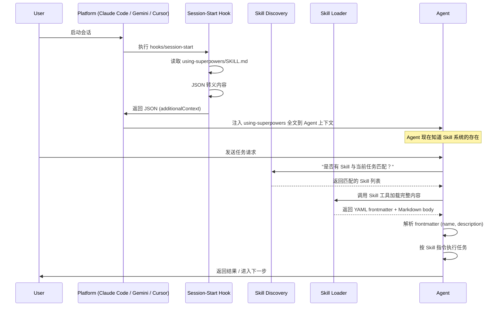
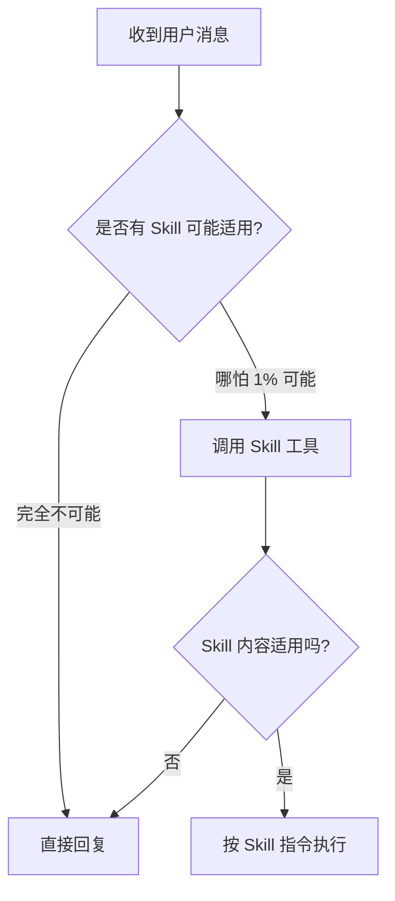
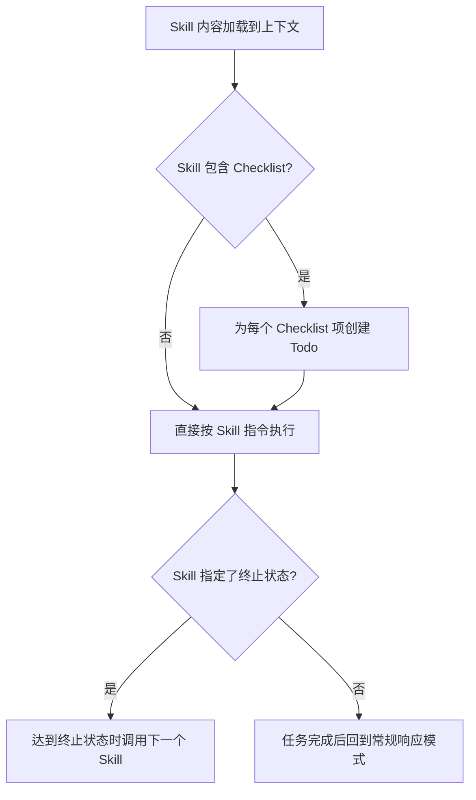

# 第二章 Skill 生命周期：发现、触发、加载、执行

> **对应源文件**：`hooks/session-start`、`skills/using-superpowers/SKILL.md`、`README.md`

## 概述

一个 Skill(技能) 从"存在于仓库中"到"被 Agent 遵循执行"，需要经历完整的生命周期：Discovery(发现) → Triggering(触发) → Loading(加载) → Execution(执行) → Completion(完成)。理解这条链路，才能诊断"为什么 Skill 没有被调用"或"为什么 Agent 没有遵循 Skill 指令"等常见问题。

**前置阅读**：[01-seven-step-workflow](./01-seven-step-workflow.md)（了解 Skill 在工作流中的位置）
**后续阅读**：[03-instruction-priority](./03-instruction-priority.md)（了解当多个 Skill 冲突时如何裁决）

---

## 1 生命周期全景



> 上图展示了从会话启动到 Skill 执行完成的完整数据流。关键点在于：`session-start` Hook 是整个 Skill 系统的引导加载器(Bootstrap Loader)，没有它，Agent 不知道 Skill 系统的存在。

---

## 2 Phase 1：Discovery（发现）

### 2.1 Hook 注册机制

Skill 的发现始于平台的 Plugin(插件) 系统。不同平台有不同的注册方式：

| 平台 | 注册方式 | 发现机制 |
|------|----------|----------|
| Claude Code | `/plugin install` 或 Marketplace | 扫描 Plugin 的 `hooks/` 和 `skills/` 目录 |
| Cursor | `/add-plugin` 或 Marketplace | 扫描 Plugin 的 `hooks/` 和 `skills/` 目录 |
| Gemini CLI | `gemini extensions install` | 读取 `gemini-extension.json` 清单文件 |
| Codex / OpenCode | 手动配置 | 按安装文档拉取远程 Skill 文件 |

**为什么需要 Plugin 系统而不是直接读文件**：Plugin 系统提供了版本管理（`/plugin update`）、隔离（每个 Plugin 独立目录）和跨平台兼容（统一的 Hook/Skill 约定）。如果让用户手动管理文件，版本冲突和路径错误将成为常态。

### 2.2 Session-Start Hook 详解

> 源文件：`hooks/session-start`

`session-start` 是整个 Skill 系统的**引导程序**。以下逐段分析：

```bash
#!/usr/bin/env bash
set -euo pipefail
```

**第 1–2 行**：声明 Bash 解释器，启用严格模式。`set -euo pipefail` 确保任何命令失败都会立即终止脚本（`-e`），未定义变量视为错误（`-u`），管道中任何命令失败都传播错误（`-o pipefail`）。**为什么**：Hook 的输出被平台解析为 JSON——如果 Hook 静默失败并输出非 JSON 内容，平台会出现不可预测行为。

```bash
SCRIPT_DIR="$(cd "$(dirname "$0")" && pwd)"
PLUGIN_ROOT="$(cd "${SCRIPT_DIR}/.." && pwd)"
```

**第 7–8 行**：定位脚本自身所在目录，然后上溯一级得到 Plugin 根目录。**为什么用 `cd + pwd`**：符号链接(Symlink) 环境下 `dirname` 返回的可能是链接路径而非真实路径，`cd + pwd` 确保解析到物理路径。

```bash
legacy_skills_dir="${HOME}/.config/superpowers/skills"
if [ -d "$legacy_skills_dir" ]; then
    warning_message="..."
fi
```

**第 11–15 行**：检查遗留的 Custom Skill 目录是否存在。旧版 Superpowers 将自定义 Skill 放在 `~/.config/superpowers/skills`，新版使用平台原生 Skill 系统（如 `~/.claude/skills`）。**为什么需要这个检查**：如果用户升级后没有迁移自定义 Skill，它们将被静默忽略——这比报错更危险，因为用户会误以为自定义 Skill 仍然生效。

```bash
using_superpowers_content=$(cat "${PLUGIN_ROOT}/skills/using-superpowers/SKILL.md" 2>&1 || echo "Error reading...")
```

**第 18 行**：读取 `using-superpowers` Skill 的完整内容。这是唯一在 Hook 阶段直接读取的 Skill——它是 Agent 理解整个 Skill 系统的"元指令(Meta-Instruction)"。其他 Skill 在运行时按需加载。**为什么只预加载这一个**：上下文窗口有限，预加载所有 Skill 会浪费 Token(令牌)。`using-superpowers` 告诉 Agent **如何**发现和调用其他 Skill，一个就够了。

```bash
escape_for_json() {
    local s="$1"
    s="${s//\\/\\\\}"
    s="${s//\"/\\\"}"
    s="${s//$'\n'/\\n}"
    s="${s//$'\r'/\\r}"
    s="${s//$'\t'/\\t}"
    printf '%s' "$s"
}
```

**第 23–30 行**：JSON 字符串转义函数。使用 Bash Parameter Substitution(参数替换) 而非逐字符循环——性能差距达数量级。**为什么需要手动转义而不是用 `jq`**：减少外部依赖。`jq` 不是所有环境都预装，而 Bash 的参数替换是内置功能。

```bash
if [ -n "${CURSOR_PLUGIN_ROOT:-}" ]; then
  printf '{\n  "additional_context": "%s"\n}\n' "$session_context"
elif [ -n "${CLAUDE_PLUGIN_ROOT:-}" ]; then
  printf '{\n  "hookSpecificOutput": {\n    ...\n  }\n}\n' "$session_context"
else
  printf '{\n  "additional_context": "%s"\n}\n' "$session_context"
fi
```

**第 46–55 行**：平台检测与 JSON 输出。不同平台期望不同的 JSON 结构：
- **Cursor**：读取顶层 `additional_context` 字段
- **Claude Code**：读取嵌套的 `hookSpecificOutput.additionalContext` 字段
- **其他平台**：使用 `additional_context` 作为降级方案

**为什么不两个字段都输出**：Claude Code 会同时读取两个字段但不做去重——如果两个都输出，`using-superpowers` 的内容会被注入两次，浪费宝贵的上下文空间。

**为什么用 `printf` 而非 Heredoc(Here 文档)**：源码注释中指出，Bash 5.3+ 存在一个 Bug——当 Heredoc 变量展开的内容超过 ~512 字节时，脚本会挂起。`printf` 绕过了这个问题。

### 2.3 JSON Stdout 的设计选择

Hook 通过 JSON 格式的 stdout(标准输出) 与平台通信。**为什么是 JSON 而非其他格式**：

| 格式 | 跨平台兼容 | 结构化 | 解析复杂度 | 选择 |
|------|------------|--------|------------|------|
| 纯文本 | ✅ | ❌ | 低 | ❌ 无法表达嵌套结构 |
| YAML | ✅ | ✅ | 中 | ❌ 缩进敏感，Shell 中难以生成 |
| JSON | ✅ | ✅ | 低 | ✅ 所有平台原生支持解析 |
| 环境变量 | ❌ | ❌ | 低 | ❌ 无法传递大段文本 |

JSON 是平台与 Hook 之间的**契约格式**——它足够简单可以在 Bash 中用 `printf` 生成，又足够结构化可以被任何平台的 JSON 解析器处理。

---

## 3 Phase 2：Triggering（触发）

### 3.1 1% Rule（1% 规则）

> 源文件：`skills/using-superpowers/SKILL.md`

触发机制的核心是**极低阈值匹配**：

```
如果你认为一个 Skill 有哪怕 1% 的可能性适用于当前任务，
你就必须调用它。
```

**为什么设定如此低的阈值**：Agent 有内在的"效率偏好"——它倾向于跳过额外步骤来更快完成任务。1% 规则对冲了这种偏好：宁可多调用一个不需要的 Skill（成本 = 几百 Token），也不要漏掉一个需要的 Skill（成本 = 返工数小时的代码）。

**触发的决策流程**：



### 3.2 Description 驱动的匹配

每个 Skill 文件以 YAML Frontmatter(前置元数据) 开头：

```yaml
---
name: brainstorming
description: "You MUST use this before any creative work..."
---
```

`description` 字段是 Agent 判断是否触发 Skill 的主要依据。它的写法遵循一种类似 SEO(搜索引擎优化) 的原则，可以称为 **CSO — Claude Search Optimization**：

| 原则 | 说明 | 示例 |
|------|------|------|
| 动作动词开头 | 明确声明"何时使用" | `"Use when implementing any feature..."` |
| 覆盖同义场景 | 列出所有可能触发的任务描述 | `"creating features, building components, adding functionality"` |
| 强制性语言 | 消除 Agent 的跳过倾向 | `"You MUST use this before..."` |

**为什么 description 如此重要**：Agent 在决定是否调用一个 Skill 时，首先看到的就是 `description`。如果 description 不够明确或覆盖面不够广，Agent 可能判断"这个 Skill 不适用"而跳过它——即使实际上它应该被调用。

### 3.3 显式调用 vs 隐式匹配

| 触发方式 | 机制 | 示例 |
|----------|------|------|
| 显式调用 | 用户或 Skill 指令中直接引用 Skill 名称 | `"Invoke writing-plans skill"` |
| 隐式匹配 | Agent 根据任务内容与 Skill description 匹配 | 用户说"帮我加个功能" → Agent 匹配到 brainstorming |
| 链式调用 | 一个 Skill 在结束时调用另一个 Skill | brainstorming → writing-plans → subagent-driven-development |

**链式调用是七步工作流的驱动机制**——每个 Skill 的 Completion 状态都包含"下一步调用哪个 Skill"的指令，形成流水线。

---

## 4 Phase 3：Loading（加载）

### 4.1 YAML Frontmatter 格式

每个 Skill 文件（`SKILL.md`）的头部包含 YAML Frontmatter：

```yaml
---
name: test-driven-development
description: Use when implementing any feature or bugfix, before writing implementation code
---
```

| 字段 | 用途 | 必填 |
|------|------|------|
| `name` | Skill 的唯一标识符，用于显式调用（如 `superpowers:test-driven-development`） | ✅ |
| `description` | 触发匹配的描述文本，告诉 Agent "何时使用此 Skill" | ✅ |

**为什么用 YAML Frontmatter 而非独立配置文件**：
1. **就近原则**：元数据和内容在同一文件中，不会出现配置与内容脱节
2. **Markdown 兼容**：YAML Frontmatter 是 Markdown 生态的标准约定（Hugo、Jekyll、Obsidian 等），工具链天然支持
3. **极简性**：只有两个字段，不需要复杂的 Schema

### 4.2 平台差异

不同平台加载 Skill 的方式不同：

| 平台 | 加载方式 | 说明 |
|------|----------|------|
| Claude Code | `Skill` 工具调用 | Agent 通过 Skill 工具按名称请求，平台返回完整内容 |
| Gemini CLI | `activate_skill` 工具 | 会话启动时加载所有 Skill 的元数据，按需激活完整内容 |
| Cursor | Plugin 系统 | 与 Claude Code 类似的 Skill 工具调用 |
| Codex / OpenCode | 文件读取 | 无原生 Skill 工具，Agent 直接读取 SKILL.md 文件 |

**为什么 Claude Code 禁止用 Read 工具读取 Skill 文件**：`using-superpowers` 明确指出 "Never use the Read tool on skill files"。原因是 Skill 工具不仅返回文件内容，还处理了 Skill 的依赖解析、版本控制和平台适配。直接读文件会绕过这些机制。

### 4.3 Subagent 与 Skill 加载的交互

在 Subagent-Driven Development 中，Subagent 有一个特殊规则：

```
<SUBAGENT-STOP>
If you were dispatched as a subagent to execute a specific task, skip this skill.
</SUBAGENT-STOP>
```

**为什么 Subagent 要跳过 `using-superpowers`**：Subagent 是由 Controller 派发的执行者，它的指令已经由 Controller 精心构建。如果 Subagent 再走一遍"检查所有可能的 Skill"的流程，不仅浪费 Token，还可能触发不相关的 Skill（比如 Subagent 被派发做 Task 3 的实现，却触发了 brainstorming 要求重新设计）。

---

## 5 Phase 4：Execution（执行）

### 5.1 执行流程

加载 Skill 后，Agent 的执行遵循以下模式：



### 5.2 宣告机制

大多数 Skill 要求在开始时明确宣告：

```
"I'm using the writing-plans skill to create the implementation plan."
"I'm using the finishing-a-development-branch skill to complete this work."
```

**为什么需要宣告**：
1. **用户感知**：用户知道 Agent 正在遵循哪个 Skill，可以判断是否合理
2. **审计跟踪**：在对话历史中留下明确的 Skill 调用记录
3. **自我约束**：宣告后 Agent 更不容易偏离 Skill 指令（类似"公开承诺效应"）

### 5.3 Rigid vs Flexible Skill

> 源文件：`skills/using-superpowers/SKILL.md`

| 类型 | 特征 | 代表 Skill | 执行方式 |
|------|------|-----------|----------|
| Rigid(刚性) | 步骤不可省略，顺序不可调整 | `test-driven-development`, `systematic-debugging` | 严格遵循每一步 |
| Flexible(柔性) | 原则层面指导，具体步骤可适配 | 模式类 Skill (patterns) | 根据上下文调整细节 |

**为什么需要这个区分**：如果所有 Skill 都是 Flexible 的，Agent 会把"适配到上下文"作为跳过关键步骤的借口（"这个场景不需要写失败测试"）。Rigid Skill 明确告诉 Agent "没有例外"——这是对 Agent 偷懒倾向的系统性约束。Skill 自身会声明自己属于哪种类型。

---

## 6 Phase 5：Completion（完成与过渡）

### 6.1 终止状态与链式过渡

每个工作流 Skill 都定义了明确的终止状态和过渡目标：

| Skill | 终止状态 | 过渡到 |
|-------|----------|--------|
| `brainstorming` | 用户审批 Spec | `writing-plans` |
| `writing-plans` | Plan 保存完成 | `subagent-driven-development` 或 `executing-plans` |
| `subagent-driven-development` | 全部 Task 完成 + 最终 Review | `finishing-a-development-branch` |
| `executing-plans` | 全部 Task 完成 | `finishing-a-development-branch` |
| `finishing-a-development-branch` | 用户选择并执行完成 | 会话结束 |

**这条链就是第一章七步工作流的驱动机制**——不需要外部编排器(Orchestrator)，每个 Skill 自己知道"完成后该调用谁"。

### 6.2 异常终止

并非所有 Skill 执行都能正常完成：

| 异常 | 处理方式 |
|------|----------|
| 用户明确中断 | 尊重用户指令，停止当前 Skill |
| Subagent 报告 BLOCKED | 由 Controller 评估后决定：补充上下文 / 升级模型 / 拆分任务 / 上报人类 |
| 测试持续失败 | 停止执行，报告实际状态，请求人类介入 |
| Skill 冲突 | 按指令优先级裁决（见 [03-instruction-priority](./03-instruction-priority.md)） |

---

## 7 生命周期问题诊断

| 症状 | 可能原因 | 诊断方法 |
|------|----------|----------|
| Agent 完全不知道 Skill 系统 | `session-start` Hook 未执行 | 检查 Plugin 是否正确安装 |
| Agent 知道 Skill 但不主动调用 | `using-superpowers` 内容注入失败 | 检查 Hook 的 JSON 输出格式是否匹配平台 |
| Agent 调用了错误的 Skill | Skill description 覆盖范围不精确 | 审查 description 文本 |
| Subagent 走了完整 Skill 检查流程 | `SUBAGENT-STOP` 标记缺失或被忽略 | 检查 Skill 文件头部的 `<SUBAGENT-STOP>` 标签 |
| Skill 内容被注入两次 | 平台检测逻辑有误 | 检查 Hook 中的环境变量判断 (`CURSOR_PLUGIN_ROOT` / `CLAUDE_PLUGIN_ROOT`) |

---

## 本章核心结论

1. **`session-start` Hook 是引导加载器**：它将 `using-superpowers` 注入 Agent 上下文，是整个 Skill 系统的启动入口。
2. **只预加载一个 Skill**：`using-superpowers` 告诉 Agent 如何发现和调用其他 Skill，避免上下文浪费。
3. **JSON Stdout 是 Hook 与平台的契约**：格式必须精确匹配平台期望，否则 Skill 系统静默失效。
4. **1% Rule 对冲效率偏好**：宁可多调用不需要的 Skill，也不漏掉需要的 Skill。
5. **YAML Frontmatter 的 `description` 决定触发**：写法需覆盖所有可能的触发场景，类似 CSO 优化。
6. **Rigid Skill 不可"适配"**：TDD、Debugging 等 Skill 的步骤不可省略，这是系统性防偷懒机制。
7. **链式过渡驱动工作流**：每个 Skill 的终止状态包含"下一步调用谁"的指令，无需外部编排。
