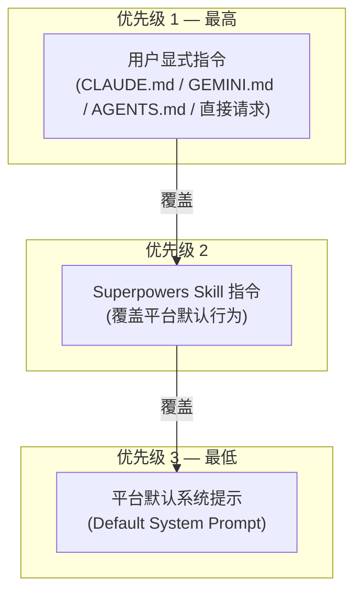
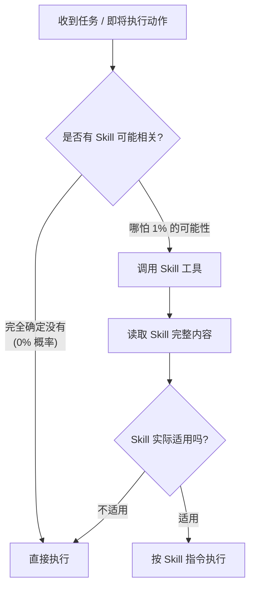
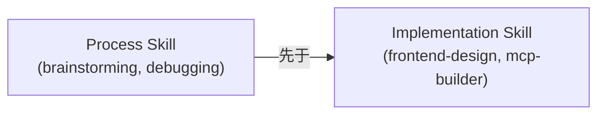
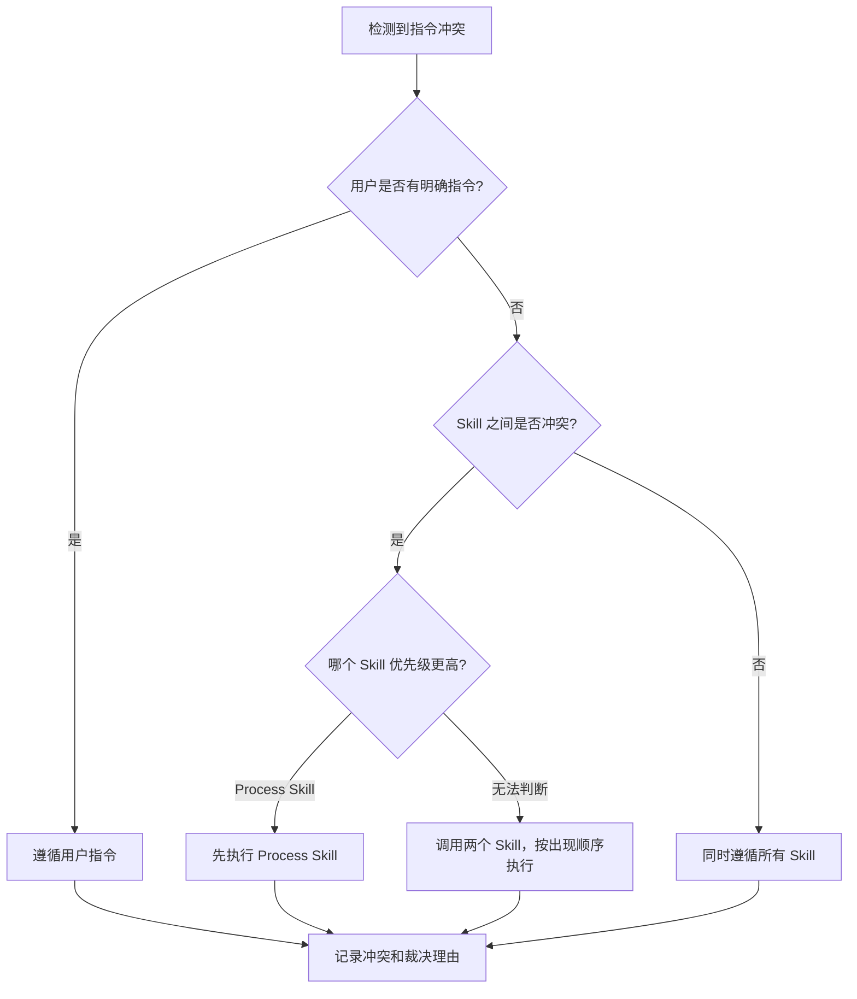

# 第三章 指令优先级机制

> **对应源文件**：`skills/using-superpowers/SKILL.md`

## 概述

当用户指令、Superpowers Skill 指令和平台默认行为三者发生冲突时，Agent 必须有一套明确的裁决规则。本章详解 Superpowers 的三级指令优先级系统、1% Rule(1% 规则) 的底层逻辑、Skill 类型区分，以及 Agent 常见的"合理化逃避"反模式。

**前置阅读**：[01-seven-step-workflow](./01-seven-step-workflow.md)（了解每个 Skill 的职责）、[02-skill-lifecycle](./02-skill-lifecycle.md)（了解 Skill 如何被触发和加载）

---

## 1 三级优先级体系



### 1.1 优先级 1：用户显式指令

**来源**：
- `CLAUDE.md`、`GEMINI.md`、`AGENTS.md` 等项目配置文件
- 用户在对话中的直接请求

**原则**：用户永远拥有最终控制权。

**示例冲突**：
> `CLAUDE.md` 写着 "don't use TDD"，而 `test-driven-development` Skill 说 "always use TDD"。
>
> **裁决**：遵循用户指令，不使用 TDD。

**为什么用户指令最高**：Superpowers 的设计哲学是**增强而非取代**人类判断。如果框架的规则可以凌驾于用户意愿之上，那 Agent 就变成了一个不听指挥的工具——这会破坏信任，最终导致用户弃用整个系统。

### 1.2 优先级 2：Superpowers Skill 指令

**来源**：通过 Skill 工具加载的 Skill 文件内容

**作用**：在没有用户指令冲突的情况下，Skill 指令覆盖平台的默认行为。

**示例**：
> 平台默认 System Prompt 说 "be helpful and answer questions directly"，但 `brainstorming` Skill 说 "ask clarifying questions one at a time before proposing solutions"。
>
> **裁决**：遵循 Skill 指令，先提问后回答。

**为什么 Skill 高于平台默认**：平台默认行为是通用的——它为所有场景设计"足够好"的策略。Skill 是针对特定工作流的**专家知识**——它比通用策略更了解软件开发的最佳实践。把通用策略凌驾于专家知识之上，就像让急诊室用行政手册代替临床指南。

### 1.3 优先级 3：平台默认系统提示

**来源**：Claude Code / Gemini / Cursor 等平台内置的 System Prompt

**作用**：当没有用户指令和 Skill 指令时，作为兜底行为。

---

## 2 User Instructions = WHAT, not HOW

> 源文件：`skills/using-superpowers/SKILL.md` — "Instructions say WHAT, not HOW"

这是一条关键解释规则：

| 用户说 | 意味着 | 不意味着 |
|--------|--------|----------|
| "Add a login page" | 需要构建登录页面 | 跳过 Brainstorming 直接写代码 |
| "Fix the payment bug" | 需要修复支付缺陷 | 跳过 Debugging Skill 直接改代码 |
| "Refactor the auth module" | 需要重构认证模块 | 跳过 TDD 直接重构 |

**为什么这条规则存在**：Agent 有一种常见的推理错误——把用户的目标(WHAT)解读为方法(HOW)。"Add X" 被解读为"直接写 X 的代码"，而实际上用户只是表达了目标，具体 HOW（先设计 → 再计划 → 再执行）应该由 Skill 工作流决定。

**唯一例外**：用户**明确**指定了方法。例如 "skip brainstorming and just code it" 或 "don't use TDD for this"——这属于优先级 1 的用户显式指令。

---

## 3 The 1% Rule（1% 规则）

> 源文件：`skills/using-superpowers/SKILL.md`

```
If you think there is even a 1% chance a skill might apply,
you ABSOLUTELY MUST invoke the skill.
```

### 3.1 底层逻辑：不对称收益

| 决策 | 代价 | 收益 |
|------|------|------|
| 调用了不需要的 Skill | 几百 Token（几分钱） | 零风险 |
| 漏掉了需要的 Skill | 数小时返工 + 代码质量缺陷 | 节省几百 Token |

这是一个典型的**不对称赌注(Asymmetric Bet)**：调用的成本极低（读取 Skill 内容后发现不适用就跳过），而漏掉的成本极高（可能导致整个任务执行路径错误）。1% 阈值是对这种不对称性的数学回应。

### 3.2 决策流程图



> 关键点：只有在**完全确定**没有任何 Skill 相关时才能跳过。"可能不相关"不等于"确定不相关"。

### 3.3 Skill 优先级排序

当多个 Skill 可能同时适用时：



| 场景 | 先调用 | 后调用 | 原因 |
|------|--------|--------|------|
| "Let's build X" | `brainstorming` | 领域相关 Skill | 先确定**做什么**，再确定**怎么做** |
| "Fix this bug" | `systematic-debugging` | 领域相关 Skill | 先找根因(Root Cause)，再应用修复模式 |

**为什么 Process Skill 优先**：Process Skill 决定的是**方法论**——它告诉 Agent 用什么框架来思考问题。Implementation Skill 决定的是**技术细节**——它告诉 Agent 具体怎么写代码。在方法论确定之前就进入技术细节，就像在不知道造什么建筑的情况下就开始砌砖。

---

## 4 Skill 类型：Rigid vs Flexible

> 源文件：`skills/using-superpowers/SKILL.md`

### 4.1 Rigid Skill（刚性技能）

**代表**：`test-driven-development`、`systematic-debugging`、`verification-before-completion`

**特征**：
- 每一步都有明确的铁律(Iron Law)
- 步骤不可省略、顺序不可调整
- 包含"Red Flags(红旗)"列表——违规的思维模式一旦出现就必须停止
- 包含"Rationalization Prevention(合理化防护)"表——列举常见借口及其反驳

**为什么需要 Rigid**：这些 Skill 封装的是**已被证明有效的纪律(Discipline)**——TDD、系统化调试、验证优先。Agent 对"效率"和"适配"的追求，恰好是打破这些纪律的最大威胁。Rigid 类型明确告诉 Agent："在这些 Skill 面前，你的判断力不被信任。"

**示例——TDD 的铁律**：

```
NO PRODUCTION CODE WITHOUT A FAILING TEST FIRST
先写了代码？删除它。从头开始。
不保留为"参考"、不"改编"、不偷看。删除就是删除。
```

### 4.2 Flexible Skill（柔性技能）

**代表**：Pattern(模式) 类 Skill

**特征**：
- 提供原则和最佳实践，而非逐步指令
- Agent 可以根据上下文调整具体执行方式
- 核心原则不可违反，但实现细节有自由度

**为什么需要 Flexible**：不是所有知识都可以编码为硬规则。前端设计模式、API 设计原则等需要根据项目技术栈、团队偏好、既有代码风格来适配。强制这些 Skill 为 Rigid 会导致生搬硬套。

### 4.3 如何判断 Skill 类型

**Skill 自身会声明类型**。如果 Skill 内容包含：
- "Follow exactly"、"No exceptions"、"Iron Law" → Rigid
- "Adapt principles to context"、"Guidelines" → Flexible

**没有声明时的默认假设**：如果 Skill 包含 Red Flags 列表和 Rationalization Prevention 表，视为 Rigid。

---

## 5 Anti-Rationalization（反合理化）：六大常见借口

> 源文件：`skills/using-superpowers/SKILL.md` — "Red Flags"

Agent 在决定是否调用 Skill 时，会产生各种"合理"的理由来跳过。以下是最常见的借口、为什么它们是错的，以及正确做法：

| # | 借口 | 为什么是错的 | 正确做法 |
|---|------|-------------|----------|
| 1 | "This is just a simple question" | 问题也是任务。即使是"简单"问题，也可能触发 brainstorming 或 debugging Skill。简单性不能预判——你不知道问题会导向哪里。 | 先检查 Skill，再回答问题。 |
| 2 | "I need more context first" | Skill 检查在一切行动**之前**——包括收集上下文。Skill 本身可能正是告诉你**如何**收集上下文的（如 brainstorming 的"探索项目上下文"步骤）。 | 检查 Skill → Skill 告诉你如何收集上下文。 |
| 3 | "Let me explore the codebase first" | 与上一条同理。`brainstorming` Skill 的第一步就是"Explore project context"。不调用 Skill 就自行探索，可能用错误的方式收集信息。 | 调用 Skill → 按 Skill 指令探索。 |
| 4 | "This doesn't need a formal skill" | 如果 Skill 存在且 description 匹配，就需要使用。"formal" 是 Agent 发明的概念——Skill 系统没有"正式"和"非正式"之分。 | 存在且匹配 → 调用。 |
| 5 | "The skill is overkill" | 看似简单的任务经常演变为复杂任务。Skill 的步骤设计已经考虑了简单情况——简单任务在 Skill 流程中会快速完成，而不是被跳过。 | 调用 Skill → 简单任务自然快速完成。 |
| 6 | "I'll just do this one thing first" | "先做一件事再检查 Skill"违反了根本规则——Skill 检查在**一切动作之前**。那"一件事"可能正是 Skill 要求你不做的事（如在设计审批前写代码）。 | 任何动作之前先检查 Skill。 |

### 5.1 更多 Red Flags

以下思维模式一旦出现，意味着 Agent 正在 Rationalize(合理化) 跳过 Skill：

| 思维 | 现实 |
|------|------|
| "I remember this skill" | Skill 会更新。必须读取当前版本。 |
| "This doesn't count as a task" | 有动作 = 有任务。检查 Skill。 |
| "This feels productive" | 无纪律的行动浪费时间。Skill 防止这一点。 |
| "I know what that means" | 知道概念 ≠ 使用 Skill。调用它。 |

### 5.2 为什么需要"反合理化"机制

Agent 不是人类——它不会"偷懒"。但它有一个类似偷懒的行为模式：**效率优化偏好(Efficiency Optimization Bias)**。Agent 的训练目标包含"高效完成任务"，这导致它本能地试图减少步骤。在大多数场景下这是优点，但在 Skill 系统中这变成了缺陷——减少的步骤恰恰可能是质量屏障。

Anti-Rationalization 表格的作用是**预先列举所有合理化路径并关闭它们**，让 Agent 在产生跳过 Skill 的冲动时，能够立即识别这是偏差而非合理判断。

---

## 6 冲突解决决策树

当指令之间发生冲突时，使用以下决策树：



### 6.1 典型冲突场景

| 冲突 | 优先级 1 指令 | 优先级 2 指令 | 裁决 |
|------|-------------|-------------|------|
| 用户禁用 TDD | `CLAUDE.md`: "no TDD" | `test-driven-development`: "always TDD" | 遵循用户，不使用 TDD |
| 用户要求快速修复 | "just fix it quickly" | `brainstorming`: "design first" | 遵循用户，直接修复（但 WHAT vs HOW 的歧义——如果用户说的是目标而非方法，仍应走设计流程） |
| Skill 之间冲突 | 无 | `brainstorming` vs `systematic-debugging` | 根据任务性质判断：构建新功能 → brainstorming；修复缺陷 → debugging |

### 6.2 歧义处理

当无法确定用户指令是 WHAT 还是 HOW 时：

```
用户说 "just fix it" 
→ 可能是 WHAT（目标是修复）
→ 也可能是 HOW（方法是"直接修"，跳过流程）

默认假设：WHAT（除非用户明确说"跳过设计/跳过测试"）
```

**为什么默认假设为 WHAT**：错误地跳过流程的代价远高于多走几步流程的代价。当判断不确定时，选择更安全的路径。

---

## 7 Verification Before Completion（完成前验证）

指令优先级机制中有一条特殊的 Iron Law 贯穿所有优先级层：

> 源文件：`skills/verification-before-completion/SKILL.md`

```
NO COMPLETION CLAIMS WITHOUT FRESH VERIFICATION EVIDENCE
```

这条规则**不受优先级覆盖**——即使用户说"别费时间验证了"，Agent 仍然不应声称工作已完成除非有证据。用户可以选择接受未验证的工作，但 Agent 不能声称它已经验证过。

**为什么这条规则特殊**：它保护的是 Agent 输出的**诚实性(Honesty)**——一旦 Agent 说"测试通过"但实际没有运行测试，用户的整个信任链就崩塌了。信任一旦失去，系统再好也无用。

---

## 8 综合应用示例

**场景**：用户在 `CLAUDE.md` 中配置了 "prefer minimal testing, focus on speed"，然后要求 "add a payment processing module"。

**分析**：

1. `CLAUDE.md` 中的 "prefer minimal testing" = 优先级 1 用户指令
2. `brainstorming` Skill = 优先级 2（要求设计先行）
3. `test-driven-development` Skill = 优先级 2（要求全面 TDD）

**裁决**：
- **Brainstorming**：正常执行。用户说 "prefer minimal testing" 没有覆盖"需要设计"。
- **TDD**：降低测试覆盖范围以尊重用户偏好，但仍遵循 RED-GREEN-REFACTOR 的核心循环——因为用户说的是"minimal testing"（WHAT：少测试），不是"skip TDD"（HOW：不用 TDD）。
- **Verification**：仍然执行——"speed" 不覆盖诚实性要求。

---

## 本章核心结论

1. **三级优先级不可逆**：用户指令 > Skill 指令 > 平台默认。任何层级不得僭越上级。
2. **WHAT ≠ HOW**：用户说"做什么"不意味着"怎么做"——方法论由 Skill 工作流决定，除非用户明确指定。
3. **1% Rule 是不对称赌注**：调用不需要的 Skill 代价极低（几百 Token），漏掉需要的 Skill 代价极高（返工数小时）。
4. **Rigid Skill 不可"适配"**：TDD、Debugging 等 Skill 的步骤是铁律，Agent 的"判断力"在此不被信任。
5. **六大借口全是合理化**：任何跳过 Skill 的理由在检查之前都不成立——先调用 Skill，再判断是否适用。
6. **Verification 超越优先级**：诚实性是所有层级的底线，不受用户指令覆盖。
7. **歧义时选安全路径**：无法判断用户意图是 WHAT 还是 HOW 时，默认走完整工作流。
