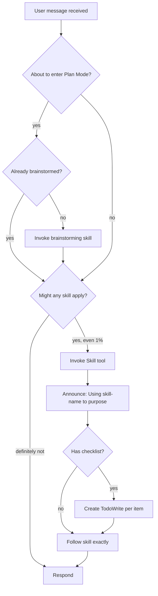
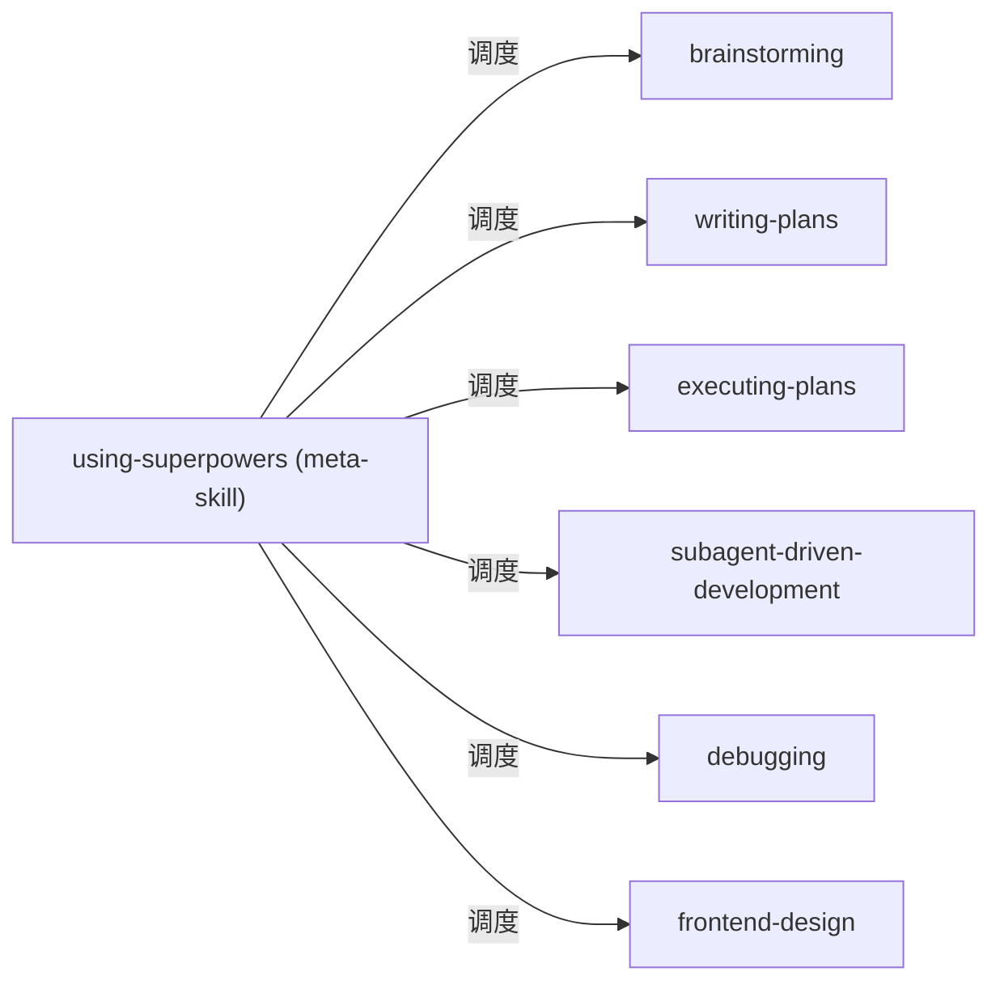

# 第零章 Using Superpowers — 元技能

> **对应源文件**：`skills/using-superpowers/SKILL.md`、`skills/using-superpowers/references/codex-tools.md`、`skills/using-superpowers/references/gemini-tools.md`

## 概述

Using Superpowers 是控制所有其他 Skill(技能) 的 **meta-skill（元技能）**。它不解决某一类具体问题，而是解决 _"AI Agent 在收到任务后第一时间应该做什么"_ 这个根本问题。核心回答只有一句：**先检查有没有适用的 Skill，如果有，必须调用。**

## 前置阅读

无。本章是整个 Superpowers 体系的入口。

---

## 1 定义与定位

| 维度 | 说明 |
|------|------|
| 是什么 | 在 Agent 接收到任何消息后、做出任何响应之前，强制执行的 Skill 检索与调用规则 |
| 在工作流中的位置 | 最上层——位于所有 Skill 之前，是 Skill 的"调度器" |
| 解决什么问题 | 防止 Agent 凭"直觉"跳过已有的结构化工作流，从而产出质量不稳定的结果 |

---

## 2 底层原理

大语言模型存在一种强烈倾向：**先行动再思考**。拿到 "Add X" 或 "Fix Y" 的指令后，模型会立即开始写代码、调命令，跳过探索和规划。Using Superpowers 通过 **1% 规则（1% Rule）** 对抗这种倾向：

> 只要有哪怕 1% 的可能性某个 Skill 适用于当前任务，你就 **必须** 调用它。

如果不遵守该规则，Agent 会反复以"这只是个简单问题"为由跳过流程，导致：
- 未经设计直接写代码 → 返工
- 未经 TDD 直接实现 → 遗漏测试
- 未经 brainstorming 直接编码 → 架构不合理

---

## 3 触发条件

| 条件 | 是否触发 | 原因 |
|------|---------|------|
| 收到用户消息 | ✅ | 任何消息都可能对应某个 Skill |
| 准备进入 Plan Mode | ✅ | 先检查是否已完成 brainstorming |
| 被作为 Subagent（子代理）派遣执行特定任务 | ❌ | Subagent 跳过此技能，直接执行委派任务 |
| 明确判定无 Skill 适用 | ❌ | 直接响应用户 |

**互斥关系**：当 Agent 以 Subagent 身份运行时（`<SUBAGENT-STOP>` 标记），跳过 Using Superpowers，因为 Subagent 的上下文由 Controller（控制器）精确构建，无需自主检索。

---

## 4 执行流程



**流程说明**（因果链）：

1. **接收消息** — 每条消息都是 Skill 检索的触发点。如果跳过此步，后续所有流程控制失效。
2. **Plan Mode 检查** — 若 Agent 即将进入计划模式，先确认 brainstorming 是否已完成。未完成就直接规划 = 在需求不明时写方案。
3. **1% 检查** — 只要存在可能性，就调用 Skill。调用后发现不适用可以放弃，但不调用就永远不知道是否适用。
4. **声明使用** — 向用户声明 "Using [skill] to [purpose]"，确保透明度。
5. **Checklist 转 Todo** — 若 Skill 附带 checklist，为每个项目创建 Todo 项，防止遗漏。

---

## 5 强制规则

### 5.1 Instruction Priority（指令优先级）

```
用户显式指令 (CLAUDE.md / GEMINI.md / AGENTS.md / 直接请求)
        ↓ 最高优先
Superpowers Skills
        ↓
默认系统提示 (Default System Prompt)
        ↓ 最低优先
```

**原因**：用户始终拥有最终控制权。如果 `CLAUDE.md` 写了 "don't use TDD"，而某个 Skill 要求 "always use TDD"，遵循用户指令。违反此优先级会导致 Agent 忽视用户意图。

### 5.2 Skill 类型

| 类型 | 含义 | 如何遵循 | 举例 |
|------|------|---------|------|
| Rigid（刚性） | 必须严格按步骤执行 | 不得自行裁剪或跳步 | TDD, Debugging |
| Flexible（柔性） | 原则适配上下文 | 保持原则，根据场景调整细节 | 设计模式类 |

**为什么区分**：Rigid Skill 对抗的是 "走捷径" 倾向——如果允许灵活裁剪，Agent 会逐步把所有步骤都裁掉。Flexible Skill 则承认某些领域的最佳实践因场景而异。

### 5.3 Skill 优先顺序

当多个 Skill 同时适用时：

1. **Process Skill 优先**（brainstorming, debugging）— 决定 _如何_ 处理任务
2. **Implementation Skill 其次**（frontend-design, mcp-builder）— 指导具体执行

**原因**：Process Skill 确定方向，Implementation Skill 填充细节。先做方向决策，再做实施决策，顺序颠倒会导致在错误方向上做精细执行。

### 5.4 用户指令 ≠ 跳过流程

用户说 "Add X" 或 "Fix Y" 描述的是 **WHAT**（做什么），不是 **HOW**（怎么做）。这些指令不意味着跳过 brainstorming、planning 或 TDD 等工作流。

---

## 6 Checklist

Using Superpowers 自身的 checklist 就是上面流程图中的每一步：

- [ ] 收到消息后，检查是否需要进入 Plan Mode
- [ ] 若进入 Plan Mode，先确认是否已完成 brainstorming
- [ ] 遍历所有已知 Skill，判断是否有 ≥1% 可能适用
- [ ] 如有，调用 Skill tool
- [ ] 声明 "Using [skill] to [purpose]"
- [ ] 若 Skill 有 checklist，为每项创建 TodoWrite
- [ ] 严格遵循 Skill 指示

---

## 7 常见违规与对策 — Red Flags（反合理化表）

| 自我合理化借口 | 为什么是错的 | 正确做法 |
|---------------|-------------|---------|
| "This is just a simple question" | 问题也是任务。Skill 可能定义了如何回答此类问题 | 检查 Skill |
| "I need more context first" | Skill 检查在获取上下文 _之前_。Skill 本身会告诉你如何获取上下文 | 先检查 Skill |
| "Let me explore the codebase first" | Skill 会告诉你 _如何_ 探索。盲目探索浪费时间 | 先检查 Skill |
| "I can check git/files quickly" | 文件缺少对话上下文。Skill 提供结构化的探索方式 | 先检查 Skill |
| "Let me gather information first" | Skill 定义了信息收集的方式 | 先检查 Skill |
| "This doesn't need a formal skill" | 如果 Skill 存在，就应使用 | 使用 Skill |
| "I remember this skill" | Skill 会演化。你记忆的可能是旧版本 | 读取当前版本 |
| "This doesn't count as a task" | 有行动 = 有任务 | 检查 Skill |
| "The skill is overkill" | 简单任务最容易在未受检验的假设上出错 | 使用 Skill |
| "I'll just do this one thing first" | 检查 Skill 必须在 _任何_ 行动之前 | 先检查 Skill |
| "This feels productive" | 缺乏纪律的行动浪费时间。Skill 防止这种浪费 | 先检查 Skill |
| "I know what that means" | 知道概念 ≠ 使用 Skill。Skill 包含具体步骤 | 调用 Skill |

---

## 8 与其他技能的关系



Using Superpowers 是所有 Skill 的上游。它不产出任何实现，只负责确保正确的 Skill 被调用。下游的每个 Skill 假定调用方（即 Using Superpowers）已完成适用性判断。

---

## 9 Prompt 模板

Using Superpowers 不使用 Subagent，因此没有 Subagent Prompt 模板。其"模板"就是流程图本身——嵌入在 Agent 的系统提示中。

---

## 10 平台适配 — 工具映射

Skill 文件以 Claude Code 工具名称编写。在其他平台运行时，需要进行工具名映射。

### 10.1 Codex 工具映射

| Skill 中的引用 | Codex 等效 |
|---------------|-----------|
| `Task` tool (dispatch subagent) | `spawn_agent`（见下方 Named Agent Dispatch） |
| Multiple `Task` calls (parallel) | Multiple `spawn_agent` calls |
| Task returns result | `wait` |
| Task completes automatically | `close_agent` to free slot |
| `TodoWrite` (task tracking) | `update_plan` |
| `Skill` tool (invoke a skill) | Skills load natively — 直接遵循指令 |
| `Read`, `Write`, `Edit` (files) | 使用原生文件工具 |
| `Bash` (run commands) | 使用原生 shell 工具 |

**Codex 多代理支持**：需要在 `~/.codex/config.toml` 中启用：

```toml
[features]
multi_agent = true
```

**Named Agent Dispatch**（命名代理派遣）：Codex 没有命名代理注册表。当 Skill 要求派遣命名代理（如 `superpowers:code-reviewer`）时：

1. 找到代理的 prompt 文件（如 `agents/code-reviewer.md` 或 Skill 本地的 prompt 模板）
2. 读取 prompt 内容
3. 填充模板占位符（`{BASE_SHA}`, `{WHAT_WAS_IMPLEMENTED}` 等）
4. 用 `spawn_agent(agent_type="worker", message=...)` 派遣

**消息构造最佳实践**：

```
Your task is to perform the following. Follow the instructions below exactly.

<agent-instructions>
[填充后的 prompt 内容]
</agent-instructions>

Execute this now. Output ONLY the structured response following the format
specified in the instructions above.
```

- 使用任务委派框架（"Your task is..."）而非角色框架（"You are..."）
- 用 XML 标签包裹指令——模型将标记块视为权威指令
- 以明确的执行指令结尾，防止模型"摘要式回应"

**环境检测**：涉及 worktree 或 branch 操作的 Skill 应先用只读 Git 命令检测环境：

```bash
GIT_DIR=$(cd "$(git rev-parse --git-dir)" 2>/dev/null && pwd -P)
GIT_COMMON=$(cd "$(git rev-parse --git-common-dir)" 2>/dev/null && pwd -P)
BRANCH=$(git branch --show-current)
```

- `GIT_DIR != GIT_COMMON` → 已在 linked worktree 中（跳过创建）
- `BRANCH` 为空 → detached HEAD（无法 branch/push/PR）

### 10.2 Gemini CLI 工具映射

| Skill 中的引用 | Gemini CLI 等效 |
|---------------|----------------|
| `Read` (file reading) | `read_file` |
| `Write` (file creation) | `write_file` |
| `Edit` (file editing) | `replace` |
| `Bash` (run commands) | `run_shell_command` |
| `Grep` (search file content) | `grep_search` |
| `Glob` (search files by name) | `glob` |
| `TodoWrite` (task tracking) | `write_todos` |
| `Skill` tool (invoke a skill) | `activate_skill` |
| `WebSearch` | `google_web_search` |
| `WebFetch` | `web_fetch` |
| `Task` tool (dispatch subagent) | **无等效** — Gemini CLI 不支持 Subagent |

**无 Subagent 支持**：依赖 Subagent 派遣的 Skill（如 `subagent-driven-development`、`dispatching-parallel-agents`）在 Gemini CLI 上回退为 `executing-plans` 的单会话执行模式。

**Gemini CLI 独有工具**：

| 工具 | 用途 |
|------|------|
| `list_directory` | 列出文件和子目录 |
| `save_memory` | 将事实持久化到 GEMINI.md 以跨会话保存 |
| `ask_user` | 向用户请求结构化输入 |
| `tracker_create_task` | 丰富的任务管理（创建、更新、列表、可视化） |
| `enter_plan_mode` / `exit_plan_mode` | 切换到只读研究模式 |

---

## 11 Reference 文件

### `references/codex-tools.md`

提供 Codex 平台的完整工具映射表、多代理配置方式、Named Agent Dispatch 的 workaround，以及 Codex App 环境下因 detached HEAD 导致的分支/推送限制的应对方式。

### `references/gemini-tools.md`

提供 Gemini CLI 的完整工具映射表，明确标注 Gemini 不支持 Subagent 的限制，并列出 Gemini CLI 独有的工具集。

---

## 12 本章核心结论

1. **1% 规则不可妥协**：只要有 1% 的可能性某个 Skill 适用，必须调用——调用后发现不适用的代价远小于不调用导致跳过流程的代价。
2. **用户指令 > Skill > 默认系统提示**：任何优先级冲突时，用户的显式指令是最终裁判。
3. **Process Skill 先于 Implementation Skill**：先确定"怎么做"，再决定"做什么"。顺序错误 = 在错误方向上高效执行。
4. **Rigid Skill 不可裁剪**：Rigid 类 Skill 的每一步都对抗模型的"走捷径"倾向，任何裁剪都会导致质量退化。
5. **平台适配用映射表**：Codex 用 `spawn_agent` 替代 `Task`，Gemini CLI 无 Subagent 支持则回退到 `executing-plans`——不同平台的能力差异需要不同的执行策略。
6. **所有"合理化借口"都是 Red Flag**：当你产生"这个太简单不需要 Skill"的念头时，那正是你最需要 Skill 的时刻。
