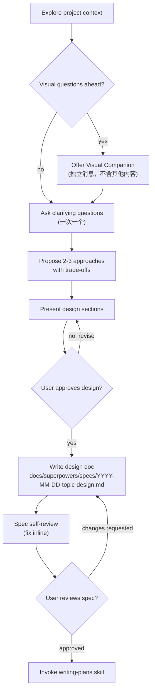
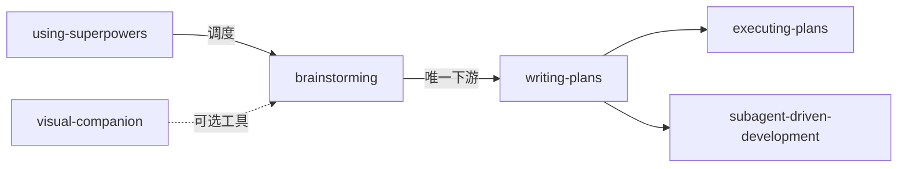
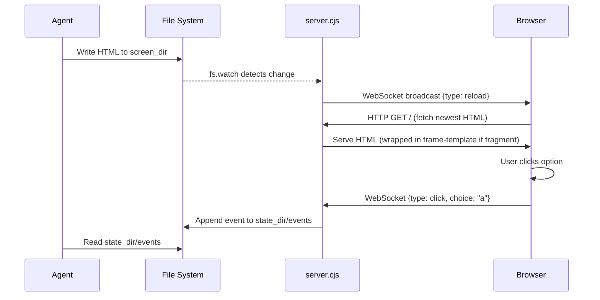

# 第一章 Brainstorming — 头脑风暴

> **对应源文件**：`skills/brainstorming/SKILL.md`、`skills/brainstorming/visual-companion.md`、`skills/brainstorming/spec-document-reviewer-prompt.md`、`skills/brainstorming/scripts/server.cjs`、`scripts/frame-template.html`、`scripts/helper.js`、`scripts/start-server.sh`、`scripts/stop-server.sh`

## 概述

Brainstorming 是所有创造性工作的 **入口 Skill**。它将用户的模糊想法转化为经过验证的设计文档（Spec），并确保在写任何代码之前，需求已被理解、方案已被选定、设计已被用户批准。本章同时覆盖 Visual Companion（可视化伴侣）功能——一个基于浏览器的辅助工具，用于在头脑风暴过程中展示 mockup、图表和选项。

## 前置阅读

- 第零章 Using Superpowers（了解 Skill 调用机制）

---

## 1 定义与定位

| 维度 | 说明 |
|------|------|
| 是什么 | 通过协作对话将想法转化为完整设计和 Spec 的结构化流程 |
| 在工作流中的位置 | 位于 writing-plans 之前，是实现链的第一环 |
| 解决什么问题 | 防止 Agent 在需求不明时直接写代码，避免"先开枪再瞄准"式开发 |

---

## 2 底层原理

Agent 接到 "build X" 的指令后，最自然的倾向是立即开始 scaffold（脚手架搭建）。Brainstorming 对抗的是这种 **premature implementation（过早实现）** 倾向。

**Hard Gate（硬性门禁）**：

> 在你提出设计方案并得到用户批准之前，**不得** 调用任何 implementation skill、编写任何代码、或创建任何项目脚手架。无论项目看起来多简单，这条规则都适用。

**为什么"简单"项目也需要设计**：所有项目都经过此流程。Todo List、单函数工具、配置修改——全部。"简单"项目恰恰是未经检验的假设造成最多返工的地方。设计可以很短（对于真正简单的项目只需几句话），但你必须呈现并获得批准。

---

## 3 触发条件

| 条件 | 是否触发 | 原因 |
|------|---------|------|
| 用户请求创建功能、构建组件、添加功能或修改行为 | ✅ | 这些都是创造性工作 |
| 用户请求修复 bug | ❌ | 使用 debugging skill |
| 用户请求纯重构 | 视情况 | 若涉及架构变更则触发 |
| Agent 即将进入 Plan Mode 但尚未 brainstorming | ✅ | Plan Mode 前提是已有经过验证的设计 |

**互斥**：Brainstorming 完成后直接进入 `writing-plans`，不得跳到 `frontend-design`、`mcp-builder` 等 Implementation Skill。

---

## 4 执行流程



**终态**（Terminal State）：唯一的下游 Skill 是 `writing-plans`。不得从 brainstorming 直接跳到任何 Implementation Skill。

### 步骤详解（含因果链）

**Step 1 — Explore project context（探索项目上下文）**

检查文件、文档、最近的 commit。**为什么**：不了解现状就提方案 = 忽视已有代码和约束。

在此阶段评估 scope（范围）：如果请求涉及多个独立子系统（如 "build a platform with chat, file storage, billing, and analytics"），立即标记。不要花时间细化一个需要先被分解的项目。若项目过大，帮用户分解为子项目，每个子项目走独立的 spec → plan → implementation 循环。

**Step 2 — Offer Visual Companion（提供可视化伴侣）**

如果后续问题涉及视觉内容（mockup、布局、图表），以**独立消息**提供：

> "Some of what we're working on might be easier to explain if I can show it to you in a web browser. I can put together mockups, diagrams, comparisons, and other visuals as we go. This feature is still new and can be token-intensive. Want to try it? (Requires opening a local URL)"

**此消息必须独立发送**。不得与澄清问题、上下文摘要或任何其他内容合并。如果用户拒绝，继续纯文本头脑风暴。

**Step 3 — Ask clarifying questions（提出澄清问题）**

- 每条消息只问一个问题——避免用多个问题淹没用户
- 优先使用多选题——比开放式问题更容易回答
- 聚焦于：目的、约束、成功标准

**Step 4 — Propose 2-3 approaches（提出 2-3 种方案）**

- 对话式呈现，附带取舍分析
- 先展示推荐方案并解释原因
- **YAGNI**（You Aren't Gonna Need It）原则：从所有设计中移除不必要的功能

**Step 5 — Present design（呈现设计）**

- 每个部分的篇幅与其复杂度成正比：简单部分几句话，复杂部分 200-300 词
- 每个部分后询问用户反馈
- 覆盖：架构、组件、数据流、错误处理、测试
- 设计时追求 **isolation and clarity（隔离与清晰）**：每个单元有一个明确目的，通过定义良好的接口通信，可以独立理解和测试

**Step 6 — Write design doc（写设计文档）**

保存到 `docs/superpowers/specs/YYYY-MM-DD-<topic>-design.md`，commit 到 git。

**Step 7 — Spec self-review（规格自审）**

1. **Placeholder scan（占位符扫描）**：任何 "TBD"、"TODO"、不完整段落？修复。
2. **Internal consistency（内部一致性）**：各段落是否矛盾？架构是否匹配功能描述？
3. **Scope check（范围检查）**：是否聚焦到可用单一 implementation plan 实现的程度？
4. **Ambiguity check（歧义检查）**：任何需求可以被两种方式解读？选定一种并明确化。

发现问题直接修复，无需重新审查。

**Step 8 — User reviews written spec（用户审查 Spec）**

> "Spec written and committed to `<path>`. Please review it and let me know if you want to make any changes before we start writing out the implementation plan."

等待用户回应。若请求修改，修改后重新走 spec review loop。仅在用户批准后继续。

**Step 9 — Transition to implementation（转入实现）**

调用 `writing-plans` skill 创建实现计划。不调用任何其他 Skill。

---

## 5 强制规则

### Iron Laws

1. **Hard Gate — 设计批准前禁止实现**：不得编写任何代码、scaffold 任何项目、或调用任何 Implementation Skill，直到设计方案被用户批准。违反此规则 = 在未验证的假设上构建系统。
2. **一次一个问题**：多个问题会淹没用户，导致部分问题被忽略或草率回答。
3. **Visual Companion 提供必须是独立消息**：与其他内容合并会模糊用户的选择（接受/拒绝），导致隐式同意。
4. **终态只能是 writing-plans**：brainstorming → writing-plans 是唯一合法的转换路径。

### Red Flags

- "This is too simple to need a design" — 简单项目正是假设最多、风险最隐蔽之处
- 未提出 2-3 种方案就直接确定方案 — 缺少对比 = 确认偏误
- Spec 中留有 "TBD" 就进入下一阶段 — 不完整的 Spec 产出不完整的 Plan

---

## 6 Checklist

以下是必须按顺序完成的检查项，需为每项创建 task 跟踪：

- [ ] **Explore project context** — 检查文件、文档、最近的 commit
- [ ] **Offer visual companion**（若涉及视觉问题）— 独立消息，不与澄清问题合并
- [ ] **Ask clarifying questions** — 一次一个，理解目的/约束/成功标准
- [ ] **Propose 2-3 approaches** — 附带取舍分析和推荐
- [ ] **Present design** — 按复杂度分段呈现，每段后获取用户反馈
- [ ] **Write design doc** — 保存到 `docs/superpowers/specs/YYYY-MM-DD-<topic>-design.md` 并 commit
- [ ] **Spec self-review** — 快速内联检查占位符、矛盾、歧义、范围
- [ ] **User reviews written spec** — 请用户审查 spec 文件后才继续
- [ ] **Transition to implementation** — 调用 writing-plans skill

---

## 7 常见违规与对策

| 合理化借口 | 为什么是错的 | 正确做法 |
|-----------|-------------|---------|
| "用户已经知道要什么，不需要 brainstorming" | 用户知道 WHAT，不一定知道 HOW。未被检验的 HOW = 架构债务 | 走完整流程，设计可以短但必须有 |
| "先写个 prototype 再讨论更有效" | Prototype 锚定思维——用户会围绕它调整需求而非独立思考 | 先完成设计并获得批准 |
| "这个改动太小了" | 小改动的 Spec 可以只有几句话，但仍需呈现和批准 | 写短 Spec |
| "用户说了'快速'做" | "快速"描述用户的期望速度，不是跳过流程的许可 | 告知用户流程会很快，然后正常走流程 |

---

## 8 与其他技能的关系



- **上游**：`using-superpowers` 负责调度 brainstorming
- **唯一下游**：`writing-plans`——不可跳到 implementation skill
- **可选工具**：Visual Companion 是 brainstorming 的辅助能力，非独立 Skill

---

## 9 Prompt 模板 — Spec Document Reviewer

当使用 Subagent 进行 Spec 审查时，使用以下模板：

```
Task tool (general-purpose):
  description: "Review spec document"
  prompt: |
    You are a spec document reviewer. Verify this spec is complete and ready for planning.

    **Spec to review:** [SPEC_FILE_PATH]

    ## What to Check

    | Category | What to Look For |
    |----------|------------------|
    | Completeness | TODOs, placeholders, "TBD", incomplete sections |
    | Consistency | Internal contradictions, conflicting requirements |
    | Clarity | Requirements ambiguous enough to cause someone to build the wrong thing |
    | Scope | Focused enough for a single plan — not covering multiple independent subsystems |
    | YAGNI | Unrequested features, over-engineering |

    ## Calibration

    **Only flag issues that would cause real problems during implementation planning.**
    A missing section, a contradiction, or a requirement so ambiguous it could be
    interpreted two different ways — those are issues. Minor wording improvements,
    stylistic preferences, and "sections less detailed than others" are not.

    Approve unless there are serious gaps that would lead to a flawed plan.

    ## Output Format

    ## Spec Review

    **Status:** Approved | Issues Found

    **Issues (if any):**
    - [Section X]: [specific issue] - [why it matters for planning]

    **Recommendations (advisory, do not block approval):**
    - [suggestions for improvement]
```

**字段说明**：

| 字段 | 说明 |
|------|------|
| `SPEC_FILE_PATH` | 需要审查的 Spec 文件路径 |
| Calibration 段 | 校准审查严格度——只标记会导致实际问题的缺陷，不标记风格偏好 |
| Status | `Approved`（通过）或 `Issues Found`（发现问题） |

**审查者返回**：Status、Issues（如有）、Recommendations（建议性，不阻塞批准）

---

## 10 Visual Companion 与 Brainstorm Server 架构

### 10.1 架构概览

Visual Companion 是一个零依赖（zero-dependency）的 Node.js HTTP + WebSocket 服务器。它监视目录中的 HTML 文件变化，并通过 WebSocket 通知浏览器重新加载。Agent 写入 HTML → 用户在浏览器中看到 → 用户点击选项 → 事件记录到文件 → Agent 在下一轮读取事件。



### 10.2 核心组件

**`server.cjs` — 服务端**

- 手动实现 RFC 6455 WebSocket Protocol（WebSocket 协议），包括 `computeAcceptKey`、`encodeFrame`、`decodeFrame`——不依赖任何第三方库
- HTTP 服务器处理两种路由：`/`（返回最新 HTML 页面）和 `/files/<name>`（返回静态资源）
- `isFullDocument()` 函数检测 HTML 是否以 `<!DOCTYPE` 或 `<html` 开头：如果是，直接注入 helper script；如果不是，先用 `frame-template.html` 包装
- `getNewestScreen()` 按修改时间排序 `screen_dir` 中的 HTML 文件，返回最新的
- 每 60 秒检查一次生命周期：如果 owner process 退出或空闲超过 30 分钟，自动关闭
- 启动时验证 owner PID 有效性——若无效（WSL、Tailscale SSH 等场景常见），禁用 owner 监控，改为依赖空闲超时

**`frame-template.html` — 页面框架模板**

提供一致的页面骨架：
- 固定 header 和 selection indicator bar
- OS-aware 明暗主题（`prefers-color-scheme: dark`）
- 可滚动主内容区
- 内容注入点为 `<!-- CONTENT -->` 占位符

**可用 CSS 类**：

| 类 / 结构 | 用途 |
|-----------|------|
| `.options` > `.option[data-choice]` | A/B/C 选项列表 |
| `.options[data-multiselect]` | 多选模式 |
| `.cards` > `.card[data-choice]` | 视觉设计卡片（grid 布局） |
| `.mockup` > `.mockup-header` + `.mockup-body` | 原型容器 |
| `.split` > `.mockup` × 2 | 并排对比 |
| `.pros-cons` > `.pros` + `.cons` | 优缺点列表 |
| `.mock-nav`, `.mock-sidebar`, `.mock-content` | wireframe 建筑块 |
| `.mock-button`, `.mock-input`, `.placeholder` | 交互元素原型 |

**`helper.js` — 客户端脚本**

- 建立 WebSocket 连接，收到 `{type: "reload"}` 时自动刷新页面
- 监听 `[data-choice]` 元素点击，通过 WebSocket 发送 `{type: "click", choice: "...", text: "..."}` 事件
- 实现 `toggleSelect(el)` 函数处理选中/取消选中逻辑（支持单选和多选）
- 更新底部 indicator bar 显示当前选中状态
- 连接断开后 1 秒自动重连

### 10.3 服务器生命周期

**`start-server.sh` — 启动**

```bash
scripts/start-server.sh --project-dir /path/to/project
```

返回：

```json
{"type":"server-started","port":52341,"url":"http://localhost:52341",
 "screen_dir":"/path/to/project/.superpowers/brainstorm/12345-1706000000/content",
 "state_dir":"/path/to/project/.superpowers/brainstorm/12345-1706000000/state"}
```

**启动参数**：

| 参数 | 说明 |
|------|------|
| `--project-dir <path>` | 将会话文件存储在 `<path>/.superpowers/brainstorm/`。不使用则存入 `/tmp`（会被清理） |
| `--host <bind-host>` | 绑定地址，默认 `127.0.0.1`。远程/容器化环境使用 `0.0.0.0` |
| `--url-host <host>` | 返回的 URL 中显示的主机名 |
| `--foreground` | 前台运行模式（不 daemonize） |
| `--background` | 强制后台模式（覆盖 Codex 自动前台检测） |

**平台适配**：

| 平台 | 启动方式 | 原因 |
|------|---------|------|
| Claude Code (macOS/Linux) | 默认模式 | 脚本自行后台运行 |
| Claude Code (Windows) | Bash 工具设置 `run_in_background: true` | Windows 自动检测并使用前台模式，会阻塞 |
| Codex | 正常运行 | 脚本自动检测 `CODEX_CI` 环境变量并切换到前台模式 |
| Gemini CLI | `--foreground` + `is_background: true` | 进程需跨对话轮次存活 |

**`stop-server.sh` — 停止**

```bash
scripts/stop-server.sh $SESSION_DIR
```

- 发送 SIGTERM，等待 2 秒 graceful shutdown
- 若仍运行，升级为 SIGKILL
- 仅删除 `/tmp` 下的临时会话目录；`--project-dir` 模式下的文件保留供日后参考

### 10.4 Visual Companion 使用循环

每轮交互的标准循环：

1. **检查服务器存活** + **写入 HTML** 到 `screen_dir`
   - 写入前检查 `$STATE_DIR/server-info` 是否存在。不存在或存在 `server-stopped` → 重启服务器
   - 使用语义化文件名：`platform.html`、`visual-style.html`、`layout.html`
   - **永不重复使用文件名**——每个画面一个新文件
   - 使用 Write 工具——**不要用 cat/heredoc**（会在终端输出噪音）

2. **告知用户** 并结束当前轮次
   - 每步都提醒 URL（不仅首次）
   - 简述画面内容（如 "Showing 3 layout options for the homepage"）

3. **下一轮读取事件** — 读取 `$STATE_DIR/events`
   - 格式为 JSONL：`{"type":"click","choice":"a","text":"Option A","timestamp":1706000101}`
   - 完整事件流展示用户的探索路径，最后一个 choice 通常是最终选择
   - 若无事件文件，说明用户未与浏览器交互——仅使用终端文本

4. **迭代或推进** — 如反馈修改当前画面，写新版本（如 `layout-v2.html`）

5. **返回终端时卸载** — 推送等待画面清除过时内容：

   ```html
   <div style="display:flex;align-items:center;justify-content:center;min-height:60vh">
     <p class="subtitle">Continuing in terminal...</p>
   </div>
   ```

### 10.5 内容编写示例

写入内容片段（不需要完整 HTML 文档）：

```html
<h2>Which layout works better?</h2>
<p class="subtitle">Consider readability and visual hierarchy</p>

<div class="options">
  <div class="option" data-choice="a" onclick="toggleSelect(this)">
    <div class="letter">A</div>
    <div class="content">
      <h3>Single Column</h3>
      <p>Clean, focused reading experience</p>
    </div>
  </div>
  <div class="option" data-choice="b" onclick="toggleSelect(this)">
    <div class="letter">B</div>
    <div class="content">
      <h3>Two Column</h3>
      <p>Sidebar navigation with main content</p>
    </div>
  </div>
</div>
```

无需 `<html>`、CSS 或 `<script>` 标签——服务器自动包装。

---

## 11 Reference 文件

### `visual-companion.md`

详细的 Visual Companion 使用指南，包含：何时使用浏览器 vs 终端的判断标准、会话启动流程、交互循环的每个步骤、可用 CSS 类列表、浏览器事件格式、文件命名约定、清理流程。

### `spec-document-reviewer-prompt.md`

Spec 审查 Subagent 的完整 prompt 模板，包含审查维度（完整性、一致性、清晰度、范围、YAGNI）和校准指引（只标记会导致实际问题的缺陷）。

### `scripts/server.cjs`

零依赖 Node.js 服务器源码。手动实现 RFC 6455 WebSocket 协议，支持 HTTP 服务和文件监视。关键设计决策：零依赖（无需 `npm install`）、自动活跃检测（30 分钟空闲超时）、owner PID 监控（若 Agent 进程退出则自动关闭）。

### `scripts/frame-template.html`

页面框架模板，提供主题、布局、选项/卡片/mockup 等 CSS 类。内容通过 `<!-- CONTENT -->` 占位符注入。

### `scripts/helper.js`

客户端 JavaScript，处理 WebSocket 连接、自动重载、点击事件捕获、选中状态管理。

### `scripts/start-server.sh`

服务器启动脚本，处理参数解析、环境检测（Codex/Windows 自动前台）、PID 管理、启动等待确认。

### `scripts/stop-server.sh`

服务器停止脚本，支持 graceful shutdown → SIGKILL 升级、条件性清理（仅删除 `/tmp` 会话）。

---

## 12 本章核心结论

1. **Hard Gate 不可绕过**：设计被批准前不得写任何代码——这是防止"在错误基础上高效建造"的最后防线。
2. **每次只问一个问题**：多问题 = 信息过载 → 部分回答被忽略 → 需求理解不完整。
3. **Visual Companion 是工具不是模式**：即使用户接受了 Companion，仍需逐问题判断是否使用浏览器。概念性问题用终端，视觉性问题用浏览器。
4. **唯一下游是 writing-plans**：brainstorming 结束后只能进入 writing-plans，不可直接跳到实现类 Skill。
5. **Spec 必须经过自审 + 用户审查双重关卡**：自审抓占位符和矛盾，用户审查确保意图一致。跳过任一 = 将缺陷传递到 Plan 阶段。
6. **零依赖服务器设计是刻意选择**：`server.cjs` 手动实现 WebSocket 协议，因为 brainstorming 在项目初始阶段执行，此时可能尚无 `node_modules`，零依赖保证任何环境都能运行。
