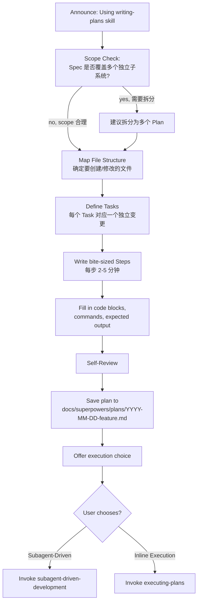
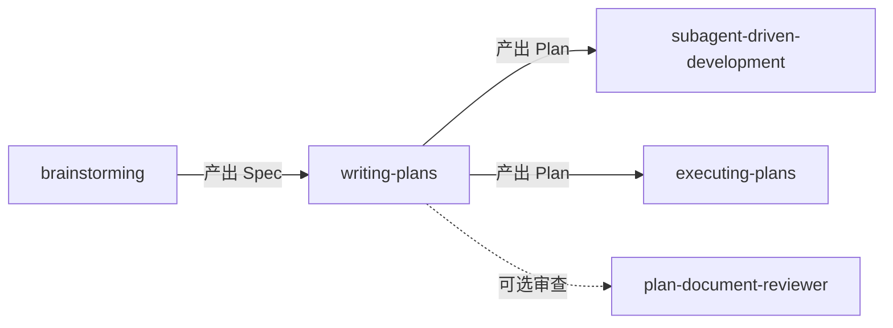

# 第二章 Writing Plans — 编写实现计划

> **对应源文件**：`skills/writing-plans/SKILL.md`、`skills/writing-plans/plan-document-reviewer-prompt.md`

## 概述

Writing Plans 将经过验证的设计文档（Spec）转化为**可机械执行的实现计划**。它的核心假设是：执行者对代码库零上下文、对问题领域只有基本了解——因此计划中的每一步都必须自包含、可验证、不含任何占位符。

## 前置阅读

- 第零章 Using Superpowers
- 第一章 Brainstorming（本 Skill 的上游，Spec 由其产出）

---

## 1 定义与定位

| 维度 | 说明 |
|------|------|
| 是什么 | 将 Spec 分解为 bite-sized（小粒度）Task，每个 Task 包含完整代码、命令和预期输出的实现计划 |
| 在工作流中的位置 | brainstorming 之后、executing-plans / subagent-driven-development 之前 |
| 解决什么问题 | 防止执行者（人或 Agent）因信息缺失而猜测、偏离或阻塞 |

---

## 2 底层原理

Agent 在执行多步任务时存在 **context decay（上下文衰减）** 倾向：随着步骤增多，早期决策和约束被"遗忘"。Writing Plans 通过以下机制对抗：

- **完整自包含**：每个 Task 的每个 Step 都包含实际代码和完整命令，不引用"参见 Task N"
- **TDD 驱动**：先写失败测试 → 验证失败 → 写最小实现 → 验证通过 → commit。这个循环在每个 Task 中重复
- **零占位符**：任何 "TBD"、"TODO"、"implement later" 都是 plan failure

**如果不遵守**：执行者遇到含糊步骤会自行"填空"——每次填空都是一个潜在偏差点。5 个 Task × 3 个含糊步骤 = 15 个偏差源。

---

## 3 触发条件

| 条件 | 是否触发 | 原因 |
|------|---------|------|
| 有经过审批的 Spec，需要多步实现 | ✅ | 多步任务需要结构化计划 |
| brainstorming 完成后的自然下一步 | ✅ | brainstorming 的终态就是调用 writing-plans |
| 简单的单步修复 | ❌ | 不需要计划 |
| 没有 Spec 就想写计划 | ❌ | 先完成 brainstorming |

**前置条件**：必须有已审批的 Spec（来自 brainstorming）或明确的需求描述。

---

## 4 执行流程



### 步骤详解

**Scope Check（范围检查）**

如果 Spec 覆盖多个独立子系统，它应在 brainstorming 阶段就被拆分。若未被拆分，建议拆为多个 Plan——每个 Plan 应产出可独立工作和测试的软件。

**Map File Structure（映射文件结构）**

在定义 Task 之前，先规划哪些文件将被创建或修改，以及每个文件的职责。**为什么先做这步**：文件结构锁定了分解决策。如果文件边界不清晰，后续 Task 分解也不会清晰。

原则：
- 每个文件一个明确职责，接口定义良好
- Agent 对可在上下文中容纳的代码推理效果最好——偏好小文件
- 一起变更的文件应该放在一起。按职责而非技术层拆分
- 在已有代码库中，遵循已有模式

**Bite-Sized Task Granularity（小粒度任务）**

每一步对应一个 2-5 分钟的动作：

| Step | 示例 |
|------|------|
| 写失败测试 | `def test_specific_behavior(): ...` |
| 运行测试确认失败 | `pytest tests/path/test.py::test_name -v` → FAIL |
| 写最小实现 | `def function(input): return expected` |
| 运行测试确认通过 | `pytest ...` → PASS |
| Commit | `git commit -m "feat: add specific feature"` |

---

## 5 强制规则

### 5.1 Plan Document Header（计划文档头）

**每个 Plan 必须以此 header 开始**：

````markdown
# [Feature Name] Implementation Plan

> **For agentic workers:** REQUIRED SUB-SKILL: Use superpowers:subagent-driven-development (recommended) or superpowers:executing-plans to implement this plan task-by-task. Steps use checkbox (`- [ ]`) syntax for tracking.

**Goal:** [One sentence describing what this builds]

**Architecture:** [2-3 sentences about approach]

**Tech Stack:** [Key technologies/libraries]

---
````

**为什么需要 header**：执行者（可能是不同会话的 Agent）需要立即了解全局目标和技术栈，header 提供这个"30 秒概览"。header 中的 `> **For agentic workers:**` 指令确保执行者使用正确的执行 Skill。

### 5.2 Task Structure（Task 结构）

````markdown
### Task N: [Component Name]

**Files:**
- Create: `exact/path/to/file.py`
- Modify: `exact/path/to/existing.py:123-145`
- Test: `tests/exact/path/to/test.py`

- [ ] **Step 1: Write the failing test**

```python
def test_specific_behavior():
    result = function(input)
    assert result == expected
```

- [ ] **Step 2: Run test to verify it fails**

Run: `pytest tests/path/test.py::test_name -v`
Expected: FAIL with "function not defined"

- [ ] **Step 3: Write minimal implementation**

```python
def function(input):
    return expected
```

- [ ] **Step 4: Run test to verify it passes**

Run: `pytest tests/path/test.py::test_name -v`
Expected: PASS

- [ ] **Step 5: Commit**

```bash
git add tests/path/test.py src/path/file.py
git commit -m "feat: add specific feature"
```
````

### 5.3 No Placeholders（禁止占位符）

以下内容是 **plan failure**，绝不允许出现：

| 占位符模式 | 为什么是失败 |
|-----------|-------------|
| "TBD", "TODO", "implement later", "fill in details" | 执行者会猜测实现方式，猜测 = 偏差 |
| "Add appropriate error handling" / "add validation" | "appropriate" 是含糊的——哪种错误？哪种验证？ |
| "Write tests for the above"（无实际测试代码） | 执行者不知道测试什么行为，会写出验证实现而非行为的测试 |
| "Similar to Task N"（不重复代码） | 执行者可能不按顺序阅读 Task |
| 描述做什么但不展示怎么做的步骤 | 代码步骤必须有代码块 |
| 引用未在任何 Task 中定义的类型/函数/方法 | 执行者无法凭空推断未定义的接口 |

---

## 6 Self-Review Checklist

写完整个 Plan 后，用"新眼光"对照 Spec 检查：

- [ ] **Spec coverage（规格覆盖）**：逐段浏览 Spec 的每个需求，能否指向实现它的 Task？列出所有缺口。
- [ ] **Placeholder scan（占位符扫描）**：搜索 Plan 中的 Red Flag——任何"No Placeholders"段落中列出的模式。修复它们。
- [ ] **Type consistency（类型一致性）**：后续 Task 使用的类型、方法签名、属性名是否与前面 Task 的定义一致？`clearLayers()` 在 Task 3 但 `clearFullLayers()` 在 Task 7 = bug。

发现问题直接修复，无需重新审查。若发现 Spec 需求无对应 Task，添加该 Task。

---

## 7 常见违规与对策

| 合理化借口 | 为什么是错的 | 正确做法 |
|-----------|-------------|---------|
| "执行者能自己推断缺失的细节" | Agent 的"推断"就是幻觉——它会编造实现 | 写出完整代码 |
| "重复代码太冗余，引用 Task N 更 DRY" | DRY 适用于源代码，Plan 是操作手册——执行者需要每步独立可读 | 在每个 Task 中重复必要代码 |
| "这个太明显不需要写" | 对你明显的 ≠ 对零上下文的执行者明显 | 写出来 |
| "先写骨架后续再填" | "后续"不会到来——Plan 中的 TBD 会原样传递到实现 | 现在就填完 |

---

## 8 与其他技能的关系



- **上游**：`brainstorming` 产出 Spec
- **下游**（二选一）：`subagent-driven-development`（推荐）或 `executing-plans`
- **可选**：Plan 写完后可以派遣 Plan Document Reviewer Subagent 审查

---

## 9 Prompt 模板 — Plan Document Reviewer

```
Task tool (general-purpose):
  description: "Review plan document"
  prompt: |
    You are a plan document reviewer. Verify this plan is complete and ready for implementation.

    **Plan to review:** [PLAN_FILE_PATH]
    **Spec for reference:** [SPEC_FILE_PATH]

    ## What to Check

    | Category | What to Look For |
    |----------|------------------|
    | Completeness | TODOs, placeholders, incomplete tasks, missing steps |
    | Spec Alignment | Plan covers spec requirements, no major scope creep |
    | Task Decomposition | Tasks have clear boundaries, steps are actionable |
    | Buildability | Could an engineer follow this plan without getting stuck? |

    ## Calibration

    **Only flag issues that would cause real problems during implementation.**
    An implementer building the wrong thing or getting stuck is an issue.
    Minor wording, stylistic preferences, and "nice to have" suggestions are not.

    Approve unless there are serious gaps — missing requirements from the spec,
    contradictory steps, placeholder content, or tasks so vague they can't be acted on.

    ## Output Format

    ## Plan Review

    **Status:** Approved | Issues Found

    **Issues (if any):**
    - [Task X, Step Y]: [specific issue] - [why it matters for implementation]

    **Recommendations (advisory, do not block approval):**
    - [suggestions for improvement]
```

**字段说明**：

| 字段 | 说明 |
|------|------|
| `PLAN_FILE_PATH` | 需要审查的 Plan 文件路径 |
| `SPEC_FILE_PATH` | 对应的 Spec 文件路径（审查者需对比 Plan 是否覆盖 Spec） |
| Calibration | 校准：只标记会导致执行者"构建错误东西"或"卡住"的问题 |
| Buildability | 关键维度——一个工程师能否照着这个 Plan 不卡住地执行完？ |

---

## 10 代码示例 — Execution Handoff

Plan 保存后，Agent 向用户提供执行选择：

```
Plan complete and saved to `docs/superpowers/plans/<filename>.md`. Two execution options:

1. Subagent-Driven (recommended) - I dispatch a fresh subagent per task, review between tasks, fast iteration

2. Inline Execution - Execute tasks in this session using executing-plans, batch execution with checkpoints

Which approach?
```

**如果选择 Subagent-Driven**：
- **REQUIRED SUB-SKILL**: `superpowers:subagent-driven-development`
- 每 Task 派遣新 Subagent + 两阶段审查

**如果选择 Inline Execution**：
- **REQUIRED SUB-SKILL**: `superpowers:executing-plans`
- 批量执行，设有检查点供审查

---

## 11 Reference 文件

### `plan-document-reviewer-prompt.md`

Plan 审查 Subagent 的完整 prompt 模板。审查维度：完整性（无占位符）、Spec 对齐（Plan 覆盖 Spec 需求）、Task 分解（边界清晰、步骤可执行）、可构建性（工程师能否顺畅执行）。校准标准与 Spec Reviewer 相同——只标记会导致实际问题的缺陷。

---

## 12 本章核心结论

1. **Plan 假设执行者零上下文**：每个 Step 必须自包含——包含完整代码、命令和预期输出。如果执行者需要"看其他地方"才能完成一步，该步就是不完整的。
2. **No Placeholders 是硬性规则**：任何 "TBD"、"TODO"、"implement later" 都是 Plan Failure。占位符传递到执行阶段 = 执行者猜测 = 偏差。
3. **先映射文件结构再定义 Task**：文件结构锁定分解决策。跳过此步 = Task 边界模糊 = 执行时的集成问题。
4. **TDD 循环是每个 Task 的标准结构**：写失败测试 → 验证失败 → 最小实现 → 验证通过 → commit。这不是偏好而是规则。
5. **Self-Review 对照 Spec**：写完 Plan 后必须逐需求检查覆盖度、占位符和类型一致性。发现 Spec 需求无对应 Task → 添加 Task。
6. **Execution Handoff 提供两种选择**：Subagent-Driven（推荐，更高质量）或 Inline Execution（无 Subagent 支持时的后备）。
