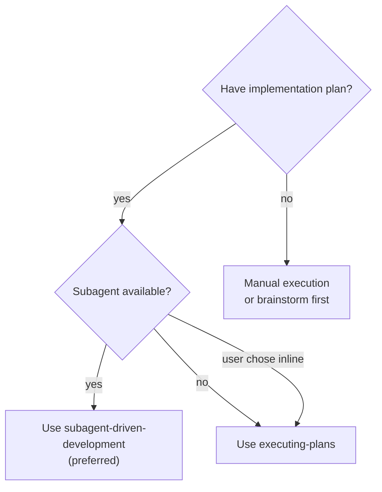
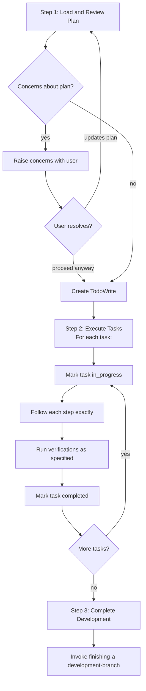
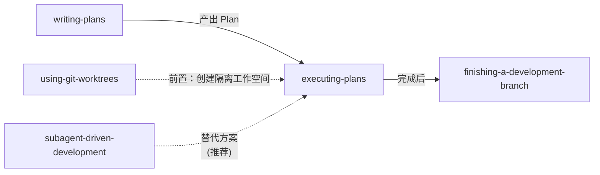

# 第三章 Executing Plans — 执行实现计划

> **对应源文件**：`skills/executing-plans/SKILL.md`

## 概述

Executing Plans 是 **Inline Execution（内联执行）** 模式——当 Subagent 不可用或用户选择在当前会话中执行时使用。它加载 Plan、批判性审查后逐 Task 执行，遇到阻塞时停下而非猜测。本 Skill 是 `subagent-driven-development` 的轻量替代方案。

## 前置阅读

- 第零章 Using Superpowers
- 第二章 Writing Plans（本 Skill 执行的 Plan 由其产出）

---

## 1 定义与定位

| 维度 | 说明 |
|------|------|
| 是什么 | 在当前会话中逐 Task 执行 Plan 的流程 |
| 在工作流中的位置 | writing-plans 之后，finishing-a-development-branch 之前 |
| 解决什么问题 | 在无 Subagent 支持的平台（如 Gemini CLI）上提供结构化的 Plan 执行能力 |

**重要提示**：如果当前平台支持 Subagent，应优先使用 `subagent-driven-development`——其质量显著更高（两阶段审查 + 上下文隔离）。使用 Executing Plans 时，应告知用户 Superpowers 在有 Subagent 支持的平台上效果更好。

---

## 2 底层原理

Agent 在同一会话中执行多个 Task 时，面临 **context pollution（上下文污染）** 问题：前面 Task 的代码、错误信息、决策记忆会干扰后续 Task 的执行。Executing Plans 通过 **batch execution with checkpoints（批量执行 + 检查点）** 部分缓解此问题，但无法像 Subagent 模式那样实现完全的上下文隔离。

**如果不遵守此 Skill 的流程**：Agent 会"连续执行"而忽视验证步骤，累积的错误在后期爆发时修复成本远高于逐步发现。

---

## 3 触发条件



| 条件 | 是否触发 | 原因 |
|------|---------|------|
| 有 Plan + 无 Subagent 支持 | ✅ | 唯一的执行选择 |
| 有 Plan + 用户选择 Inline Execution | ✅ | 尊重用户选择 |
| 有 Plan + Subagent 可用 | ❌ | 优先使用 subagent-driven-development |
| 无 Plan | ❌ | 先完成 writing-plans |

---

## 4 执行流程



### Step 1: Load and Review Plan

1. 读取 Plan 文件
2. **批判性审查**——识别任何疑问或问题。**为什么先审查**：盲目执行有缺陷的 Plan = 高效地构建错误的东西
3. 如有问题：在开始前向用户提出
4. 如无问题：创建 TodoWrite 并继续

### Step 2: Execute Tasks

对每个 Task：
1. 标记为 `in_progress`
2. **严格遵循每一步**（Plan 中的步骤是 bite-sized 的）
3. **运行指定的验证**——不跳过
4. 标记为 `completed`

### Step 3: Complete Development

所有 Task 完成并验证后：
- 声明："I'm using the finishing-a-development-branch skill to complete this work."
- **REQUIRED SUB-SKILL**: `superpowers:finishing-a-development-branch`
- 遵循该 Skill 验证测试、呈现选项、执行选择

---

## 5 强制规则

### Iron Laws

1. **Review before execute（先审后执）**：不审查 Plan 就执行 = 不审查地图就上路。Plan 中可能有 Spec 遗漏、步骤矛盾或过时信息。
2. **Follow plan steps exactly（严格遵循步骤）**：Plan 的每一步都经过 writing-plans 的精心设计和 self-review。"我觉得这步可以跳过"是 rationalization（合理化）。
3. **Don't skip verifications（不跳过验证）**：验证步骤是错误检测的唯一机会。跳过验证 = 累积隐藏错误。
4. **Never start on main/master without consent（未经同意不在主分支上实现）**：在主分支上直接改代码 = 无安全网的操作。

### When to Stop — 立即停止执行的条件

| 情况 | 为什么停下 | 怎么做 |
|------|----------|-------|
| Hit a blocker（遇到阻塞）| 猜测如何绕过阻塞会引入更多问题 | 停下，请求帮助 |
| Plan has critical gaps（Plan 有严重缺口）| 无法开始执行 = Plan 需要修改 | 停下，反馈给 Plan 作者 |
| Don't understand an instruction（不理解指令）| 错误理解 → 错误执行 → 需要回滚 | 停下，请求澄清 |
| Verification fails repeatedly（验证反复失败）| 反复失败说明实现方式有根本问题 | 停下，不要 force through |

### Red Flags

- "这个验证肯定会通过，跳过吧" — 验证存在的意义就是"肯定会通过"时才最有价值
- "Plan 步骤有点模糊但我大概知道意思" — 大概知道 = 大概率偏差
- "我先把所有 Task 做完再统一验证" — 这否定了逐步验证的核心设计

---

## 6 Checklist

- [ ] 读取 Plan 文件
- [ ] 批判性审查 Plan——识别疑问和问题
- [ ] 如有问题，向用户提出并等待解决
- [ ] 创建 TodoWrite，记录所有 Task
- [ ] 对每个 Task：标记 in_progress → 遵循步骤 → 验证 → 标记 completed
- [ ] 所有 Task 完成后，调用 `finishing-a-development-branch`
- [ ] 确认不在 main/master 分支上操作

---

## 7 常见违规与对策

| 合理化借口 | 为什么是错的 | 正确做法 |
|-----------|-------------|---------|
| "Plan 我写的，不需要再审查" | 写和审是两种认知模式，自审发现不了的问题在二次审查中可发现 | 用"新眼光"审查 |
| "这个 Task 和上一个类似，我知道怎么做" | 上下文污染——上一个 Task 的记忆可能覆盖本 Task 的细节差异 | 逐步遵循 Plan |
| "验证失败了但我知道原因，继续下一步" | 未修复的失败 + 后续步骤 = 错误叠加 | 修复后再继续 |
| "阻塞了但我有个 workaround" | 未经设计的 workaround 是技术债务 | 停下，请求帮助 |

---

## 8 与其他技能的关系



- **上游**：`writing-plans` 产出 Plan
- **下游**：`finishing-a-development-branch` 完成开发分支
- **前置**：`using-git-worktrees` 创建隔离工作空间
- **替代**：`subagent-driven-development` 是质量更高的替代方案

**Required workflow skills**：
- `superpowers:using-git-worktrees` — 在开始前设置隔离工作空间
- `superpowers:writing-plans` — 创建本 Skill 执行的 Plan
- `superpowers:finishing-a-development-branch` — 所有 Task 完成后收尾

---

## 9 Prompt 模板

Executing Plans 不派遣 Subagent，因此没有 Subagent Prompt 模板。所有执行在当前会话中进行。

---

## 10 代码示例

执行启动时的标准声明：

```
I'm using the executing-plans skill to implement this plan.
```

Plan 审查时若有问题，反馈格式：

```
Before starting execution, I have concerns about the plan:

1. Task 3, Step 2: The test expects `clearLayers()` but Task 1 defines `clearAllLayers()` — type inconsistency
2. Task 5: No verification step after implementation — need to add test run

Should I proceed as-is or would you like to update the plan first?
```

---

## 11 When to Revisit Earlier Steps

| 情况 | 回到哪一步 | 原因 |
|------|-----------|------|
| 用户基于反馈更新了 Plan | Step 1 (Load and Review) | Plan 内容已变更，需重新审查 |
| 基本方法需要重新思考 | Step 1 (Load and Review) | 根本方向可能已改变 |
| 单个 Task 失败但 Plan 整体合理 | 当前 Task（不回退） | 修复当前问题即可 |

---

## 12 本章核心结论

1. **Executing Plans 是后备方案**：如果平台支持 Subagent，优先使用 `subagent-driven-development`。Executing Plans 缺少上下文隔离和两阶段审查。
2. **先审后执不可跳过**：盲目执行有缺陷的 Plan 比不执行更糟——它会高效地构建错误的东西。
3. **验证步骤是硬性要求**：每个 Task 完成后必须运行指定的验证。跳过验证 = 隐藏错误直到来不及修复。
4. **遇到阻塞立即停下**：强行突破阻塞是最常见的违规行为。停下请求帮助的成本远低于猜错后回滚的成本。
5. **Context pollution 是本 Skill 的固有限制**：同一会话中执行多个 Task 时，早期 Task 的记忆会污染后续判断——这就是为什么 Subagent 模式是更优选择。
