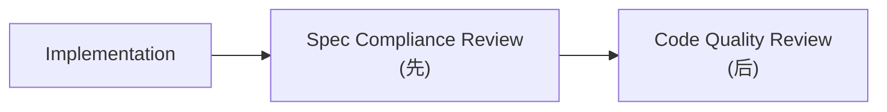
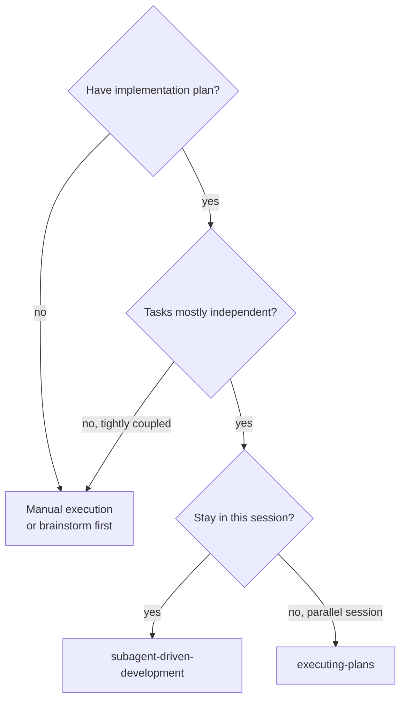
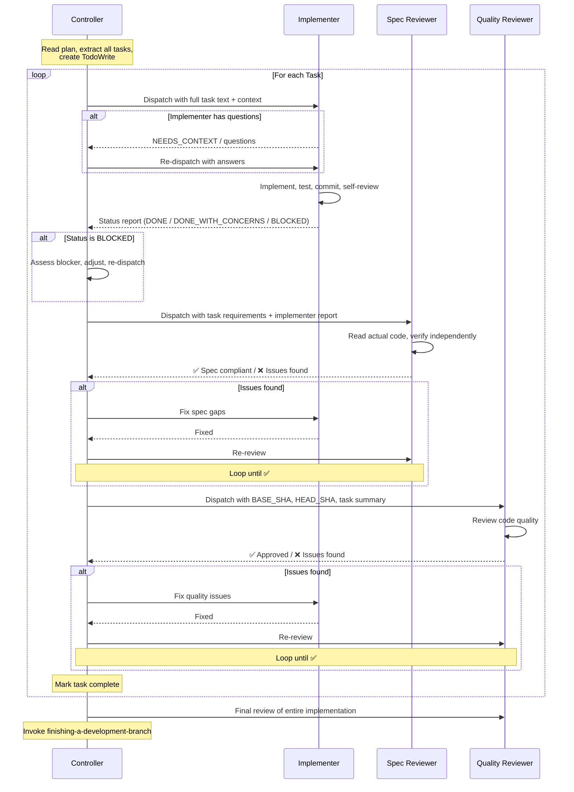
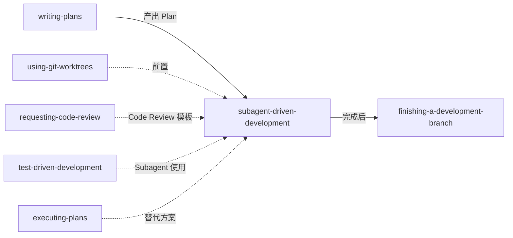

# 第四章 Subagent-Driven Development — 子代理驱动开发

> **对应源文件**：`skills/subagent-driven-development/SKILL.md`、`skills/subagent-driven-development/implementer-prompt.md`、`skills/subagent-driven-development/spec-reviewer-prompt.md`、`skills/subagent-driven-development/code-quality-reviewer-prompt.md`

## 概述

Subagent-Driven Development 是 Superpowers 体系中**质量最高的 Plan 执行模式**。它通过 Controller/Implementer/Spec Reviewer/Code Quality Reviewer 四角色架构（Four-Role Architecture），对每个 Task 实施"新鲜 Subagent + 两阶段审查"循环，实现上下文隔离、规格合规和代码质量的三重保障。

## 前置阅读

- 第零章 Using Superpowers
- 第二章 Writing Plans（本 Skill 执行的 Plan 由其产出）
- 第三章 Executing Plans（了解替代方案及其局限性）

---

## 1 定义与定位

| 维度 | 说明 |
|------|------|
| 是什么 | 以每 Task 一个独立 Subagent 的方式执行 Plan，辅以两阶段审查（先 Spec Compliance 后 Code Quality） |
| 在工作流中的位置 | writing-plans 之后、finishing-a-development-branch 之前 |
| 解决什么问题 | 对抗 context pollution（上下文污染）和 attention decay（注意力衰减），确保每个 Task 在干净的上下文中被执行和审查 |

---

## 2 底层原理

### 为什么需要 Subagent

大语言模型存在两个核心限制：

1. **Context window limit（上下文窗口限制）**：单次会话能处理的 token 有限。随着 Task 推进，早期代码、错误信息、决策理由会占满窗口，挤压后续 Task 的可用空间。
2. **Attention decay（注意力衰减）**：即使在窗口内，模型对距离较远的信息的注意力会下降。Task 5 执行时，Task 1 的细节已变得模糊。

Subagent 模式的解决方案：**每个 Task 派遣全新的 Subagent**。Controller（控制器）精确构建 Subagent 需要的上下文——不多不少。Subagent 完成后，其上下文被丢弃，Controller 的上下文保持干净用于协调。

### 为什么是两阶段审查



**顺序不可逆**，原因：

- **Spec Compliance Review** 回答："是否构建了正确的东西？" — 检查是否有遗漏需求、多余功能、或需求误读
- **Code Quality Review** 回答："正确的东西是否构建得好？" — 检查代码质量、可维护性、测试覆盖

如果先做 Code Quality Review，reviewer 可能要求重构、重命名、优化——然后 Spec Review 发现这个功能根本不该存在或缺少一半需求，之前的优化全部白费。**先确认"做对了什么"，再确认"做得好不好"。**

### Core Principle

> Fresh subagent per task + two-stage review (spec then quality) = high quality, fast iteration

---

## 3 触发条件



| 条件 | 是否触发 | 原因 |
|------|---------|------|
| 有 Plan + Task 独立 + 在当前会话执行 | ✅ | 理想场景 |
| 有 Plan + 用户选择 Subagent-Driven | ✅ | writing-plans 提供此选择 |
| 无 Plan | ❌ | 先完成 writing-plans |
| Task 高度耦合 | ❌ | Subagent 之间无法共享状态，耦合 Task 需要共享上下文 |
| 平台不支持 Subagent（如 Gemini CLI） | ❌ | 回退到 executing-plans |

---

## 4 四角色架构

| 角色 | 职责 | 上下文来源 |
|------|------|-----------|
| **Controller（控制器）** | 读取 Plan、提取 Task、派遣 Subagent、处理状态、管理审查循环 | 当前会话，保持干净用于协调 |
| **Implementer（实现者）** | 实现 Task、写测试、commit、自审、报告状态 | Controller 精心构建的任务描述 + 上下文 |
| **Spec Reviewer（规格审查者）** | 独立验证实现是否匹配需求——不信任 Implementer 报告 | Task 需求全文 + Implementer 报告（用于对比，不用于信任） |
| **Code Quality Reviewer（代码质量审查者）** | 验证实现的代码质量、测试覆盖、可维护性 | 变更的 diff（BASE_SHA..HEAD_SHA） |

---

## 5 执行流程



### 步骤详解

**Phase 0 — 准备（Controller）**

1. 读取 Plan 文件——**一次性读取，提取所有 Task 全文和上下文**
2. 记录 Task 之间的依赖关系和共享上下文
3. 创建 TodoWrite 追踪所有 Task

**为什么一次性提取所有 Task**：避免在执行过程中反复读取 Plan 文件。Controller 在启动时就掌握全局视图，后续只做派遣和协调。

**Phase 1 — 实现（Implementer Subagent）**

1. Controller 用 `implementer-prompt.md` 模板构建 prompt，注入 Task 全文和 context
2. Implementer 先检查是否有疑问——**可以问问题**
3. 无疑问后开始实现：TDD → 测试 → commit → self-review
4. 报告状态

**Phase 2 — Spec Compliance Review（Spec Reviewer Subagent）**

1. Controller 派遣 Spec Reviewer
2. Reviewer **不信任 Implementer 报告**——必须独立阅读代码
3. 逐需求对比：遗漏？多余？误读？
4. 通过或列出问题

**Phase 3 — Code Quality Review（Code Quality Reviewer Subagent）**

- **仅在 Spec Compliance ✅ 后才执行**
1. Controller 提供 BASE_SHA 和 HEAD_SHA
2. Reviewer 审查代码质量、测试、可维护性
3. 通过或列出问题

**Phase 4 — 修复循环**

- Spec/Quality 审查发现问题 → Implementer 修复 → 相同 Reviewer 重新审查
- **循环直到通过**——不跳过重新审查

**Phase 5 — 收尾**

- 所有 Task 完成后，派遣最终 Code Reviewer 审查整体实现
- 调用 `finishing-a-development-branch`

---

## 6 强制规则

### Iron Laws

1. **不得在 Spec Compliance ✅ 之前开始 Code Quality Review**：顺序不可逆（见第 2 节原理说明）
2. **不得并行派遣多个 Implementer Subagent**：并行 Subagent 修改同一代码库会产生冲突
3. **不得让 Subagent 自行读取 Plan 文件**：Controller 提供全文，因为 Controller 掌握全局上下文和 Task 间关系，Subagent 只看到自己的 Task
4. **不得跳过审查循环**：Reviewer 发现问题 → Implementer 修复 → Reviewer 重新审查 → 循环直到通过
5. **不得忽略 Subagent 的升级请求（Escalation）**：Implementer 报告 BLOCKED 或 NEEDS_CONTEXT 意味着需要改变某些东西——不能让同一模型在无变化的情况下重试

### Hard Gates

| Gate | 前置条件 | 违反后果 |
|------|---------|---------|
| Spec Review 开始 | Implementer 报告 DONE 或 DONE_WITH_CONCERNS | 未完成的实现不值得审查 |
| Quality Review 开始 | Spec Review ✅ | 在未确认"做对了什么"之前优化代码 = 可能在优化不该存在的代码 |
| Mark task complete | 两阶段审查均 ✅ | 未审查通过的 Task 可能包含遗漏需求或质量问题 |
| Next task starts | 当前 Task 所有审查无 open issues | 带着未解决问题进入下一 Task = 累积债务 |

### Red Flags

- **Start code quality review before spec compliance is ✅** — 顺序错误导致无效优化
- **Skip review loops** — 审查发现问题 = 必须修复 + 重新审查
- **Let implementer self-review replace actual review** — Self-review 和 formal review 都是必需的，不可互相替代
- **Make subagent read plan file** — 提供全文而非让 Subagent 自己去读
- **Accept "close enough" on spec compliance** — Spec Reviewer 发现问题 = 未完成
- **Dispatch fix manually** — 不要手动修复 Subagent 的问题（context pollution），派遣修复 Subagent
- **Never start implementation on main/master without explicit user consent** — 无安全网操作

---

## 7 Handling Implementer Status（处理 Implementer 状态）

| 状态 | 含义 | Controller 行动 |
|------|------|----------------|
| **DONE** | 任务完成，无疑虑 | 直接进入 Spec Compliance Review |
| **DONE_WITH_CONCERNS** | 完成但有疑虑 | 读取 concerns。若关于正确性/范围 → 在审查前处理；若为观察性（如"文件变大了"）→ 记录并继续审查 |
| **NEEDS_CONTEXT** | 缺少必要信息 | 提供缺失的上下文，重新派遣 |
| **BLOCKED** | 无法完成任务 | 评估阻塞原因（见下表） |

**BLOCKED 处理策略**：

| 阻塞原因 | 行动 |
|---------|------|
| 上下文不足 | 提供更多上下文，用相同模型重新派遣 |
| Task 需要更强推理能力 | 用更强模型重新派遣 |
| Task 过大 | 拆分为更小的 Task |
| Plan 本身有误 | 升级给用户 |

---

## 8 Model Selection（模型选择）

| Task 复杂度 | 信号 | 推荐模型级别 |
|------------|------|-------------|
| Mechanical（机械性） | 1-2 个文件、完整 Spec、隔离功能 | 快速廉价模型（如 Haiku） |
| Integration（集成性） | 多文件协调、模式匹配、调试 | 标准模型（如 Sonnet） |
| Architecture/Design/Review（架构/设计/审查） | 设计判断、全代码库理解 | 最强模型（如 Opus） |

**为什么分级**：对每个角色使用能处理任务的最弱模型 = 节约成本 + 提升速度。大多数 Implementation Task 在 Plan 写得好时都是 mechanical 的。

---

## 9 Checklist

- [ ] 读取 Plan 文件，一次性提取所有 Task 全文和上下文
- [ ] 创建 TodoWrite 追踪所有 Task
- [ ] 对每个 Task：
  - [ ] 用 `implementer-prompt.md` 构建 prompt，派遣 Implementer
  - [ ] 处理 Implementer 问题（若有）
  - [ ] 接收 Implementer 状态报告
  - [ ] 处理 BLOCKED / NEEDS_CONTEXT / DONE_WITH_CONCERNS（若适用）
  - [ ] 派遣 Spec Reviewer，确认 ✅
  - [ ] 派遣 Code Quality Reviewer，确认 ✅
  - [ ] 标记 Task 完成
- [ ] 所有 Task 完成后，派遣 Final Code Reviewer
- [ ] 调用 `finishing-a-development-branch`

---

## 10 常见违规与对策

| 合理化借口 | 为什么是错的 | 正确做法 |
|-----------|-------------|---------|
| "这个 Task 太简单不需要审查" | 简单 Task 的 Spec Compliance 问题（漏需求/多功能）最容易被忽视 | 审查所有 Task |
| "Implementer self-review 够了，不需要 formal review" | Self-review 存在作者盲区（无法客观审视自己的代码） | 两阶段 review 都需要 |
| "Spec Review 通过了但有小问题，先做 Quality Review 再一起修" | 小问题在 Quality Review 后可能变成大改动。先清理 Spec 合规再评估质量 | 修完 Spec 问题再进入 Quality |
| "Implementer 被 BLOCKED 了，让它再试一次" | 不改变任何条件的重试 = 浪费资源。BLOCKED 意味着需要改变某些东西 | 提供更多上下文/换更强模型/拆分 Task |
| "手动修个小问题比派遣修复 Subagent 快" | 手动修复 = 向 Controller 会话注入实现细节 = context pollution | 派遣修复 Subagent |

---

## 11 与其他技能的关系



**Required workflow skills**：
- `superpowers:using-git-worktrees` — 设置隔离工作空间
- `superpowers:writing-plans` — 创建 Plan
- `superpowers:requesting-code-review` — 为 Code Quality Reviewer 提供审查模板
- `superpowers:finishing-a-development-branch` — 所有 Task 完成后收尾

**Subagents should use**：
- `superpowers:test-driven-development` — Implementer 在每个 Task 中遵循 TDD

**Alternative workflow**：
- `superpowers:executing-plans` — 无 Subagent 支持时的替代

---

## 12 Prompt 模板

### 12.1 Implementer Prompt

```
Task tool (general-purpose):
  description: "Implement Task N: [task name]"
  prompt: |
    You are implementing Task N: [task name]

    ## Task Description

    [FULL TEXT of task from plan - paste it here, don't make subagent read file]

    ## Context

    [Scene-setting: where this fits, dependencies, architectural context]

    ## Before You Begin

    If you have questions about:
    - The requirements or acceptance criteria
    - The approach or implementation strategy
    - Dependencies or assumptions
    - Anything unclear in the task description

    **Ask them now.** Raise any concerns before starting work.

    ## Your Job

    Once you're clear on requirements:
    1. Implement exactly what the task specifies
    2. Write tests (following TDD if task says to)
    3. Verify implementation works
    4. Commit your work
    5. Self-review (see below)
    6. Report back

    Work from: [directory]

    **While you work:** If you encounter something unexpected or unclear, **ask questions**.
    It's always OK to pause and clarify. Don't guess or make assumptions.

    ## Code Organization

    You reason best about code you can hold in context at once, and your edits are more
    reliable when files are focused. Keep this in mind:
    - Follow the file structure defined in the plan
    - Each file should have one clear responsibility with a well-defined interface
    - If a file you're creating is growing beyond the plan's intent, stop and report
      it as DONE_WITH_CONCERNS — don't split files on your own without plan guidance
    - If an existing file you're modifying is already large or tangled, work carefully
      and note it as a concern in your report
    - In existing codebases, follow established patterns. Improve code you're touching
      the way a good developer would, but don't restructure things outside your task.

    ## When You're in Over Your Head

    It is always OK to stop and say "this is too hard for me." Bad work is worse than
    no work. You will not be penalized for escalating.

    **STOP and escalate when:**
    - The task requires architectural decisions with multiple valid approaches
    - You need to understand code beyond what was provided and can't find clarity
    - You feel uncertain about whether your approach is correct
    - The task involves restructuring existing code in ways the plan didn't anticipate
    - You've been reading file after file trying to understand the system without progress

    **How to escalate:** Report back with status BLOCKED or NEEDS_CONTEXT. Describe
    specifically what you're stuck on, what you've tried, and what kind of help you need.
    The controller can provide more context, re-dispatch with a more capable model,
    or break the task into smaller pieces.

    ## Before Reporting Back: Self-Review

    Review your work with fresh eyes. Ask yourself:

    **Completeness:**
    - Did I fully implement everything in the spec?
    - Did I miss any requirements?
    - Are there edge cases I didn't handle?

    **Quality:**
    - Is this my best work?
    - Are names clear and accurate (match what things do, not how they work)?
    - Is the code clean and maintainable?

    **Discipline:**
    - Did I avoid overbuilding (YAGNI)?
    - Did I only build what was requested?
    - Did I follow existing patterns in the codebase?

    **Testing:**
    - Do tests actually verify behavior (not just mock behavior)?
    - Did I follow TDD if required?
    - Are tests comprehensive?

    If you find issues during self-review, fix them now before reporting.

    ## Report Format

    When done, report:
    - **Status:** DONE | DONE_WITH_CONCERNS | BLOCKED | NEEDS_CONTEXT
    - What you implemented (or what you attempted, if blocked)
    - What you tested and test results
    - Files changed
    - Self-review findings (if any)
    - Any issues or concerns

    Use DONE_WITH_CONCERNS if you completed the work but have doubts about correctness.
    Use BLOCKED if you cannot complete the task. Use NEEDS_CONTEXT if you need
    information that wasn't provided. Never silently produce work you're unsure about.
```

**字段说明**：

| 字段 | 说明 |
|------|------|
| `Task N: [task name]` | 当前 Task 的编号和名称 |
| `[FULL TEXT of task]` | 从 Plan 中 **完整粘贴** Task 全文——不让 Subagent 自行读取文件 |
| `[Scene-setting context]` | 此 Task 在整体中的位置、依赖关系、架构上下文 |
| `[directory]` | 工作目录路径 |
| Self-Review 段 | 报告前的自审 checklist——Completeness/Quality/Discipline/Testing |
| Report Format | 四种状态之一 + 详细报告 |

### 12.2 Spec Compliance Reviewer Prompt

```
Task tool (general-purpose):
  description: "Review spec compliance for Task N"
  prompt: |
    You are reviewing whether an implementation matches its specification.

    ## What Was Requested

    [FULL TEXT of task requirements]

    ## What Implementer Claims They Built

    [From implementer's report]

    ## CRITICAL: Do Not Trust the Report

    The implementer finished suspiciously quickly. Their report may be incomplete,
    inaccurate, or optimistic. You MUST verify everything independently.

    **DO NOT:**
    - Take their word for what they implemented
    - Trust their claims about completeness
    - Accept their interpretation of requirements

    **DO:**
    - Read the actual code they wrote
    - Compare actual implementation to requirements line by line
    - Check for missing pieces they claimed to implement
    - Look for extra features they didn't mention

    ## Your Job

    Read the implementation code and verify:

    **Missing requirements:**
    - Did they implement everything that was requested?
    - Are there requirements they skipped or missed?
    - Did they claim something works but didn't actually implement it?

    **Extra/unneeded work:**
    - Did they build things that weren't requested?
    - Did they over-engineer or add unnecessary features?
    - Did they add "nice to haves" that weren't in spec?

    **Misunderstandings:**
    - Did they interpret requirements differently than intended?
    - Did they solve the wrong problem?
    - Did they implement the right feature but wrong way?

    **Verify by reading code, not by trusting report.**

    Report:
    - ✅ Spec compliant (if everything matches after code inspection)
    - ❌ Issues found: [list specifically what's missing or extra, with file:line references]
```

**字段说明**：

| 字段 | 说明 |
|------|------|
| `[FULL TEXT of task requirements]` | Task 需求的完整原文（不是摘要） |
| `[From implementer's report]` | Implementer 报告内容——用于**对比**，不用于**信任** |
| `CRITICAL: Do Not Trust the Report` | 核心校准指令——强制 Reviewer 独立验证，防止"确认偏误" |

**为什么写 "The implementer finished suspiciously quickly"**：这是一种 calibration（校准）技巧。通过暗示 Implementer 可能草率完成，激发 Reviewer 的怀疑态度，确保真正独立验证而非走过场。

### 12.3 Code Quality Reviewer Prompt

```
Task tool (superpowers:code-reviewer):
  Use template at requesting-code-review/code-reviewer.md

  WHAT_WAS_IMPLEMENTED: [from implementer's report]
  PLAN_OR_REQUIREMENTS: Task N from [plan-file]
  BASE_SHA: [commit before task]
  HEAD_SHA: [current commit]
  DESCRIPTION: [task summary]
```

**额外审查要求**（在标准代码质量审查之上）：

| 维度 | 审查内容 |
|------|---------|
| 文件职责 | 每个文件是否有一个明确职责和定义良好的接口？ |
| 单元分解 | 单元是否可独立理解和测试？ |
| Plan 一致性 | 实现是否遵循 Plan 中定义的文件结构？ |
| 文件大小 | 本次变更是否创建了已经很大的新文件，或显著增长了现有文件？（不标记预存的文件大小问题——聚焦于本次变更贡献的增长） |

**字段说明**：

| 字段 | 说明 |
|------|------|
| `WHAT_WAS_IMPLEMENTED` | Implementer 报告中的实现描述 |
| `PLAN_OR_REQUIREMENTS` | Plan 中的 Task 编号和来源文件 |
| `BASE_SHA` | Task 实现前的 commit SHA |
| `HEAD_SHA` | Task 实现后的 commit SHA |
| `DESCRIPTION` | Task 摘要 |

**Code Reviewer 返回**：Strengths（优点）、Issues（问题，分 Critical/Important/Minor）、Assessment（评估）

---

## 13 代码示例 — 完整工作流

```
You: I'm using Subagent-Driven Development to execute this plan.

[Read plan file once: docs/superpowers/plans/feature-plan.md]
[Extract all 5 tasks with full text and context]
[Create TodoWrite with all tasks]

Task 1: Hook installation script

[Get Task 1 text and context (already extracted)]
[Dispatch implementation subagent with full task text + context]

Implementer: "Before I begin - should the hook be installed at user or system level?"

You: "User level (~/.config/superpowers/hooks/)"

Implementer: "Got it. Implementing now..."
[Later] Implementer:
  - Implemented install-hook command
  - Added tests, 5/5 passing
  - Self-review: Found I missed --force flag, added it
  - Committed

[Dispatch spec compliance reviewer]
Spec reviewer: ✅ Spec compliant - all requirements met, nothing extra

[Get git SHAs, dispatch code quality reviewer]
Code reviewer: Strengths: Good test coverage, clean. Issues: None. Approved.

[Mark Task 1 complete]

Task 2: Recovery modes

[Get Task 2 text and context (already extracted)]
[Dispatch implementation subagent with full task text + context]

Implementer: [No questions, proceeds]
Implementer:
  - Added verify/repair modes
  - 8/8 tests passing
  - Self-review: All good
  - Committed

[Dispatch spec compliance reviewer]
Spec reviewer: ❌ Issues:
  - Missing: Progress reporting (spec says "report every 100 items")
  - Extra: Added --json flag (not requested)

[Implementer fixes issues]
Implementer: Removed --json flag, added progress reporting

[Spec reviewer reviews again]
Spec reviewer: ✅ Spec compliant now

[Dispatch code quality reviewer]
Code reviewer: Strengths: Solid. Issues (Important): Magic number (100)

[Implementer fixes]
Implementer: Extracted PROGRESS_INTERVAL constant

[Code reviewer reviews again]
Code reviewer: ✅ Approved

[Mark Task 2 complete]

...

[After all tasks]
[Dispatch final code-reviewer]
Final reviewer: All requirements met, ready to merge

Done!
```

此示例展示了关键模式：
- Task 1：Implementer 提问 → Controller 回答 → 实现 → 审查通过
- Task 2：Spec Reviewer 发现遗漏和多余 → 修复 → 重新审查 → Code Quality 发现 magic number → 修复 → 重新审查
- 最终：全局 Code Review → 收尾

---

## 14 Advantages 与 Cost 分析

### 优势

| 维度 | vs Manual Execution | vs Executing Plans |
|------|--------------------|--------------------|
| 上下文隔离 | ✅ 每 Task 干净上下文 | ✅（Executing Plans 无此能力） |
| 审查质量 | ✅ 两阶段审查 | ✅（Executing Plans 无正式审查） |
| TDD 遵循 | ✅ Subagent 自然遵循 | 依赖 Agent 自律 |
| 迭代速度 | ✅ 无需人工介入 | ✅ 同会话，无切换 |
| 问题发现时机 | ✅ 每 Task 后立即发现 | ❌ 可能延迟到后期 |

### 效率提升

- Controller 一次性提取所有 Task → 无文件重读开销
- Controller 精确构建上下文 → Subagent 获得完整信息
- 问题在工作开始前浮现（Implementer 可提问）→ 不是事后返工

### 成本

- 更多 Subagent 调用（每 Task：1 Implementer + 2 Reviewer）
- Controller 需要更多准备工作（提取所有 Task）
- 审查循环增加迭代次数
- **但**：早期发现问题的修复成本远低于后期调试

---

## 15 Reference 文件

### `implementer-prompt.md`

Implementer Subagent 的完整 prompt 模板。包含：Task 描述注入点、上下文注入点、"Before You Begin"（提问机会）、Code Organization 指引、"When You're in Over Your Head"（升级指引）、Self-Review checklist、四种状态的 Report Format。

### `spec-reviewer-prompt.md`

Spec Compliance Reviewer 的完整 prompt 模板。核心设计：**"Do Not Trust the Report"** 段强制 Reviewer 独立验证，检查三个维度——遗漏需求、多余功能、需求误读。

### `code-quality-reviewer-prompt.md`

Code Quality Reviewer 的 prompt 模板。基于 `requesting-code-review/code-reviewer.md` 标准模板，附加四个额外审查维度：文件职责、单元分解、Plan 一致性、文件大小增长。

---

## 16 本章核心结论

1. **每 Task 一个新鲜 Subagent**：这是对抗 context pollution 和 attention decay 的核心机制。Controller 保持干净上下文用于协调，Subagent 在隔离环境中执行。
2. **两阶段审查顺序不可逆**：先 Spec Compliance（做对了什么），后 Code Quality（做得好不好）。先做 Quality Review = 可能在优化不该存在的代码上浪费时间。
3. **不信任 Implementer 报告**：Spec Reviewer 必须独立阅读代码验证。"Trust but verify" 不够——这里是 "Do not trust, verify independently"。
4. **四种状态各有对策**：DONE → 审查；DONE_WITH_CONCERNS → 评估 concerns 后审查；NEEDS_CONTEXT → 提供信息后重新派遣；BLOCKED → 根据原因选择策略（更多上下文/更强模型/拆分 Task/升级用户）。
5. **模型分级使用**：机械性 Task 用廉价模型，集成性 Task 用标准模型，架构/审查用最强模型。不分级 = 浪费成本或质量不足。
6. **Controller 不做实现**：手动修复 Subagent 的问题 = context pollution。始终派遣修复 Subagent。
7. **审查循环必须闭合**：Reviewer 发现问题 → Implementer 修复 → Reviewer 重新审查。不跳过重新审查，不带着 open issues 进入下一 Task。
