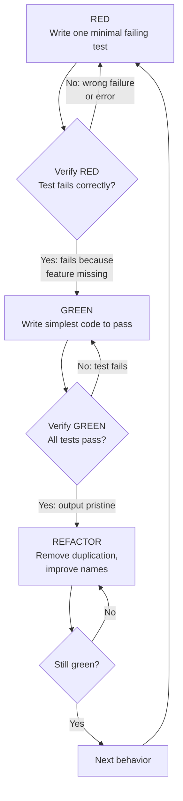

# 第五章 Test-Driven Development — 测试驱动开发

> **对应源文件**：`skills/test-driven-development/SKILL.md`、`skills/test-driven-development/testing-anti-patterns.md`

## 概述

Test-Driven Development（测试驱动开发）是 Superpowers 体系中**唯一被允许的产品代码编写方式**。其核心铁律：**没有先失败的测试，就不能写产品代码**。TDD 通过 Red-Green-Refactor（红-绿-重构）循环，强制开发者先定义"代码应该做什么"，再实现"怎么做"，从根本上消除 confirmation bias（确认偏差）带来的质量风险。

## 前置阅读

- 第零章 Using Superpowers
- [第六章 Systematic Debugging](./06-systematic-debugging.md)（TDD 与 Bug 修复的集成流程）
- [第七章 Verification](./07-verification.md)（TDD 产出的测试如何进入验证阶段）

---

## 1 定义与定位

| 维度 | 说明 |
|------|------|
| 是什么 | 先写测试、看它失败、用最小代码使其通过、再重构的开发循环 |
| 在工作流中的位置 | 编写任何 feature、bugfix、refactoring 时的**强制流程** |
| 解决什么问题 | 对抗 confirmation bias（确认偏差）——先写代码再补测试只会验证"已经写了什么"，而非"应该做什么" |
| 铁律 | `NO PRODUCTION CODE WITHOUT A FAILING TEST FIRST` |

**适用范围**：

- ✅ 新功能、Bug 修复、重构、行为变更——**始终使用**
- ❌ 一次性原型、生成代码、配置文件——需与 human partner 确认后可豁免

---

## 2 底层原理

### 为什么必须 Test-First 而非 Test-After

人类认知存在 confirmation bias（确认偏差）：当你已经写完代码，你的大脑会**无意识地让测试验证你已有的实现**，而不是验证需求。这导致：

1. **Tests-after 回答的是 "What does this do?"**（这段代码做了什么？）——你在描述现状
2. **Tests-first 回答的是 "What should this do?"**（这段代码应该做什么？）——你在定义期望

Tests-after 写完立即通过，但通过本身**什么也没证明**：
- 可能测试了错误的行为
- 可能测试了 implementation 而非 behavior
- 可能遗漏了你忘记的 edge case
- 你从未看到测试捕获到 bug

Tests-first 强制你**先看到测试失败**，证明测试确实在检测某种行为——如果从未失败过，它可能检测的是"永远为真"的条件。

### 为什么 "删除已有代码" 不是浪费

Sunk cost fallacy（沉没成本谬误）：已经花掉的时间无法挽回。你现在的选择是：

- **删除，用 TDD 重写**：多花时间，但高置信度
- **保留，补测试**：省30分钟，但低置信度，可能引入技术债

"浪费"的不是删掉的代码，而是**保留你无法信任的代码**。没有经过 TDD 验证的工作代码就是 technical debt（技术债务）。

---

## 3 触发条件

| 条件 | 是否触发 TDD | 原因 |
|------|-------------|------|
| 新功能开发 | ✅ | 必须先定义行为再实现 |
| Bug 修复 | ✅ | 必须先用测试复现 bug |
| 重构 | ✅ | 必须有测试保护现有行为 |
| 行为变更 | ✅ | 必须先定义新行为期望 |
| 一次性原型 | ❌（需确认） | 可豁免，但探索完成后必须丢弃，用 TDD 重写 |
| 生成代码 / 配置文件 | ❌（需确认） | 需与 human partner 确认 |
| 想"就这一次跳过 TDD" | ❌ **停下** | 这就是 rationalization（合理化），立即回到 TDD |

---

## 4 执行流程

### Red-Green-Refactor 循环



**循环说明**：每次循环只关注**一个行为**。RED 阶段写一个最小失败测试；验证它因为"功能缺失"而失败（不是语法错误）；GREEN 阶段写最小代码使其通过；验证所有测试通过且输出干净；REFACTOR 阶段仅在绿灯后进行，不添加新行为。

### 各阶段详解

**RED — 写一个失败测试**

- 一次只测一个行为
- 测试名称清晰描述行为（名称中有 "and"？拆分它）
- 使用真实代码，不用 mock（除非不可避免）
- 测试展示期望的 API 用法

**Verify RED — 验证失败（必做，不可跳过）**

```bash
npm test path/to/test.test.ts
```

确认三点：
1. 测试**失败**（不是报错）
2. 失败信息符合预期
3. 失败原因是功能缺失（不是拼写错误）

测试通过了？说明你在测试已有行为，修改测试。测试报错了？修复错误，重新运行直到正确失败。

**GREEN — 最小代码**

写**刚好能通过测试的代码**。不加功能、不重构其他代码、不"改进"超出测试范围的部分。违反 YAGNI（You Aren't Gonna Need It）的过度工程化是此阶段的头号敌人。

**Verify GREEN — 验证通过（必做）**

```bash
npm test path/to/test.test.ts
```

确认：当前测试通过、其他测试仍然通过、输出干净（无错误、无警告）。测试失败？修改代码，不修改测试。其他测试失败？立即修复。

**REFACTOR — 重构**

仅在绿灯后进行：移除重复、改善命名、提取 helper。保持测试绿灯，不添加行为。

---

## 5 强制规则

### 铁律：NO PRODUCTION CODE WITHOUT A FAILING TEST FIRST

| 规则 | 原因 | 机制 | 违反后果 |
|------|------|------|---------|
| 先写测试再写代码 | Confirmation bias 使 test-after 只验证实现而非需求 | Red-Green-Refactor 循环 | 删除代码，从测试重新开始 |
| 先写代码就删除它 | 保留未经 TDD 验证的代码是 technical debt | 铁律强制执行 | 不保留为"参考"、不"改编"、不看它——删除就是删除 |
| Verify RED 不可跳过 | 未看到失败的测试可能测试了"永远为真"的条件 | 运行测试确认正确失败 | 无法证明测试有效 |
| Verify GREEN 不可跳过 | 必须确认所有测试通过且输出干净 | 运行全部测试 | 可能引入 regression |
| 仅在绿灯后重构 | 红灯时重构会混淆"功能缺失"和"重构引入的错误" | 流程顺序约束 | 无法区分失败原因 |
| Mock 仅在不可避免时使用 | 测试 mock 行为 ≠ 测试真实行为 | 优先使用真实依赖 | 虚假的测试置信度 |
| Bug 修复必须先写失败测试 | 测试证明修复有效并防止 regression | TDD 循环 | 无法证明 bug 已修复 |

---

## 6 Checklist — 验证清单

在标记工作完成之前，逐项确认：

- [ ] 每个新函数/方法都有测试
- [ ] 观察了每个测试在实现前失败
- [ ] 每个测试因预期原因失败（功能缺失，不是拼写错误）
- [ ] 为每个测试写了最小代码使其通过
- [ ] 所有测试通过
- [ ] 输出干净（无错误、无警告）
- [ ] 测试使用真实代码（mock 仅在不可避免时使用）
- [ ] Edge case 和错误场景已覆盖

**无法勾选所有项？你跳过了 TDD。删除代码，重新开始。**

---

## 7 常见违规与对策

### 7.1 常见 Rationalization 完整对照表

| 违规场景（借口） | 表现 | 正确做法 |
|-----------------|------|---------|
| "Too simple to test" | 认为代码太简单不需要测试 | 简单代码也会出错。写测试只需30秒。 |
| "I'll test after" | 先写完代码再补测试 | Test-after 立即通过什么也没证明。删除代码，从测试开始。 |
| "Tests after achieve same goals" | 声称补测试等同于 TDD | Tests-after = "what does this do?" Tests-first = "what should this do?" 二者本质不同。 |
| "Already manually tested" | 用手动测试替代自动化测试 | Ad-hoc ≠ systematic。无记录、不可重复、压力下容易遗漏。 |
| "Deleting X hours is wasteful" | 拒绝删除未经 TDD 验证的代码 | Sunk cost fallacy。保留未验证代码就是 technical debt。 |
| "Keep as reference, write tests first" | 保留旧代码作为参考 | 你会不自觉地改编它，这就是 test-after。Delete means delete。 |
| "Need to explore first" | 以探索为由跳过 TDD | 探索可以，但完成后丢弃探索代码，用 TDD 重新开始。 |
| "Test hard = design unclear" | 测试很难写 | 倾听测试的信号——难以测试 = 难以使用。改善设计。 |
| "TDD will slow me down" | 认为 TDD 降低效率 | TDD 比 debugging 快。Pragmatic = test-first。 |
| "Manual test faster" | 认为手动测试更快 | 手动测试无法证明 edge case。每次修改都需要重新测试。 |
| "Existing code has no tests" | 以现有代码无测试为由不写测试 | 你在改进它。为现有代码补充测试。 |

### 7.2 Red Flags — 停下并重新开始

出现以下任何信号，立即停止，删除代码，从 TDD 重新开始：

1. 先写代码再写测试
2. 实现完成后补测试
3. 测试写完立即通过
4. 无法解释测试为什么失败
5. 测试被标记为"稍后添加"
6. 合理化"就这一次"
7. "I already manually tested it"
8. "Tests after achieve the same purpose"
9. "It's about spirit not ritual"
10. "Keep as reference" 或 "adapt existing code"
11. "Already spent X hours, deleting is wasteful"
12. "TDD is dogmatic, I'm being pragmatic"
13. "This is different because..."

**以上所有情况的正确做法：删除代码，用 TDD 重新开始。**

### 7.3 卡住时怎么办

| 问题 | 解决方案 |
|------|---------|
| 不知道怎么写测试 | 先写期望的 API 用法，先写 assertion，问 human partner |
| 测试太复杂 | 说明设计太复杂。简化接口。 |
| 必须 mock 所有东西 | 代码耦合度太高。使用 dependency injection。 |
| 测试 setup 太庞大 | 提取 helper。仍然复杂？简化设计。 |

---

## 8 与其他技能的关系

| 相关技能 | 关系 | 说明 |
|---------|------|------|
| [Systematic Debugging](./06-systematic-debugging.md) | TDD → Debugging | 发现 Bug 时，先写失败测试复现它，再走 TDD 循环修复。测试同时证明修复有效并防止 regression。**永远不要在没有测试的情况下修复 Bug。** |
| [Verification](./07-verification.md) | TDD → Verification | TDD 产出的测试是 verification 阶段的核心输入。Verification checklist 中"所有测试通过"和"输出干净"直接依赖 TDD 的严格执行。 |
| Subagent-Driven Development | TDD ⊂ Implementer | 在 Subagent-Driven Development 中，Implementer 执行 Task 时**必须遵循 TDD 流程**。Spec Reviewer 会验证测试是否存在且覆盖需求。 |

---

## 9 Prompt 模板

当需要提醒 AI agent 遵循 TDD 时，使用以下模板：

```
## TDD 强制要求

实现任何功能前，严格遵循 Red-Green-Refactor 循环：

1. RED：先写一个最小失败测试，描述期望行为
2. VERIFY RED：运行测试，确认因功能缺失而失败（不是报错）
3. GREEN：写最小代码使测试通过
4. VERIFY GREEN：运行所有测试，确认全部通过且输出干净
5. REFACTOR：仅在绿灯后重构，保持测试绿灯

铁律：如果先写了产品代码，删除它，从测试重新开始。
不保留为参考、不改编、不看它——delete means delete。
```

---

## 10 代码示例 — Bug 修复 TDD 循环

**Bug**：空邮箱被系统接受

### RED — 写失败测试

```typescript
test('rejects empty email', async () => {
  const result = await submitForm({ email: '' });
  expect(result.error).toBe('Email required');
});
```

测试名称清晰描述了期望行为：空邮箱应被拒绝。

### Verify RED — 确认正确失败

```bash
$ npm test
FAIL: expected 'Email required', got undefined
```

✅ 测试失败，原因是功能缺失（`submitForm` 未校验空邮箱），不是语法错误。

### GREEN — 写最小代码

```typescript
function submitForm(data: FormData) {
  if (!data.email?.trim()) {
    return { error: 'Email required' };
  }
  // ... existing logic
}
```

仅添加了空邮箱校验，没有过度工程化。

### Verify GREEN — 确认通过

```bash
$ npm test
PASS
```

✅ 所有测试通过，输出干净。

### REFACTOR — 重构

如果有多个字段需要类似校验，提取通用验证函数。但此刻只有一个字段，保持现状。

---

## 11 Reference 文件 — Testing Anti-Patterns

> 来源：`skills/test-driven-development/testing-anti-patterns.md`

当编写或修改测试、添加 mock、或想在产品类中添加 test-only 方法时，加载此参考。

### 三条铁律

```
1. NEVER test mock behavior — 永远不要测试 mock 的行为
2. NEVER add test-only methods to production classes — 永远不要在产品类中添加仅测试用的方法
3. NEVER mock without understanding dependencies — 永远不要在不理解依赖关系的情况下 mock
```

### Anti-Pattern 1：Testing Mock Behavior（测试 Mock 行为）

**违规**：断言 mock 元素存在，而非组件真实行为。

```typescript
// ❌ BAD: 测试的是 mock 是否存在
test('renders sidebar', () => {
  render(<Page />);
  expect(screen.getByTestId('sidebar-mock')).toBeInTheDocument();
});
```

**为什么错**：你验证的是 mock 工作正常，不是组件工作正常。测试在 mock 存在时通过、不存在时失败——这跟真实行为无关。

**正确做法**：测试真实组件或不 mock：

```typescript
// ✅ GOOD: 测试真实行为
test('renders sidebar', () => {
  render(<Page />);
  expect(screen.getByRole('navigation')).toBeInTheDocument();
});
```

**Gate Function**：断言任何 mock 元素前，问自己——"我在测试真实组件行为还是 mock 存在？" 如果是后者，删除断言或取消 mock。

### Anti-Pattern 2：Test-Only Methods in Production（产品类中的仅测试方法）

**违规**：在产品类中添加 `destroy()` 等仅被测试调用的方法。

**为什么错**：
- 产品类被测试代码污染
- 如果在生产环境中被意外调用，后果危险
- 违反 YAGNI 和关注点分离
- 混淆对象生命周期与实体生命周期

**正确做法**：将测试清理逻辑放入 test utilities：

```typescript
// ✅ GOOD: 测试工具处理清理
export async function cleanupSession(session: Session) {
  const workspace = session.getWorkspaceInfo();
  if (workspace) {
    await workspaceManager.destroyWorkspace(workspace.id);
  }
}
```

**Gate Function**：添加任何方法到产品类前，问——"这个方法只被测试使用吗？" 如果是，放入 test utilities。

### Anti-Pattern 3：Mocking Without Understanding（不理解依赖就 Mock）

**违规**：Mock 了有副作用的方法，而测试逻辑依赖该副作用。

```typescript
// ❌ BAD: Mock 阻止了测试依赖的配置写入
vi.mock('ToolCatalog', () => ({
  discoverAndCacheTools: vi.fn().mockResolvedValue(undefined)
}));
```

**为什么错**：被 mock 的方法有测试所依赖的副作用（写入配置），over-mocking "to be safe" 破坏了真实行为，测试因错误原因通过或莫名失败。

**正确做法**：Mock 正确的层级——mock 慢的/外部的操作，保留测试所需的行为。

**Gate Function**：Mock 任何方法前，先问三个问题：
1. 真实方法有什么副作用？
2. 测试是否依赖这些副作用？
3. 我完全理解测试需要什么吗？

如果不确定，先用真实实现运行测试，观察实际需要什么，再最小化 mock。

### Anti-Pattern 4：Incomplete Mocks（不完整的 Mock）

**违规**：只 mock 了你认为需要的字段，遗漏了下游代码依赖的字段。

**为什么错**：
- Partial mock 隐藏了结构假设
- 下游代码可能依赖你未包含的字段
- 测试通过但集成失败
- 虚假的置信度

**正确做法**：Mock 完整的数据结构，镜像真实 API 的所有字段。

```typescript
// ✅ GOOD: 镜像真实 API 完整性
const mockResponse = {
  status: 'success',
  data: { userId: '123', name: 'Alice' },
  metadata: { requestId: 'req-789', timestamp: 1234567890 }
};
```

**Gate Function**：创建 mock response 前，检查真实 API response 包含哪些字段，包含所有字段。

### Anti-Pattern 5：Integration Tests as Afterthought（集成测试作为事后补充）

**违规**：实现完成后才想到测试，声称"Ready for testing"。

**为什么错**：测试是实现的一部分，不是可选的后续步骤。TDD 本来就能避免这种情况。

**正确做法**：TDD 循环——先写失败测试，实现使其通过，重构，然后才能声称完成。

### Anti-Pattern 快速参考表

| Anti-Pattern | 正确做法 |
|--------------|---------|
| 断言 mock 元素 | 测试真实组件或取消 mock |
| 产品类中的 test-only 方法 | 移至 test utilities |
| 不理解依赖就 mock | 先理解依赖，最小化 mock |
| 不完整的 mock | 完整镜像真实 API |
| 测试作为事后补充 | TDD——测试先行 |
| 过度复杂的 mock | 考虑使用 integration test |

### Mocking Red Flags

出现以下信号时，审视你的 mock 使用：

- 断言检查 `*-mock` test ID
- 方法仅在测试文件中被调用
- Mock setup 超过测试逻辑的 50%
- 移除 mock 后测试失败
- 无法解释为什么需要这个 mock
- "Just to be safe" 地添加 mock

**核心原则**：Mock 是隔离的工具，不是被测试的对象。如果你在测试 mock 行为，你已经偏离了 TDD。

---

## 本章核心结论

1. **铁律不可违反**：没有先失败的测试，就不能写产品代码。先写了代码？删除，从测试重新开始——不保留、不改编、不参考。
2. **Verify RED 和 Verify GREEN 是必做步骤**：未看到失败的测试无法证明有效；未确认全部通过可能引入 regression。
3. **Tests-first ≠ Tests-after**：前者定义"应该做什么"，后者描述"做了什么"——confirmation bias 使二者不可互换。
4. **所有 rationalization 的正确回应都是同一个**：删除代码，用 TDD 重新开始。
5. **Mock 是隔离工具，不是测试目标**：断言 mock 行为 = 测试无效；不理解依赖就 mock = 隐藏 bug；不完整的 mock = 虚假置信度。
6. **难以测试 = 设计问题**：倾听测试的信号，简化接口，而非绕过测试。
7. **Bug 修复必经 TDD**：先写失败测试复现 bug，再用最小代码修复——测试同时防止 regression。
