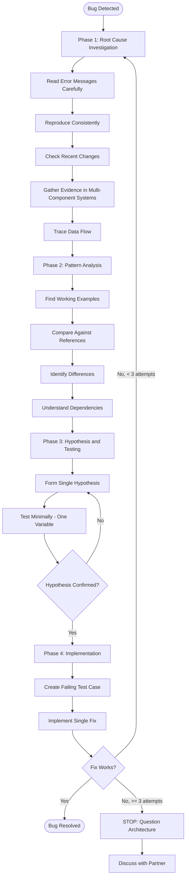
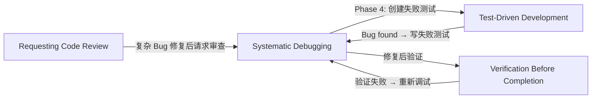

# 第六章 Systematic Debugging — 系统化调试

> **对应源文件**：`skills/systematic-debugging/SKILL.md`、`skills/systematic-debugging/root-cause-tracing.md`、`skills/systematic-debugging/defense-in-depth.md`、`skills/systematic-debugging/condition-based-waiting.md`、`skills/systematic-debugging/condition-based-waiting-example.ts`、`skills/systematic-debugging/find-polluter.sh`

## 概述

Systematic Debugging（系统化调试）是 Superpowers 体系中处理一切技术问题的强制流程。它要求在尝试任何修复之前**必须先找到 Root Cause（根因）**，用科学方法替代猜测式修复。随机修复不仅浪费时间，还会引入新 Bug；快速补丁只是在掩盖深层问题。

**核心原则**：ALWAYS find root cause before attempting fixes. Symptom fixes are failure.

## 前置阅读

- [第五章 Test-Driven Development](./05-test-driven-development.md)（Phase 4 中创建失败测试依赖 TDD 技能）
- [第七章 Verification Before Completion](./07-verification-before-completion.md)（修复后验证依赖此技能）

---

## 1 定义与定位

| 维度 | 说明 |
|------|------|
| 是什么 | 四阶段结构化调试流程：Root Cause Investigation → Pattern Analysis → Hypothesis & Testing → Implementation |
| 在工作流中的位置 | 遇到任何 Bug、测试失败、异常行为时**立即启动**，在提出修复方案之前 |
| 解决什么问题 | 对抗 guess-and-check thrashing（猜测式反复修复），消除 symptom fix（症状修复）导致的新 Bug 和时间浪费 |

---

## 2 底层原理

### 为什么必须先找根因

随机修复遵循的是"改了看看"模式，其本质问题是：

1. **无法隔离变量**：同时改多处时，无法确认是哪个改动解决了问题，也无法确认是否引入了新问题
2. **症状修复 ≠ 根因修复**：在错误出现的位置打补丁，只是压制了症状；根因仍然存在，会在其他路径再次触发
3. **认知偏差**：时间压力下人倾向于选择"看起来明显"的修复，但 95% 的"无根因"案例实际是调查不充分

### 实际影响数据

| 方法 | 修复时间 | 首次修复成功率 | 引入新 Bug |
|------|---------|---------------|-----------|
| Systematic Debugging | 15–30 分钟 | 95% | 接近零 |
| Random Fixes | 2–3 小时 | 40% | 常见 |

### 为什么"≥3 次修复失败 → 质疑架构"

当连续 3 次修复都失败时，呈现出一个特征模式：每次修复揭示出新的 shared state（共享状态）/coupling（耦合）/问题出现在不同位置。这不是假设验证失败——而是**架构本身有问题**。继续在错误的架构上修补只会陷入无限循环。

---

## 3 触发条件

### 必须使用的场景

- Test failures（测试失败）
- Bugs in production（生产环境 Bug）
- Unexpected behavior（意外行为）
- Performance problems（性能问题）
- Build failures（构建失败）
- Integration issues（集成问题）

### 尤其应该使用的场景

| 场景 | 原因 |
|------|------|
| 时间压力下 | 紧急情况让猜测更具诱惑力，但系统化方法实际更快 |
| "一个快速修复就行" | 看似简单的修复往往掩盖深层问题 |
| 已经尝试了多次修复 | 说明之前没有真正理解问题 |
| 上一次修复没有生效 | 需要重新分析，而非叠加更多修复 |
| 不完全理解问题 | 不理解就不应该修复 |

### 不应跳过的场景

- ❌ "问题很简单"——简单 Bug 也有根因，流程对简单 Bug 很快
- ❌ "赶时间"——赶时间恰恰保证返工
- ❌ "经理要求立刻修复"——系统化方法比反复尝试更快

---

## 4 执行流程

### 四阶段总览 Mermaid 流程图



**流程说明**：

- **Phase 1**（根因调查）：在尝试任何修复之前必须完成。仔细阅读错误信息、稳定复现、检查最近改动、在多组件系统中添加诊断 instrumentation（插桩）收集证据、追溯数据流
- **Phase 2**（模式分析）：找到相同代码库中的 working examples（可工作示例），逐行比对，列出所有差异
- **Phase 3**（假设与测试）：形成单一假设，做最小改动测试，一次只改一个变量
- **Phase 4**（实现）：先创建失败测试，再实现单一修复，验证通过。如果 ≥3 次修复失败 → 停下来质疑架构

### Phase 1 详解：根因调查

#### 1.1 仔细阅读错误信息

不要跳过错误和警告——它们往往包含精确的解决方案。完整阅读 stack trace（堆栈追踪），记录行号、文件路径、错误代码。

#### 1.2 稳定复现

- 能否可靠触发？
- 精确步骤是什么？
- 每次都发生吗？
- 如果不能复现 → 收集更多数据，**不要猜测**

#### 1.3 检查最近改动

```bash
git diff
git log --oneline -10
```

检查：新依赖、配置变更、环境差异。

#### 1.4 多组件系统中收集证据

**当系统有多个组件时**（CI → build → signing，API → service → database），在提出修复之前添加诊断 instrumentation：

```bash
# Layer 1: Workflow
echo "=== Secrets available in workflow: ==="
echo "IDENTITY: ${IDENTITY:+SET}${IDENTITY:-UNSET}"

# Layer 2: Build script
echo "=== Env vars in build script: ==="
env | grep IDENTITY || echo "IDENTITY not in environment"

# Layer 3: Signing script
echo "=== Keychain state: ==="
security list-keychains
security find-identity -v

# Layer 4: Actual signing
codesign --sign "$IDENTITY" --verbose=4 "$APP"
```

这会揭示**哪一层**出了问题（例如：secrets → workflow ✓，workflow → build ✗）。

#### 1.5 追溯数据流

当错误在 call stack（调用栈）深处时，使用 backward tracing（反向追溯）技术——详见下方 Reference 文件章节。

### Phase 2 详解：模式分析

1. **找到可工作示例**：在同一代码库中定位相似的正常工作代码
2. **对照参考实现**：如果在实现某个 pattern，**完整阅读**参考实现的每一行——不要略读
3. **识别差异**：列出正常与异常之间的**所有**差异，无论多小。不要假设"这个不可能有影响"
4. **理解依赖**：这段代码需要哪些组件、配置、环境？它做了哪些假设？

### Phase 3 详解：假设与测试

1. **形成单一假设**：明确陈述"我认为 X 是根因，因为 Y"，写下来，具体而非模糊
2. **最小化测试**：做最小的改动来验证假设，一次只改一个变量，不要同时修复多个问题
3. **验证后再继续**：成功 → Phase 4；失败 → 形成**新**假设，**不要**在上面叠加更多修复
4. **不知道就说不知道**：不要假装理解，请求帮助或进一步研究

### Phase 4 详解：实现

1. **创建失败测试**：使用 [TDD 技能](./05-test-driven-development.md) 编写最简复现测试
2. **实现单一修复**：只修复已识别的根因，一次一个改动，不要"顺便"改进
3. **验证修复**：测试通过？其他测试未受影响？问题真正解决？
4. **修复无效时**：
   - 已尝试 < 3 次 → 返回 Phase 1，用新信息重新分析
   - **已尝试 ≥ 3 次 → 停下来，质疑架构**（见下方）
   - **不要**在没有架构讨论的情况下尝试第 4 次修复

### 何时质疑架构（≥3 次修复失败）

**架构问题的特征模式**：
- 每次修复揭示新的 shared state / coupling / 问题出现在不同位置
- 修复需要"大规模重构"才能实现
- 每次修复在其他地方产生新症状

**必须停下来质疑根本问题**：
- 这个 pattern 从根本上是否合理？
- 我们是否因为惯性在坚持它？
- 应该重构架构还是继续修补症状？

**在尝试更多修复之前必须与 Partner 讨论。**

---

## 5 强制规则

### 规则 1：先根因，后修复

```
NO FIXES WITHOUT ROOT CAUSE INVESTIGATION FIRST
```

**原因**：不理解根因就修复 = 猜测。猜测的修复成功率只有 40%，且常引入新 Bug。即使碰巧修好了，也无法确认是否真正修好，因为你不知道问题的本质。

### 规则 2：完成每个阶段才能进入下一阶段

**原因**：阶段之间有依赖关系——没有根因就无法形成有效假设，没有假设验证就不应该实现修复。跳过阶段会导致在错误基础上层层堆积。

### 规则 3：一次只改一个变量

**原因**：同时改多处时，无法确认是哪个改动解决了问题。如果 fix A + fix B 一起生效了，你不知道是 A 还是 B 还是两者共同作用。这对未来调试毫无帮助。

### 规则 4：不理解就不要假装理解

**原因**：假装理解会导致你基于错误假设行动，浪费更多时间。"我不确定"是有价值的信息——它引导你去正确的方向获取更多数据。

### 规则 5：≥3 次修复失败必须质疑架构

**原因**：反复失败是架构问题的信号，不是"再试一次就好了"。继续在错误架构上修补会陷入无限循环。

### 规则 6：永远不要修复症状

**原因**：在错误出现的位置打补丁只是压制。根因仍在，会通过其他路径再次触发，且更难诊断因为症状被掩盖了。

---

## 6 Checklist

调试完成前检查：

- [ ] 完成了 Phase 1 根因调查（不是直接跳到修复）
- [ ] 能够稳定复现问题
- [ ] 检查了最近改动（git diff, git log）
- [ ] 在多组件系统中添加了诊断 instrumentation
- [ ] 追溯了数据流到源头
- [ ] 找到了可工作的对比示例
- [ ] 完整阅读了参考实现（不是略读）
- [ ] 形成了明确的单一假设
- [ ] 一次只测试了一个变量
- [ ] 创建了失败测试用例
- [ ] 实现了单一修复（非多个）
- [ ] 验证了修复通过且无回归
- [ ] 如果 ≥3 次修复失败，已质疑架构并与 Partner 讨论

---

## 7 常见违规与对策

### 合理化借口表

| 借口 | 现实 |
|------|------|
| "问题很简单，不需要流程" | 简单问题也有根因。流程对简单 Bug 很快。 |
| "紧急情况，没时间走流程" | 系统化调试比猜测式反复尝试**更快**。 |
| "先试一下，再调查" | 第一次修复会建立模式。从一开始就做对。 |
| "确认修复有效后再写测试" | 未测试的修复不牢靠。先写测试才能证明。 |
| "同时修多个节省时间" | 无法隔离有效改动。还会引入新 Bug。 |
| "参考文档太长，我改编一下" | 不完全理解保证出 Bug。完整阅读。 |
| "我看到问题了，让我修复" | 看到症状 ≠ 理解根因。 |
| "再试一次"（已失败 2+ 次） | 3+ 次失败 = 架构问题。质疑 pattern，不要再修。 |

### Red Flags — 立即停止

如果你发现自己在想：

- "先快速修复，之后再调查"
- "试着改一下 X 看看行不行"
- "加多个改动，跑测试"
- "跳过测试，我手动验证"
- "可能是 X，让我修一下"
- "我不完全理解但这可能行"
- "Pattern 说 X 但我要不同的做法"
- "这些是主要问题：[列出修复方案但没有调查]"
- 在追溯数据流之前就提出方案
- **"再试一次修复"（已经尝试了 2+ 次）**
- **每次修复揭示不同位置的新问题**

**以上所有情况都意味着：停下来。返回 Phase 1。**

### 违规场景对策表

| 违规场景 | 表现 | 正确做法 |
|---------|------|---------|
| 跳过根因直接修复 | 连续提出多个修复方案，每个都不解决问题 | 停下来，返回 Phase 1，从头阅读错误信息 |
| 同时改多处 | "我改了 A、B、C，现在测试通过了" | 回退到只改一处，逐个验证 |
| 症状修复 | 在异常出现的位置加 try-catch 或默认值 | 追溯数据流，找到错误数据的源头 |
| 修复不写测试 | "手动验证过了，没问题" | 先写失败测试，再修复（TDD） |
| 假装理解 | "应该是这个问题"但无法解释机制 | 承认不理解，收集更多数据 |
| 反复修复失败不停步 | 第 4、5 次修复尝试 | 停在第 3 次，质疑架构，与 Partner 讨论 |
| 略读参考实现 | "我大概知道这个 pattern" | 逐行完整阅读参考实现 |

---

## 8 与其他技能的关系



| 关联技能 | 关系 | 说明 |
|---------|------|------|
| [Test-Driven Development](./05-test-driven-development.md) | Phase 4 依赖 | 创建失败测试用例必须遵循 TDD 的 Red-Green-Refactor 流程 |
| [Verification Before Completion](./07-verification-before-completion.md) | 修复后衔接 | 修复完成后必须用 Verification 技能确认修复有效 |
| [Requesting Code Review](./08-requesting-code-review.md) | 可选衔接 | 复杂 Bug 修复后建议请求 Code Review |

---

## 9 Prompt 模板

调试开始时的结构化思考模板：

```
## 调试记录

### 问题描述
[具体错误信息和表现]

### Phase 1: 根因调查
- 错误信息完整内容：
- 复现步骤：
- 最近改动（git log）：
- 数据流追溯结果：

### Phase 2: 模式分析
- 可工作的对比示例：
- 差异列表：

### Phase 3: 假设
- 假设：我认为 [X] 是根因，因为 [Y]
- 最小测试方案：
- 验证结果：

### Phase 4: 实现
- 失败测试：
- 修复内容：
- 验证结果：
```

---

## 10 代码示例

### 多组件系统诊断 Instrumentation 示例

```bash
# Layer 1: Workflow
echo "=== Secrets available in workflow: ==="
echo "IDENTITY: ${IDENTITY:+SET}${IDENTITY:-UNSET}"

# Layer 2: Build script
echo "=== Env vars in build script: ==="
env | grep IDENTITY || echo "IDENTITY not in environment"

# Layer 3: Signing script
echo "=== Keychain state: ==="
security list-keychains
security find-identity -v

# Layer 4: Actual signing
codesign --sign "$IDENTITY" --verbose=4 "$APP"
```

**解释**：对每个组件边界记录进出数据。运行一次收集证据，分析证据确定哪一层出问题，然后专注调查该组件。

---

## 11 Reference 文件

### 11.1 Root Cause Tracing（根因追溯）

**来源**：`skills/systematic-debugging/root-cause-tracing.md`

**核心原则**：Bug 常在 call stack 深处表现（git init 在错误目录、文件创建在错误位置、数据库打开了错误路径）。你的本能是在错误出现的位置修复，但那只是在治疗症状。

**追溯过程**（五步法）：

1. **观察症状**：`Error: git init failed in /Users/jesse/project/packages/core`
2. **找到直接原因**：`await execFileAsync('git', ['init'], { cwd: projectDir });`
3. **问：是谁调用了它？** `WorktreeManager.createSessionWorktree() → Session.initializeWorkspace() → Session.create() → test at Project.create()`
4. **继续向上追溯**：`projectDir = ''`（空字符串！），空字符串作为 `cwd` 解析为 `process.cwd()`
5. **找到原始触发点**：`const context = setupCoreTest(); // Returns { tempDir: '' }` — 在 `beforeEach` 之前访问

#### 添加 Stack Trace

当无法手动追溯时，添加 instrumentation：

```typescript
async function gitInit(directory: string) {
  const stack = new Error().stack;
  console.error('DEBUG git init:', {
    directory,
    cwd: process.cwd(),
    nodeEnv: process.env.NODE_ENV,
    stack,
  });
  await execFileAsync('git', ['init'], { cwd: directory });
}
```

**关键**：在测试中使用 `console.error()`（不是 logger——logger 可能被抑制）。在危险操作**之前**记录，不是失败之后。

#### 查找测试污染者（find-polluter.sh）

当不知道哪个测试造成了污染时，使用二分查找脚本：

```bash
#!/usr/bin/env bash
# Usage: ./find-polluter.sh <file_or_dir_to_check> <test_pattern>
# Example: ./find-polluter.sh '.git' 'src/**/*.test.ts'

set -e

if [ $# -ne 2 ]; then
  echo "Usage: $0 <file_to_check> <test_pattern>"
  exit 1
fi

POLLUTION_CHECK="$1"
TEST_PATTERN="$2"

echo "🔍 Searching for test that creates: $POLLUTION_CHECK"

TEST_FILES=$(find . -path "$TEST_PATTERN" | sort)
TOTAL=$(echo "$TEST_FILES" | wc -l | tr -d ' ')

COUNT=0
for TEST_FILE in $TEST_FILES; do
  COUNT=$((COUNT + 1))

  if [ -e "$POLLUTION_CHECK" ]; then
    echo "⚠️  Pollution already exists before test $COUNT/$TOTAL"
    continue
  fi

  echo "[$COUNT/$TOTAL] Testing: $TEST_FILE"
  npm test "$TEST_FILE" > /dev/null 2>&1 || true

  if [ -e "$POLLUTION_CHECK" ]; then
    echo "🎯 FOUND POLLUTER!"
    echo "   Test: $TEST_FILE"
    echo "   Created: $POLLUTION_CHECK"
    ls -la "$POLLUTION_CHECK"
    exit 1
  fi
done

echo "✅ No polluter found - all tests clean!"
```

**原理**：逐个运行测试文件，每次运行后检查是否出现了不应该存在的文件/目录。一旦发现污染者就停下来报告。

### 11.2 Defense-in-Depth Validation（纵深防御验证）

**来源**：`skills/systematic-debugging/defense-in-depth.md`

**核心原则**：修复 Bug 时在一个位置加验证看似足够，但单一检查可以被不同代码路径、重构或 mock 绕过。在数据经过的**每一层**都加验证，使 Bug **结构性不可能发生**。

#### 四层验证

| 层级 | 目的 | 示例 |
|------|------|------|
| Layer 1: Entry Point Validation | 在 API 边界拒绝明显无效输入 | `if (!workingDirectory) throw new Error('workingDirectory cannot be empty')` |
| Layer 2: Business Logic Validation | 确保数据对该操作有意义 | `if (!projectDir) throw new Error('projectDir required')` |
| Layer 3: Environment Guards | 在特定上下文中阻止危险操作 | 测试中拒绝在 temp 目录外执行 `git init` |
| Layer 4: Debug Instrumentation | 为取证捕获上下文 | 在危险操作前记录 directory、cwd、stack trace |

**为什么四层都需要**：在实际测试中，每一层都捕获了其他层遗漏的 Bug——不同代码路径绕过了 entry validation，mock 绕过了 business logic，边缘情况在不同平台需要 environment guards，debug logging 识别了结构性误用。

#### Layer 3 示例：Environment Guard

```typescript
async function gitInit(directory: string) {
  if (process.env.NODE_ENV === 'test') {
    const normalized = normalize(resolve(directory));
    const tmpDir = normalize(resolve(tmpdir()));
    if (!normalized.startsWith(tmpDir)) {
      throw new Error(
        `Refusing git init outside temp dir during tests: ${directory}`
      );
    }
  }
  // ... proceed
}
```

### 11.3 Condition-Based Waiting（基于条件的等待）

**来源**：`skills/systematic-debugging/condition-based-waiting.md`

**核心原则**：Flaky tests（不稳定测试）通常用任意延迟猜测时机。这会产生 race condition（竞态条件）——在快机器上通过但在 CI 或高负载下失败。等待你**真正关心的条件**，而非猜测它需要多久。

#### 核心 Pattern

```typescript
// ❌ BEFORE: 猜测时机
await new Promise(r => setTimeout(r, 50));
const result = getResult();
expect(result).toBeDefined();

// ✅ AFTER: 等待条件
await waitFor(() => getResult() !== undefined);
const result = getResult();
expect(result).toBeDefined();
```

#### 通用 Polling 实现

```typescript
async function waitFor<T>(
  condition: () => T | undefined | null | false,
  description: string,
  timeoutMs = 5000
): Promise<T> {
  const startTime = Date.now();
  while (true) {
    const result = condition();
    if (result) return result;
    if (Date.now() - startTime > timeoutMs) {
      throw new Error(`Timeout waiting for ${description} after ${timeoutMs}ms`);
    }
    await new Promise(r => setTimeout(r, 10)); // Poll every 10ms
  }
}
```

#### 常见场景 Quick Patterns

| 场景 | Pattern |
|------|---------|
| 等待事件 | `waitFor(() => events.find(e => e.type === 'DONE'))` |
| 等待状态 | `waitFor(() => machine.state === 'ready')` |
| 等待数量 | `waitFor(() => items.length >= 5)` |
| 等待文件 | `waitFor(() => fs.existsSync(path))` |
| 复合条件 | `waitFor(() => obj.ready && obj.value > 10)` |

#### 何时任意 Timeout 是正确的

```typescript
// Tool ticks every 100ms - need 2 ticks to verify partial output
await waitForEvent(manager, 'TOOL_STARTED'); // First: wait for condition
await new Promise(r => setTimeout(r, 200));   // Then: wait for timed behavior
// 200ms = 2 ticks at 100ms intervals - documented and justified
```

要求：(1) 先等待触发条件 (2) 基于已知时序（非猜测）(3) 注释说明原因。

#### 实际影响

- 修复了 3 个文件中的 15 个 flaky tests
- 通过率：60% → 100%
- 执行时间：快了 40%
- 不再有 race condition

---

## 12 本章核心结论

1. **先根因，后修复**——没有完成 Phase 1 就不能提出任何修复方案；猜测式修复成功率仅 40% 且常引入新 Bug
2. **一次只改一个变量**——同时改多处无法隔离有效改动，且会掩盖真正原因
3. **≥3 次修复失败 → 质疑架构**——反复失败是架构问题的信号，继续修补只会无限循环
4. **追溯到源头修复，不修症状**——在错误出现的位置打补丁只是压制，根因会通过其他路径再次触发
5. **纵深防御：每层都加验证**——单一检查可被绕过，四层验证使 Bug 结构性不可能发生
6. **用条件等待替代任意延迟**——`setTimeout` 猜测时机导致 flaky tests；等待真实条件才可靠
7. **不理解就说不理解**——假装理解导致基于错误假设行动，浪费更多时间
