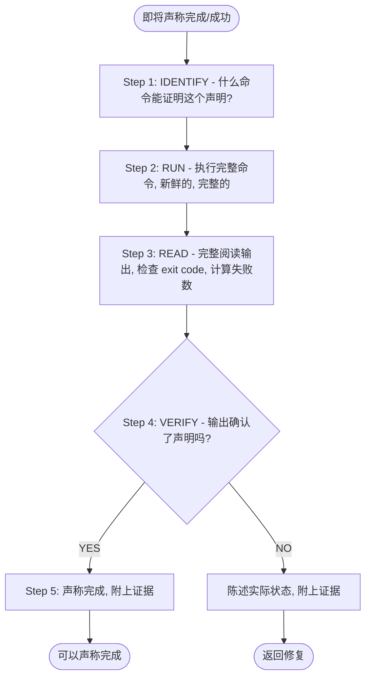
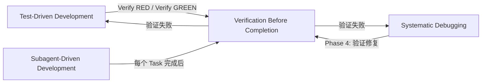

# 第七章 Verification Before Completion — 完成前验证

> **对应源文件**：`skills/verification-before-completion/SKILL.md`

## 概述

Verification Before Completion（完成前验证）是 Superpowers 体系中**所有任务完成声明的门禁规则**。它要求在声称任何工作已完成之前，必须**运行验证命令并确认输出**——没有新鲜证据的完成声明就是谎言。

**核心原则**：Evidence before claims, always（先证据，后声明）。

**违反规则的字面含义就是违反规则的精神。**

## 前置阅读

- [第五章 Test-Driven Development](./05-test-driven-development.md)（TDD 的 Verify RED / Verify GREEN 就是本技能的具体应用）
- [第六章 Systematic Debugging](./06-systematic-debugging.md)（修复后验证是调试流程的最后一步）

---

## 1 定义与定位

| 维度 | 说明 |
|------|------|
| 是什么 | 五步 Gate Function（门禁函数）：IDENTIFY → RUN → READ → VERIFY → CLAIM |
| 在工作流中的位置 | 任何完成声明、满意表达、提交/PR/任务完成之前**必须执行** |
| 解决什么问题 | 对抗 premature completion claims（过早完成声明）——Agent 和人类都倾向于在未验证时声称"完成了" |

---

## 2 底层原理

### 为什么"新鲜"验证至关重要

Stale results（过时结果）不可靠，原因有三：

1. **代码在上次测试后已改动**：你改了代码但引用了之前的测试结果，那个结果不再反映当前代码状态
2. **环境可能已变化**：依赖更新、配置变更、其他并行操作都可能影响结果
3. **记忆偏差**：人倾向于记住成功，遗忘失败。"刚才跑过了"可能是几个改动之前的事

### 为什么 Agent 尤其容易过早声明完成

AI Agent 有特有的倾向：

- **模式匹配而非验证**：Agent 看到代码"看起来对了"就认为完成了，但"看起来对"≠"经过验证"
- **乐观偏差**：Agent 倾向于产出积极结果，容易在代码改动后立即声称"应该可以了"
- **缺乏怀疑精神**：Agent 不会像人一样本能地怀疑自己的输出是否正确
- **信任自身报告**：当 Agent A 委派给 Agent B 时，A 倾向于信任 B 的成功报告而不独立验证

### 实际后果

来自 24 次失败记录：
- Partner 说"我不相信你"——信任被破坏
- 未定义的函数被提交——会导致崩溃
- 缺失的需求被提交——功能不完整
- 在错误的完成声明上浪费时间 → 重定向 → 返工

---

## 3 触发条件

### 必须应用的时机

**在以下情况之前必须运行验证**：

- 任何形式的成功/完成声明
- 任何满意表达（"Great!"、"Perfect!"、"Done!"）
- 任何关于工作状态的正面陈述
- 提交（commit）、创建 PR、标记任务完成
- 转移到下一个任务
- 委派给 Agent

### 规则适用范围

不仅是精确措辞——还包括：
- 改述和同义词
- 暗示成功
- **任何**暗示完成/正确的沟通

---

## 4 执行流程

### The Gate Function（门禁函数）



**五步详解**：

1. **IDENTIFY**（识别）：确定什么命令能证明你的声明。"测试通过"需要测试命令输出；"构建成功"需要构建命令的 exit code 0
2. **RUN**（运行）：执行**完整**的验证命令——新鲜的、完整的。不是上次的结果，不是部分检查
3. **READ**（阅读）：完整阅读输出。检查 exit code。计算失败数。不要只看最后一行
4. **VERIFY**（验证）：输出是否确认了你要声称的内容？如果不确认 → 陈述实际状态
5. **CLAIM**（声称）：只有在第 4 步确认后才能声称完成，且**必须附上证据**

**跳过任何一步 = 撒谎，不是验证。**

---

## 5 强制规则

### The Iron Law

```
NO COMPLETION CLAIMS WITHOUT FRESH VERIFICATION EVIDENCE
```

如果在当前消息中没有运行验证命令，你就不能声称它通过了。

### 规则 1：证据先于声明

**原因**：没有证据的声明是基于记忆或假设，两者都不可靠。记忆有偏差（倾向于记住成功），假设有盲点（你改的代码可能影响了你没想到的地方）。

### 规则 2：验证必须是新鲜的

**原因**：代码是动态的——你在上次测试后做的每一个改动都可能让之前的结果失效。"刚才跑过了"不算——"刚才"和"现在"之间你改了什么？

### 规则 3：验证必须是完整的

**原因**：部分验证什么都不能证明。Linter passing（通过）不能证明 build 成功；单个测试通过不能证明没有回归；Agent 报告成功不能证明改动是正确的。

### 规则 4：禁止使用 "should"、"probably"、"seems to"

**原因**：这些词是未验证的信号。"应该可以了"意味着你没有运行验证。"看起来对了"意味着你用眼睛看了代码而非用命令验证。这些词标记了你跳过了 Gate Function。

### 规则 5：不信任 Agent 的成功报告

**原因**：Agent 有和你相同的乐观偏差倾向。当 Agent 报告"成功"时，你需要独立验证：检查 VCS diff，运行测试，确认改动存在且正确。

---

## 6 Checklist

验证完成前检查：

- [ ] 识别了证明声明的具体命令
- [ ] 在当前会话中**新鲜**运行了完整验证命令
- [ ] 完整阅读了输出（不只是最后一行）
- [ ] 检查了 exit code
- [ ] 计算了失败/错误数量
- [ ] 输出确认了声明内容
- [ ] 声明中附上了证据（如"34/34 pass"）
- [ ] 没有使用 "should"、"probably"、"seems to"
- [ ] 如果是 Agent 委派，独立验证了 Agent 报告
- [ ] 如果是 TDD，验证了完整的 Red-Green 循环

---

## 7 常见违规与对策

### 常见验证失败表

| 声明 | 需要的证据 | 不充分的证据 |
|------|-----------|-------------|
| Tests pass | 测试命令输出：0 failures | 上次的运行结果、"should pass" |
| Linter clean | Linter 输出：0 errors | 部分检查、推断 |
| Build succeeds | 构建命令：exit 0 | Linter 通过、日志看起来不错 |
| Bug fixed | 测试原始症状：通过 | 代码已改，假设已修复 |
| Regression test works | Red-Green cycle 已验证 | 测试只通过了一次 |
| Agent completed | VCS diff 显示改动 | Agent 报告"成功" |
| Requirements met | 逐行对照检查 | 测试通过 |

### 合理化借口表

| 借口 | 现实 |
|------|------|
| "应该可以了" | 运行验证 |
| "我很有信心" | 信心 ≠ 证据 |
| "就这一次" | 没有例外 |
| "Linter 通过了" | Linter ≠ 编译器 |
| "Agent 说成功了" | 独立验证 |
| "我太累了" | 疲惫 ≠ 借口 |
| "部分检查就够了" | 部分什么都不能证明 |
| "换个说法所以规则不适用" | 精神高于字面 |

### 违规场景对策表

| 违规场景 | 表现 | 正确做法 |
|---------|------|---------|
| 未运行就声称通过 | "测试应该通过了" | 运行 `npm test`，等待输出，报告实际结果 |
| 依赖过时结果 | "刚才跑过了"（但之后改了代码） | 重新运行验证命令 |
| 部分验证 | "Linter 通过了"代替"Build 成功" | 运行实际需要的验证命令 |
| 满意表达先于验证 | "Great! 搞定了！"（但还没跑测试） | 先运行验证，再表达满意 |
| 信任 Agent 报告 | "Subagent 说完成了" | 检查 git diff，运行测试，确认改动 |
| 用模糊语言回避 | "seems to work"、"probably fixed" | 用具体证据替代：`34/34 pass, exit 0` |

### Red Flags — 立即停止

- 使用 "should"、"probably"、"seems to"
- 在验证前表达满意（"Great!"、"Perfect!"、"Done!"）
- 即将提交/推送/PR 但没有验证
- 信任 Agent 成功报告
- 依赖部分验证
- 想着"就这一次"
- 感到疲惫想结束工作
- **任何暗示成功但没有运行验证的措辞**

---

## 8 与其他技能的关系



| 关联技能 | 关系 | 说明 |
|---------|------|------|
| [Test-Driven Development](./05-test-driven-development.md) | 具体应用 | TDD 的 Verify RED 和 Verify GREEN 步骤就是本技能的实例 |
| [Systematic Debugging](./06-systematic-debugging.md) | Phase 4 衔接 | 调试修复后必须用本技能验证修复有效 |
| [Requesting Code Review](./08-requesting-code-review.md) | 前置条件 | 请求 Review 前必须先通过验证 |
| Subagent-Driven Development | 每个 Task | 每个 Subagent Task 完成后必须独立验证 |

---

## 9 Prompt 模板

不适用——本技能是一个决策门禁，不涉及 Subagent 委派。

---

## 10 代码示例

### 正确验证模式

**测试验证**：
```
✅ [运行测试命令] [看到: 34/34 pass] "All tests pass"
❌ "Should pass now" / "Looks correct"
```

**Regression Test 验证（TDD Red-Green）**：
```
✅ Write → Run (pass) → Revert fix → Run (MUST FAIL) → Restore → Run (pass)
❌ "I've written a regression test" (without red-green verification)
```

**Build 验证**：
```
✅ [运行构建] [看到: exit 0] "Build passes"
❌ "Linter passed" (linter doesn't check compilation)
```

**需求验证**：
```
✅ Re-read plan → Create checklist → Verify each → Report gaps or completion
❌ "Tests pass, phase complete"
```

**Agent 委派验证**：
```
✅ Agent reports success → Check VCS diff → Verify changes → Report actual state
❌ Trust agent report
```

---

## 11 Reference 文件

本技能没有额外的 Reference 文件。所有规则已在主 SKILL.md 中完整定义。

---

## 12 本章核心结论

1. **没有新鲜证据就不能声称完成**——任何完成声明都必须附上当前会话中运行的验证命令输出
2. **Gate Function 五步不可跳过**——IDENTIFY → RUN → READ → VERIFY → CLAIM，跳过任何一步等于撒谎
3. **"should"/"probably"/"seems to" 是红旗**——这些词意味着你没有运行验证，立即停下来执行 Gate Function
4. **不信任 Agent 报告**——Agent 有同样的乐观偏差；永远独立验证 VCS diff 和测试结果
5. **部分验证什么都不能证明**——Linter ≠ Build，单个测试 ≠ 全部通过，Agent 报告 ≠ 实际状态
6. **疲惫不是借口**——越累越需要验证，因为疲惫时犯错概率更高
