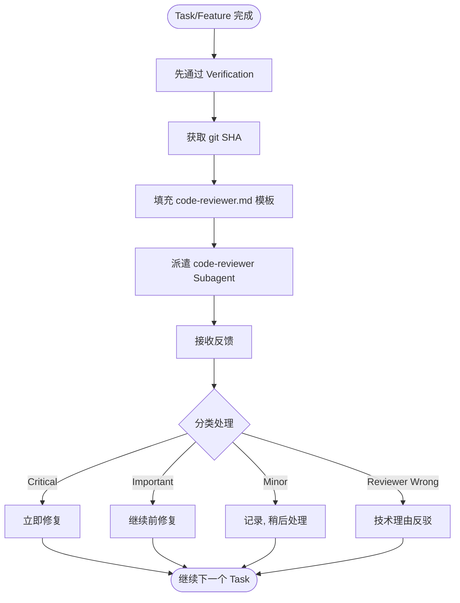
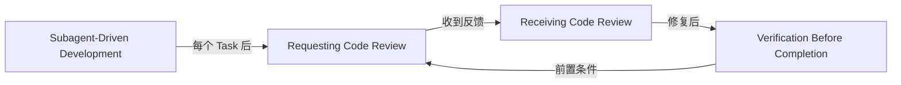

# 第八章 Requesting Code Review — 请求代码审查

> **对应源文件**：`skills/requesting-code-review/SKILL.md`、`skills/requesting-code-review/code-reviewer.md`

## 概述

Requesting Code Review（请求代码审查）是 Superpowers 体系中的**质量门禁触发机制**。它通过派遣独立的 code-reviewer Subagent（代码审查子代理）在问题级联之前发现问题。审查者获得精心构造的上下文进行评估——永远不是你的会话历史。这既保持了审查者专注于工作产出，也保护了你自己的上下文不被消耗。

**核心原则**：Review early, review often（早审查，常审查）。

## 前置阅读

- [第七章 Verification Before Completion](./07-verification-before-completion.md)（请求 Review 前必须先通过验证）
- [第九章 Receiving Code Review](./09-receiving-code-review.md)（收到反馈后如何处理）

---

## 1 定义与定位

| 维度 | 说明 |
|------|------|
| 是什么 | 通过 Task tool 派遣 `superpowers:code-reviewer` Subagent，提供 git SHA 范围和上下文，获取分类反馈 |
| 在工作流中的位置 | 每个 Task 完成后（Subagent-Driven Development）、重大功能完成后、合并到 main 之前 |
| 解决什么问题 | 对抗 tunnel vision（视野狭窄）和 blind spots（盲点）——自己写的代码自己最难发现问题 |

---

## 2 底层原理

### 为什么 "review early, review often"

1. **问题会级联**：Task 1 中的架构问题如果在 Task 5 才发现，修复成本是 10 倍。每个 Task 后审查将问题限制在最小范围
2. **新鲜上下文**：审查者在独立上下文中工作，没有你的假设和偏见，能看到你因为"太熟悉"而忽略的问题
3. **上下文隔离**：审查者只看工作产出（代码 diff），不看你的思考过程。这确保评估基于代码质量而非意图

### 为什么审查者不应该看到你的会话历史

- **专注于产出**：审查者评估的是代码，不是你的推理过程
- **避免偏见传播**：你的假设不应该影响审查者的判断
- **保护上下文**：你自己的上下文窗口不会因为传递历史而被消耗

---

## 3 触发条件

### 必须请求审查的场景（Mandatory）

| 场景 | 原因 |
|------|------|
| Subagent-Driven Development 中每个 Task 完成后 | 在问题级联之前捕获 |
| 完成重大功能后 | 架构和集成问题需要外部视角 |
| 合并到 main 之前 | 最后的质量门禁 |

### 可选但有价值的场景（Optional）

| 场景 | 原因 |
|------|------|
| 卡住时 | 新鲜视角可能发现你的盲点 |
| 重构前 | 建立基线，确认当前行为 |
| 修复复杂 Bug 后 | 确认修复没有引入新问题 |

---

## 4 执行流程

### 请求审查流程



### Step 1：获取 Git SHA

```bash
BASE_SHA=$(git rev-parse HEAD~1)  # or origin/main
HEAD_SHA=$(git rev-parse HEAD)
```

### Step 2：填充模板并派遣 Subagent

使用 Task tool 派遣 `superpowers:code-reviewer` 类型的 Subagent，填充 `code-reviewer.md` 模板。

**Placeholders（占位符）说明**：

| Placeholder | 说明 | 示例 |
|-------------|------|------|
| `{WHAT_WAS_IMPLEMENTED}` | 你刚构建了什么 | "Verification and repair functions for conversation index" |
| `{PLAN_OR_REQUIREMENTS}` | 它应该做什么（指向 Plan 或需求文档） | "Task 2 from docs/plans/deployment-plan.md" |
| `{BASE_SHA}` | 起始 commit | `a7981ec` |
| `{HEAD_SHA}` | 结束 commit | `3df7661` |
| `{DESCRIPTION}` | 简短摘要 | "Added verifyIndex() and repairIndex() with 4 issue types" |

### Step 3：处理反馈

| 反馈类别 | 定义 | 处理方式 |
|---------|------|---------|
| **Critical**（必须修复） | Bug、安全问题、数据丢失风险、功能破坏 | **立即修复**，不继续任何工作 |
| **Important**（应该修复） | 架构问题、缺失功能、差的错误处理、测试缺口 | **在继续下一个 Task 前修复** |
| **Minor**（建议改进） | 代码风格、优化机会、文档改进 | **记录下来**，稍后处理 |

**如果审查者判断错误**：
- 用技术理由反驳
- 展示代码/测试证明其正确
- 请求澄清

---

## 5 强制规则

### 规则 1：Subagent-Driven Development 中每个 Task 后必须审查

**原因**：Task 间问题会级联。Task 1 的架构问题在 Task 5 发现时修复成本是 10 倍。每个 Task 后审查将问题限制在最小范围。

### 规则 2：Critical 问题必须立即修复

**原因**：Critical 问题（Bug、安全、数据丢失）不会因为推迟而变好——只会随代码积累变得更难修复，且在此基础上构建的代码都是不可靠的。

### 规则 3：Important 问题必须在继续前修复

**原因**：Important 问题（架构、错误处理、测试缺口）如果推迟，后续 Task 会在有缺陷的基础上构建，修复成本指数增长。

### 规则 4：不因为"简单"就跳过审查

**原因**："简单"的代码也有盲点。你对代码的熟悉度恰恰让你最容易忽略问题。审查的价值正是来自外部视角。

### 规则 5：不无视有效的技术反馈

**原因**：审查者有你缺乏的外部视角。如果反馈技术上正确，拒绝它就是在选择保留已知问题。

---

## 6 Checklist

请求审查前检查：

- [ ] 已通过 [Verification](./07-verification-before-completion.md)（测试通过、构建成功）
- [ ] 获取了正确的 BASE_SHA 和 HEAD_SHA
- [ ] 填充了所有 Placeholder（WHAT、PLAN、SHA、DESCRIPTION）
- [ ] 审查范围明确（不是整个仓库，而是具体改动）
- [ ] Plan 或需求文档可访问

收到反馈后检查：

- [ ] 处理了所有 Critical 问题
- [ ] 处理了所有 Important 问题
- [ ] 记录了 Minor 问题
- [ ] 对不同意的反馈用技术理由反驳了

---

## 7 常见违规与对策

| 违规场景 | 表现 | 正确做法 |
|---------|------|---------|
| 跳过审查因为"简单" | "这个改动太小了不需要审查" | 再小的改动也可能有盲点，执行审查 |
| 忽视 Critical 问题 | "先继续，之后再修" | 立即停下来修复 Critical |
| 带着 Important 问题继续 | "记下来了，下个 Task 再处理" | 在继续前修复所有 Important |
| 无理由反驳有效反馈 | "我觉得我的方式更好"（无技术论证） | 用具体技术理由和测试/代码证据反驳 |
| 不审查就合并 | 直接 merge to main | main 分支合并前必须通过审查 |

---

## 8 与其他技能的关系



| 关联技能 | 关系 | 说明 |
|---------|------|------|
| [Verification Before Completion](./07-verification-before-completion.md) | 前置条件 | 请求审查前必须先通过验证 |
| [Receiving Code Review](./09-receiving-code-review.md) | 下游衔接 | 收到审查反馈后的处理流程 |
| Subagent-Driven Development | 集成 | SDD 流程中每个 Task 后必须审查 |
| Executing Plans | 集成 | 每批次（3 个 Task）后请求审查 |

---

## 9 Prompt 模板

### code-reviewer.md 完整模板

以下是 `skills/requesting-code-review/code-reviewer.md` 的完整模板——派遣 Subagent 时使用：

```markdown
# Code Review Agent

You are reviewing code changes for production readiness.

**Your task:**
1. Review {WHAT_WAS_IMPLEMENTED}
2. Compare against {PLAN_OR_REQUIREMENTS}
3. Check code quality, architecture, testing
4. Categorize issues by severity
5. Assess production readiness

## What Was Implemented

{DESCRIPTION}

## Requirements/Plan

{PLAN_REFERENCE}

## Git Range to Review

**Base:** {BASE_SHA}
**Head:** {HEAD_SHA}

## Review Checklist

**Code Quality:**
- Clean separation of concerns?
- Proper error handling?
- Type safety (if applicable)?
- DRY principle followed?
- Edge cases handled?

**Architecture:**
- Sound design decisions?
- Scalability considerations?
- Performance implications?
- Security concerns?

**Testing:**
- Tests actually test logic (not mocks)?
- Edge cases covered?
- Integration tests where needed?
- All tests passing?

**Requirements:**
- All plan requirements met?
- Implementation matches spec?
- No scope creep?
- Breaking changes documented?

**Production Readiness:**
- Migration strategy (if schema changes)?
- Backward compatibility considered?
- Documentation complete?
- No obvious bugs?

## Output Format

### Strengths
[What's well done? Be specific.]

### Issues

#### Critical (Must Fix)
[Bugs, security issues, data loss risks, broken functionality]

#### Important (Should Fix)
[Architecture problems, missing features, poor error handling, test gaps]

#### Minor (Nice to Have)
[Code style, optimization opportunities, documentation improvements]

**For each issue:**
- File:line reference
- What's wrong
- Why it matters
- How to fix (if not obvious)

### Recommendations
[Improvements for code quality, architecture, or process]

### Assessment
**Ready to merge?** [Yes/No/With fixes]
**Reasoning:** [Technical assessment in 1-2 sentences]
```

### 模板字段说明

| 字段 | 说明 | 填充指引 |
|------|------|---------|
| `{WHAT_WAS_IMPLEMENTED}` | 审查目标 | 简短描述实现了什么功能 |
| `{PLAN_OR_REQUIREMENTS}` | 对照标准 | 指向 Plan 文件路径或内联需求 |
| `{DESCRIPTION}` | 实现摘要 | 一句话概括改动内容 |
| `{PLAN_REFERENCE}` | 完整需求 | Plan 的相关章节或全文 |
| `{BASE_SHA}` | diff 起点 | 改动前的 commit SHA |
| `{HEAD_SHA}` | diff 终点 | 改动后的 commit SHA |

### Critical Rules for Reviewer

**DO**（应该做的）：
- 按实际严重性分类（不是所有都标 Critical）
- 具体到 file:line
- 解释**为什么**问题重要
- 承认优点
- 给出明确结论

**DON'T**（不应该做的）：
- 没有检查就说"看起来不错"
- 把细节问题标为 Critical
- 对没审查的代码给反馈
- 模糊建议（如"改善错误处理"）
- 回避给出明确结论

---

## 10 代码示例

### 完整审查请求示例

```
[刚完成 Task 2: Add verification function]

You: Let me request code review before proceeding.

BASE_SHA=$(git log --oneline | grep "Task 1" | head -1 | awk '{print $1}')
HEAD_SHA=$(git rev-parse HEAD)

[Dispatch superpowers:code-reviewer subagent]
  WHAT_WAS_IMPLEMENTED: Verification and repair functions for conversation index
  PLAN_OR_REQUIREMENTS: Task 2 from docs/superpowers/plans/deployment-plan.md
  BASE_SHA: a7981ec
  HEAD_SHA: 3df7661
  DESCRIPTION: Added verifyIndex() and repairIndex() with 4 issue types

[Subagent returns]:
  Strengths: Clean architecture, real tests
  Issues:
    Important: Missing progress indicators
    Minor: Magic number (100) for reporting interval
  Assessment: Ready to proceed

You: [Fix progress indicators]
[Continue to Task 3]
```

### 不同工作流中的集成

**Subagent-Driven Development**：每个 Task 后审查 → 在问题级联之前捕获

**Executing Plans**：每批次（3 个 Task）后审查 → 获取反馈，应用，继续

**Ad-Hoc Development**：合并前审查 / 卡住时审查

---

## 11 Reference 文件

完整的 code-reviewer.md 模板已在第 9 节 Prompt 模板中展示。

---

## 12 本章核心结论

1. **每个 Task 后必须审查**——问题会级联，Task 1 的问题在 Task 5 发现时修复成本是 10 倍
2. **Critical 立即修复，Important 继续前修复，Minor 记录稍后处理**——这是严格的优先级，不可颠倒
3. **审查者获得精心构造的上下文，而非你的会话历史**——这确保评估基于代码质量而非你的意图
4. **不因为"简单"跳过审查**——熟悉度恰恰制造盲点，审查的价值来自外部视角
5. **对错误反馈用技术理由反驳**——不是无条件接受，也不是无理由拒绝；用代码和测试说话
