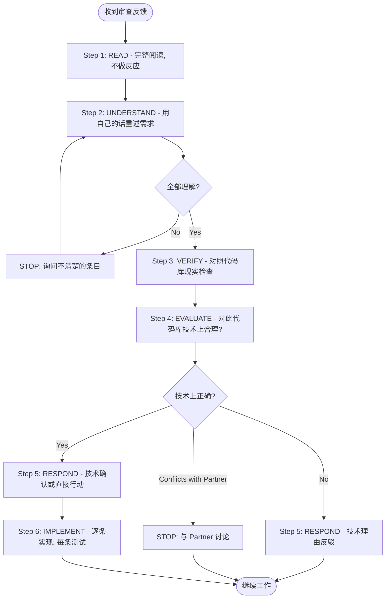
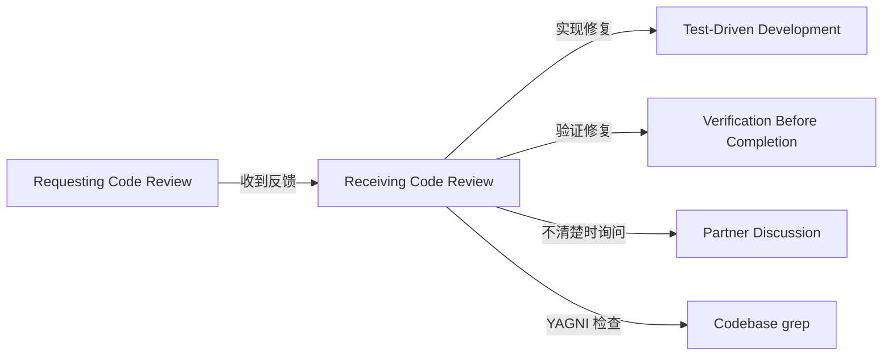

# 第九章 Receiving Code Review — 接收代码审查

> **对应源文件**：`skills/receiving-code-review/SKILL.md`

## 概述

Receiving Code Review（接收代码审查）定义了收到审查反馈后的**技术评估流程**。代码审查要求的是技术评估，不是情感表演。核心原则是：先验证再实现，先询问再假设，Technical Correctness（技术正确性）高于 Social Comfort（社交舒适）。

**核心原则**：Verify before implementing. Ask before assuming. Technical correctness over social comfort.

## 前置阅读

- [第八章 Requesting Code Review](./08-requesting-code-review.md)（请求审查的流程）
- [第七章 Verification Before Completion](./07-verification-before-completion.md)（实现修复后的验证）

---

## 1 定义与定位

| 维度 | 说明 |
|------|------|
| 是什么 | 六步响应模式：READ → UNDERSTAND → VERIFY → EVALUATE → RESPOND → IMPLEMENT |
| 在工作流中的位置 | 收到任何代码审查反馈后**立即启动**，在实现任何建议之前 |
| 解决什么问题 | 对抗 performative agreement（表演式同意）和 blind implementation（盲目实现）——两者都浪费时间并引入错误 |

---

## 2 底层原理

### 为什么 "Technical rigor > social comfort"

1. **Performative agreement 浪费时间并掩盖误解**：说"你完全对！"然后实现一个你不理解的建议，最终结果是实现错误，需要再次审查。不如一开始就说"我不理解第 4 点"
2. **盲目实现引入新 Bug**：不理解建议的完整上下文就实现它，可能破坏你理解但审查者不知道的逻辑
3. **审查者不是绝对权威**：外部审查者可能缺乏完整上下文。他们的建议是**需要评估的建议**，不是必须执行的命令

### 为什么 "actions speak louder than thanks"

- **感谢是空话**：说"谢谢你发现这个！"消耗时间但不产生价值
- **修复是行动**：直接修复并展示改动证明你听到了反馈
- **代码本身是最好的回应**：`"Fixed. [Brief description]"` 比任何感谢都更有意义

### YAGNI Check 原则

当审查者建议"正确实现"某个功能时，先用 `grep` 检查代码库中的实际使用情况：
- 如果**没有使用** → "This endpoint isn't called. Remove it (YAGNI)?"
- 如果**有使用** → 按建议实现

**原则**：你和审查者都对 Partner 负责。如果不需要这个功能，就不要添加。

---

## 3 触发条件

### 必须使用的时机

- 收到任何代码审查反馈时（无论来源）
- 收到 GitHub PR review comment 时
- 收到 code-reviewer Subagent 的反馈时

### 来源区分处理

| 来源 | 信任级别 | 处理方式 |
|------|---------|---------|
| Partner | 高——理解后实现 | 仍需在范围不清时询问；不做 performative agreement；直接行动或技术确认 |
| External Reviewer | 需评估——验证后决定 | 检查技术正确性、是否破坏现有功能、当前实现的原因、跨平台兼容性、审查者是否理解完整上下文 |

---

## 4 执行流程

### 六步响应模式



**六步详解**：

1. **READ**（阅读）：完整阅读所有反馈，不做反应。不要读到第一条就开始实现——条目之间可能有关联
2. **UNDERSTAND**（理解）：用自己的话重述每条反馈的技术需求。如果无法重述 → 你不理解它
3. **VERIFY**（验证）：对照代码库的实际状态检查每条建议。审查者可能基于过时或不完整的理解
4. **EVALUATE**（评估）：这条建议对**这个**代码库技术上合理吗？会破坏现有功能吗？
5. **RESPOND**（回应）：技术确认或技术理由反驳。**永远不要** performative agreement
6. **IMPLEMENT**（实现）：逐条实现，每条实现后单独测试，验证无回归

### 处理不清楚的反馈

```
IF 任何条目不清楚:
  STOP - 不要实现任何东西
  ASK 对不清楚的条目请求澄清

WHY: 条目之间可能有关联。部分理解 = 错误实现。
```

**示例**：
```
Partner: "Fix 1-6"
你理解 1,2,3,6。不清楚 4,5。

❌ WRONG: 先实现 1,2,3,6，之后再问 4,5
✅ RIGHT: "I understand items 1,2,3,6. Need clarification on 4 and 5 before proceeding."
```

**原因**：条目 4 可能影响你对条目 3 的实现方式。部分理解下实现的代码可能需要全部重做。

---

## 5 强制规则

### 规则 1：禁止 Performative Agreement

**禁止说的话**：
- "You're absolutely right!"
- "Great point!" / "Excellent feedback!"
- "Let me implement that now"（在验证之前）
- "Thanks for catching that!" / "Thanks for [anything]"
- 任何感谢表达

**应该说的话**：
- 重述技术需求
- 提出澄清问题
- 用技术理由反驳
- 直接开始工作（行动 > 语言）
- `"Fixed. [Brief description of what changed]"`
- `"Good catch - [specific issue]. Fixed in [location]."`

**原因**：Performative agreement 浪费沟通带宽，掩盖误解。你说"完全对！"但实际不理解时，后续的错误实现会浪费更多时间。如果你真的理解了，直接修复就是最好的证明。

**如果发现自己即将写"Thanks"**：删除它。陈述修复内容。

### 规则 2：不清楚就 STOP and ASK

**原因**：部分理解导致错误实现。条目之间可能有依赖关系——在不理解第 4 条的情况下实现第 3 条，可能导致第 3 条的实现需要全部重做。先全部澄清再动手。

### 规则 3：外部反馈必须先评估再实现

**对外部审查者的五项检查**：
1. 对**此**代码库技术上正确吗？
2. 会破坏现有功能吗？
3. 当前实现有什么原因？
4. 在所有平台/版本上可行吗？
5. 审查者理解完整上下文吗？

**原因**：外部审查者可能缺乏上下文。他们的建议可能对一般情况正确，但对这个特定代码库不正确。盲目实现会引入新问题。

### 规则 4：与 Partner 决策冲突时先讨论

**原因**：外部审查者的建议可能与 Partner 之前的架构决策冲突。你不应该在没有 Partner 参与的情况下改变已有的架构方向。

### 规则 5：YAGNI 检查 "professional" 功能建议

**原因**：审查者可能建议"正确实现"一个实际上没有被使用的功能。添加未使用的功能违反 YAGNI（You Aren't Gonna Need It）——增加维护负担而无实际价值。

### 规则 6：逐条实现，每条测试

**原因**：批量实现无法隔离问题。如果实现了 5 条建议后测试失败，你不知道是哪条导致的。逐条实现 + 逐条测试确保每个改动都是安全的。

---

## 6 Checklist

收到反馈后检查：

- [ ] 完整阅读了所有反馈（不是读到第一条就开始实现）
- [ ] 能用自己的话重述每条反馈的技术需求
- [ ] 对不清楚的条目已请求澄清
- [ ] 对每条建议对照代码库验证了技术正确性
- [ ] 检查了建议是否会破坏现有功能
- [ ] 对外部反馈进行了五项检查
- [ ] 没有使用 performative agreement
- [ ] 按优先级排序：blocking → simple → complex
- [ ] 逐条实现，每条测试
- [ ] 验证了无回归
- [ ] 对不同意的条目用技术理由反驳了

---

## 7 常见违规与对策

### Forbidden Responses 与替代

| 禁止的回应 | 为什么禁止 | 正确的回应 |
|-----------|-----------|-----------|
| "You're absolutely right!" | 掩盖是否真正理解；浪费沟通带宽 | 重述技术需求或直接开始修复 |
| "Great point!" / "Excellent feedback!" | Performative，不传递技术信息 | `"Fixed. [description]"` 或 `"Good catch - [issue]. Fixed in [location]."` |
| "Thanks for catching that!" | 感谢是空话，修复是行动 | 直接展示修复内容 |
| "Let me implement that now" | 在验证之前就承诺实现 | 先验证技术正确性，再开始实现 |

### 违规场景对策表

| 违规场景 | 表现 | 正确做法 |
|---------|------|---------|
| Performative agreement | "You're absolutely right! Let me fix that!" | 重述需求或直接行动 |
| 盲目实现 | 不验证就开始改代码 | 先对照代码库验证建议的正确性 |
| 批量实现不测试 | 一次性实现所有建议，最后才跑测试 | 逐条实现，每条测试 |
| 假设审查者一定对 | "审查者说要改，那就改" | 检查是否会破坏现有功能 |
| 回避反驳 | 不同意但不说出来 | 用技术理由反驳，引用测试/代码 |
| 部分理解就实现 | 理解 4/6 条，先实现这 4 条 | 先澄清所有条目，再开始实现 |
| 无法验证但继续 | "我验证不了但先按建议改" | 说明限制："I can't verify this without [X]" |

### 推回被证明错误时的处理

如果你反驳了但被证明是错的：
```
✅ "You were right - I checked [X] and it does [Y]. Implementing now."
✅ "Verified this and you're correct. My initial understanding was wrong because [reason]. Fixing."

❌ 长篇道歉
❌ 为什么要反驳的辩解
❌ 过度解释
```

事实性地陈述更正，然后继续工作。

---

## 8 与其他技能的关系



| 关联技能 | 关系 | 说明 |
|---------|------|------|
| [Requesting Code Review](./08-requesting-code-review.md) | 上游 | 收到的反馈来自请求审查的流程 |
| [Test-Driven Development](./05-test-driven-development.md) | 实现修复 | 逐条修复时遵循 TDD 流程 |
| [Verification Before Completion](./07-verification-before-completion.md) | 验证修复 | 每条修复后验证无回归 |
| [Systematic Debugging](./06-systematic-debugging.md) | 可能触发 | 如果修复引入了新问题，启动调试流程 |

---

## 9 Prompt 模板

不适用——本技能是响应式流程，不涉及 Subagent 派遣。

---

## 10 代码示例

### Performative Agreement（错误示例）

```
Reviewer: "Remove legacy code"
❌ "You're absolutely right! Let me remove that..."
```

问题：没有验证是否有代码依赖该 legacy code，也没有检查兼容性需求。

### Technical Verification（正确示例）

```
Reviewer: "Remove legacy code"
✅ "Checking... build target is 10.15+, this API needs 13+.
    Need legacy for backward compat.
    Current impl has wrong bundle ID - fix it or drop pre-13 support?"
```

说明：验证了代码库的实际状况，发现审查者的建议在当前上下文中不完全正确，提出了具体的替代方案。

### YAGNI Check（正确示例）

```
Reviewer: "Implement proper metrics tracking with database, date filters, CSV export"
✅ "Grepped codebase - nothing calls this endpoint.
    Remove it (YAGNI)? Or is there usage I'm missing?"
```

说明：用 `grep` 验证了实际使用情况，发现功能未被使用，建议删除而非"正确实现"一个无人使用的功能。

### Unclear Item Handling（正确示例）

```
Partner: "Fix items 1-6"
You understand 1,2,3,6. Unclear on 4,5.

✅ "Understand 1,2,3,6. Need clarification on 4 and 5 before implementing."
```

说明：在不完全理解的情况下暂停，请求澄清所有不清楚的条目，避免部分理解导致错误实现。

### Implementation Order

```
FOR multi-item feedback:
  1. Clarify anything unclear FIRST
  2. Then implement in this order:
     - Blocking issues (breaks, security)
     - Simple fixes (typos, imports)
     - Complex fixes (refactoring, logic)
  3. Test each fix individually
  4. Verify no regressions
```

### GitHub Thread Replies

回复 GitHub PR 内联评论时，在评论线程中回复：

```bash
gh api repos/{owner}/{repo}/pulls/{pr}/comments/{id}/replies
```

不要发顶层 PR 评论。

---

## 11 Reference 文件

本技能没有额外的 Reference 文件。所有规则已在主 SKILL.md 中完整定义。

---

## 12 本章核心结论

1. **Technical rigor > social comfort**——技术正确性永远优先于社交舒适；performative agreement 浪费时间并掩盖误解
2. **六步响应：READ → UNDERSTAND → VERIFY → EVALUATE → RESPOND → IMPLEMENT**——不能跳到最后一步；不理解就不能实现
3. **不清楚就 STOP and ASK**——部分理解 = 错误实现；条目之间可能有依赖，先全部澄清
4. **外部反馈是需要评估的建议，不是命令**——五项检查后才决定是否实现
5. **YAGNI 检查**——审查者建议"正确实现"时，先 `grep` 代码库验证是否有人使用
6. **Actions speak louder than thanks**——删除感谢，陈述修复内容；代码本身是最好的回应
7. **逐条实现，每条测试**——批量实现无法隔离问题，逐条测试确保每个改动安全
