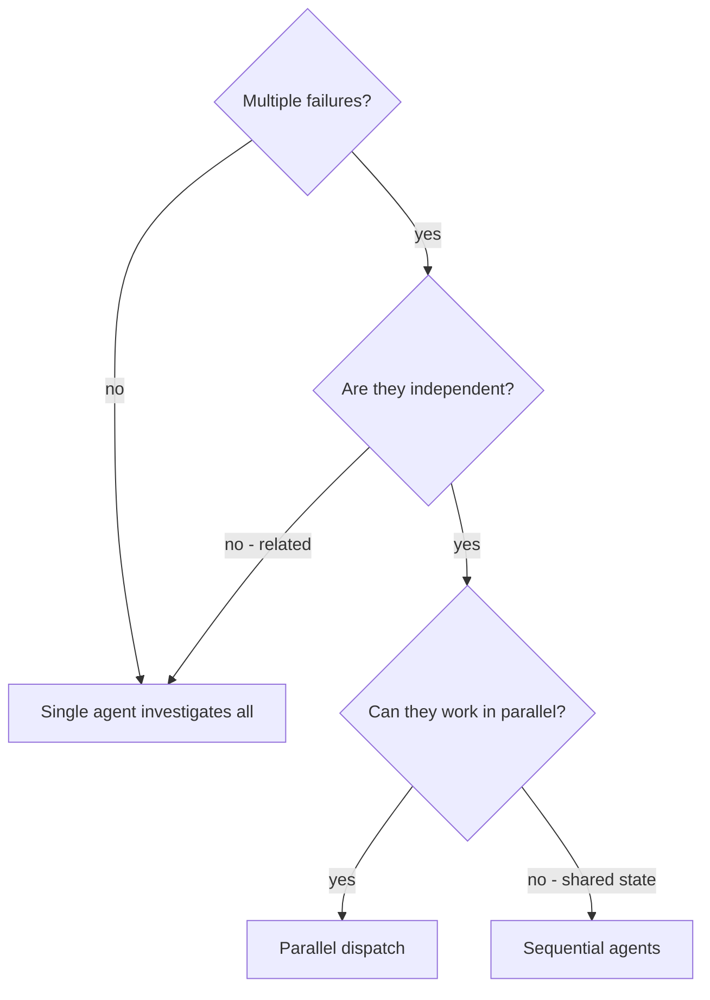
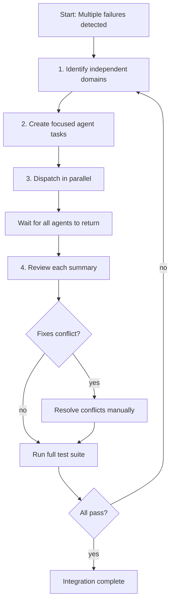

# 第十章 Dispatching Parallel Agents — 并行 Agent 调度

> **对应源文件**：`skills/dispatching-parallel-agents/SKILL.md`

## 概述

Dispatching Parallel Agents（并行 Agent 调度）解决的是"多个独立故障需要同时排查"的场景。核心原则：**每个独立问题域派遣一个 Agent，让它们并发工作**。通过精心构造每个 Agent 的指令与上下文，使其保持专注并成功完成任务——它们不应继承你的会话上下文，而是由你精确构建它们所需的一切。

## 前置阅读

- [第四章 Subagent-Driven Development](./04-subagent-driven-development.md)（Subagent 驱动开发的基本流程）
- [第三章 Executing Plans](./03-executing-plans.md)（执行计划中的任务调度）
- [第六章 Systematic Debugging](./06-systematic-debugging.md)（系统化调试方法论）

---

## 1 定义与定位

| 维度 | 说明 |
|------|------|
| 是什么 | 将多个无关联的任务分别委派给独立的 Subagent（子 Agent），让它们并发执行 |
| 在工作流中的位置 | 出现 2+ 个独立故障/任务时，在调试或实现阶段取代串行处理 |
| 解决什么问题 | 对抗"逐个串行排查"导致的时间浪费——每个调查互相独立，可以同时进行 |

**适用范围**：

- ✅ 3+ 个测试文件因不同根因失败
- ✅ 多个子系统独立损坏
- ✅ 每个问题可以在不依赖其他上下文的情况下理解
- ✅ 各调查之间无共享状态

- ❌ 故障之间有关联（修一个可能修好其他的）
- ❌ 需要理解完整系统状态
- ❌ Agent 之间会互相干扰（编辑同一文件、使用同一资源）

---

## 2 底层原理

### 为什么需要并行调度

当你面对重构后跨 3 个文件的 6 个测试失败时，直觉做法是"从第一个开始逐个排查"。但这存在两个问题：

1. **串行浪费时间**：每个排查都是独立的，结果互不影响——串行意味着总耗时 = 调查1 + 调查2 + 调查3
2. **上下文污染**：排查问题 A 积累的上下文会干扰你思考问题 B，导致 Context Window（上下文窗口）被无关信息占满

并行调度的心理学基础：

- **隔离上下文**：每个 Agent 拥有独立的 Context Window，不会互相污染
- **聚焦范围**：窄范围 = 更少需要追踪的上下文 = 更高成功率
- **时间压缩**：N 个问题在 1 个问题的时间内解决

### 这不是什么

并行调度**不是**"把一个大任务拆成小块并行"——那是 Subagent-Driven Development 的范畴。并行调度特指**多个彼此无关的问题同时排查**。

---

## 3 触发条件

| 条件 | 触发？ | 原因 |
|------|--------|------|
| 3+ 个测试文件因不同根因失败 | ✅ | 每个文件的故障互相独立 |
| 多个子系统独立损坏 | ✅ | 各子系统无共享状态 |
| 每个问题可独立理解 | ✅ | 不需要其他调查的结果 |
| 故障彼此关联 | ❌ | 修一个可能修好其他的——应先整体排查 |
| 需要理解全局状态 | ❌ | 隔离 Agent 看不到全貌 |
| Agent 会编辑相同文件 | ❌ | 并发修改同一文件会冲突 |
| 尚不清楚什么坏了（探索性调试） | ❌ | 先搞清问题域再决定是否并行 |

**决策流程图**：



---

## 4 执行流程



### 步骤详解

#### Step 1：识别独立问题域（Identify Independent Domains）

按"什么坏了"分组：

```
- File A tests: Tool approval flow
- File B tests: Batch completion behavior
- File C tests: Abort functionality
```

每个域是独立的——修复 Tool Approval 不影响 Abort 测试。

**关键判断**：如果你不确定两个失败是否独立，先花 2 分钟检查它们的调用栈和错误信息。如果涉及相同的代码路径，它们可能是关联的。

#### Step 2：构造专注的 Agent 任务（Create Focused Agent Tasks）

每个 Agent 获得：

| 要素 | 说明 |
|------|------|
| Specific scope（具体范围） | 一个测试文件或子系统 |
| Clear goal（明确目标） | "让这些测试通过" |
| Constraints（约束） | "不要修改其他代码" |
| Expected output（预期输出） | "返回你发现的问题和修复的摘要" |

#### Step 3：并行派遣（Dispatch in Parallel）

```typescript
// 在 Claude Code / AI 环境中
Task("Fix agent-tool-abort.test.ts failures")
Task("Fix batch-completion-behavior.test.ts failures")
Task("Fix tool-approval-race-conditions.test.ts failures")
// 三个任务并发执行
```

#### Step 4：审查与集成（Review and Integrate）

当所有 Agent 返回后：

1. **阅读每个摘要** — 理解做了什么更改
2. **检查冲突** — Agent 是否编辑了相同代码？
3. **运行完整测试套件** — 验证所有修复协同工作
4. **抽查** — Agent 可能犯系统性错误

---

## 5 强制规则

1. **每个 Agent 必须有独立的问题域**
   - 原因：共享问题域会导致冲突修改和重复工作

2. **Agent 的 Prompt 必须自包含（Self-Contained）**
   - 原因：Agent 不继承你的会话上下文，缺少信息就会猜测

3. **必须指定明确的输出格式**
   - 原因："Fix it" 不会告诉你发生了什么更改

4. **必须在集成后运行完整测试套件**
   - 原因：独立修复可能在组合时产生意外交互

5. **不确定是否独立时，先不要并行**
   - 原因：关联的失败应先整体排查，否则两个 Agent 可能做出互相矛盾的修改

---

## 6 Checklist

**调度前**：
- [ ] 确认存在 2+ 个独立问题域
- [ ] 确认各域之间无共享状态
- [ ] 确认 Agent 不会编辑相同文件

**构造 Agent Prompt**：
- [ ] 每个 Agent 有具体范围（一个文件/子系统）
- [ ] 每个 Agent 有明确目标
- [ ] 每个 Agent 有约束条件
- [ ] 每个 Agent 要求返回摘要
- [ ] Prompt 包含所有必要上下文（错误消息、测试名称）

**集成后**：
- [ ] 阅读每个 Agent 的返回摘要
- [ ] 检查修改是否冲突
- [ ] 运行完整测试套件
- [ ] 抽查 Agent 的修改质量

---

## 7 常见违规与对策

| 借口 | 为什么错误 | 正确做法 |
|------|-----------|---------|
| "把所有失败都交给一个 Agent 处理更简单" | 单个 Agent 的 Context Window 被多个无关问题占满，效率下降 | 按问题域分配独立 Agent |
| "我不确定它们是否独立，先并行试试" | 关联失败并行处理会导致 Agent 做出矛盾修改 | 先花 2 分钟分析失败原因，确认独立性 |
| "Agent Prompt 不需要太详细，它们会自己搞清楚" | 缺乏上下文的 Agent 会猜测、瞎改代码 | 提供完整的错误消息、测试名称、预期行为 |
| "Agent 返回说修好了，就直接提交" | Agent 可能犯系统性错误或引入新问题 | 必须运行完整测试套件 + 抽查修改 |
| "Fix all the tests"（太笼统的 Prompt） | Agent 迷失方向，不知道从哪里开始 | "Fix agent-tool-abort.test.ts"（具体到文件） |
| "Fix the race condition"（没上下文） | Agent 不知道 Race Condition 在哪里 | 粘贴错误消息和测试名称 |

---

## 8 与其他技能的关系

### 上游技能（提供输入）

| 技能 | 关系 |
|------|------|
| [Systematic Debugging](./06-systematic-debugging.md) | 调试过程中发现多个独立问题，触发并行调度 |
| [Executing Plans](./03-executing-plans.md) | 执行计划中的独立任务可以并行 |

### 下游技能（消费输出）

| 技能 | 关系 |
|------|------|
| [Verification Before Completion](./07-verification-before-completion.md) | 并行修复集成后必须验证 |
| [Test-Driven Development](./05-test-driven-development.md) | Agent 的修复应遵循 TDD 流程 |

### 互补技能

| 技能 | 关系 |
|------|------|
| [Subagent-Driven Development](./04-subagent-driven-development.md) | 提供 Subagent 使用的通用框架；并行调度是其在调试场景下的特化 |

---

## 9 Prompt 模板

### 好的 Agent Prompt 示例

```markdown
Fix the 3 failing tests in src/agents/agent-tool-abort.test.ts:

1. "should abort tool with partial output capture" - expects 'interrupted at' in message
2. "should handle mixed completed and aborted tools" - fast tool aborted instead of completed
3. "should properly track pendingToolCount" - expects 3 results but gets 0

These are timing/race condition issues. Your task:

1. Read the test file and understand what each test verifies
2. Identify root cause - timing issues or actual bugs?
3. Fix by:
   - Replacing arbitrary timeouts with event-based waiting
   - Fixing bugs in abort implementation if found
   - Adjusting test expectations if testing changed behavior

Do NOT just increase timeouts - find the real issue.

Return: Summary of what you found and what you fixed.
```

### Prompt 构造要素对比

| 要素 | ❌ 错误示范 | ✅ 正确示范 |
|------|-----------|-----------|
| 范围 | "Fix all the tests" | "Fix agent-tool-abort.test.ts" |
| 上下文 | "Fix the race condition" | 粘贴错误消息和测试名称 |
| 约束 | 无约束（Agent 可能重构一切） | "Do NOT change production code" |
| 输出 | "Fix it" | "Return summary of root cause and changes" |

---

## 10 代码示例

### 实际场景：重构后 6 个测试失败

**背景**：大规模重构后，3 个文件共 6 个测试失败

**失败清单**：
- `agent-tool-abort.test.ts`：3 个失败（时序问题）
- `batch-completion-behavior.test.ts`：2 个失败（工具未执行）
- `tool-approval-race-conditions.test.ts`：1 个失败（执行计数 = 0）

**决策**：独立问题域——Abort Logic 与 Batch Completion 与 Race Conditions 互不相关

**派遣**：
```
Agent 1 → Fix agent-tool-abort.test.ts
Agent 2 → Fix batch-completion-behavior.test.ts
Agent 3 → Fix tool-approval-race-conditions.test.ts
```

**结果**：
- Agent 1：用 Event-Based Waiting 替换了 Timeout
- Agent 2：修复了事件结构 Bug（threadId 在错误的位置）
- Agent 3：添加了等待异步工具执行完成的逻辑

**集成**：所有修复独立、无冲突、完整测试套件通过

**节省的时间**：3 个问题在 1 个问题的时间内完成（并行 vs 串行）

---

## 本章核心结论

1. **2+ 个独立故障 → 并行调度**；关联故障 → 先整体排查
2. **每个 Agent = 一个问题域**；不要把多个无关问题塞给同一个 Agent
3. **Prompt 必须自包含**：具体范围 + 错误消息 + 约束 + 预期输出
4. **集成后必须运行完整测试套件**——Agent 的修复在隔离环境中验证过，但组合后可能出问题
5. **不确定独立性 → 不要并行**；先花 2 分钟确认，再决定调度策略
