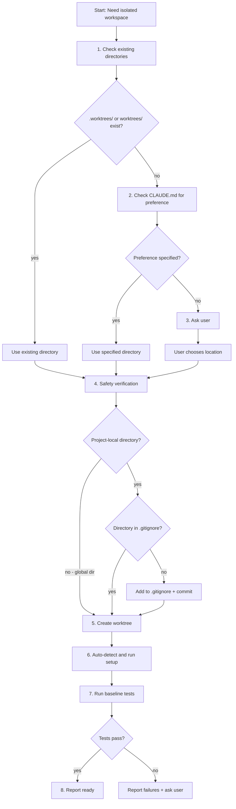

# 第十一章 Using Git Worktrees — 使用 Git Worktree

> **对应源文件**：`skills/using-git-worktrees/SKILL.md`

## 概述

Git Worktree（Git 工作树）允许在同一个仓库中创建多个隔离的工作空间，无需切换分支即可同时处理多个功能。本技能定义了**目录选择优先级、安全验证（.gitignore）、创建步骤和项目设置自动检测**的完整流程，确保每次创建 Worktree 都是系统化、可重复的。

## 前置阅读

- [第四章 Subagent-Driven Development](./04-subagent-driven-development.md)（Subagent 驱动开发，调度前需创建隔离工作空间）
- [第三章 Executing Plans](./03-executing-plans.md)（执行计划前需设置隔离环境）
- [第十二章 Finishing a Development Branch](./12-finishing-a-development-branch.md)（完成开发分支后清理 Worktree）

---

## 1 定义与定位

| 维度 | 说明 |
|------|------|
| 是什么 | 系统化创建 Git Worktree 的标准操作流程，包含目录选择、安全检查、环境设置和基线验证 |
| 在工作流中的位置 | 在开始功能开发或执行计划之前执行，为后续工作提供隔离的代码空间 |
| 解决什么问题 | 防止"凭直觉选目录导致不一致""忘记 .gitignore 导致 Worktree 内容被提交""跳过基线测试导致新旧 Bug 无法区分" |

**核心原则**：Systematic Directory Selection（系统化目录选择）+ Safety Verification（安全验证）= Reliable Isolation（可靠隔离）。

**启动声明**："I'm using the using-git-worktrees skill to set up an isolated workspace."

---

## 2 底层原理

### 为什么需要 Worktree

传统的 `git checkout` 切换分支会改变当前工作目录的所有文件，这意味着：

1. **无法同时在两个分支上工作** — 切换分支后之前的编译结果、node_modules 等可能失效
2. **子 Agent 无法并行** — 多个 Agent 在同一目录操作会互相覆盖
3. **无法对比两个分支的运行时行为** — 只能看一个分支的状态

Worktree 通过在文件系统中创建独立目录，共享 `.git` 目录但拥有独立的工作区，解决了以上所有问题。

### 为什么需要标准化流程

没有标准化流程时，常见的失败模式包括：

- 每次创建 Worktree 选不同位置，项目惯例被打破
- 忘记将 Worktree 目录加入 .gitignore，导致 `git status` 被污染
- 跳过依赖安装，导致测试报错并浪费时间排查
- 跳过基线测试，导致后续修改引入的 Bug 和预存 Bug 混淆

---

## 3 触发条件

| 条件 | 触发？ | 原因 |
|------|--------|------|
| 设计通过审批，即将开始实现 | ✅ | Brainstorming（头脑风暴）Phase 4 要求创建隔离工作区 |
| Subagent-Driven Development 开始前 | ✅ | 子 Agent 需要隔离环境才能安全执行 |
| Executing Plans 开始前 | ✅ | 计划执行需要独立分支 |
| 需要隔离工作空间的任何时候 | ✅ | 通用需求 |
| 在当前分支快速修一个小 Bug | ❌ | 无需隔离，直接在当前分支操作即可 |
| 只是想查看另一个分支的代码 | ❌ | 用 `git show` 或 `git diff` 即可，无需创建 Worktree |

---

## 4 执行流程



### 步骤详解

#### Step 1：检查已有目录（Check Existing Directories）

```bash
# 按优先级检查
ls -d .worktrees 2>/dev/null     # 首选（隐藏目录）
ls -d worktrees 2>/dev/null      # 备选
```

- 如果找到：使用该目录
- 如果两者都存在：`.worktrees` 优先
- 如果都不存在：继续 Step 2

#### Step 2：检查 CLAUDE.md

```bash
grep -i "worktree.*director" CLAUDE.md 2>/dev/null
```

如果 CLAUDE.md 中指定了偏好，直接使用，无需询问。

#### Step 3：询问用户

```
No worktree directory found. Where should I create worktrees?

1. .worktrees/ (project-local, hidden)
2. ~/.config/superpowers/worktrees/<project-name>/ (global location)

Which would you prefer?
```

#### Step 4：Safety Verification（安全验证）

**对 Project-Local 目录（.worktrees 或 worktrees）**：

**必须在创建 Worktree 前验证目录已被忽略**：

```bash
# 检查目录是否被忽略（会检查 local、global 和 system gitignore）
git check-ignore -q .worktrees 2>/dev/null || \
git check-ignore -q worktrees 2>/dev/null
```

**如果未被忽略**——遵循 Jesse 的规则 "Fix broken things immediately"：

1. 将适当的行添加到 `.gitignore`
2. 提交更改
3. 继续创建 Worktree

**为什么这很关键**：防止意外将 Worktree 内容提交到仓库中。

**对 Global 目录（`~/.config/superpowers/worktrees`）**：无需 .gitignore 验证——完全在项目外部。

#### Step 5：创建 Worktree

```bash
# 检测项目名称
project=$(basename "$(git rev-parse --show-toplevel)")

# 根据位置确定完整路径
# Project-local:
path=".worktrees/$BRANCH_NAME"
# Global:
path="~/.config/superpowers/worktrees/$project/$BRANCH_NAME"

# 创建带新分支的 Worktree
git worktree add "$path" -b "$BRANCH_NAME"
cd "$path"
```

#### Step 6：运行项目设置（Auto-Detect Setup）

自动检测并运行适当的设置：

```bash
# Node.js
if [ -f package.json ]; then npm install; fi

# Rust
if [ -f Cargo.toml ]; then cargo build; fi

# Python
if [ -f requirements.txt ]; then pip install -r requirements.txt; fi
if [ -f pyproject.toml ]; then poetry install; fi

# Go
if [ -f go.mod ]; then go mod download; fi
```

#### Step 7：验证干净基线（Verify Clean Baseline）

```bash
# 运行项目对应的测试命令
npm test        # Node.js
cargo test      # Rust
pytest          # Python
go test ./...   # Go
```

- **如果测试失败**：报告失败，询问是否继续
- **如果测试通过**：报告就绪

#### Step 8：报告位置

```
Worktree ready at <full-path>
Tests passing (<N> tests, 0 failures)
Ready to implement <feature-name>
```

---

## 5 强制规则

1. **必须按优先级选择目录：existing > CLAUDE.md > ask**
   - 原因：保持项目惯例一致性，避免每次创建 Worktree 都选不同位置

2. **Project-Local 目录必须验证已被 .gitignore 忽略**
   - 原因：未被忽略的 Worktree 目录会污染 `git status`，甚至可能被意外提交

3. **未被忽略时必须立即修复（添加到 .gitignore 并提交）**
   - 原因：Fix Broken Things Immediately 原则——发现问题不能拖延

4. **必须自动检测并运行项目设置命令**
   - 原因：硬编码设置命令在不同项目上会失败

5. **必须在 Worktree 中运行基线测试**
   - 原因：无法区分新 Bug 和预存问题

6. **测试失败时必须报告并询问——不能静默继续**
   - 原因：在已知失败的基线上开始开发会导致后续混乱

---

## 6 Checklist

**目录选择**：
- [ ] 检查 `.worktrees/` 是否存在
- [ ] 检查 `worktrees/` 是否存在
- [ ] 如果两者都存在，使用 `.worktrees/`
- [ ] 如果都不存在，检查 CLAUDE.md
- [ ] 如果 CLAUDE.md 无偏好，询问用户

**安全验证**：
- [ ] 对 Project-Local 目录执行 `git check-ignore`
- [ ] 如果未被忽略，添加到 `.gitignore` 并提交

**创建与设置**：
- [ ] 检测项目名称
- [ ] 创建 Worktree（`git worktree add`）
- [ ] 进入 Worktree 目录
- [ ] 自动检测项目类型（package.json / Cargo.toml / requirements.txt / go.mod）
- [ ] 运行对应的依赖安装命令
- [ ] 运行基线测试

**完成报告**：
- [ ] 报告 Worktree 完整路径
- [ ] 报告测试结果
- [ ] 如果测试失败，报告失败详情并等待用户指示

---

## 7 常见违规与对策

| 借口 | 为什么错误 | 正确做法 |
|------|-----------|---------|
| "我知道应该放在哪里，不用检查已有目录" | 违反项目惯例，可能与团队其他成员创建位置不一致 | 按优先级：existing > CLAUDE.md > ask |
| "忽略 .gitignore 检查，反正我不会提交那些文件" | Worktree 内容一旦出现在 `git status` 中，就有被意外提交的风险 | 创建前必须 `git check-ignore` |
| "基线测试太慢了，直接跳过吧" | 无法区分新引入的 Bug 和预存问题 | 即使慢也必须跑——知道基线状态至关重要 |
| "测试失败了但看起来和我的功能无关，继续吧" | 你无法确定，且后续调试时会浪费更多时间 | 报告失败，获得明确许可后才能继续 |
| "硬编码 `npm install` 就行了" | 在 Rust / Python / Go 项目上会失败 | 自动检测项目文件来决定设置命令 |

---

## 8 与其他技能的关系

### 上游技能（调用本技能）

| 技能 | 关系 |
|------|------|
| [Brainstorming](./01-brainstorming.md) | Phase 4——设计通过后，**必须**使用本技能创建工作区 |
| [Subagent-Driven Development](./04-subagent-driven-development.md) | 执行任务前**必须**创建隔离环境 |
| [Executing Plans](./03-executing-plans.md) | 执行计划前**必须**创建隔离环境 |

### 下游技能（本技能的输出传递给）

| 技能 | 关系 |
|------|------|
| [Finishing a Development Branch](./12-finishing-a-development-branch.md) | **必须**在工作完成后清理本技能创建的 Worktree |

---

## 9 Prompt 模板

### 标准 Worktree 创建请求

```
I need to start implementing [feature-name].
Please create an isolated worktree for this work.
```

Agent 应自动执行完整的目录选择 → 安全验证 → 创建 → 设置 → 测试流程。

---

## 10 代码示例

### 完整工作流示例

```bash
# Step 1: 检查已有目录
ls -d .worktrees 2>/dev/null     # 存在

# Step 2: 验证已被忽略
git check-ignore -q .worktrees   # 确认已忽略

# Step 3: 创建 Worktree
git worktree add .worktrees/auth -b feature/auth

# Step 4: 进入并安装依赖
cd .worktrees/auth
npm install

# Step 5: 运行基线测试
npm test
# 47 passing, 0 failures

# 报告
echo "Worktree ready at $(pwd)"
echo "Tests passing (47 tests, 0 failures)"
echo "Ready to implement auth feature"
```

### Quick Reference 表

| 场景 | 操作 |
|------|------|
| `.worktrees/` 存在 | 使用它（验证已忽略） |
| `worktrees/` 存在 | 使用它（验证已忽略） |
| 两者都存在 | 使用 `.worktrees/` |
| 都不存在 | 检查 CLAUDE.md → 询问用户 |
| 目录未被忽略 | 添加到 .gitignore + 提交 |
| 基线测试失败 | 报告失败 + 询问用户 |
| 无 package.json / Cargo.toml | 跳过依赖安装 |

---

## 本章核心结论

1. **目录选择有优先级**：existing > CLAUDE.md > ask——不要凭直觉选
2. **Project-Local Worktree 必须验证 .gitignore**——否则 Worktree 内容会污染仓库
3. **自动检测项目类型**来决定 `npm install` / `cargo build` / `pip install`——不要硬编码
4. **基线测试是强制的**——跳过就无法区分新 Bug 和老 Bug
5. **测试失败必须报告**——不能静默继续
6. **本技能与 Finishing a Development Branch 成对使用**——创建 ↔ 清理
