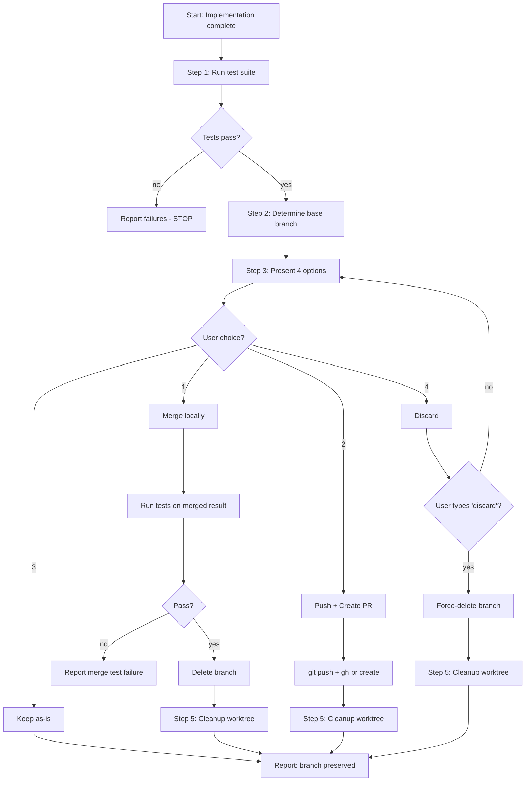

# 第十二章 Finishing a Development Branch — 完成开发分支

> **对应源文件**：`skills/finishing-a-development-branch/SKILL.md`

## 概述

Finishing a Development Branch（完成开发分支）定义了**从实现完成到分支集成或清理**的标准流程。核心原则：**Verify Tests → Present Options → Execute Choice → Clean Up**（验证测试 → 呈现选项 → 执行选择 → 清理）。该技能确保不会合并有 Bug 的代码、不会意外删除工作成果、不会留下废弃的 Worktree。

## 前置阅读

- [第十一章 Using Git Worktrees](./11-using-git-worktrees.md)（本技能清理的 Worktree 由该技能创建）
- [第四章 Subagent-Driven Development](./04-subagent-driven-development.md)（所有任务完成后调用本技能）
- [第三章 Executing Plans](./03-executing-plans.md)（所有批次完成后调用本技能）

---

## 1 定义与定位

| 维度 | 说明 |
|------|------|
| 是什么 | 开发分支完成后的标准化收尾流程：验证、选择集成方式、执行、清理 |
| 在工作流中的位置 | Subagent-Driven Development 的 Step 7、Executing Plans 的 Step 5——在所有实现工作完成后触发 |
| 解决什么问题 | 防止"合并失败代码""开放式问题导致分支悬空""误删工作成果""遗留废弃 Worktree" |

**启动声明**："I'm using the finishing-a-development-branch skill to complete this work."

---

## 2 底层原理

### 为什么需要结构化的完成流程

开发分支完成后，常见的混乱模式：

1. **直接合并，测试未通过** — 合并了有 Bug 的代码到主分支
2. **"你想怎么处理？"** — 开放式问题让用户困惑，不知道有哪些选项
3. **自动清理 Worktree** — 但用户可能还需要它（Push PR 后想继续在该分支修改）
4. **直接删除分支** — 没有确认，意外丢失工作成果
5. **忘记清理** — Worktree 目录残留在文件系统中

### 四选项模型

源文件定义了恰好 **4 个选项**——不多不少：

| 选项 | 适用场景 |
|------|---------|
| 1. Merge locally | 本地合并：小改动、个人项目、不需要 Review |
| 2. Push and create PR | 推送并创建 PR：团队项目、需要 Code Review |
| 3. Keep as-is | 保持现状：还没想好、稍后处理 |
| 4. Discard | 丢弃：实验性工作、不再需要 |

这 4 个选项覆盖了所有可能的结局，且每个选项的后续步骤完全不同。

---

## 3 触发条件

| 条件 | 触发？ | 原因 |
|------|--------|------|
| Subagent-Driven Development 所有任务完成 | ✅ | Step 7 明确要求调用 |
| Executing Plans 所有批次完成 | ✅ | Step 5 明确要求调用 |
| 功能实现完成，所有测试通过 | ✅ | 通用触发条件 |
| 测试仍有失败 | ❌ | 必须先修复测试，不能在失败状态下进入完成流程 |
| 功能实现只完成了一半 | ❌ | 不应在中间状态使用完成流程 |

---

## 4 执行流程



### 步骤详解

#### Step 1：验证测试（Verify Tests）

**在呈现任何选项之前，必须先验证测试通过：**

```bash
# 运行项目的测试套件
npm test / cargo test / pytest / go test ./...
```

**如果测试失败**：

```
Tests failing (<N> failures). Must fix before completing:

[Show failures]

Cannot proceed with merge/PR until tests pass.
```

**停止。不要进入 Step 2。**

**如果测试通过**：继续 Step 2。

#### Step 2：确定基础分支（Determine Base Branch）

```bash
# 尝试常见的 Base Branch
git merge-base HEAD main 2>/dev/null || \
git merge-base HEAD master 2>/dev/null
```

或询问："This branch split from main - is that correct?"

#### Step 3：呈现选项（Present Options）

呈现**恰好 4 个选项**：

```
Implementation complete. What would you like to do?

1. Merge back to <base-branch> locally
2. Push and create a Pull Request
3. Keep the branch as-is (I'll handle it later)
4. Discard this work

Which option?
```

**不要添加解释** — 保持选项简洁。

#### Step 4：执行选择（Execute Choice）

##### Option 1：本地合并（Merge Locally）

```bash
# 切换到 Base Branch
git checkout <base-branch>

# 拉取最新
git pull

# 合并 Feature Branch
git merge <feature-branch>

# 在合并结果上验证测试
<test command>

# 如果测试通过
git branch -d <feature-branch>
```

然后：清理 Worktree（Step 5）

##### Option 2：推送并创建 PR（Push and Create PR）

```bash
# 推送分支
git push -u origin <feature-branch>

# 创建 PR
gh pr create --title "<title>" --body "$(cat <<'EOF'
## Summary
<2-3 bullets of what changed>

## Test Plan
- [ ] <verification steps>
EOF
)"
```

然后：清理 Worktree（Step 5）

##### Option 3：保持现状（Keep As-Is）

报告："Keeping branch `<name>`. Worktree preserved at `<path>`."

**不要清理 Worktree。**

##### Option 4：丢弃（Discard）

**必须先确认**：

```
This will permanently delete:
- Branch <name>
- All commits: <commit-list>
- Worktree at <path>

Type 'discard' to confirm.
```

等待精确确认。

如果确认：

```bash
git checkout <base-branch>
git branch -D <feature-branch>
```

然后：清理 Worktree（Step 5）

#### Step 5：清理 Worktree（Cleanup Worktree）

**仅 Option 1、2、4 需要清理**：

检查是否在 Worktree 中：

```bash
git worktree list | grep $(git branch --show-current)
```

如果是：

```bash
git worktree remove <worktree-path>
```

**Option 3 保留 Worktree。**

---

## 5 强制规则

1. **必须在呈现选项前验证测试通过**
   - 原因：合并失败代码或创建失败的 PR 都是不可接受的

2. **必须呈现恰好 4 个选项——不多不少**
   - 原因：开放式问题（"你想怎么处理？"）会造成决策疲劳

3. **Option 4（Discard）必须要求用户键入 'discard' 确认**
   - 原因：防止意外删除工作成果

4. **Option 1 合并后必须在合并结果上重新运行测试**
   - 原因：分支上通过的测试在合并后可能因冲突而失败

5. **仅 Option 1 和 4 清理 Worktree；Option 2 和 3 保留**
   - 原因：Option 2（PR）用户可能需要继续修改；Option 3 明确要求保留

6. **不要 Force-Push 除非用户明确要求**
   - 原因：Force-Push 可能覆盖他人的工作

---

## 6 Checklist

**Step 1 — 验证测试**：
- [ ] 运行项目测试套件
- [ ] 如果失败，显示失败详情并停止
- [ ] 如果通过，继续

**Step 2 — 确定基础分支**：
- [ ] 尝试 `git merge-base HEAD main`
- [ ] 如果失败，尝试 `git merge-base HEAD master`
- [ ] 如果仍不确定，询问用户

**Step 3 — 呈现选项**：
- [ ] 呈现恰好 4 个选项
- [ ] 不添加额外解释

**Step 4 — 执行选择**：

| 选项 | Merge | Push | Keep Worktree | Cleanup Branch |
|------|-------|------|---------------|----------------|
| 1. Merge locally | ✓ | - | - | ✓ |
| 2. Create PR | - | ✓ | ✓ | - |
| 3. Keep as-is | - | - | ✓ | - |
| 4. Discard | - | - | - | ✓ (force) |

**Step 5 — 清理 Worktree**：
- [ ] Option 1：清理 Worktree
- [ ] Option 2：保留 Worktree（用户可能继续修改）
- [ ] Option 3：保留 Worktree
- [ ] Option 4：清理 Worktree

---

## 7 常见违规与对策

| 借口 | 为什么错误 | 正确做法 |
|------|-----------|---------|
| "测试太慢了，手动验证过了，直接合并吧" | 手动验证不等于自动化测试通过——遗漏回归风险 | 必须等测试通过后才呈现选项 |
| "你想怎么处理这个分支？" | 开放式问题让用户迷茫，浪费交互时间 | 呈现恰好 4 个结构化选项 |
| "PR 创建后自动清理 Worktree" | 用户可能需要继续在该分支上修改 | Option 2 保留 Worktree |
| "确定要丢弃吗？（y/n）" | 简单的 y/n 确认太容易误触 | 要求键入完整的 'discard' |
| "合并完成，删除分支" — 没有重新运行测试 | 合并可能引入冲突导致测试失败 | 合并后必须在结果上重新运行测试 |
| "先合并再跑测试，不通过再回滚" | 已经污染了主分支的 Git 历史 | 先测试，通过后才保留合并 |

---

## 8 与其他技能的关系

### 上游技能（调用本技能）

| 技能 | 关系 |
|------|------|
| [Subagent-Driven Development](./04-subagent-driven-development.md) | Step 7 — 所有任务完成后调用 |
| [Executing Plans](./03-executing-plans.md) | Step 5 — 所有批次完成后调用 |

### 配对技能

| 技能 | 关系 |
|------|------|
| [Using Git Worktrees](./11-using-git-worktrees.md) | 清理该技能创建的 Worktree |

### 下游技能

| 技能 | 关系 |
|------|------|
| [Requesting Code Review](./08-requesting-code-review.md) | Option 2（Create PR）后进入 Code Review 流程 |
| [Verification Before Completion](./07-verification-before-completion.md) | 在呈现选项前隐含要求验证通过 |

---

## 10 代码示例

### 完整工作流示例：Option 2（Push and Create PR）

```bash
# Step 1: 验证测试
npm test
# ✓ 47 passing, 0 failures

# Step 2: 确定基础分支
git merge-base HEAD main
# abc1234 - 确认基础分支为 main

# Step 3: 呈现选项 → 用户选择 2

# Step 4: 推送并创建 PR
git push -u origin feature/auth
gh pr create \
  --title "feat: add authentication system" \
  --body "## Summary
- Added JWT-based authentication
- Added login/logout endpoints
- Added middleware for route protection

## Test Plan
- [ ] Run full test suite
- [ ] Test login flow manually
- [ ] Test token expiration"

# Step 5: Worktree 保留（Option 2 不清理）
echo "PR created. Worktree preserved at .worktrees/auth"
```

### 完整工作流示例：Option 4（Discard）

```bash
# Step 1: 验证测试（即使要丢弃也要先验证状态）
npm test

# Step 3: 呈现选项 → 用户选择 4

# 确认
echo "This will permanently delete:"
echo "- Branch feature/experiment"
echo "- All commits: abc1234, def5678, ghi9012"
echo "- Worktree at .worktrees/experiment"
echo ""
echo "Type 'discard' to confirm."
# 用户键入: discard

# Step 4: 执行
git checkout main
git branch -D feature/experiment

# Step 5: 清理 Worktree
git worktree remove .worktrees/experiment
```

---

## 本章核心结论

1. **测试不通过 = 不呈现选项**——这是最硬的前提条件
2. **恰好 4 个选项**——Merge / PR / Keep / Discard，不多不少
3. **Discard 需要键入 'discard' 确认**——`y/n` 太危险
4. **Merge 后必须重新测试**——分支通过 ≠ 合并后通过
5. **Option 2 和 3 保留 Worktree**——只有 Option 1 和 4 清理
6. **与 Using Git Worktrees 成对使用**——创建 ↔ 完成
