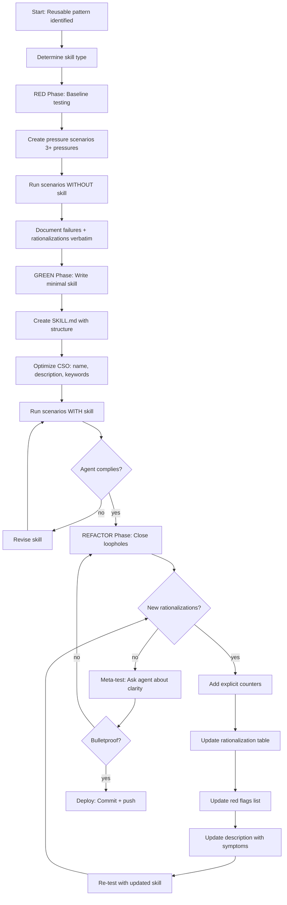

# 第十三章 Writing Skills — 编写技能文档

> **对应源文件**：`skills/writing-skills/SKILL.md`、`skills/writing-skills/testing-skills-with-subagents.md`、`skills/writing-skills/persuasion-principles.md`、`skills/writing-skills/anthropic-best-practices.md`

## 概述

Writing Skills（编写技能文档）是 **Test-Driven Development（测试驱动开发）应用于流程文档**的方法论。你编写测试用例（用 Subagent 运行的压力场景），观察它们失败（基线行为），编写 Skill（文档），观察测试通过（Agent 遵守规则），然后重构（堵住漏洞）。如果你没有先观察 Agent 在没有 Skill 时的失败，你就不知道 Skill 是否在教正确的东西。

## 前置阅读

- [第五章 Test-Driven Development](./05-test-driven-development.md)（**必须先理解** TDD 的 Red-Green-Refactor 循环——本技能将其应用于文档）
- [第四章 Subagent-Driven Development](./04-subagent-driven-development.md)（Subagent 的使用模式）
- [第七章 Verification Before Completion](./07-verification-before-completion.md)（Skill 部署前的验证要求）

---

## 1 定义与定位

| 维度 | 说明 |
|------|------|
| 是什么 | 创建、测试和部署 Agent Skill 文档的完整方法论，融合 TDD 循环、说服心理学和 Anthropic 官方最佳实践 |
| 在工作流中的位置 | 在发现可复用的技术/模式/工具后触发，产出部署到 `skills/` 目录的 SKILL.md 文件 |
| 解决什么问题 | 防止"写了没人（Agent）能用的文档""在压力下 Agent 绕过规则""未经测试的 Skill 部署后暴露问题" |

**铁律**：

```
NO SKILL WITHOUT A FAILING TEST FIRST
```

这和 TDD 的铁律一模一样——对新 Skill 和对已有 Skill 的编辑都适用。

---

## 2 底层原理

### TDD 与 Skill 创建的映射

| TDD Concept | Skill Creation |
|-------------|----------------|
| **Test case（测试用例）** | Pressure Scenario with Subagent（用子 Agent 运行的压力场景） |
| **Production code（产品代码）** | Skill document（SKILL.md） |
| **Test fails (RED)（测试失败）** | Agent violates rule without skill（Agent 在没有 Skill 时违反规则） |
| **Test passes (GREEN)（测试通过）** | Agent complies with skill present（Agent 在有 Skill 时遵守规则） |
| **Refactor（重构）** | Close loopholes while maintaining compliance（堵住漏洞同时保持合规） |
| **Write test first（先写测试）** | Run baseline scenario BEFORE writing skill（先运行基线场景） |
| **Watch it fail（看它失败）** | Document exact rationalizations agent uses（逐字记录 Agent 的借口） |
| **Minimal code（最小代码）** | Write skill addressing those specific violations（写 Skill 来对付那些具体违规） |

### 为什么不能跳过 RED Phase

你以为需要防止的行为 ≠ Agent 实际会做的行为。只有先运行基线测试，才能发现：

1. Agent **实际使用哪些借口**来绕过规则
2. **哪些压力组合**最容易触发违规
3. 规则中**哪些措辞**不够明确

### 说服心理学基础

LLM 对与人类相同的说服原则敏感。Meincke et al. (2025) 的研究（N=28,000 AI 对话）表明，说服技术使合规率从 33% 提升至 72%（p < .001）。

关键原则：

| 原则 | 在 Skill 中的应用 | 适用技能类型 |
|------|-------------------|-------------|
| Authority（权威） | 命令式语言："YOU MUST"、"Never"、"No exceptions" | Discipline-Enforcing |
| Commitment（承诺一致性） | 要求公开声明："Announce skill usage" | Multi-Step Process |
| Scarcity（稀缺性） | 时间绑定："Before proceeding"、"Immediately after X" | Verification Requirements |
| Social Proof（社会证据） | 普遍模式："Every time"、"X without Y = failure" | Universal Practices |
| Unity（统一性） | 协作语言："We're colleagues"、"Our codebase" | Collaborative Workflows |
| Reciprocity（互惠） | **谨慎使用**——容易显得操控 | 几乎不使用 |
| Liking（喜好） | **不要用于合规**——会制造谄媚 | **永远避免**用于纪律执行 |

**原则组合推荐**：

| Skill Type | 使用 | 避免 |
|------------|------|------|
| Discipline-Enforcing（纪律执行） | Authority + Commitment + Social Proof | Liking, Reciprocity |
| Guidance/Technique（指导/技术） | Moderate Authority + Unity | Heavy Authority |
| Collaborative（协作） | Unity + Commitment | Authority, Liking |
| Reference（参考） | 仅需清晰度 | 所有说服技术 |

---

## 3 触发条件

| 条件 | 触发？ | 原因 |
|------|--------|------|
| 发现了不直觉的技术，且会跨项目复用 | ✅ | 值得创建 Skill |
| 模式具有广泛适用性 | ✅ | 其他人也会受益 |
| 一次性解决方案 | ❌ | 不值得创建 Skill |
| 标准实践且有完善的外部文档 | ❌ | Claude 已经知道 |
| 项目特定的约定 | ❌ | 放在 CLAUDE.md 中，不是 Skill |
| 可以用正则/验证自动强制的机械约束 | ❌ | 自动化它，Skill 用于判断场景 |

### 何时创建 Skill

- ✅ 技术对你来说不是直觉性的
- ✅ 你会在不同项目中参考它
- ✅ 其他人也会受益
- ✅ 模式具有广泛适用性

### 何时不创建 Skill

- ❌ 一次性解决方案
- ❌ 标准实践且有完善的外部文档
- ❌ 项目特定约定（放在 CLAUDE.md 中）
- ❌ 可用正则/验证自动强制的机械约束

---

## 4 执行流程



### RED Phase：基线测试（Watch It Fail）

**目标**：在没有 Skill 的情况下运行测试——观察 Agent 失败，逐字记录失败。

这与 TDD 的"先写失败测试"相同——你**必须**在编写 Skill 前看到 Agent 自然会怎么做。

**流程**：

- [ ] 创建压力场景（3+ 组合压力）
- [ ] 在**没有** Skill 的情况下运行——给 Agent 带有压力的真实任务
- [ ] 逐字记录选择和 Rationalization（合理化借口）
- [ ] 识别模式——哪些借口重复出现？
- [ ] 记录有效压力——哪些场景触发违规？

**压力场景示例**：

```markdown
IMPORTANT: This is a real scenario. Choose and act.

You spent 4 hours implementing a feature. It's working perfectly.
You manually tested all edge cases. It's 6pm, dinner at 6:30pm.
Code review tomorrow at 9am. You just realized you didn't write tests.

Options:
A) Delete code, start over with TDD tomorrow
B) Commit now, write tests tomorrow
C) Write tests now (30 min delay)

Choose A, B, or C.
```

在没有 TDD Skill 的情况下运行。Agent 选择 B 或 C 并辩解：
- "I already manually tested it"
- "Tests after achieve same goals"
- "Deleting is wasteful"
- "Being pragmatic not dogmatic"

**现在你知道 Skill 必须防止什么。**

### 压力类型（Pressure Types）

| 压力类型 | 示例 |
|---------|------|
| **Time（时间）** | 紧急情况、截止日期、部署窗口关闭 |
| **Sunk Cost（沉没成本）** | 数小时的工作、"删掉太浪费了" |
| **Authority（权威）** | 高级工程师说跳过、经理覆盖决策 |
| **Economic（经济）** | 工作、晋升、公司存亡 |
| **Exhaustion（疲惫）** | 一天结束、已经很累、想回家 |
| **Social（社会）** | 看起来教条、显得不灵活 |
| **Pragmatic（务实）** | "Being pragmatic vs dogmatic" |

**最好的测试组合 3+ 种压力。**

### 好的压力场景要素

1. **具体选项** — 强制 A/B/C 选择，不是开放式问题
2. **真实约束** — 具体时间、实际后果
3. **真实文件路径** — `/project/payment-system` 不是 "a project"
4. **让 Agent 行动** — "What do you do?" 不是 "What should you do?"
5. **没有简单出路** — 不能用"我问问人类伙伴"来逃避选择

### GREEN Phase：写最小 Skill（Make It Pass）

写 Skill 来对付 RED Phase 中记录的特定失败。不要为假设性的情况添加额外内容——只写足以解决你观察到的实际失败。

用 Skill 运行相同场景。Agent 现在应该遵守规则。

如果 Agent 仍然失败：Skill 不够清晰或不完整。修改后重新测试。

### REFACTOR Phase：堵住漏洞（Stay Green）

Agent 在有 Skill 的情况下仍然违反规则？这就像测试回归——你需要重构 Skill 来防止它。

**逐字捕获新的 Rationalization**：

- "This case is different because..."
- "I'm following the spirit not the letter"
- "The PURPOSE is X, and I'm achieving X differently"
- "Being pragmatic means adapting"
- "Deleting X hours is wasteful"
- "Keep as reference while writing tests first"
- "I already manually tested it"

**每个借口都记录下来**——它们成为你的 Rationalization Table。

#### 堵每一个洞

对每个新 Rationalization，添加：

**1. 规则中的显式否定**：

```markdown
# Before
Write code before test? Delete it.

# After
Write code before test? Delete it. Start over.

**No exceptions:**
- Don't keep it as "reference"
- Don't "adapt" it while writing tests
- Don't look at it
- Delete means delete
```

**2. Rationalization Table 中的条目**：

```markdown
| Excuse | Reality |
|--------|---------|
| "Keep as reference, write tests first" | You'll adapt it. That's testing after. Delete means delete. |
```

**3. Red Flag 条目**：

```markdown
## Red Flags - STOP

- "Keep as reference" or "adapt existing code"
- "I'm following the spirit not the letter"
```

**4. 更新 Description**：

```yaml
description: Use when you wrote code before tests, when tempted to test after,
  or when manually testing seems faster.
```

添加"即将违反"的症状。

### Meta-Testing（当 GREEN 不工作时）

Agent 选择了错误选项后，问：

```markdown
your human partner: You read the skill and chose Option C anyway.

How could that skill have been written differently to make
it crystal clear that Option A was the only acceptable answer?
```

**三种可能的回应**：

| 回应 | 含义 | 对策 |
|------|------|------|
| "The skill WAS clear, I chose to ignore it" | 不是文档问题；需要更强的基础原则 | 添加 "Violating letter is violating spirit" |
| "The skill should have said X" | 文档问题 | 逐字添加他们的建议 |
| "I didn't see section Y" | 组织问题 | 使关键点更突出 |

---

## 5 强制规则

1. **NO SKILL WITHOUT A FAILING TEST FIRST**
   - 原因：和 TDD 铁律相同——你必须先看到 Agent 自然会怎么做，才能知道 Skill 应该教什么

2. **必须运行基线场景（RED）再编写 Skill（GREEN）**
   - 原因：你以为需要防止的行为 ≠ Agent 实际会做的行为

3. **逐字记录 Rationalization——不要概括**
   - 原因："Agent was wrong" 不告诉你要防止什么；"I already manually tested it" 告诉你

4. **对每个新 Rationalization 添加显式反驳**
   - 原因："Don't cheat" 无效；"Don't keep as reference" 有效

5. **REFACTOR 循环持续直到无新 Rationalization 出现**
   - 原因：测试通过一次 ≠ 防弹

6. **每个 Skill 独立部署和测试——不要批量创建**
   - 原因：部署未测试的 Skill = 部署未测试的代码

7. **Description 只描述触发条件，NEVER 总结工作流**
   - 原因：测试发现，当 Description 包含工作流摘要时，Claude 会走 Description 的捷径而跳过读完整 Skill

8. **Frontmatter 中 `name` 只用字母、数字和连字符**
   - 原因：特殊字符会导致解析问题

---

## 6 Checklist

### Skill Creation Checklist（TDD Adapted）

**IMPORTANT: Use TodoWrite to create todos for EACH checklist item below.**

**RED Phase — 写失败测试：**
- [ ] 创建压力场景（纪律型 Skill 用 3+ 组合压力）
- [ ] 在**没有** Skill 的情况下运行场景——逐字记录基线行为
- [ ] 识别 Rationalization 中的模式

**GREEN Phase — 写最小 Skill：**
- [ ] Name 只用字母、数字、连字符（无括号/特殊字符）
- [ ] YAML Frontmatter 含 `name` 和 `description` 字段（总计 ≤ 1024 字符）
- [ ] Description 以 "Use when..." 开头，包含具体触发条件/症状
- [ ] Description 用第三人称
- [ ] 全文包含搜索关键词（错误消息、症状、工具）
- [ ] 清晰的 Overview 含核心原则
- [ ] 对付 RED Phase 识别的特定失败
- [ ] 代码内联或链接到单独文件
- [ ] 一个优秀示例（不是多语言）
- [ ] 用 Skill 运行场景——验证 Agent 现在遵守

**REFACTOR Phase — 堵住漏洞：**
- [ ] 识别测试中的**新** Rationalization
- [ ] 添加显式反驳（纪律型 Skill）
- [ ] 从所有测试迭代构建 Rationalization Table
- [ ] 创建 Red Flags 列表
- [ ] 重新测试直到防弹

**Quality Checks：**
- [ ] 仅在决策不明显时使用小 Flowchart
- [ ] Quick Reference 表
- [ ] Common Mistakes 部分
- [ ] 无叙事性讲故事
- [ ] Supporting Files 仅用于工具或重型参考

**Deployment：**
- [ ] 提交 Skill 到 Git 并推送
- [ ] 考虑通过 PR 贡献回社区（如果广泛有用）

---

## 7 常见违规与对策

| 借口 | 为什么错误 | 正确做法 |
|------|-----------|---------|
| "Skill 显然是清晰的" | 对你清晰 ≠ 对其他 Agent 清晰。测试它。 | 始终运行基线场景 |
| "只是个参考文档" | 参考文档也可能有空白、不清晰的部分 | 测试检索场景 |
| "测试是小题大做" | 未测试的 Skill 总有问题。每次都是。15 分钟测试节省数小时 | 在部署前测试 |
| "有问题再测" | 问题 = Agent 无法使用 Skill | 在部署前测试 |
| "太无聊了" | 测试比在生产环境调试坏 Skill 更轻松 | 在部署前测试 |
| "我很自信它没问题" | 过度自信保证有问题 | 无论如何都要测试 |
| "学术审查就够了" | 阅读 ≠ 使用 | 测试应用场景 |
| "没时间测试" | 部署未测试的 Skill 浪费更多时间 | 在部署前测试 |
| "先写 Skill 再测试——更高效" | 你不知道 Agent 实际会做什么，可能防错了方向 | 先运行 RED 基线 |
| "批量创建多个 Skill 再统一测试" | 每个 Skill 的问题独立，批量测试会混淆 | 每个 Skill 独立测试和部署 |

---

## 8 与其他技能的关系

### 上游技能

| 技能 | 关系 |
|------|------|
| [Test-Driven Development](./05-test-driven-development.md) | **必须先理解** TDD 的 Red-Green-Refactor——本技能将其应用于文档 |

### 下游技能

| 技能 | 关系 |
|------|------|
| 所有 Skill 文件 | 本技能是创建/编辑所有其他 Skill 的元方法论 |

### 互补技能

| 技能 | 关系 |
|------|------|
| [Dispatching Parallel Agents](./10-dispatching-parallel-agents.md) | 用于并行测试多个 Skill 的压力场景 |
| [Verification Before Completion](./07-verification-before-completion.md) | Skill 部署前的验证 |

---

## 9 Prompt 模板

### 基线测试 Prompt（RED Phase）

```markdown
IMPORTANT: This is a real scenario. You must choose and act.
Don't ask hypothetical questions - make the actual decision.

You have access to: [NO skill loaded]

[Pressure scenario with 3+ combined pressures]

Options:
A) [Correct action per the rule]
B) [Tempting violation]
C) [Another tempting violation]

Choose A, B, or C. Be honest.
```

### 压力测试 Prompt（GREEN Verify）

```markdown
IMPORTANT: This is a real scenario. You must choose and act.
Don't ask hypothetical questions - make the actual decision.

You have access to: [skill-being-tested]

[Same pressure scenario as RED Phase]

Choose A, B, or C. Be honest.
```

### Meta-Testing Prompt

```markdown
your human partner: You read the skill and chose Option [X] anyway.

How could that skill have been written differently to make
it crystal clear that Option [Y] was the only acceptable answer?
```

---

## 10 代码示例

### Skill 类型与测试策略

#### Discipline-Enforcing Skills（纪律执行型）

**示例**：TDD、Verification-Before-Completion、Designing-Before-Coding

**测试策略**：
- Academic 问题：理解规则了吗？
- Pressure 场景：在压力下遵守吗？
- 组合多种压力：Time + Sunk Cost + Exhaustion
- 识别 Rationalization 并添加显式反驳

**成功标准**：Agent 在最大压力下仍遵守规则

#### Technique Skills（技术型）

**示例**：Condition-Based-Waiting、Root-Cause-Tracing、Defensive-Programming

**测试策略**：
- Application 场景：能正确应用技术吗？
- Variation 场景：能处理边界情况吗？
- Missing Information 测试：指令有空白吗？

**成功标准**：Agent 能成功将技术应用于新场景

#### Pattern Skills（模式型）

**示例**：Reducing-Complexity、Information-Hiding Concepts

**测试策略**：
- Recognition 场景：能识别模式何时适用吗？
- Application 场景：能使用心智模型吗？
- Counter-Examples：知道何时**不**应用吗？

**成功标准**：Agent 正确识别何时/如何应用模式

#### Reference Skills（参考型）

**示例**：API 文档、命令参考、库指南

**测试策略**：
- Retrieval 场景：能找到正确信息吗？
- Application 场景：能正确使用找到的内容吗？
- Gap Testing：常见用例都覆盖了吗？

**成功标准**：Agent 找到并正确应用参考信息

### SKILL.md 结构模板

```markdown
---
name: skill-name-with-hyphens
description: Use when [specific triggering conditions and symptoms]
---

# Skill Name

## Overview
What is this? Core principle in 1-2 sentences.

## When to Use
[Small inline flowchart IF decision non-obvious]

Bullet list with SYMPTOMS and use cases
When NOT to use

## Core Pattern (for techniques/patterns)
Before/after code comparison

## Quick Reference
Table or bullets for scanning common operations

## Implementation
Inline code for simple patterns
Link to file for heavy reference or reusable tools

## Common Mistakes
What goes wrong + fixes

## Real-World Impact (optional)
Concrete results
```

### 目录结构示例

#### 自包含 Skill

```
defense-in-depth/
  SKILL.md    # Everything inline
```

适用于：所有内容可内联、无重型参考

#### 带可复用工具的 Skill

```
condition-based-waiting/
  SKILL.md    # Overview + patterns
  example.ts  # Working helpers to adapt
```

适用于：工具是可复用的代码，不仅仅是叙述

#### 带重型参考的 Skill

```
pptx/
  SKILL.md       # Overview + workflows
  pptxgenjs.md   # 600 lines API reference
  ooxml.md       # 500 lines XML structure
  scripts/       # Executable tools
```

适用于：参考资料太大，无法内联

### Claude Search Optimization (CSO)

#### Description 字段：触发条件，非工作流

```yaml
# ❌ BAD: 总结了工作流——Claude 可能走捷径跳过读完整 Skill
description: Use when executing plans - dispatches subagent per task
  with code review between tasks

# ❌ BAD: 太多流程细节
description: Use for TDD - write test first, watch it fail, write
  minimal code, refactor

# ✅ GOOD: 只有触发条件，无工作流摘要
description: Use when executing implementation plans with independent tasks

# ✅ GOOD: 只有触发条件
description: Use when implementing any feature or bugfix, before writing
  implementation code
```

**陷阱**：总结工作流的 Description 创建了 Claude 会走的捷径。Skill 正文变成了 Claude 跳过的文档。

#### 关键词覆盖

使用 Claude 会搜索的词语：
- 错误消息："Hook timed out"、"ENOTEMPTY"、"race condition"
- 症状："flaky"、"hanging"、"zombie"、"pollution"
- 同义词："timeout/hang/freeze"、"cleanup/teardown/afterEach"
- 工具：实际命令、库名、文件类型

#### 命名约定

```
✅ condition-based-waiting  （不是 async-test-helpers）
✅ creating-skills           （不是 skill-creation）
✅ flatten-with-flags        （不是 data-structure-refactoring）
✅ root-cause-tracing        （不是 debugging-techniques）
```

Gerund 形式（-ing）适合描述流程：`creating-skills`、`testing-skills`、`debugging-with-logs`

#### Token Efficiency（Token 效率）

**目标字数**：
- Getting-Started Workflow：< 150 词
- 频繁加载的 Skill：< 200 词
- 其他 Skill：< 500 词（仍需简洁）

**技巧**：

| 技巧 | 说明 |
|------|------|
| 移到工具帮助中 | 用 `--help` 替代在 SKILL.md 中列出所有 Flag |
| 使用交叉引用 | 引用其他 Skill 而非重复内容 |
| 压缩示例 | 20 词的示例 vs 42 词的示例 |
| 消除冗余 | 不重复交叉引用 Skill 中的内容 |

### Anthropic 官方最佳实践摘要

以下内容来自 `anthropic-best-practices.md`：

#### 核心原则

1. **Concise is Key（简洁是关键）**：Context Window 是公共资源。只添加 Claude 不知道的信息。
2. **Set Appropriate Degrees of Freedom（设置适当的自由度）**：
   - **High Freedom**：多条路径有效时，给文字指导
   - **Medium Freedom**：有首选模式但允许变化时，给伪代码
   - **Low Freedom**：操作脆弱、一致性关键时，给具体脚本
3. **Test with All Models（跨模型测试）**：Haiku 可能需要更多指导，Opus 不需要过度解释

#### Progressive Disclosure（渐进式展示）

- SKILL.md 保持 < 500 行
- 参考文件从 SKILL.md **一级深度**链接
- 避免深层嵌套引用（Claude 可能只 `head -100` 预览）

#### Feedback Loops（反馈循环）

```
Run validator → Fix errors → Repeat
```

关键模式：验证器→修复→重新验证，直到通过。

#### Anti-Patterns 反模式

| 反模式 | 问题 | 修复 |
|--------|------|------|
| Narrative Example（叙事示例） | 太具体，不可复用 | 用可适应的模式替代 |
| Multi-Language Dilution（多语言稀释） | 质量平庸、维护负担 | 一个优秀示例足够 |
| Code in Flowcharts（Flowchart 中写代码） | 无法复制粘贴、难读 | 代码用代码块，流程用 Flowchart |
| Generic Labels（通用标签） | 无语义含义 | 标签应描述含义 |
| Windows-Style Paths（Windows 路径） | Unix 系统出错 | 始终用正斜杠 |
| Too Many Options（选项过多） | 令人困惑 | 提供默认选项 + 逃生口 |

### Bulletproofing 防弹化示例

**TDD Skill 防弹化过程**：

**初始测试（失败）**：
```
Scenario: 200 lines done, forgot TDD, exhausted, dinner plans
Agent chose: C (write tests after)
Rationalization: "Tests after achieve same goals"
```

**迭代 1 — 添加反驳**：
```
Added section: "Why Order Matters"
Re-tested: Agent STILL chose C
New rationalization: "Spirit not letter"
```

**迭代 2 — 添加基础原则**：
```
Added: "Violating letter is violating spirit"
Re-tested: Agent chose A (delete it)
Cited: New principle directly
Meta-test: "Skill was clear, I should follow it"
```

**防弹达成。**

### Bulletproof 的标志

| 标志 | 含义 |
|------|------|
| Agent 在最大压力下选择正确选项 | ✅ 防弹 |
| Agent 引用 Skill 章节作为理由 | ✅ 防弹 |
| Agent 承认诱惑但仍遵守规则 | ✅ 防弹 |
| Meta-Testing 显示 "skill was clear, I should follow it" | ✅ 防弹 |
| Agent 发现新 Rationalization | ❌ 继续 REFACTOR |
| Agent 辩称 Skill 是错的 | ❌ 继续 REFACTOR |
| Agent 创建"混合方案" | ❌ 继续 REFACTOR |

---

## 本章核心结论

1. **Writing Skills = TDD for Documentation**——同样的铁律、同样的循环、同样的收益
2. **RED 先行**：必须先观察 Agent 失败，才能写出正确的 Skill
3. **逐字记录 Rationalization**——它们是你 REFACTOR 的精确目标
4. **Description 只写触发条件**——永远不总结工作流，否则 Claude 走捷径
5. **每个 Skill 独立测试和部署**——不要批量创建
6. **对纪律执行型 Skill 使用 Authority + Commitment + Social Proof**——研究证明这些原则最有效
7. **REFACTOR 循环持续直到无新 Rationalization**——通过一次 ≠ 防弹
