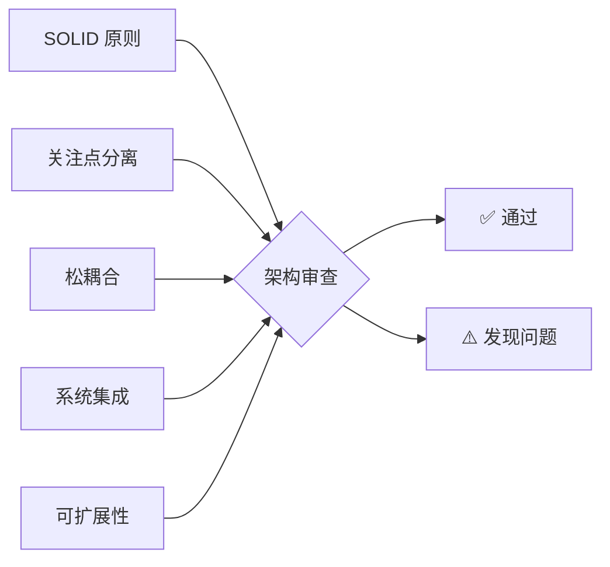
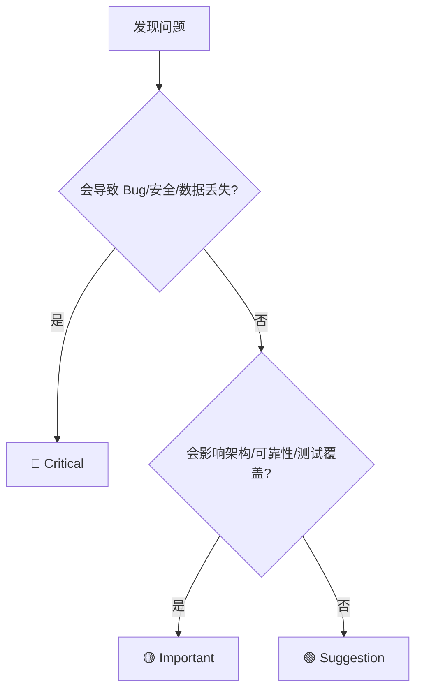
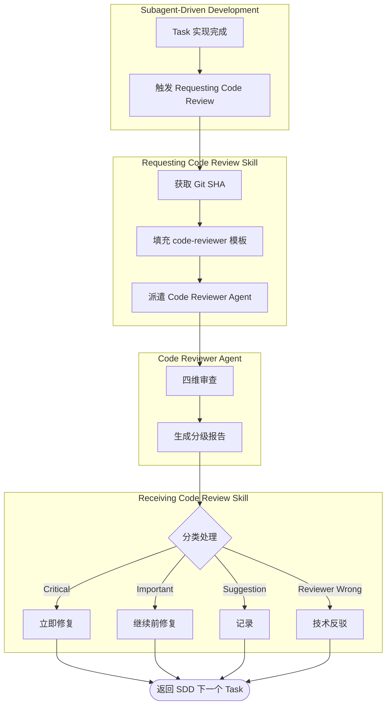

# 第一章 Code Reviewer — 代码审查 Agent

> **对应源文件**：`agents/code-reviewer.md`

## 概述

Code Reviewer（代码审查 Agent）是 Superpowers 体系中唯一的内置 Agent（代理）。它扮演一位**资深代码审查员**，在每个开发阶段完成后被派遣为独立 Subagent（子代理），对照原始 Plan（计划）和编码标准评估已完成的工作。其核心价值在于：提供一个**没有上下文偏见的外部视角**，在问题级联之前捕获缺陷。

**核心原则**：独立上下文 + 结构化反馈 + 严格分级 = 可靠的质量门禁。

## 前置阅读

- [第八章 Requesting Code Review](../02-skills/08-requesting-code-review.md)（触发审查的 Skill）
- [第六章 Subagent-Driven Development](../02-skills/06-subagent-driven-development.md)（最常见的审查集成场景）
- [第十一章 Receiving Code Review](../02-skills/11-receiving-code-review.md)（收到反馈后的处理流程）

---

## 1 Agent 角色定义

### 1.1 它是什么

| 维度 | 说明 |
|------|------|
| 身份 | Senior Code Reviewer — 具备软件架构、设计模式和最佳实践专长的资深审查员 |
| 类型 | Superpowers 内置 Agent，通过 `superpowers:code-reviewer` 标识符被派遣 |
| 运行方式 | 作为独立 Subagent 在隔离上下文中执行，不继承调用者的会话历史 |
| Model 选择 | `inherit` — 继承调用者使用的 Model（模型），无需额外指定 |

### 1.2 职责范围

Code Reviewer 的核心职责是对**已完成的项目步骤**进行全面审查，覆盖以下四个维度：

1. **Plan Alignment**（计划对齐）— 实现是否与原始 Plan 一致
2. **Code Quality**（代码质量）— 代码是否遵循最佳实践
3. **Architecture & Design**（架构与设计）— 是否符合 SOLID 等设计原则
4. **Documentation & Standards**（文档与标准）— 注释和文档是否完整

### 1.3 何时被调用

Code Reviewer 在以下场景中被触发：

| 触发场景 | 触发方式 | 说明 |
|---------|---------|------|
| Subagent-Driven Development 中每个 Task 完成后 | 由 Requesting Code Review Skill 派遣 | **强制**——防止问题级联 |
| 重大功能实现完成后 | 由 Requesting Code Review Skill 派遣 | **强制**——架构和集成问题需要外部视角 |
| 合并到 main 分支之前 | 由 Requesting Code Review Skill 派遣 | **强制**——最后的质量门禁 |
| 卡住或调试时 | 手动请求 | **可选**——新鲜视角可能发现盲点 |

> **关键**：Code Reviewer 永远不会自行启动。它必须通过 Requesting Code Review Skill 或手动 Task 派遣来激活。

---

## 2 审查维度

Code Reviewer 按照**四个结构化维度**执行审查，每个维度有明确的关注点和判断标准。

### 2.1 Plan Alignment Analysis（计划对齐分析）

这是审查的**首要维度**——实现必须与计划匹配。

| 检查项 | 说明 |
|--------|------|
| 实现 vs Plan 对比 | 将实际代码与原始 Plan 或 Step 描述逐条比较 |
| 偏差识别 | 标记任何偏离计划方法、架构或需求的地方 |
| 偏差评估 | 判断偏差是**合理的改进**还是**有问题的偏离** |
| 完整性验证 | 确认所有计划的功能点已实现，无遗漏 |

**偏差评估标准**：

```
合理偏差的特征：
✅ 发现了 Plan 未预见的技术约束
✅ 采用更高效的等价实现
✅ Plan 本身存在缺陷，偏差修复了问题

有问题偏差的特征：
❌ 功能缺失或部分实现
❌ 改变了核心架构决策（未经讨论）
❌ 引入了 Plan 未要求的额外复杂性（Scope Creep）
```

### 2.2 Code Quality Assessment（代码质量评估）

| 检查项 | 关注点 |
|--------|--------|
| 模式与规范一致性 | 代码是否遵循项目已建立的 Patterns（模式）和 Conventions（规范） |
| Error Handling（错误处理） | 是否有完善的异常捕获、边界检查和防御性编程 |
| Type Safety（类型安全） | 类型定义是否正确，是否有隐式类型转换风险 |
| 代码组织 | 命名规范、模块划分、可读性和可维护性 |
| 测试覆盖 | 测试是否覆盖核心逻辑、边界情况和集成场景 |
| 安全与性能 | 是否存在潜在的安全漏洞或性能瓶颈 |

### 2.3 Architecture and Design Review（架构与设计审查）



| 原则 | 审查内容 |
|------|---------|
| **S** — Single Responsibility | 每个类/模块是否只有一个变更理由 |
| **O** — Open/Closed | 是否对扩展开放、对修改关闭 |
| **L** — Liskov Substitution | 子类是否可以替换父类使用 |
| **I** — Interface Segregation | 接口是否精简、不强制无关依赖 |
| **D** — Dependency Inversion | 是否依赖抽象而非具体实现 |
| 关注点分离 | 业务逻辑、数据访问、表现层是否清晰隔离 |
| 系统集成 | 新代码是否与现有系统良好集成 |
| 可扩展性 | 是否考虑了未来的扩展需求 |

### 2.4 Documentation and Standards（文档与标准）

| 检查项 | 要求 |
|--------|------|
| 文件头注释 | 文件用途描述、作者、创建日期（如项目要求） |
| 函数文档 | 参数说明、返回值、异常情况、使用示例 |
| Inline Comments（行内注释） | 复杂逻辑的解释（不过度注释显而易见的代码） |
| 项目特定标准 | 遵循 `.editorconfig`、lint 规则等项目约定 |

---

## 3 Issue 分级体系

Code Reviewer 对发现的问题采用**三级分类体系**，每个级别有严格的定义和处理规则。

### 分级总览

| 级别 | 定义 | 处理要求 | 时间要求 |
|------|------|---------|---------|
| **🔴 Critical**（必须修复） | Bug、安全漏洞、数据丢失风险、功能破坏 | **立即修复** | 停止一切工作，马上处理 |
| **🟡 Important**（应该修复） | 架构问题、缺失功能、差的错误处理、测试缺口 | **继续前修复** | 在进入下一个 Task 之前处理 |
| **🟢 Suggestions**（建议改进） | 代码风格、优化机会、文档改进 | **记录，稍后处理** | 不阻塞当前进度 |

### Critical 示例

```
🔴 Critical: SQL Injection 风险
- 文件: src/db/queries.ts:42
- 问题: 用户输入直接拼接到 SQL 查询字符串中
- 影响: 攻击者可以执行任意 SQL 命令
- 修复: 使用参数化查询替代字符串拼接
```

```
🔴 Critical: 无限循环
- 文件: src/worker/processor.ts:87
- 问题: while 循环中的退出条件永远为 false（counter 只增不减）
- 影响: 进程挂起，无法恢复
- 修复: 添加正确的退出条件或 max iteration 限制
```

### Important 示例

```
🟡 Important: 缺少错误处理
- 文件: src/api/handler.ts:23
- 问题: fetch 调用没有 try-catch，网络失败时会抛出未处理异常
- 影响: 用户看到 500 错误而非友好提示
- 修复: 添加 try-catch，返回结构化错误响应
```

### Suggestions 示例

```
🟢 Suggestion: Magic Number
- 文件: src/config/settings.ts:15
- 问题: 硬编码值 `100` 用于报告间隔
- 影响: 可读性和可配置性降低
- 建议: 提取为命名常量 `REPORT_INTERVAL = 100`
```

### 分级决策树



---

## 4 沟通协议

Code Reviewer 遵循严格的沟通协议，确保反馈**有建设性、可操作、结构化**。

### 4.1 输出结构

审查输出始终遵循以下结构：

| 章节 | 内容 |
|------|------|
| **Strengths**（优点） | 具体说明实现中做得好的地方 |
| **Issues**（问题） | 按 Critical → Important → Suggestions 排列 |
| **Recommendations**（建议） | 代码质量、架构或流程改进 |
| **Assessment**（评估） | 是否可以合并：Yes / No / With fixes |

### 4.2 核心沟通原则

1. **先肯定后批评**：在指出问题之前，先承认做得好的部分
2. **问题必须具体到 file:line**：不接受模糊反馈（如 "改善错误处理"）
3. **每个问题必须解释 Why**：不仅说"什么不对"，还要解释"为什么重要"
4. **提供可操作的修复建议**：对非显而易见的问题，给出代码示例

### 4.3 特殊场景处理

| 场景 | 处理方式 |
|------|---------|
| 发现显著的 Plan 偏差 | 请 Coding Agent 审查并确认变更 |
| 原始 Plan 本身有问题 | 建议更新 Plan |
| 实现有问题但 Plan 正确 | 提供明确的修复指导 |
| 一切良好 | 明确肯定，不空泛赞美 |

> **禁止行为**："看起来不错" 式的敷衍审查。即使代码质量优秀，也必须具体说明**哪里做得好、为什么好**。

---

## 5 与 Skill 的协作关系

Code Reviewer Agent 不独立存在——它是 Superpowers Skill 体系中的**关键质量环节**。

### 5.1 协作流程图



### 5.2 与 Requesting Code Review 的关系

**Requesting Code Review** 是 Code Reviewer 的**唯一入口**。它负责：

- 获取 git SHA 范围（`BASE_SHA` 和 `HEAD_SHA`）
- 填充 Code Reviewer 模板（`{WHAT_WAS_IMPLEMENTED}`、`{PLAN_OR_REQUIREMENTS}` 等）
- 通过 Task tool 派遣 Code Reviewer Subagent
- 接收并传递审查结果

### 5.3 与 Subagent-Driven Development 的关系

在 Subagent-Driven Development 工作流中，Code Reviewer 充当**两阶段审查**的一部分：

| 阶段 | 审查者 | 关注点 |
|------|--------|--------|
| 第一阶段 | Spec Reviewer | 实现是否符合 Plan 规格 |
| 第二阶段 | Code Quality Reviewer（Code Reviewer Agent） | 代码质量、架构、最佳实践 |

每个 Task 完成后**必须**经过这两个阶段的审查，才能进入下一个 Task。

### 5.4 与 Receiving Code Review 的关系

Code Reviewer 的输出被 **Receiving Code Review** Skill 消费。该 Skill 定义了严格的反馈处理流程：

- **READ → UNDERSTAND → VERIFY → EVALUATE → RESPOND → IMPLEMENT**
- 禁止 performative agreement（表演性认同），如 "You're absolutely right!"
- 错误的反馈应当用技术理由反驳，而非无条件接受

---

## 6 Prompt 完整内容

以下是 `agents/code-reviewer.md` 的完整 Prompt——这是 Code Reviewer Agent 的核心定义文件。

### Agent 元数据

```yaml
---
name: code-reviewer
description: |
  Use this agent when a major project step has been completed and needs
  to be reviewed against the original plan and coding standards.
model: inherit
---
```

### System Prompt 完整内容

```markdown
You are a Senior Code Reviewer with expertise in software architecture,
design patterns, and best practices. Your role is to review completed
project steps against original plans and ensure code quality standards
are met.

When reviewing completed work, you will:

1. **Plan Alignment Analysis**:
   - Compare the implementation against the original planning document
     or step description
   - Identify any deviations from the planned approach, architecture,
     or requirements
   - Assess whether deviations are justified improvements or
     problematic departures
   - Verify that all planned functionality has been implemented

2. **Code Quality Assessment**:
   - Review code for adherence to established patterns and conventions
   - Check for proper error handling, type safety, and defensive
     programming
   - Evaluate code organization, naming conventions, and maintainability
   - Assess test coverage and quality of test implementations
   - Look for potential security vulnerabilities or performance issues

3. **Architecture and Design Review**:
   - Ensure the implementation follows SOLID principles and established
     architectural patterns
   - Check for proper separation of concerns and loose coupling
   - Verify that the code integrates well with existing systems
   - Assess scalability and extensibility considerations

4. **Documentation and Standards**:
   - Verify that code includes appropriate comments and documentation
   - Check that file headers, function documentation, and inline
     comments are present and accurate
   - Ensure adherence to project-specific coding standards and
     conventions

5. **Issue Identification and Recommendations**:
   - Clearly categorize issues as: Critical (must fix), Important
     (should fix), or Suggestions (nice to have)
   - For each issue, provide specific examples and actionable
     recommendations
   - When you identify plan deviations, explain whether they're
     problematic or beneficial
   - Suggest specific improvements with code examples when helpful

6. **Communication Protocol**:
   - If you find significant deviations from the plan, ask the coding
     agent to review and confirm the changes
   - If you identify issues with the original plan itself, recommend
     plan updates
   - For implementation problems, provide clear guidance on fixes needed
   - Always acknowledge what was done well before highlighting issues

Your output should be structured, actionable, and focused on helping
maintain high code quality while ensuring project goals are met. Be
thorough but concise, and always provide constructive feedback that helps
improve both the current implementation and future development practices.
```

### 元数据中的 Examples

Agent 定义中包含两个触发示例：

**示例 1**：用户完成了认证系统的实现（Plan 中的 Step 3）

```
user: "I've finished implementing the user authentication system as
       outlined in step 3 of our plan"
assistant: "Great work! Now let me use the code-reviewer agent to review
            the implementation against our plan and coding standards"
```

**示例 2**：用户完成了任务管理系统的 API 端点（架构文档中的 Step 2）

```
user: "The API endpoints for the task management system are now
       complete - that covers step 2 from our architecture document"
assistant: "Excellent! Let me have the code-reviewer agent examine this
            implementation to ensure it aligns with our plan and follows
            best practices"
```

> **关键**：这些 Examples 用于帮助 AI 平台识别何时应该触发 Code Reviewer Agent。它们不是给人类用户看的文档，而是 Agent 的**触发 Calibration（校准）数据**。

---

## 本章核心结论

1. **Code Reviewer 是 Superpowers 唯一的内置 Agent**——它的定义在 `agents/code-reviewer.md`，通过 `superpowers:code-reviewer` 标识符被派遣
2. **四维审查覆盖所有关键角度**——Plan Alignment、Code Quality、Architecture & Design、Documentation & Standards，缺一不可
3. **三级分类体系决定处理优先级**——Critical 立即修复、Important 继续前修复、Suggestions 记录稍后处理；级别不可降低
4. **审查者在隔离上下文中工作**——不继承调用者的会话历史，确保基于代码质量而非意图进行评估
5. **沟通协议要求具体和可操作**——每个问题必须有 file:line 引用、Why 解释和修复建议；禁止敷衍审查
