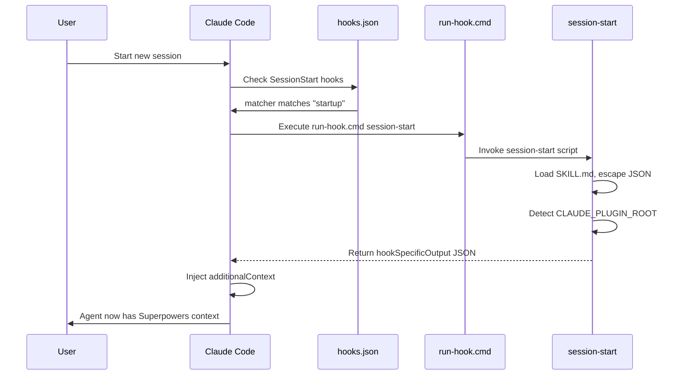

# 第二章 Claude Code 集成

> **对应源文件**：`.claude-plugin/plugin.json`、`.claude-plugin/marketplace.json`、`hooks/hooks.json`

## 概述

Claude Code 是 Superpowers 的首要目标平台，也是功能最完整的集成。它通过 Plugin System（插件系统）和 Marketplace（市场）实现一键安装，通过 Hooks 实现自动上下文注入，通过原生 Skill Tool（技能工具）实现按需加载。本章详细解析每个配置文件及其集成机制。

---

## 1 安装方式

Claude Code 提供三种安装 Superpowers 的方式，按推荐程度排序：

### 1.1 Official Marketplace（官方市场）

最简单的安装方式，直接从 Anthropic 官方插件市场安装：

```bash
/plugin install superpowers@claude-plugins-official
```

官方市场链接：https://claude.com/plugins/superpowers

### 1.2 Community Marketplace（社区市场）

通过 Superpowers 自建的社区市场安装，可能包含更新的开发版本：

```bash
# 第一步：注册市场源
/plugin marketplace add obra/superpowers-marketplace

# 第二步：安装插件
/plugin install superpowers@superpowers-marketplace
```

### 1.3 Manual（手动安装）

适用于本地开发或需要自定义修改的场景：

1. Clone 仓库到本地
2. 使用 `/plugin install <本地路径>` 安装

### 1.4 更新

无论哪种安装方式，更新命令统一为：

```bash
/plugin update superpowers
```

Skills 随插件更新自动同步。

---

## 2 plugin.json 解析

文件路径：`.claude-plugin/plugin.json`

```json
{
  "name": "superpowers",
  "description": "Core skills library for Claude Code: TDD, debugging, collaboration patterns, and proven techniques",
  "version": "5.0.6",
  "author": {
    "name": "Jesse Vincent",
    "email": "jesse@fsck.com"
  },
  "homepage": "https://github.com/obra/superpowers",
  "repository": "https://github.com/obra/superpowers",
  "license": "MIT",
  "keywords": [
    "skills",
    "tdd",
    "debugging",
    "collaboration",
    "best-practices",
    "workflows"
  ]
}
```

### 字段详解

| 字段 | 类型 | 必填 | 说明 |
|------|------|------|------|
| `name` | String | 是 | 插件唯一标识符，用于 `/plugin install` 命令 |
| `description` | String | 是 | 插件描述，在市场列表和插件信息中展示 |
| `version` | String | 是 | 语义化版本号，当前为 `5.0.6` |
| `author` | Object | 否 | 作者信息，包含 `name` 和 `email` |
| `homepage` | String | 否 | 项目主页 URL |
| `repository` | String | 否 | 源码仓库 URL |
| `license` | String | 否 | 许可证类型 |
| `keywords` | Array | 否 | 关键词列表，用于市场搜索 |

**注意**：Claude Code 的 `plugin.json` 不包含 `skills`、`agents`、`commands`、`hooks` 等路径字段。Claude Code 按照约定目录结构自动发现这些资源：

- Skills 目录：`skills/`
- Hooks 配置：`hooks/hooks.json`
- Agents 目录：`agents/`
- Commands 目录：`commands/`

---

## 3 Marketplace 发布

文件路径：`.claude-plugin/marketplace.json`

```json
{
  "name": "superpowers-dev",
  "description": "Development marketplace for Superpowers core skills library",
  "owner": {
    "name": "Jesse Vincent",
    "email": "jesse@fsck.com"
  },
  "plugins": [
    {
      "name": "superpowers",
      "description": "Core skills library for Claude Code: TDD, debugging, collaboration patterns, and proven techniques",
      "version": "5.0.6",
      "source": "./",
      "author": {
        "name": "Jesse Vincent",
        "email": "jesse@fsck.com"
      }
    }
  ]
}
```

### 字段详解

| 字段 | 说明 |
|------|------|
| `name` | 市场名称。这里是 `superpowers-dev`，表示开发市场 |
| `description` | 市场描述 |
| `owner` | 市场所有者信息 |
| `plugins` | 插件数组，一个市场可以托管多个插件 |
| `plugins[].source` | 插件源路径。`"./"` 表示当前仓库根目录即为插件 |

### 发布流程

1. 仓库中维护 `marketplace.json`
2. 用户通过 `/plugin marketplace add <owner>/<repo>` 注册市场
3. Claude Code 从 GitHub 拉取 `marketplace.json`，解析其中的插件列表
4. 用户通过 `/plugin install <name>@<marketplace>` 安装指定插件

---

## 4 Hook 配置

Claude Code 的 Hook 配置位于 `hooks/hooks.json`：

```json
{
  "hooks": {
    "SessionStart": [
      {
        "matcher": "startup|clear|compact",
        "hooks": [
          {
            "type": "command",
            "command": "\"${CLAUDE_PLUGIN_ROOT}/hooks/run-hook.cmd\" session-start",
            "async": false
          }
        ]
      }
    ]
  }
}
```

### 执行流程



### Claude Code 特有行为

- **`${CLAUDE_PLUGIN_ROOT}`**：Claude Code 自动设置此环境变量，指向插件安装目录
- **`hookSpecificOutput`**：Claude Code 期望的输出格式，包含 `hookEventName` 和 `additionalContext`
- **同步执行**：`async: false` 确保 Agent 在回复前获得完整上下文

---

## 5 Skill 发现机制

Claude Code 的 Skill 发现分为两个层次：

### 5.1 Bootstrap Skill（引导技能）

通过 SessionStart Hook 注入 `using-superpowers` Skill 的**完整内容**。这个 Skill 告诉 Agent：

1. 你拥有 Superpowers
2. 如何使用 `Skill` Tool 加载其他技能
3. 何时应该使用技能（即使只有 1% 的可能性也要检查）
4. Skill 优先级规则

### 5.2 按需加载

Agent 在对话过程中使用 Claude Code 原生的 `Skill` Tool 按需加载其他 Skill：

```
Agent 调用 → Skill tool("brainstorming") → 读取 skills/brainstorming/SKILL.md → 内容注入对话
```

### 5.3 目录约定

Claude Code 扫描插件目录下的 `skills/` 文件夹，每个子目录中的 `SKILL.md` 即为一个 Skill：

```
skills/
├── using-superpowers/
│   └── SKILL.md          # Bootstrap skill (Hook 注入)
├── brainstorming/
│   └── SKILL.md          # 按需加载
├── test-driven-development/
│   └── SKILL.md          # 按需加载
├── systematic-debugging/
│   └── SKILL.md          # 按需加载
└── ...
```

---

## 6 调试与验证

### 6.1 验证安装

```bash
# 查看已安装的插件
/plugin list

# 查看插件详情
/plugin info superpowers
```

### 6.2 验证 Hook 执行

启动一个新会话后，Agent 的第一条回复应包含 Superpowers 相关的行为特征：

- Agent 会主动检查是否有适用的 Skill
- Agent 会使用 `Skill` Tool 加载技能
- 如果存在旧版目录 `~/.config/superpowers/skills`，Agent 会在第一条回复中发出迁移警告

### 6.3 手动测试 Hook 脚本

```bash
# 模拟 Claude Code 环境
export CLAUDE_PLUGIN_ROOT="/path/to/superpowers"
bash hooks/session-start
```

预期输出应为包含 `hookSpecificOutput` 的 JSON。

### 6.4 常见问题

| 问题 | 排查步骤 |
|------|---------|
| 插件安装后无反应 | 检查 `/plugin list` 是否显示 superpowers |
| Agent 不使用 Skill | 检查新会话是否触发 Hook（观察 Agent 是否提到 "superpowers"） |
| Windows 上 Hook 失败 | 确认已安装 Git for Windows，检查 `run-hook.cmd` 能否找到 `bash.exe` |
| 上下文被注入两次 | 确认 `session-start` 脚本的平台检测逻辑是否正确 |

### 6.5 日志检查

Claude Code 提供 Hook 执行日志，可通过开发者工具或日志文件查看 Hook 的 stdout/stderr 输出。

---

## 本章核心结论

1. **Claude Code 是 Superpowers 功能最完整的平台**——支持 Marketplace 安装、Hook 自动注入、原生 Skill Tool
2. **`plugin.json` 使用约定优于配置**——不需要显式声明 skills/hooks 路径
3. **`marketplace.json` 支持自建市场**——一个仓库可以同时作为插件和市场
4. **Hook 同步执行确保上下文就绪**——`async: false` 是关键配置
5. **Skill 发现是两层结构**——Bootstrap（Hook 注入） + 按需加载（Skill Tool）
