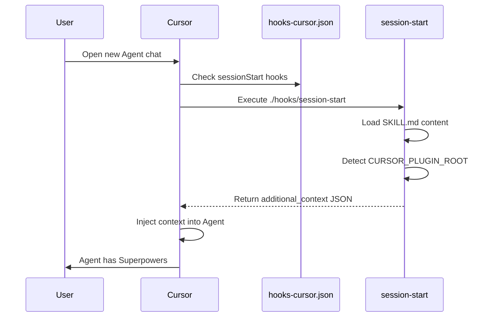

# 第三章 Cursor 集成

> **对应源文件**：`.cursor-plugin/plugin.json`、`hooks/hooks-cursor.json`

## 概述

Cursor 是 Superpowers 支持的第二大平台。与 Claude Code 不同，Cursor 拥有自己的 Plugin System（插件系统）格式——它使用 camelCase 事件名、要求显式声明资源路径、并提供 `displayName` 等 UI 相关字段。本章详细对比 Cursor 与 Claude Code 的集成差异，并解析每个配置字段。

---

## 1 安装方式

### 1.1 Plugin Marketplace（插件市场）

在 Cursor 的 Agent Chat 中直接安装：

```text
/add-plugin superpowers
```

或者在 Cursor 的插件市场界面中搜索 "superpowers" 进行安装。

### 1.2 手动安装

对于需要本地开发或自定义的场景：

1. Clone 仓库到本地
2. 在 Cursor 中通过插件管理面板添加本地插件路径

### 1.3 更新

通过 Cursor 插件管理界面更新，或重新安装以获取最新版本。

---

## 2 plugin.json 解析

文件路径：`.cursor-plugin/plugin.json`

```json
{
  "name": "superpowers",
  "displayName": "Superpowers",
  "description": "Core skills library: TDD, debugging, collaboration patterns, and proven techniques",
  "version": "5.0.6",
  "author": {
    "name": "Jesse Vincent",
    "email": "jesse@fsck.com"
  },
  "homepage": "https://github.com/obra/superpowers",
  "repository": "https://github.com/obra/superpowers",
  "license": "MIT",
  "keywords": [
    "skills",
    "tdd",
    "debugging",
    "collaboration",
    "best-practices",
    "workflows"
  ],
  "skills": "./skills/",
  "agents": "./agents/",
  "commands": "./commands/",
  "hooks": "./hooks/hooks-cursor.json"
}
```

### 字段详解

| 字段 | 类型 | Claude Code | Cursor | 说明 |
|------|------|-------------|--------|------|
| `name` | String | ✅ | ✅ | 插件唯一标识符 |
| `displayName` | String | ❌ | ✅ | UI 展示名称，允许空格和大写 |
| `description` | String | ✅ | ✅ | 插件描述 |
| `version` | String | ✅ | ✅ | 语义化版本号 |
| `author` | Object | ✅ | ✅ | 作者信息 |
| `homepage` | String | ✅ | ✅ | 项目主页 |
| `repository` | String | ✅ | ✅ | 源码仓库 |
| `license` | String | ✅ | ✅ | 许可证 |
| `keywords` | Array | ✅ | ✅ | 搜索关键词 |
| `skills` | String | ❌ | ✅ | Skills 目录的相对路径 |
| `agents` | String | ❌ | ✅ | Agents 目录的相对路径 |
| `commands` | String | ❌ | ✅ | Commands 目录的相对路径 |
| `hooks` | String | ❌ | ✅ | Hooks 配置文件的相对路径 |

### 关键差异

**Cursor 要求显式声明资源路径**，而 Claude Code 使用约定目录自动发现。这意味着：

- 如果重命名 `skills/` 目录，Cursor 需要更新 `plugin.json`，Claude Code 则无法工作
- `hooks` 字段指向 `./hooks/hooks-cursor.json` 而非 `./hooks/hooks.json`——两个平台使用不同的 Hook 配置文件
- `displayName` 是 Cursor 特有字段，允许在 UI 中显示更友好的名称（如 "Superpowers" 而非 "superpowers"）

---

## 3 Hook 配置

文件路径：`hooks/hooks-cursor.json`

```json
{
  "version": 1,
  "hooks": {
    "sessionStart": [
      {
        "command": "./hooks/session-start"
      }
    ]
  }
}
```

### 与 Claude Code hooks.json 的对比

| 特性 | Claude Code (`hooks.json`) | Cursor (`hooks-cursor.json`) |
|------|---------------------------|------------------------------|
| `version` 字段 | 无 | 必填，当前值 `1` |
| 事件命名 | `SessionStart`（PascalCase） | `sessionStart`（camelCase） |
| `matcher` | `"startup\|clear\|compact"` | 不支持 |
| `type` 字段 | `"command"` | 不需要 |
| 命令路径 | 绝对路径 `${CLAUDE_PLUGIN_ROOT}/...` | 相对路径 `./hooks/...` |
| Wrapper | `run-hook.cmd` | 直接调用脚本 |
| `async` 字段 | 显式 `false` | 无此字段 |

### 为什么 Cursor 更简洁？

1. **无需 Wrapper**：Cursor 在 macOS/Linux 上可直接执行 Bash 脚本，不需要 `run-hook.cmd`
2. **无需 matcher**：Cursor 的 `sessionStart` 事件不区分子类型
3. **相对路径**：Cursor 自动将 `./` 解析为插件根目录

### 环境变量

Cursor 设置 `CURSOR_PLUGIN_ROOT` 环境变量。`session-start` 脚本通过此变量判断当前运行在 Cursor 平台上：

```bash
if [ -n "${CURSOR_PLUGIN_ROOT:-}" ]; then
  # Cursor 平台：输出 additional_context 格式
  printf '{\n  "additional_context": "%s"\n}\n' "$session_context"
```

**注意**：Cursor 可能同时设置 `CURSOR_PLUGIN_ROOT` 和 `CLAUDE_PLUGIN_ROOT`。`session-start` 脚本优先检测 `CURSOR_PLUGIN_ROOT` 以避免冲突。

---

## 4 Skill 发现机制

### 4.1 资源路径声明

与 Claude Code 的约定发现不同，Cursor 通过 `plugin.json` 中的显式路径声明来发现资源：

```json
{
  "skills": "./skills/",
  "agents": "./agents/",
  "commands": "./commands/"
}
```

Cursor 扫描 `skills/` 目录下的每个子目录，读取 `SKILL.md` 文件的 YAML Frontmatter（前置元数据）来获取 Skill 的名称和描述。

### 4.2 Bootstrap 流程



### 4.3 输出格式

Cursor 期望的 Hook 输出格式：

```json
{
  "additional_context": "<EXTREMELY_IMPORTANT>\nYou have superpowers.\n\n..."
}
```

这比 Claude Code 的嵌套格式（`hookSpecificOutput.additionalContext`）更简单、更扁平。

---

## 5 平台特有功能

### 5.1 displayName

Cursor 的 `displayName` 字段允许插件在 UI 中显示人类友好的名称：

```json
"displayName": "Superpowers"
```

这与 `name`（`"superpowers"`，用于程序内部标识）分离，是 Cursor 插件系统的 UI 优化。

### 5.2 Agents 与 Commands

Cursor 通过 `plugin.json` 显式声明支持 Agent 和 Command 资源：

```json
"agents": "./agents/",
"commands": "./commands/"
```

这允许 Superpowers 在 Cursor 中提供：

- **Agents**：预配置的 AI Agent 角色
- **Commands**：用户可直接调用的快捷命令

### 5.3 版本化 Hook 配置

```json
"version": 1
```

`hooks-cursor.json` 中的 `version` 字段为 Hook 配置提供了版本控制能力。当 Cursor 将来更新 Hook 格式时，可以通过版本号实现向后兼容。

---

## 6 调试与验证

### 6.1 验证安装

在 Cursor 的 Agent Chat 中输入：

```
Tell me about your superpowers
```

如果安装正确，Agent 应当：
1. 提到自己拥有 Superpowers
2. 能够列出可用的 Skill
3. 在回答问题前主动检查适用的 Skill

### 6.2 手动测试 Hook

```bash
# 模拟 Cursor 环境
export CURSOR_PLUGIN_ROOT="/path/to/superpowers"
bash hooks/session-start
```

预期输出：

```json
{
  "additional_context": "<EXTREMELY_IMPORTANT>\nYou have superpowers...."
}
```

### 6.3 检查插件资源发现

确认 Cursor 能正确发现所有资源：

```bash
# 检查 skills 目录
ls skills/*/SKILL.md

# 检查 agents 目录
ls agents/

# 检查 commands 目录
ls commands/
```

### 6.4 常见问题

| 问题 | 排查步骤 |
|------|---------|
| 插件未出现在列表中 | 检查 `.cursor-plugin/plugin.json` 是否存在且格式正确 |
| Skills 未被发现 | 确认 `plugin.json` 中 `"skills": "./skills/"` 路径正确 |
| Hook 未执行 | 检查 `hooks/session-start` 是否有执行权限（`chmod +x`） |
| 上下文未注入 | 检查 `CURSOR_PLUGIN_ROOT` 是否被正确设置 |
| `displayName` 未显示 | 确认 Cursor 版本支持此字段 |

### 6.5 双平台同时支持

Superpowers 通过以下方式同时支持 Claude Code 和 Cursor：

```
.claude-plugin/
├── plugin.json           # Claude Code 配置
└── marketplace.json      # Claude Code 市场发布

.cursor-plugin/
└── plugin.json           # Cursor 配置（包含显式路径）

hooks/
├── hooks.json            # Claude Code Hook 格式
├── hooks-cursor.json     # Cursor Hook 格式
├── run-hook.cmd          # Windows polyglot wrapper
└── session-start         # 共享的核心 Hook 脚本
```

核心 Hook 脚本 `session-start` 是共享的——它通过环境变量自动判断平台并输出对应格式。

---

## 本章核心结论

1. **Cursor 使用显式路径声明**——`plugin.json` 必须声明 `skills`、`agents`、`commands`、`hooks` 路径
2. **Hook 格式更简洁**——camelCase 事件名、无 matcher、相对路径、扁平输出格式
3. **`displayName` 是 Cursor 特有字段**——分离了程序标识和 UI 展示名称
4. **版本化 Hook 配置**——`version: 1` 为未来格式升级预留空间
5. **共享核心脚本**——`session-start` 通过 `CURSOR_PLUGIN_ROOT` 自动适配输出格式
6. **Cursor 可能同时设置两个 `*_PLUGIN_ROOT` 变量**——脚本优先检测 `CURSOR_PLUGIN_ROOT`
