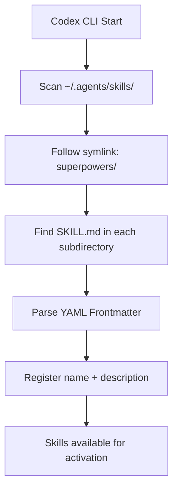

# 第四章 Codex 集成

> **对应源文件**：`.codex/INSTALL.md`、`docs/README.codex.md`

## 概述

OpenAI Codex 通过 Native Skill Discovery（原生技能发现）机制集成 Superpowers。与 Claude Code 和 Cursor 的插件市场不同，Codex 采用 Clone + Symlink（克隆 + 符号链接）的方式手动安装。Codex 在启动时扫描 `~/.agents/skills/` 目录，通过 SKILL.md 的 YAML Frontmatter（前置元数据）自动发现和加载 Skill。

---

## 1 安装方式

### 1.1 自动安装（推荐）

告诉 Codex 执行远程安装指令：

```
Fetch and follow instructions from https://raw.githubusercontent.com/obra/superpowers/refs/heads/main/.codex/INSTALL.md
```

Codex 会自动获取安装文档并按步骤执行。

### 1.2 手动安装

#### 前置要求

- Git
- OpenAI Codex CLI

#### 步骤 1：克隆仓库

```bash
git clone https://github.com/obra/superpowers.git ~/.codex/superpowers
```

将 Superpowers 仓库克隆到 `~/.codex/superpowers` 目录。

#### 步骤 2：创建符号链接

**macOS/Linux：**

```bash
mkdir -p ~/.agents/skills
ln -s ~/.codex/superpowers/skills ~/.agents/skills/superpowers
```

**Windows（PowerShell）：**

```powershell
New-Item -ItemType Directory -Force -Path "$env:USERPROFILE\.agents\skills"
cmd /c mklink /J "$env:USERPROFILE\.agents\skills\superpowers" "$env:USERPROFILE\.codex\superpowers\skills"
```

Windows 使用 Junction（目录联接）而非 Symbolic Link（符号链接），因为 Junction 不需要开发者模式或管理员权限。

#### 步骤 3：重启 Codex

退出并重新启动 Codex CLI，使其在启动时发现新的 Skills 目录。

### 1.3 验证安装

```bash
ls -la ~/.agents/skills/superpowers
```

应看到一个指向 `~/.codex/superpowers/skills` 的符号链接（或 Windows 上的 Junction）。

---

## 2 配置文件解析

### 2.1 目录结构

Codex 不使用 `plugin.json` 或 Hook 配置文件。它的集成完全基于文件系统约定：

```
~/.codex/superpowers/        # 仓库克隆位置
├── skills/                  # Skills 源目录
│   ├── using-superpowers/
│   │   └── SKILL.md
│   ├── brainstorming/
│   │   └── SKILL.md
│   └── ...

~/.agents/skills/            # Codex 技能发现目录
└── superpowers → ~/.codex/superpowers/skills/  # 符号链接
```

### 2.2 INSTALL.md

文件路径：`.codex/INSTALL.md`

这是一个自描述的安装文档，设计为 Codex 可以自行解读和执行。关键内容：

1. **克隆仓库** 到 `~/.codex/superpowers`
2. **创建符号链接** 到 `~/.agents/skills/superpowers`
3. **跨平台支持**——分别提供 Unix 和 Windows 的命令
4. **重启要求**——Skills 仅在启动时发现

### 2.3 SKILL.md Frontmatter

Codex 通过解析 SKILL.md 的 YAML Frontmatter 来注册 Skill：

```markdown
---
name: brainstorming
description: Use when starting any project - refines ideas through questions
---

# Brainstorming

[Skill content...]
```

| 字段 | 说明 |
|------|------|
| `name` | Skill 唯一标识符 |
| `description` | Skill 描述，Codex 用此判断何时自动激活 |

`description` 字段尤为重要——它应当写成清晰的触发条件，以便 Codex 的自动激活逻辑能够正确匹配。

---

## 3 Skill 发现机制

### 3.1 工作原理



Codex 的 Skill 发现是**启动时**进行的：

1. 扫描 `~/.agents/skills/` 目录
2. 跟踪符号链接找到实际目录
3. 在每个子目录中查找 `SKILL.md`
4. 解析 YAML Frontmatter 获取元数据
5. 注册到运行时的 Skill 列表中

### 3.2 自动激活触发

Skill 在以下情况被激活：

- 用户直接提到 Skill 名称（如 "use brainstorming"）
- 用户任务匹配 Skill 的 `description` 字段
- `using-superpowers` Skill 引导 Codex 使用特定 Skill

### 3.3 `using-superpowers` 的特殊角色

`using-superpowers` 是引导 Skill，它被自动发现并告诉 Codex 如何使用整个 Skill 体系。它的 `description` 设计为在任何对话开始时触发：

```yaml
description: Use when starting any conversation - establishes how to find and use skills
```

---

## 4 平台特有功能

### 4.1 无 Hook 系统

与 Claude Code 和 Cursor 不同，Codex **没有 Hook 机制**。Superpowers 的上下文注入完全依赖 Skill Discovery——`using-superpowers` Skill 被发现后自动加载，无需 Hook 脚本。

### 4.2 Subagent 支持

Codex 支持多 Agent 协作，但需要显式启用：

```toml
# Codex 配置文件
[features]
multi_agent = true
```

启用后，以下 Skill 可以正常工作：
- `dispatching-parallel-agents`
- `subagent-driven-development`

### 4.3 个人 Skill

用户可以在 `~/.agents/skills/` 下创建自定义 Skill：

```bash
mkdir -p ~/.agents/skills/my-skill
```

创建 `~/.agents/skills/my-skill/SKILL.md`：

```markdown
---
name: my-skill
description: Use when [condition] - [what it does]
---

# My Skill

[Your skill content here]
```

### 4.4 AGENTS.md

Codex 使用 `~/.codex/AGENTS.md` 作为全局配置文件（类似 Claude Code 的 `CLAUDE.md`）。旧版 Superpowers 需要在此文件中添加 Bootstrap 代码块，但新版通过 Native Skill Discovery 已不再需要。

---

## 5 从旧版迁移

如果从旧版 Bootstrap 方式迁移：

### 5.1 更新仓库

```bash
cd ~/.codex/superpowers && git pull
```

### 5.2 创建符号链接

```bash
mkdir -p ~/.agents/skills
ln -s ~/.codex/superpowers/skills ~/.agents/skills/superpowers
```

### 5.3 清理旧配置

从 `~/.codex/AGENTS.md` 中**删除**任何引用 `superpowers-codex bootstrap` 的代码块——这是旧版注入方式，已被 Native Skill Discovery 取代。

### 5.4 重启 Codex

---

## 6 调试与验证

### 6.1 检查符号链接

```bash
ls -la ~/.agents/skills/superpowers
# 应显示：superpowers -> /home/<user>/.codex/superpowers/skills
```

### 6.2 检查 Skills 内容

```bash
ls ~/.codex/superpowers/skills
# 应列出所有 Skill 目录
```

### 6.3 功能验证

启动 Codex 并提出一个应触发 Skill 的请求：

```
Help me plan this feature
```

Agent 应自动使用 `brainstorming` Skill。

### 6.4 常见问题

| 问题 | 排查步骤 |
|------|---------|
| Skills 未被发现 | 1. 检查符号链接是否正确 2. 检查 Skills 目录是否存在 3. 重启 Codex |
| Windows Junction 创建失败 | 尝试以管理员身份运行 PowerShell |
| 旧版 Bootstrap 仍在运行 | 清理 `~/.codex/AGENTS.md` 中的旧代码块 |
| Subagent Skill 不工作 | 检查 Codex 配置中 `multi_agent = true` 是否启用 |

### 6.5 更新 Superpowers

```bash
cd ~/.codex/superpowers && git pull
```

通过符号链接，Skills 内容**立即生效**，无需重启 Codex（除非添加了全新的 Skill 目录）。

### 6.6 卸载

```bash
# 删除符号链接
rm ~/.agents/skills/superpowers

# 可选：删除克隆的仓库
rm -rf ~/.codex/superpowers
```

**Windows（PowerShell）：**

```powershell
Remove-Item "$env:USERPROFILE\.agents\skills\superpowers"
# 可选
Remove-Item -Recurse -Force "$env:USERPROFILE\.codex\superpowers"
```

---

## 本章核心结论

1. **Codex 使用 Clone + Symlink 安装**——没有插件市场，需手动设置
2. **Skill Discovery 是纯文件系统级别的**——扫描 `~/.agents/skills/` 目录，解析 SKILL.md Frontmatter
3. **无 Hook 系统**——上下文注入完全依赖 `using-superpowers` Skill 的自动发现
4. **通过符号链接实现即时更新**——`git pull` 后 Skill 内容立即生效
5. **Windows 使用 Junction**——不需要开发者模式或管理员权限
6. **Subagent 功能需要额外配置**——需在 Codex 配置中启用 `multi_agent = true`
