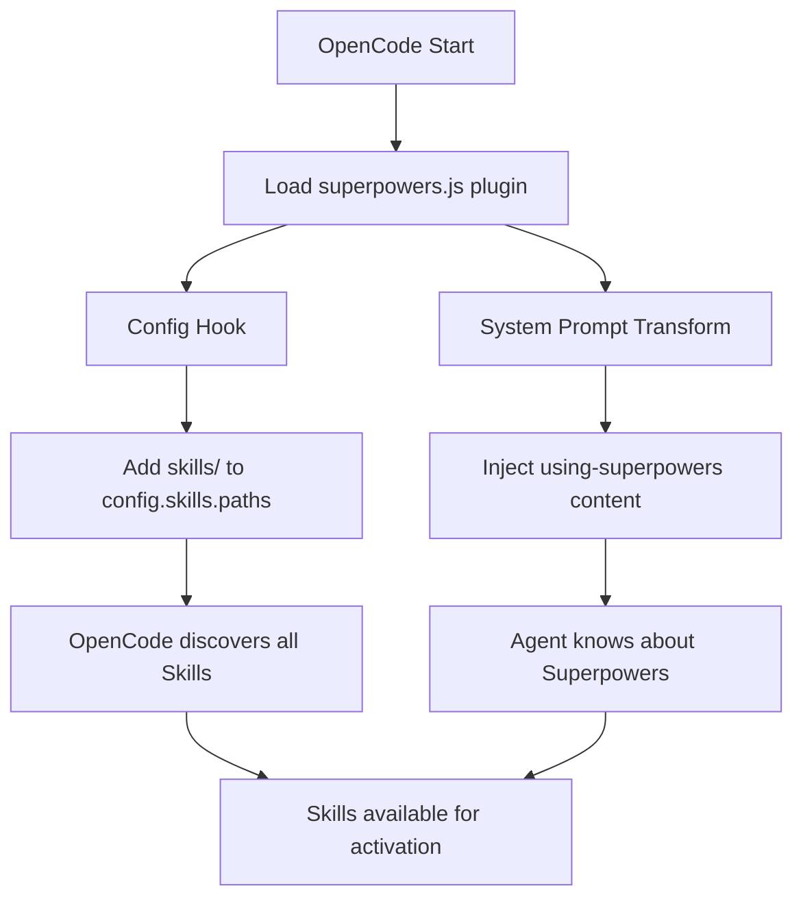

# 第五章 OpenCode 集成

> **对应源文件**：`.opencode/INSTALL.md`、`.opencode/plugins/superpowers.js`、`docs/README.opencode.md`

## 概述

OpenCode.ai 通过 Plugin System（插件系统）集成 Superpowers。与 Codex 的手动 Symlink 方式不同，OpenCode 支持声明式插件安装——只需在配置文件中添加一行 Git URL，重启后自动安装。Superpowers 提供了一个 JavaScript Plugin（`superpowers.js`），通过 System Prompt Transform（系统提示词变换）注入上下文，并通过 Config Hook（配置钩子）自动注册 Skills 目录。

---

## 1 安装方式

### 1.1 声明式安装（推荐）

在 `opencode.json`（全局或项目级别）中添加 Plugin 声明：

```json
{
  "plugin": ["superpowers@git+https://github.com/obra/superpowers.git"]
}
```

重启 OpenCode 即可。Plugin 通过 Bun 自动安装并注册所有 Skills。

### 1.2 自动安装

告诉 OpenCode 执行远程安装指令：

```
Fetch and follow instructions from https://raw.githubusercontent.com/obra/superpowers/refs/heads/main/.opencode/INSTALL.md
```

### 1.3 固定版本

如需锁定到特定版本，使用 Git Tag：

```json
{
  "plugin": ["superpowers@git+https://github.com/obra/superpowers.git#v5.0.3"]
}
```

### 1.4 验证安装

启动 OpenCode 后询问：

```
Tell me about your superpowers
```

### 1.5 更新

Superpowers 在 OpenCode 每次重启时从 Git 仓库重新安装，因此**自动获取最新版本**（除非固定了版本号）。

---

## 2 配置文件解析

### 2.1 INSTALL.md

文件路径：`.opencode/INSTALL.md`

这是面向 OpenCode Agent 的自描述安装文档，关键内容包括：

1. **声明式安装**——修改 `opencode.json`
2. **旧版迁移**——删除手动 Symlink 和旧版配置
3. **工具映射**——Claude Code 工具在 OpenCode 中的等价物
4. **故障排查**——常见问题及解决方案

### 2.2 opencode.json

OpenCode 的配置文件，支持全局（`~/.config/opencode/opencode.json`）和项目级别：

```json
{
  "plugin": ["superpowers@git+https://github.com/obra/superpowers.git"]
}
```

`plugin` 数组中的每个元素格式为 `<name>@<source>`，其中 `source` 可以是：
- `git+<url>` — 从 Git 仓库安装
- `git+<url>#<tag>` — 安装指定版本

---

## 3 superpowers.js 插件解析

文件路径：`.opencode/plugins/superpowers.js`

这是 Superpowers 的核心 OpenCode 集成代码，一个 ES Module（ES 模块）。

### 3.1 完整源码

```javascript
import path from 'path';
import fs from 'fs';
import os from 'os';
import { fileURLToPath } from 'url';

const __dirname = path.dirname(fileURLToPath(import.meta.url));

// Frontmatter 解析
const extractAndStripFrontmatter = (content) => {
  const match = content.match(/^---\n([\s\S]*?)\n---\n([\s\S]*)$/);
  if (!match) return { frontmatter: {}, content };
  const frontmatterStr = match[1];
  const body = match[2];
  const frontmatter = {};
  for (const line of frontmatterStr.split('\n')) {
    const colonIdx = line.indexOf(':');
    if (colonIdx > 0) {
      const key = line.slice(0, colonIdx).trim();
      const value = line.slice(colonIdx + 1).trim().replace(/^["']|["']$/g, '');
      frontmatter[key] = value;
    }
  }
  return { frontmatter, content: body };
};

// 路径标准化
const normalizePath = (p, homeDir) => {
  if (!p || typeof p !== 'string') return null;
  let normalized = p.trim();
  if (!normalized) return null;
  if (normalized.startsWith('~/')) {
    normalized = path.join(homeDir, normalized.slice(2));
  } else if (normalized === '~') {
    normalized = homeDir;
  }
  return path.resolve(normalized);
};

export const SuperpowersPlugin = async ({ client, directory }) => {
  // ... 插件逻辑
};
```

### 3.2 关键函数解析

#### `extractAndStripFrontmatter(content)`

| 功能 | 说明 |
|------|------|
| 输入 | SKILL.md 的完整内容 |
| 输出 | `{ frontmatter: {...}, content: "..." }` |
| 作用 | 分离 YAML Frontmatter 和 Markdown 正文 |
| 设计决策 | 简易实现，避免依赖 `skills-core` 模块 |

逐行解析 Frontmatter 中的 `key: value` 对，同时去除值两端的引号。

#### `normalizePath(p, homeDir)`

| 功能 | 说明 |
|------|------|
| 输入 | 原始路径字符串、Home 目录 |
| 输出 | 绝对路径或 `null` |
| 作用 | 展开 `~`，解析为绝对路径 |

支持 `OPENCODE_CONFIG_DIR` 环境变量自定义配置目录。

#### `SuperpowersPlugin({ client, directory })`

这是插件的导出入口。返回一个对象，包含两个 Hook：

### 3.3 Config Hook

```javascript
config: async (config) => {
  config.skills = config.skills || {};
  config.skills.paths = config.skills.paths || [];
  if (!config.skills.paths.includes(superpowersSkillsDir)) {
    config.skills.paths.push(superpowersSkillsDir);
  }
}
```

**作用**：将 Superpowers 的 `skills/` 目录注入到 OpenCode 的配置中。

**工作原理**：
- OpenCode 的 `Config.get()` 返回缓存的 Singleton（单例）
- 修改此单例后，后续的 Skill Discovery 能看到新增路径
- 无需手动符号链接或编辑配置文件

### 3.4 System Prompt Transform

```javascript
'experimental.chat.system.transform': async (_input, output) => {
  const bootstrap = getBootstrapContent();
  if (bootstrap) {
    (output.system ||= []).push(bootstrap);
  }
}
```

**作用**：将 `using-superpowers` Skill 的内容注入到每次对话的 System Prompt 中。

**为什么用 System Prompt Transform 而非其他方式？** 修复了 Issue #226——Agent 重置 Bug。直接修改 System Prompt 比 Hook 注入更可靠。

### 3.5 Bootstrap 内容生成

```javascript
const getBootstrapContent = () => {
  const skillPath = path.join(superpowersSkillsDir, 'using-superpowers', 'SKILL.md');
  if (!fs.existsSync(skillPath)) return null;

  const fullContent = fs.readFileSync(skillPath, 'utf8');
  const { content } = extractAndStripFrontmatter(fullContent);

  return `<EXTREMELY_IMPORTANT>
You have superpowers.
...
${content}
...
</EXTREMELY_IMPORTANT>`;
};
```

生成的 Bootstrap 上下文包含：
1. `<EXTREMELY_IMPORTANT>` 标签包裹
2. `using-superpowers` Skill 的完整正文（去除 Frontmatter）
3. Tool Mapping（工具映射）表

### 3.6 Tool Mapping（工具映射）

插件在 Bootstrap 中嵌入了工具映射表：

| Skill 引用 | OpenCode 等价物 |
|------------|----------------|
| `TodoWrite` | `todowrite` |
| `Task` (subagent) | `@mention` |
| `Skill` tool | OpenCode 原生 `skill` tool |
| `Read`/`Write`/`Edit`/`Bash` | OpenCode 原生工具 |

这确保了为 Claude Code 编写的 Skill 能在 OpenCode 上正确执行。

---

## 4 Skill 发现机制

### 4.1 双重注册

OpenCode 的 Skill 发现通过两条路径实现：



1. **Config Hook**：注册 `skills/` 目录路径 → OpenCode 发现所有 Skill
2. **System Prompt Transform**：注入 `using-superpowers` 内容 → Agent 知道如何使用 Skill

### 4.2 Skill 使用

通过 OpenCode 原生 `skill` 工具：

```
use skill tool to list skills
use skill tool to load superpowers/brainstorming
```

### 4.3 Skill 优先级

```
Project Skills > Personal Skills > Superpowers Skills
```

- **Project Skills**：`.opencode/skills/` 目录中的项目级别 Skill
- **Personal Skills**：`~/.config/opencode/skills/` 中的个人 Skill
- **Superpowers Skills**：通过插件注册的全局 Skill

---

## 5 平台特有功能

### 5.1 @mention Subagent 系统

OpenCode 使用 `@mention` 语法实现 Subagent 协作，替代 Claude Code 的 `Task` Tool：

```
@code-reviewer please review this change
```

### 5.2 个人 Skill

```bash
mkdir -p ~/.config/opencode/skills/my-skill
```

创建 `~/.config/opencode/skills/my-skill/SKILL.md`：

```markdown
---
name: my-skill
description: Use when [condition] - [what it does]
---

# My Skill

[Your skill content here]
```

### 5.3 项目级别 Skill

在项目目录中创建 `.opencode/skills/`，其中的 Skill 优先级高于全局 Skill。

---

## 6 从旧版迁移

如果之前使用 Symlink 方式安装：

```bash
# 删除旧的符号链接和克隆
rm -f ~/.config/opencode/plugins/superpowers.js
rm -rf ~/.config/opencode/skills/superpowers
rm -rf ~/.config/opencode/superpowers

# 如果在 opencode.json 中添加过 skills.paths，也一并移除
```

然后按照第 1 节的声明式安装步骤操作。

---

## 7 调试与验证

### 7.1 检查插件加载

```bash
opencode run --print-logs "hello" 2>&1 | grep -i superpowers
```

### 7.2 检查 Skill 发现

在 OpenCode 中：

```
use skill tool to list skills
```

应能看到所有 Superpowers Skill。

### 7.3 常见问题

| 问题 | 排查步骤 |
|------|---------|
| 插件未加载 | 检查 `opencode.json` 中的 `plugin` 声明 |
| Skills 未找到 | 使用 `skill` 工具检查发现列表 |
| Bootstrap 未注入 | 确认 OpenCode 版本支持 `experimental.chat.system.transform` |
| 工具名称不匹配 | 参考 Tool Mapping 表进行转换 |

### 7.4 卸载

从 `opencode.json` 中删除 `plugin` 数组中的 Superpowers 条目，然后重启 OpenCode。

---

## 本章核心结论

1. **OpenCode 使用声明式插件安装**——一行 `opencode.json` 配置即可完成
2. **`superpowers.js` 是核心集成模块**——通过 Config Hook 注册 Skills 目录、通过 System Prompt Transform 注入上下文
3. **双重注册机制**——路径注册（Skill Discovery）+ 内容注入（Bootstrap）
4. **自动更新**——每次重启从 Git 重新安装，无需手动拉取
5. **工具映射内嵌在 Bootstrap 中**——确保跨平台 Skill 兼容性
6. **Skill 优先级为三级**——Project > Personal > Superpowers
