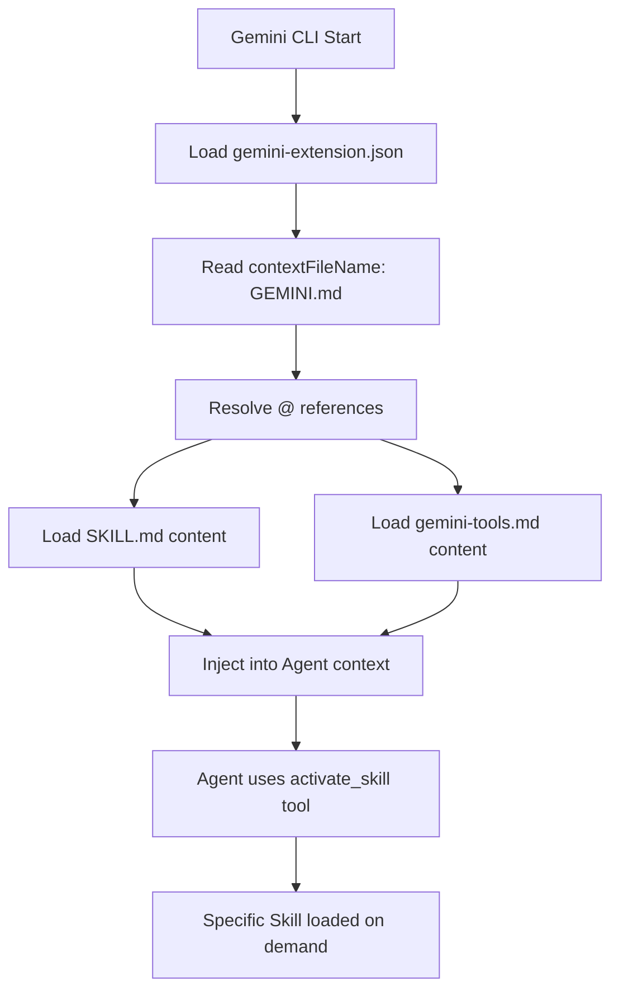

# 第六章 Gemini CLI 集成

> **对应源文件**：`gemini-extension.json`、`GEMINI.md`、`skills/using-superpowers/references/gemini-tools.md`

## 概述

Gemini CLI 通过 Extension System（扩展系统）集成 Superpowers。它使用 `gemini-extension.json` 描述扩展元数据，通过 `GEMINI.md` 作为上下文入口文件（类似 Claude Code 的 Hook 注入），并通过 `gemini-tools.md` 提供跨平台的 Tool Mapping（工具映射）。Gemini CLI 的集成模式独特——它没有 Hook 系统，而是通过 `contextFileName` 机制在会话启动时自动加载指定文件。

---

## 1 安装方式

### 1.1 CLI 安装（推荐）

```bash
gemini extensions install https://github.com/obra/superpowers
```

这是最简单的安装方式，Gemini CLI 自动从 GitHub 克隆仓库并注册为 Extension。

### 1.2 更新

```bash
gemini extensions update superpowers
```

### 1.3 验证

启动新会话后，Agent 应当自动具备 Superpowers 意识。尝试：

```
Help me plan this feature
```

Agent 应自动使用 `brainstorming` Skill。

---

## 2 gemini-extension.json 解析

文件路径：`gemini-extension.json`（位于仓库根目录）

```json
{
  "name": "superpowers",
  "description": "Core skills library: TDD, debugging, collaboration patterns, and proven techniques",
  "version": "5.0.6",
  "contextFileName": "GEMINI.md"
}
```

### 字段详解

| 字段 | 类型 | 说明 |
|------|------|------|
| `name` | String | Extension 唯一标识符，用于 `gemini extensions` 命令 |
| `description` | String | Extension 描述 |
| `version` | String | 语义化版本号 |
| `contextFileName` | String | **关键字段**——指定会话启动时自动加载的上下文文件 |

### contextFileName 机制

`contextFileName` 是 Gemini CLI Extension 系统的核心概念：

1. Gemini CLI 在 Extension 安装目录中查找 `contextFileName` 指定的文件
2. 文件内容在每次会话启动时自动加载到 Agent 上下文中
3. 相当于 Claude Code 的 SessionStart Hook + System Prompt 注入

这意味着 **Gemini CLI 不需要 Hook 脚本**——`contextFileName` 直接替代了 Hook 的上下文注入功能。

### 与其他平台的对比

| 平台 | 上下文注入机制 | 配置文件 |
|------|--------------|---------|
| Claude Code | SessionStart Hook → `hookSpecificOutput` | `hooks/hooks.json` |
| Cursor | sessionStart Hook → `additional_context` | `hooks/hooks-cursor.json` |
| Codex | Native Skill Discovery | 无（文件系统约定） |
| OpenCode | System Prompt Transform | `.opencode/plugins/superpowers.js` |
| **Gemini CLI** | **`contextFileName` 自动加载** | **`gemini-extension.json`** |

---

## 3 GEMINI.md 解析

文件路径：`GEMINI.md`（位于仓库根目录）

```markdown
@./skills/using-superpowers/SKILL.md
@./skills/using-superpowers/references/gemini-tools.md
```

### 文件引用机制

GEMINI.md 使用 `@` 语法引用其他文件。Gemini CLI 在加载此文件时：

1. 解析 `@<path>` 引用
2. 读取被引用文件的完整内容
3. 将所有内容拼接后注入到 Agent 上下文中

### 引用的文件

| 文件 | 作用 |
|------|------|
| `skills/using-superpowers/SKILL.md` | Superpowers 的核心引导 Skill——教会 Agent 如何使用 Skill 系统 |
| `skills/using-superpowers/references/gemini-tools.md` | Gemini CLI 专属的 Tool Mapping 参考 |

### 设计意图

GEMINI.md 本身几乎没有内容——它只是一个"引用聚合器"。这种设计的好处：

1. **内容复用**：`SKILL.md` 是所有平台共享的，不需要为 Gemini 维护单独版本
2. **平台特化**：`gemini-tools.md` 仅包含 Gemini CLI 特有的工具映射
3. **简洁维护**：修改 `SKILL.md` 后所有平台自动同步

---

## 4 Tool Mapping（工具映射）

文件路径：`skills/using-superpowers/references/gemini-tools.md`

Skills 使用 Claude Code 的工具名称编写。Gemini CLI 用户需要将这些工具名转换为平台等价物：

### 4.1 标准工具映射表

| Skill 引用 | Gemini CLI 等价物 | 说明 |
|------------|------------------|------|
| `Read` | `read_file` | 读取文件 |
| `Write` | `write_file` | 创建/写入文件 |
| `Edit` | `replace` | 编辑文件 |
| `Bash` | `run_shell_command` | 执行 Shell 命令 |
| `Grep` | `grep_search` | 搜索文件内容 |
| `Glob` | `glob` | 按名称模式搜索文件 |
| `TodoWrite` | `write_todos` | 任务追踪 |
| `Skill` tool | `activate_skill` | 激活技能 |
| `WebSearch` | `google_web_search` | 网络搜索 |
| `WebFetch` | `web_fetch` | 获取网页内容 |
| `Task` tool | **无等价物** | Gemini CLI 不支持 Subagent |

### 4.2 Subagent 限制

```
⚠️ Gemini CLI 没有 Task Tool 的等价物——不支持 Subagent 调度。
```

依赖 Subagent 的 Skill 会自动回退：

| Skill | 回退行为 |
|-------|---------|
| `subagent-driven-development` | 回退到 `executing-plans`（单会话执行） |
| `dispatching-parallel-agents` | 回退到 `executing-plans`（单会话执行） |

### 4.3 Gemini CLI 额外工具

Gemini CLI 提供了一些 Claude Code 没有的工具：

| 工具 | 用途 |
|------|------|
| `list_directory` | 列出文件和子目录 |
| `save_memory` | 将事实持久化到 GEMINI.md，跨会话保留 |
| `ask_user` | 向用户请求结构化输入 |
| `tracker_create_task` | 丰富的任务管理（创建、更新、列表、可视化） |
| `enter_plan_mode` / `exit_plan_mode` | 切换到只读研究模式 |

这些额外工具提供了 Gemini CLI 独有的能力，特别是 `save_memory` 允许 Agent 在会话之间保留学到的事实。

---

## 5 Skill 发现机制

### 5.1 发现流程



### 5.2 与 Claude Code 的对比

| 步骤 | Claude Code | Gemini CLI |
|------|-------------|------------|
| 上下文入口 | Hook 脚本执行 | `contextFileName` 静态文件 |
| Skill 加载 | `Skill` tool | `activate_skill` tool |
| 工具映射 | 不需要（原生工具名） | `gemini-tools.md` |
| Bootstrap 方式 | 动态 JSON 输出 | 静态文件引用 |

### 5.3 activate_skill 工具

Gemini CLI 的 `activate_skill` 等价于 Claude Code 的 `Skill` Tool：

```
Agent: 我需要进行头脑风暴...
Agent → activate_skill("brainstorming")
→ 加载 skills/brainstorming/SKILL.md
→ Skill 内容注入到对话中
```

---

## 6 平台特有功能

### 6.1 save_memory——跨会话记忆

Gemini CLI 的 `save_memory` 工具允许 Agent 将事实保存到 `GEMINI.md` 文件中。这意味着：

- Agent 在一次会话中学到的项目知识可以持久化
- 下次会话自动加载这些记忆
- 类似于 Claude Code 的 `CLAUDE.md`，但由 Agent 主动管理

### 6.2 Plan Mode——只读研究模式

```
enter_plan_mode → 只读模式，Agent 仅搜索和分析
exit_plan_mode → 恢复正常模式，Agent 可以修改代码
```

这与 Superpowers 的 `brainstorming` Skill 天然契合——Agent 可以在 Plan Mode 下完成设计阶段，然后切换回正常模式执行实现。

### 6.3 Task Tracker

`tracker_create_task` 提供了比 `TodoWrite`/`write_todos` 更丰富的任务管理能力：

- 创建、更新、列出任务
- 任务可视化
- 与 Skill 中的 Checklist 互补

### 6.4 静态上下文 vs 动态 Hook

Gemini CLI 的 `contextFileName` 机制是**静态的**——每次加载的内容相同。这与 Claude Code 的 Hook 不同（Hook 可以根据运行时条件动态生成内容）。

**影响**：
- Gemini CLI 不支持 Legacy 目录检测和迁移警告（这是 `session-start` 脚本的动态逻辑）
- 上下文内容在 `git pull` 更新后自动变化

---

## 7 调试与验证

### 7.1 检查 Extension 安装

```bash
gemini extensions list
```

应显示 `superpowers` Extension。

### 7.2 验证上下文加载

启动新会话并询问：

```
What skills do you have?
```

Agent 应当列出可用的 Superpowers Skill。

### 7.3 测试 Skill 激活

```
Help me plan a new feature for my project
```

Agent 应自动使用 `activate_skill` 加载 `brainstorming` Skill。

### 7.4 常见问题

| 问题 | 排查步骤 |
|------|---------|
| Extension 未安装 | 重新执行 `gemini extensions install` |
| Agent 无 Superpowers 意识 | 检查 `GEMINI.md` 是否存在且内容正确 |
| `activate_skill` 不工作 | 确认 Gemini CLI 版本支持此工具 |
| Subagent Skill 未回退 | Skill 应自动回退到 `executing-plans` |
| 工具名称不匹配 | 参考第 4 节的 Tool Mapping 表 |

### 7.5 更新

```bash
gemini extensions update superpowers
```

### 7.6 手动检查上下文文件

```bash
# 查看 GEMINI.md 的引用
cat GEMINI.md

# 查看工具映射文件
cat skills/using-superpowers/references/gemini-tools.md
```

---

## 本章核心结论

1. **Gemini CLI 使用 Extension 系统**——`gemini extensions install` 一键安装
2. **`contextFileName` 替代了 Hook 系统**——静态文件引用，无需动态脚本
3. **GEMINI.md 是引用聚合器**——通过 `@` 语法引用共享的 SKILL.md 和平台特有的 Tool Mapping
4. **工具映射是核心适配层**——`gemini-tools.md` 将 Claude Code 工具名转换为 Gemini CLI 等价物
5. **不支持 Subagent**——依赖 `Task` Tool 的 Skill 自动回退到单会话执行
6. **独有的 `save_memory` 和 Plan Mode 工具**——与 Superpowers 工作流天然互补
7. **静态上下文意味着无法动态检测**——Legacy 迁移警告等动态功能不可用
