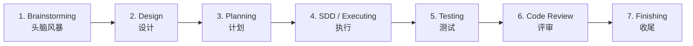
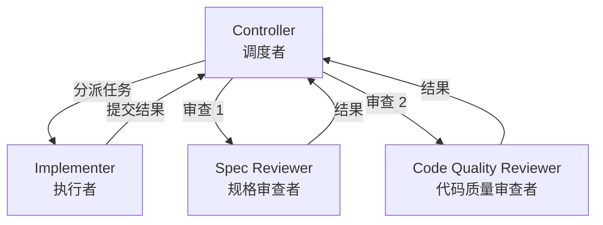

# 速查表

> 本章提供 Superpowers 框架的快速参考卡片，适合已掌握基础知识后按需查阅。

---

## 1 七步工作流速查



| 步骤 | Skill | 触发条件 | 输出物 |
|------|-------|---------|--------|
| 1 | brainstorming | 用户请求创建功能 | Spec 文档 |
| 2 | brainstorming（续） | 设计方案选定 | 用户批准的设计 |
| 3 | writing-plans | Spec 已批准 | 实施计划 |
| 4 | subagent-driven-development 或 executing-plans | 计划已完成 | 代码实现 |
| 5 | test-driven-development | 每个编码任务 | 通过的测试 |
| 6 | requesting-code-review + receiving-code-review | 实现完成 | 审查通过 |
| 7 | finishing-a-development-branch | 所有测试通过 | Merge/PR |

---

## 2 Skill 速查表

### 核心 Skill

| Skill | 触发关键词 | 一句话描述 |
|-------|-----------|-----------|
| using-superpowers | 会话启动 | 入口 Skill，调度所有其他 Skill |
| brainstorming | "创建"、"构建"、"添加功能" | 将模糊想法转化为 Spec |
| writing-plans | Spec 已批准 | 将 Spec 分解为可执行任务 |
| executing-plans | 计划已完成（无 Subagent 平台） | 逐步执行计划 |
| subagent-driven-development | 计划已完成（有 Subagent 平台） | Controller/Implementer/Reviewer 架构 |

### 质量保证 Skill

| Skill | 触发关键词 | 一句话描述 |
|-------|-----------|-----------|
| test-driven-development | 编写任何代码 | Red-Green-Refactor 循环 |
| systematic-debugging | "bug"、"失败"、"报错" | 四阶段根因调试法 |
| verification-before-completion | 声明"完成" | 新终端运行完整测试套件 |

### 协作 Skill

| Skill | 触发关键词 | 一句话描述 |
|-------|-----------|-----------|
| requesting-code-review | 实现完成 | 发起双重审查 |
| receiving-code-review | 收到审查反馈 | 处理和应对反馈 |
| dispatching-parallel-agents | 2+ 独立失败 | 并行解决独立问题 |

### 工程 Skill

| Skill | 触发关键词 | 一句话描述 |
|-------|-----------|-----------|
| using-git-worktrees | 开始新功能 | 创建隔离工作空间 |
| finishing-a-development-branch | 所有测试通过 | 分支收尾四选一 |
| writing-skills | "创建 Skill" | TDD 方法论编写 Skill |

---

## 3 三大铁律速查

| 铁律 | 规则 | 违反后果 |
|------|------|---------|
| **TDD Iron Law** | 没有失败测试，不写产品代码 | 无法证明代码有效 |
| **Debugging Iron Law** | 没有根因调查，不做修复 | 连续 3 次修复失败 = 架构问题 |
| **Verification Iron Law** | 没有新鲜验证证据，不声明完成 | "上次运行过"不可信 |

---

## 4 设计原则速查

| 原则 | 含义 |
|------|------|
| Evidence Before Claims | 任何"完成"必须附带验证输出 |
| Process Before Shortcuts | 即使简单也走流程 |
| Specification Compliance First | Spec Review 在 Code Quality Review 之前 |
| Context Isolation | Subagent 只接收最小必要上下文 |
| YAGNI | 只实现 Spec 要求的功能 |

---

## 5 常用命令速查

### 测试命令

```bash
# 运行快速测试
cd tests/claude-code && ./run-skill-tests.sh

# 运行集成测试（10-30 分钟）
./run-skill-tests.sh --integration

# 运行特定测试
./run-skill-tests.sh --test test-subagent-driven-development.sh

# Token 分析
python3 analyze-token-usage.py ~/.claude/projects/<session>.jsonl
```

### Git Worktree 命令

```bash
# 创建 worktree
git worktree add <path> -b <branch-name>

# 列出 worktree
git worktree list

# 删除 worktree
git worktree remove <path>
```

### Brainstorm Server 命令

```bash
# 启动服务器
./skills/brainstorming/scripts/start-server.sh

# 停止服务器
./skills/brainstorming/scripts/stop-server.sh
```

---

## 6 安装命令速查

| 平台 | 安装命令 |
|------|---------|
| Claude Code (Official) | `/plugin install superpowers@claude-plugins-official` |
| Claude Code (Community) | `/plugin marketplace add obra/superpowers-marketplace` |
| Cursor | `/add-plugin superpowers` 或搜索 marketplace |
| Codex | `git clone ... ~/.codex/superpowers` + symlink |
| OpenCode | `opencode.json` 添加 `"plugin": ["superpowers@git+..."]` |
| Gemini CLI | `gemini extensions install https://github.com/obra/superpowers` |

---

## 7 配置文件速查

| 文件 | 平台 | 作用 |
|------|------|------|
| `.claude-plugin/plugin.json` | Claude Code | 插件元数据 |
| `.claude-plugin/marketplace.json` | Claude Code | Marketplace 发布 |
| `.cursor-plugin/plugin.json` | Cursor | 插件元数据 + skills/agents/commands 路径 |
| `hooks/hooks.json` | Claude Code | Hook 配置（SessionStart 事件） |
| `hooks/hooks-cursor.json` | Cursor | Hook 配置（camelCase 格式） |
| `gemini-extension.json` | Gemini CLI | 扩展元数据 + contextFileName |
| `GEMINI.md` | Gemini CLI | 启动时注入的上下文 |
| `.opencode/plugins/superpowers.js` | OpenCode | JS 插件（系统提示注入 + 技能注册） |
| `package.json` | OpenCode/npm | npm 包元数据 |

---

## 8 Subagent-Driven Development 角色速查



| 角色 | 职责 | 输入 | 输出 |
|------|------|------|------|
| Controller | 读计划、分派任务、审查结果 | Plan 文档 | 完成的项目 |
| Implementer | 写代码、运行测试、自审 | Task 描述 | 代码 + 测试 |
| Spec Reviewer | 验证代码是否符合 Spec | 代码 diff + Spec | 合规/不合规 |
| Code Quality Reviewer | 审查代码质量 | 代码 diff | 质量报告 |

---

## 9 TDD 循环速查

```
RED     → 写失败测试 → 运行 → 确认失败
GREEN   → 写最小实现 → 运行 → 确认通过
REFACTOR → 优化代码 → 运行 → 确认仍然通过
```

**Anti-patterns 速查**：

| Anti-Pattern | 正确做法 |
|-------------|---------|
| Test-After | 先写测试 |
| Invisible Assertion | 每个测试有显式 assert |
| Giant Leap | 只写让当前测试通过的最小代码 |
| Mock Happy | 只 mock 你不拥有的东西 |
| Frozen Test | 测试应断言行为，不断言实现细节 |

---

## 10 调试四阶段速查

| 阶段 | 动作 | 产出 |
|------|------|------|
| 1. Reproduce | 可靠复现问题 | 复现步骤 |
| 2. Hypothesize | 形成根因假设 | 假设列表 |
| 3. Verify | 验证假设 | 确认的根因 |
| 4. Fix | 修复并验证 | 通过的测试 |

**3-Strike Rule**：连续 3 次修复失败 → 停止猜测 → 切换到架构分析。

---

## 本章核心结论

1. **日常开发**：先查七步工作流确定当前阶段，再查 Skill 速查表确定要使用的 Skill。
2. **遇到问题**：先查铁律确认是否违规，再查 Anti-patterns 表确认是否陷入常见错误。
3. **安装部署**：按平台查安装命令速查表，一步到位。
