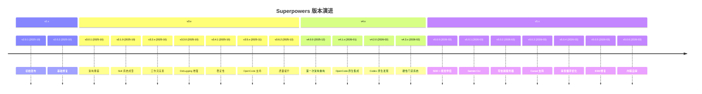

# 第一章 变更日志精要

> **对应源文件**：`RELEASE-NOTES.md`、`CHANGELOG.md`

## 概述

本章从 Superpowers 完整的变更日志中提炼关键里程碑、Breaking Changes（破坏性变更）和架构演进。目标不是替代原始 Release Notes（发行说明），而是帮助读者快速建立版本演进的全局视图，理解"为什么现在是这个样子"。

## 前置阅读

- 第零章 全部（了解当前架构）
- [02 - 版本迁移指南](./02-migration-guide.md)（如需升级）

---

## 1 版本谱系总览

---

## 2 v5.x — 子智能体时代（2026-03）

### v5.0.0：架构转折点

**Breaking Changes（破坏性变更）**：

| 变更 | 影响 | 迁移要求 |
|------|------|---------|
| Spec/Plan 目录重构 | `docs/plans/` → `docs/superpowers/specs/` + `docs/superpowers/plans/` | 移动现有文件 |
| SDD 强制化 | 在有 Subagent 能力的平台上，subagent-driven-development 不再可选 | 无需迁移 |
| executing-plans 不再分批 | 移除"执行 3 个任务后暂停审查"模式 | 无需迁移 |
| Slash Commands 废弃 | `/brainstorm`、`/write-plan`、`/execute-plan` 显示废弃通知 | 改用对应 Skill |

**新功能亮点**：

- **Visual Brainstorming Companion（可视化头脑风暴伴侣）**：可选的浏览器端辅助工具，在终端对话旁展示 mockup、图表、对比表
- **Document Review System（文档审查系统）**：Spec 和 Plan 的自动化审查循环
- **Architecture Guidance（架构指导）**：贯穿 brainstorming → writing-plans → SDD 的设计隔离原则
- **Instruction Priority Hierarchy（指令优先级层次）**：明确用户指令 > Superpowers Skill > 默认系统提示
- **SUBAGENT-STOP 门禁**：防止 Subagent 激活完整 Skill 工作流

### v5.0.1：多平台扩展

- **Gemini CLI 原生扩展**：通过 `gemini-extension.json` + `GEMINI.md` 支持
- **Brainstorm Server 移入 Skill 目录**：从 `lib/brainstorm-server/` 到 `skills/brainstorming/scripts/`，符合 agentskills.io 规范
- **Windows/Linux Hook 修复**：单引号 → 转义双引号，修复 `${CLAUDE_PLUGIN_ROOT}` 展开失败

### v5.0.2：零依赖 Brainstorm Server

- 移除全部 vendored `node_modules`（~1,200 行），改用纯 Node.js 内置模块
- 自定义 WebSocket 协议实现（RFC 6455）
- 30 分钟空闲超时 + Owner-PID 追踪
- 所有委派 Skill 增加 Context Isolation 原则

### v5.0.3：Cursor 支持

- `hooks-cursor.json`（camelCase 格式：`sessionStart`）
- 平台检测：先检查 `CURSOR_PLUGIN_ROOT`
- Hook 不再在 `--resume` 时触发
- Bash 5.3+ heredoc 挂起修复（替换为 `printf`）
- 全部 shebang 统一为 `#!/usr/bin/env bash`

### v5.0.4：审查循环精炼

- Plan Reviewer 改为单次全量审查（移除分块概念）
- 最大审查迭代次数：5 → 3
- Reviewer Checklist 精简（Spec 7→5，Plan 7→4）
- OpenCode 一行安装：`config` hook 自动注册 skills 目录

### v5.0.5：稳定性修复

- `server.js` → `server.cjs`（修复 Node.js 22+ ESM 模式下 `require()` 失败）
- Windows/MSYS2 跳过 Owner-PID 监控
- `stop-server.sh` 验证进程确实终止

### v5.0.6：内联自审取代子智能体审查

- Spec/Plan Review Loop 替换为内联 Self-Review Checklist
- 执行时间：~25 min → ~30s，缺陷率相当
- Brainstorm Server 会话目录拆分为 `content/` + `state/`
- Owner-PID 生命周期修复（EPERM 处理、WSL 兼容）

---

## 3 v4.x — 硬性门禁时代（2025-12 至 2026-02）

### v4.0.0：第一次架构重构

**Breaking Changes**：

| 变更 | 影响 |
|------|------|
| receiving-code-review 替代 addressing-code-review | Skill 重命名 |
| requesting-code-review 替代 code-review | Skill 重命名 |
| finishing-a-development-branch 替代 shipping | Skill 重命名 |
| Subagent-Driven Development 新增 | 取代简单的执行计划模式 |
| 移除 using-superpowers 的代码格式块 | Agent 不再将 Skill 内容视为代码引用 |

**新 Skill 引入**：subagent-driven-development、dispatching-parallel-agents、using-git-worktrees、finishing-a-development-branch。

### v4.1.0：OpenCode 原生 Skill 系统

- 从自定义 `use_skill`/`find_skills` 工具切换到 OpenCode 原生 `skill` 工具
- `experimental.chat.system.transform` 替代 `session.prompt({ noReply: true })`

### v4.2.0：Codex 原生发现

- 移除 `superpowers-codex` bootstrap CLI
- 安装简化为 clone + symlink
- Worktree 隔离成为实现前的必要步骤

### v4.3.0：Hard Gate 系统

- Brainstorming 引入 `<HARD-GATE>` 标签：设计批准前禁止所有实现行为
- 强制 Checklist + Graphviz 流程图
- `using-superpowers` 拦截 `EnterPlanMode`

---

## 4 v3.x — 基础奠定时代（2025-10 至 2025-12）

### v3.0.x：初始架构

- 建立 Skill 目录结构：`skills/<name>/SKILL.md`
- 引入 `using-superpowers` 作为入口 Skill
- SessionStart Hook 机制：会话启动时注入 Skill 上下文

### v3.1.0：Skill 体系成型

- brainstorming、writing-plans、executing-plans 三大核心 Skill 完成
- test-driven-development 和 systematic-debugging 引入 Iron Laws
- code-review 和 verification-before-completion 形成质量闭环
- writing-skills 元技能引入 TDD-for-Skills 方法论

### v3.2.x - v3.6.x：质量迭代

- OpenCode 平台初步支持（v3.5.0）
- 测试基础设施完善：`test-helpers.sh`、Token 分析工具
- 跨平台 Hook 兼容性改进（Windows、Linux、macOS）
- CSO 优化策略成熟

---

## 5 v2.x — 原型阶段（2025-10）

- v2.0.1/v2.0.2：初始公开发布
- 基础 Skill 概念验证
- 仅支持 Claude Code

---

## 6 演进趋势分析

| 趋势 | v2-v3 | v4 | v5 |
|------|-------|-----|-----|
| Skill 触发 | 手动提示 | 自动发现 | 自动发现 + SUBAGENT-STOP |
| 合规策略 | 文字描述 | Checklist + Graphviz | Hard Gate + 内联自审 |
| 平台覆盖 | Claude Code | + OpenCode + Codex | + Cursor + Gemini CLI |
| 审查机制 | 无 | Subagent 审查循环 | 内联 Self-Review |
| Context 管理 | 无 | 基础隔离 | 全面 Context Isolation |
| Brainstorm 体验 | 纯文本 | 纯文本 | 可视化伴侣 |

### 关键工程决策

1. **从子智能体审查到内联自审**（v5.0.6）：25 分钟开销 → 30 秒，缺陷率不变。证据驱动的简化。
2. **从描述式到门禁式**（v4.3.0）：Agent 不遵循文字描述的工作流，必须用结构化门禁强制执行。
3. **从自定义工具到原生集成**（v4.1.0/v4.2.0）：每个平台都有自己的 Skill 发现机制，适配它而非替代它。
4. **从 vendored 依赖到零依赖**（v5.0.2）：1,200 行 node_modules → 0，纯 Node.js 内置模块。

---

## 本章核心结论

1. **版本选择**：始终使用最新的 v5.0.x。v5 的每个补丁版本都修复了真实的跨平台问题。
2. **Breaking Changes 集中在 v4.0.0 和 v5.0.0**：如果从 v3 升级，需要关注 Skill 重命名和目录重构。
3. **演进方向**：从"告诉 Agent 该做什么"到"用结构化门禁确保 Agent 必须做什么"。这是 Superpowers 最核心的工程哲学。
