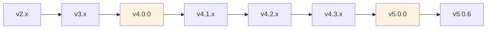

# 第二章 版本迁移指南

> **对应源文件**：`RELEASE-NOTES.md`（Breaking Changes 部分）

## 概述

本章为需要跨主要版本升级的用户提供具体的迁移步骤。每个迁移路径列出必须完成的变更，并以 Checklist（检查清单）形式呈现，确保不遗漏任何步骤。

## 前置阅读

- [01 - 变更日志精要](./01-changelog-highlights.md)（了解版本演进背景）

---

## 1 迁移路径总览



> 黄色标记的版本包含 Breaking Changes，需要执行迁移步骤。

---

## 2 从 v3.x 迁移到 v4.0.0

### 变更摘要

v4.0.0 重命名了多个核心 Skill，引入了新的 Skill，并改变了 Skill 内容的格式。

### Skill 重命名映射

| v3 名称 | v4 名称 | 原因 |
|---------|---------|------|
| `code-review` | `requesting-code-review` | 区分"请求审查"和"接收审查"两个不同阶段 |
| `addressing-code-review` | `receiving-code-review` | 语义更准确 |
| `shipping` | `finishing-a-development-branch` | 描述实际动作而非结果 |

### 新增 Skill

| Skill | 作用 |
|-------|------|
| `subagent-driven-development` | Controller/Implementer/Reviewer 架构的自主开发 |
| `dispatching-parallel-agents` | 并行解决独立问题 |
| `using-git-worktrees` | 创建隔离工作空间 |
| `finishing-a-development-branch` | 分支收尾四选一 |

### 迁移 Checklist

- [ ] 更新插件到 v4.0.0：`git pull` 或重新安装
- [ ] 如果有自定义脚本引用旧 Skill 名称，更新引用：
  - `code-review` → `requesting-code-review`
  - `addressing-code-review` → `receiving-code-review`
  - `shipping` → `finishing-a-development-branch`
- [ ] 如果有 CLAUDE.md / AGENTS.md 中引用了旧 Skill 名称，更新引用
- [ ] 重启 Agent 会话以加载新 Skill

---

## 3 从 v4.0.x 迁移到 v4.1.0（OpenCode 用户）

### 变更摘要

OpenCode 从自定义工具切换到原生 Skill 系统。

### 迁移 Checklist

- [ ] 创建 Skill 符号链接：
  ```bash
  rm -f ~/.config/opencode/skills/superpowers  # 移除旧链接
  ln -s <superpowers-repo>/skills ~/.config/opencode/skills/superpowers
  ```
- [ ] 如果使用 Windows，创建 junction 而非 symlink：
  ```powershell
  cmd /c mklink /J "%USERPROFILE%\.config\opencode\skills\superpowers" "<superpowers-repo>\skills"
  ```
- [ ] 确认 OpenCode 插件使用 `experimental.chat.system.transform`（非 `session.prompt`）
- [ ] 移除所有对 `use_skill` / `find_skills` 工具的引用
- [ ] 验证：启动新会话，询问 "Tell me about your superpowers"

---

## 4 从 v4.1.x 迁移到 v4.2.0（Codex 用户）

### 变更摘要

Codex 从 bootstrap CLI 切换到原生 Skill 发现。

### 迁移 Checklist

- [ ] 克隆仓库到标准位置：
  ```bash
  git clone https://github.com/obra/superpowers.git ~/.codex/superpowers
  ```
- [ ] 创建 Skill 符号链接：
  ```bash
  ln -s ~/.codex/superpowers/skills ~/.agents/skills/superpowers
  ```
- [ ] 从 AGENTS.md 中移除旧的 bootstrap 内容（`superpowers-codex` CLI 调用等）
- [ ] 删除旧路径 `~/.codex/skills/`（已废弃）
- [ ] 重启 Codex 验证 Skill 发现

---

## 5 从 v4.3.x 迁移到 v5.0.0

### 变更摘要

v5.0.0 是最大的 Breaking Change 版本，涉及目录结构、执行策略和命令废弃。

### 5.1 Spec/Plan 目录重构

**变更前**：
```
docs/plans/<filename>.md
```

**变更后**：
```
docs/superpowers/specs/YYYY-MM-DD-<topic>-design.md
docs/superpowers/plans/YYYY-MM-DD-<feature-name>.md
```

**迁移步骤**：
```bash
# 创建新目录
mkdir -p docs/superpowers/specs docs/superpowers/plans

# 移动现有文件（按需）
mv docs/plans/*-design.md docs/superpowers/specs/
mv docs/plans/*.md docs/superpowers/plans/
```

### 5.2 Subagent-Driven Development 强制化

在具有 Subagent 能力的平台（Claude Code、Codex）上，`writing-plans` 完成后自动进入 `subagent-driven-development`，不再提供选择。

**影响**：如果你依赖 `executing-plans` 的分批执行模式，需要适应新的连续执行方式。

**v5.0.5 更新**：此限制在 v5.0.5 中放宽，用户可再次选择执行方式。

### 5.3 Slash Commands 废弃

| 旧命令 | 新方式 |
|--------|--------|
| `/brainstorm` | 直接描述需求，Agent 自动触发 brainstorming Skill |
| `/write-plan` | Brainstorming 完成后自动进入 writing-plans |
| `/execute-plan` | Plan 完成后自动进入执行阶段 |

### 迁移 Checklist

- [ ] 更新插件到 v5.0.0
- [ ] 迁移 Spec/Plan 文件到新目录结构（如果需要保留旧文件）
- [ ] 从脚本和文档中移除 slash command 引用
- [ ] 确认 CLAUDE.md / AGENTS.md 中没有对 `docs/plans/` 的硬编码引用
- [ ] 验证：运行一次完整的 brainstorming → planning → implementation 流程

---

## 6 v5.0.x 补丁升级（无 Breaking Changes）

v5.0.1 到 v5.0.6 之间没有 Breaking Changes，直接 `git pull` 即可。但建议关注以下改进：

| 版本 | 关键改进 | 受影响平台 |
|------|---------|-----------|
| v5.0.1 | Gemini CLI 支持 | Gemini CLI 用户 |
| v5.0.2 | 零依赖 Brainstorm Server | 所有使用 Visual Companion 的用户 |
| v5.0.3 | Cursor 支持 | Cursor 用户 |
| v5.0.4 | OpenCode 一行安装 | OpenCode 用户 |
| v5.0.5 | ESM 修复 | Node.js 22+ 用户 |
| v5.0.6 | 内联自审 | 所有用户（性能提升） |

### 升级 Checklist（通用）

- [ ] 更新代码：
  ```bash
  cd <superpowers-directory>
  git pull
  ```
- [ ] 重启 Agent 会话
- [ ] 验证版本：检查 plugin.json 中的 `version` 字段

---

## 7 跨平台迁移

### 从 Claude Code 迁移到 Cursor

- [ ] 确认 Superpowers 版本 ≥ v5.0.3
- [ ] 在 Cursor 中安装：`/add-plugin superpowers`
- [ ] 验证 Hook 触发：启动新会话检查 Skill 上下文

### 从 Claude Code 迁移到 Codex

- [ ] 按 `.codex/INSTALL.md` 完成安装
- [ ] 注意：Codex 不支持 Visual Companion
- [ ] 注意：Codex 使用 `spawn_agent` 而非 `Task()` 进行子智能体调度

### 从 Claude Code 迁移到 Gemini CLI

- [ ] 确认 Superpowers 版本 ≥ v5.0.1
- [ ] 安装：`gemini extensions install https://github.com/obra/superpowers`
- [ ] 注意：Gemini CLI 不支持 Subagent，自动降级到 `executing-plans`
- [ ] 参考 `skills/using-superpowers/references/gemini-tools.md` 了解工具映射

---

## 本章核心结论

1. **最简迁移**：如果从 v4.3.x 升级到最新 v5.0.x，只需 `git pull` + 迁移 Spec/Plan 目录 + 停止使用 slash commands。
2. **平台迁移**：跨平台迁移的关键是确认 Superpowers 版本满足目标平台的最低要求。
3. **向后兼容**：v5.0.x 补丁版本之间完全向后兼容，放心升级。
