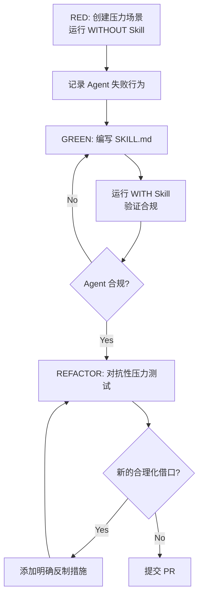

# 第三章 贡献指南

> **对应源文件**：`CODE_OF_CONDUCT.md`、`.github/PULL_REQUEST_TEMPLATE.md`、`README.md`

## 概述

本章说明如何向 Superpowers 项目贡献代码、文档和新 Skill。Superpowers 对贡献质量有严格要求——这不是"提交就合并"的项目。每个 PR（Pull Request）都必须经过人工审查、提供评估证据、并通过对抗性测试。

## 前置阅读

- [13 - Writing Skills（编写 Skill）](../02-skills/13-writing-skills.md)（如果贡献新 Skill）
- [01 - 测试基础设施](../06-testing/01-test-infrastructure.md)（如果涉及测试）

---

## 1 贡献类型

| 类型 | 适合核心库？ | 说明 |
|------|------------|------|
| Bug 修复 | ✅ | 修复已知问题，附带复现步骤和测试 |
| 平台支持 | ✅ | 新平台集成或现有平台兼容性修复 |
| Skill 改进 | ✅ | 改进现有 Skill 的合规性或覆盖范围 |
| 通用新 Skill | ✅ | 所有用户都能受益的新 Skill |
| 领域特定 Skill | ❌ | 应作为独立插件发布 |
| 第三方集成 | ❌ | 推广特定服务的集成不属于核心库 |
| 个人配置 | ❌ | 项目或团队特定的配置不属于核心库 |

**核心判断标准**：这个变更对"在完全不同类型项目上工作的人"有用吗？

---

## 2 PR 要求

### 2.1 必填部分

每个 PR 必须回答以下问题：

1. **你在解决什么问题？** — 具体的问题描述，不是"改进 X"。什么坏了？什么失败了？什么用户体验触发了这个修改？
2. **这个 PR 改了什么？** — 1-3 句话描述具体变更。
3. **这个变更适合核心库吗？** — 自我评估是否属于核心库范围。
4. **你考虑了哪些替代方案？** — 如果没有考虑替代方案，这本身就是一个红旗。
5. **这个 PR 是否包含多个不相关的变更？** — 如果是，拆分成多个 PR。捆绑的 PR 会被直接关闭。

### 2.2 重复检查

- [ ] 已审查所有 **open AND closed** PR 是否有重复或先前尝试
- [ ] 如果存在相关的已关闭 PR，解释你的方法有何不同

### 2.3 测试环境

必须提供测试环境信息：

| 字段 | 示例 |
|------|------|
| Harness | Claude Code 2.3.1 |
| Model | claude-sonnet-4-20250514 |
| OS | macOS 14.2 / Windows 11 / Ubuntu 24.04 |

### 2.4 评估要求

- 描述导致此变更的初始 Prompt（提示）
- 变更后运行了多少次评估会话？
- 变更前后的结果对比

> **"It works"不是评估**。必须描述跨多次会话观察到的前后差异。

### 2.5 严格要求

- [ ] 如果是 Skill 变更：使用 `superpowers:writing-skills` 完成对抗性压力测试
- [ ] 变更经过对抗性测试，不仅仅是 happy path
- [ ] 没有在未经充分评估的情况下修改精心调优的内容（Red Flags 表、合理化措辞、"human partner"语言等）
- [ ] **人工已审查完整的 diff**

> ⚠️ 最后一项是硬性要求。未经人工审查的 PR 不会被合并。

---

## 3 行为准则摘要

Superpowers 采用 [Contributor Covenant v2.0](https://www.contributor-covenant.org/version/2/0/code_of_conduct.html)。

### 核心原则

- **同理心和善意** — 对不同意见保持尊重
- **建设性反馈** — 接受并给予建设性批评
- **社区利益优先** — 关注对社区整体最有益的事
- **承担责任** — 为错误道歉并从中学习

### 不可接受行为

- 性化语言或关注
- 人身攻击、侮辱性评论
- 公开或私下骚扰
- 未经许可发布他人私人信息

### 执行

违规行为报告发送至 jesse@primeradiant.com。社区负责人将根据严重程度采取纠正、警告、临时封禁或永久封禁措施。

---

## 4 贡献新 Skill

### 4.1 前置条件

贡献新 Skill 之前，确认：

1. **通用性**：该 Skill 对所有类型的项目都有价值
2. **非重复**：现有 Skill 无法覆盖此场景
3. **已测试**：使用 TDD-for-Skills 方法论完成 RED-GREEN-REFACTOR 循环

### 4.2 开发流程



### 4.3 目录结构

```
skills/<skill-name>/
  SKILL.md              # 主文件（必需）
  supporting-file.*     # 辅助文件（仅在必要时）
```

### 4.4 Skill 质量标准

- [ ] YAML frontmatter 包含 `name`（≤64 字符）和 `description`（≤1024 字符）
- [ ] `description` 使用第三人称，描述**何时使用**而非**如何工作**
- [ ] 主文件 < 500 行
- [ ] 包含 Quick Reference 表或 Checklist
- [ ] 包含 Common Mistakes 部分
- [ ] 无叙事性故事
- [ ] Reference 文件只有一层深度

---

## 5 贡献平台支持

### 需要提供的内容

1. **配置文件**：平台特定的 plugin.json / extension.json
2. **Hook 适配**：平台的 Hook 格式和事件类型
3. **工具映射**：平台工具名称到 Superpowers 通用名称的映射
4. **安装文档**：平台特定的安装指南
5. **测试**：至少一个验证 Skill 加载的测试

### 参考实现

| 平台 | 参考文件 |
|------|---------|
| Claude Code | `.claude-plugin/plugin.json` |
| Cursor | `.cursor-plugin/plugin.json` |
| Codex | `.codex/INSTALL.md` |
| OpenCode | `.opencode/plugins/superpowers.js` |
| Gemini CLI | `gemini-extension.json` + `GEMINI.md` |

---

## 6 贡献 Bug 修复

### Bug 报告模板

在提交修复前，确保 Issue（问题）包含：

1. **环境**：平台、版本、OS
2. **复现步骤**：具体的操作序列
3. **预期行为**：应该发生什么
4. **实际行为**：实际发生了什么
5. **错误日志**：完整的错误输出

### 修复 PR 额外要求

- [ ] 修复包含回归测试（防止问题再次出现）
- [ ] 修复只针对报告的问题，不捆绑其他变更
- [ ] 如果涉及跨平台问题，在所有受影响平台上测试

---

## 7 开发环境设置

### 本地开发

```bash
# 克隆仓库
git clone https://github.com/obra/superpowers.git
cd superpowers

# 作为本地插件安装（Claude Code）
# 在 ~/.claude/settings.json 中添加：
# "superpowers@superpowers-dev": true

# 运行快速测试
cd tests/claude-code
./run-skill-tests.sh

# 运行集成测试（10-30 分钟）
./run-skill-tests.sh --integration
```

### 测试命令

```bash
# 运行所有快速测试
./run-skill-tests.sh

# 运行特定测试
./run-skill-tests.sh --test test-subagent-driven-development.sh

# 详细输出
./run-skill-tests.sh --verbose

# Token 分析
python3 analyze-token-usage.py ~/.claude/projects/<session>.jsonl
```

---

## 8 PR 会被关闭的情况

以下情况 PR 会被直接关闭，不予审查：

1. 未经人工审查
2. 包含多个不相关变更
3. 推广或集成第三方服务
4. 提交项目特定或个人配置作为核心变更
5. 必填部分留空或使用占位文本
6. 修改行为塑造内容（Skill 中影响 Agent 行为的措辞）却没有评估证据

---

## 本章核心结论

1. **质量优先**：Superpowers 对贡献质量的要求远高于普通开源项目。每个 Skill 变更都是"代码"，需要测试和评估证据。
2. **核心库范围**：只接受对所有用户有价值的通用变更。领域特定的 Skill 应作为独立插件发布。
3. **人工参与必需**：纯 AI 生成的 PR 会被关闭。至少需要人工审查完整 diff 并确认。
