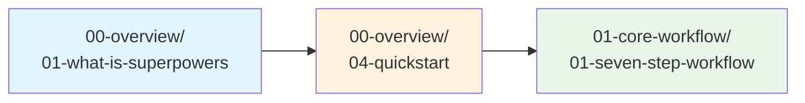

# 全书导读

> **Superpowers** — 一套面向 Coding Agent(编程智能体)的完整软件开发工作流系统，由可组合的 Skill(技能)构成，让你的 Agent 自动遵循工程纪律，而非仅仅"写代码"。

---

## 本书目标

**读者画像**：你是有经验的软件工程师，熟悉 Git、TDD(测试驱动开发)、Code Review 等工程实践，但刚接触 Agentic Development(智能体驱动开发)—— 即让 AI Agent 代替你执行编码、调试、重构等任务的新范式。

**你将学到**：

- Superpowers 的七步核心工作流，以及每一步**为什么**是这个顺序
- 如何让 Agent 自动触发正确的 Skill，而不是靠你手动提示
- TDD、Systematic Debugging(系统化调试)、Verification(验证)三大铁律及其背后的工程哲学
- Subagent-Driven Development(子智能体驱动开发) 的 Controller/Implementer/Reviewer 架构
- 如何编写自己的 Skill，并为其编写测试
- 在 Claude Code、Cursor、Codex、Gemini CLI、OpenCode 等多平台上部署和使用 Superpowers

---

## 核心认知模型

### Superpowers 的本质

Superpowers 不是一个代码库，而是一套**工程纪律系统**。它通过 Skill 文件定义 Agent 在每个开发阶段必须遵循的流程，通过 Hook(钩子) 在会话启动时自动注入上下文，通过 Command(命令) 提供用户可手动触发的操作入口。其核心理念是：**Agent 的默认行为不可信，必须用显式的流程约束取代隐式的"聪明"**。

### 工作流为什么是这个顺序


> 以下为各步骤的因果解释（每步一句话）：

| 步骤 | 因果解释 |
|------|----------|
| **Brainstorming（头脑风暴）** | 不先理解需求就动手 = 解决错误的问题，因此必须通过苏格拉底式提问逼出真实意图。 |
| **Design（设计）** | 不先形成书面设计就编码 = 需求在 Agent 脑中漂移，因此必须产出可审阅的 Spec 文档。 |
| **Planning（计划）** | 不先分解为 2-5 分钟粒度的任务就实现 = Agent 偏离方向后无法察觉，因此必须产出零上下文工程师也能执行的计划。 |
| **Subagent-Driven Development（子智能体驱动开发）** | 不隔离执行上下文 = 错误在长对话中累积污染，因此必须为每个任务启动全新 Subagent(子智能体)。 |
| **Testing（测试）** | 不先写失败测试就写实现 = 无法证明代码真正解决了问题，因此必须严格遵循 Red-Green-Refactor(红-绿-重构) 循环。 |
| **Code Review（代码评审）** | 不经双重审查就合并 = Spec 偏差和质量问题在后期代价百倍，因此必须先 Spec Review 再 Code Quality Review。 |
| **Finishing（收尾）** | 不验证全部测试通过就声明完成 = 自欺欺人，因此必须在新终端中从头运行完整测试套件。 |

### 关键铁律（Iron Laws）

Superpowers 中有三条不可违反的铁律，每一条都源自对 Agent 行为缺陷的工程化应对：

| 铁律 | 内容 | 原因 |
|------|------|------|
| **TDD Iron Law** | 没有失败测试，就不写产品代码。 | Agent 倾向于跳过测试直接写实现，导致无法证明代码真的有效。 |
| **Debugging Iron Law** | 没有 Root Cause(根因) 调查，就不做修复。 | Agent 倾向于猜测性修复，如果连续 3 次修复失败，说明是架构问题而非假设问题。 |
| **Verification Iron Law** | 没有新鲜的验证证据，就不声明完成。 | Agent 倾向于基于"上次运行过"的记忆声称成功，而非重新运行验证命令。 |

### 设计原则

以下是贯穿 Superpowers 所有 Skill 的元原则：

1. **Evidence Before Claims（证据先于声明）** — 任何"完成"声明都必须附带刚刚运行的验证输出，因为 Agent 的"应该没问题"几乎从不可信。

2. **Process Before Shortcuts（流程先于捷径）** — 即使任务看起来简单，也必须触发对应 Skill，因为简单任务经常暗藏复杂性，而 Skill 的检查清单能防止遗漏。

3. **Specification Compliance First（规格合规优先）** — 代码质量再高，如果不符合 Spec 就是错的，因此 Spec Review 必须在 Code Quality Review 之前。

4. **Context Isolation（上下文隔离）** — 每个 Subagent 只接收执行其任务所需的最小上下文，因为上下文窗口污染是 Agent 长时间自主工作偏离方向的首要原因。

5. **YAGNI（你不会需要它）** — 只实现 Spec 中明确要求的功能，因为 Agent 天然倾向于过度实现和提前优化。

---

## 阅读路线图

### 快速上手路径 ⚡

> 适合：想在 30 分钟内跑通一次完整工作流的读者。



1. [什么是 Superpowers](./00-overview/01-what-is-superpowers.md) — 理解核心概念
2. [快速开始](./00-overview/04-quickstart.md) — 安装并运行第一个任务
3. [七步工作流](./01-core-workflow/01-seven-step-workflow.md) — 掌握核心流程

### 完整学习路径 📚

> 适合：想系统掌握所有能力的读者。按章节顺序阅读即可。

```
00-overview → 01-core-workflow → 02-skills → 03-agents →
04-commands → 05-platform-integration → 06-testing →
07-advanced → 08-reference → 09-appendix
```

### 按需查阅路径 🔍

> 适合：已有基础、遇到具体问题时查阅的读者。

- 遇到不熟悉的术语 → 查看下方 [术语索引](#术语索引) 或 [完整术语表](./08-reference/01-glossary.md)
- 需要命令速查 → [速查表](./08-reference/02-cheatsheet.md)
- 出了问题 → [故障排查](./08-reference/04-troubleshooting.md)
- 想写自定义 Skill → [Skill 设计模式](./07-advanced/01-skill-design-patterns.md) + [编写 Skill](./02-skills/13-writing-skills.md)

---

## 术语索引

| 英文术语 | 中文定义 | 首次出现章节 |
|----------|----------|--------------|
| Skill | 定义 Agent 在特定场景下必须遵循的流程文档（SKILL.md），是 Superpowers 的基本组成单元 | [00-overview/01](./00-overview/01-what-is-superpowers.md) |
| Agent | 执行编码任务的 AI 智能体（如 Claude、Gemini、Codex 等） | [00-overview/01](./00-overview/01-what-is-superpowers.md) |
| Subagent | 由 Controller 分派的、具有独立上下文窗口的子智能体，每个任务使用全新 Subagent | [01-core-workflow/01](./01-core-workflow/01-seven-step-workflow.md) |
| Hook | 在会话生命周期事件（如启动、压缩）时自动执行的脚本，用于注入 Skill 上下文 | [05-platform-integration/01](./05-platform-integration/01-hooks-system.md) |
| Command | 用户可手动触发的操作入口（如 `/brainstorm`、`/write-plan`），映射到对应 Skill | [04-commands/01](./04-commands/01-brainstorm.md) |
| TDD | Test-Driven Development，测试驱动开发：先写失败测试 → 写最小实现 → 重构 | [02-skills/04](./02-skills/04-test-driven-development.md) |
| Red-Green-Refactor | TDD 的三阶段循环：Red（测试失败）→ Green（测试通过）→ Refactor（重构优化） | [02-skills/04](./02-skills/04-test-driven-development.md) |
| Iron Law | 不可违反的工程铁律，违反即终止流程。Superpowers 有三条：TDD、Debugging、Verification | [01-core-workflow/01](./01-core-workflow/01-seven-step-workflow.md) |
| YAGNI | You Aren't Gonna Need It，不实现 Spec 未要求的功能，防止 Agent 过度实现 | [01-core-workflow/01](./01-core-workflow/01-seven-step-workflow.md) |
| CSO | Claude Search Optimization，Skill 的 `description` 字段只写触发条件不写流程摘要，防止 Agent 走捷径跳过完整 Skill 内容 | [07-advanced/01](./07-advanced/01-skill-design-patterns.md) |
| Rationalization | Agent 为跳过 Skill 而自我合理化的思维模式（如"这只是个简单问题"），是 Superpowers 重点防范的行为 | [02-skills/00](./02-skills/00-using-superpowers.md) |
| Worktree | Git Worktree，用于在独立目录中创建隔离的开发分支，避免影响主分支 | [02-skills/09](./02-skills/09-using-git-worktrees.md) |
| Controller | Subagent-Driven Development 中的调度者角色，负责读取计划、分派任务、审查结果 | [02-skills/06](./02-skills/06-subagent-driven-development.md) |
| Implementer | Subagent-Driven Development 中的执行者角色，负责写代码、运行测试、提交、自审 | [02-skills/06](./02-skills/06-subagent-driven-development.md) |
| Spec Reviewer | 双重审查第一阶段的审查者，验证代码是否严格符合 Spec 要求（不多不少） | [02-skills/06](./02-skills/06-subagent-driven-development.md) |
| Code Quality Reviewer | 双重审查第二阶段的审查者，验证实现质量、代码模式和可维护性 | [02-skills/06](./02-skills/06-subagent-driven-development.md) |

---

## 目录

### 第零章 · 概览

- [01 - 什么是 Superpowers](./00-overview/01-what-is-superpowers.md)
- [02 - 安装指南](./00-overview/02-installation.md)
- [03 - 核心概念](./00-overview/03-core-concepts.md)
- [04 - 快速开始](./00-overview/04-quickstart.md)

### 第一章 · 核心工作流

- [01 - 七步工作流](./01-core-workflow/01-seven-step-workflow.md)
- [02 - Skill 触发机制](./01-core-workflow/02-skill-activation.md)
- [03 - 指令优先级](./01-core-workflow/03-instruction-priority.md)

### 第二章 · Skills 详解

- [00 - Using Superpowers（入口 Skill）](./02-skills/00-using-superpowers.md)
- [01 - Brainstorming（头脑风暴）](./02-skills/01-brainstorming.md)
- [02 - Writing Plans（编写计划）](./02-skills/02-writing-plans.md)
- [03 - Executing Plans（执行计划）](./02-skills/03-executing-plans.md)
- [04 - Test-Driven Development（测试驱动开发）](./02-skills/04-test-driven-development.md)
- [05 - Systematic Debugging（系统化调试）](./02-skills/05-systematic-debugging.md)
- [06 - Subagent-Driven Development（子智能体驱动开发）](./02-skills/06-subagent-driven-development.md)
- [07 - Dispatching Parallel Agents（并行 Agent 调度）](./02-skills/07-dispatching-parallel-agents.md)
- [08 - Requesting Code Review（请求代码评审）](./02-skills/08-requesting-code-review.md)
- [09 - Using Git Worktrees（使用 Git Worktree）](./02-skills/09-using-git-worktrees.md)
- [10 - Finishing a Development Branch（完成开发分支）](./02-skills/10-finishing-a-development-branch.md)
- [11 - Receiving Code Review（接收代码评审）](./02-skills/11-receiving-code-review.md)
- [12 - Verification Before Completion（完成前验证）](./02-skills/12-verification-before-completion.md)
- [13 - Writing Skills（编写 Skill）](./02-skills/13-writing-skills.md)

### 第三章 · Agents

- [01 - Code Reviewer（代码审查 Agent）](./03-agents/01-code-reviewer.md)

### 第四章 · Commands

- [01 - brainstorm 命令](./04-commands/01-brainstorm.md)
- [02 - write-plan 命令](./04-commands/02-write-plan.md)
- [03 - execute-plan 命令](./04-commands/03-execute-plan.md)

### 第五章 · 平台集成

- [01 - Hooks 系统](./05-platform-integration/01-hooks-system.md)
- [02 - Claude Code](./05-platform-integration/02-claude-code.md)
- [03 - Cursor](./05-platform-integration/03-cursor.md)
- [04 - Codex](./05-platform-integration/04-codex.md)
- [05 - OpenCode](./05-platform-integration/05-opencode.md)
- [06 - Gemini CLI](./05-platform-integration/06-gemini-cli.md)

### 第六章 · 测试

- [01 - 测试基础设施](./06-testing/01-test-infrastructure.md)
- [02 - 编写 Skill 测试](./06-testing/02-writing-skill-tests.md)

### 第七章 · 高级主题

- [01 - Skill 设计模式](./07-advanced/01-skill-design-patterns.md)
- [02 - CSO 优化策略](./07-advanced/02-cso-strategies.md)
- [03 - Token 效率](./07-advanced/03-token-efficiency.md)
- [04 - 多平台适配](./07-advanced/04-multi-platform.md)
- [05 - 扩展 Superpowers](./07-advanced/05-extending-superpowers.md)

### 第八章 · 参考

- [01 - 术语表](./08-reference/01-glossary.md)
- [02 - 速查表](./08-reference/02-cheatsheet.md)
- [03 - 配置参考](./08-reference/03-configuration.md)
- [04 - 故障排查](./08-reference/04-troubleshooting.md)

### 第九章 · 附录

- [01 - 变更日志精要](./09-appendix/01-changelog-highlights.md)
- [02 - 版本迁移指南](./09-appendix/02-migration-guide.md)
- [03 - 贡献指南](./09-appendix/03-contributing.md)
